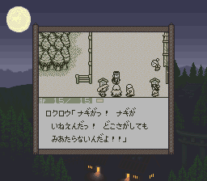

# 风来之西林：月影村的怪物

在GB这个掌机平台上，能杀时间的游戏很多。我最喜欢的，就是这作《月影村》。月影村是GB上殿堂级的游戏。在fami通评分还没贬值的时候，获得了36分的高评价。

风来的西林系列最早在SFC上登场，是个hardcore倾向的Rogue-like游戏。我虽然爱玩游戏，但更多的时候玩轻度游戏比较多，这么纯粹的专业向的游戏，月影村对我来说可能是唯一的一个，虽然在风评上西林系列的专业化程度还没那么高。

所谓Rogue-like指的是生成随机进程单向过程不可逆自由度高的一类游戏的统称。最著名的Rogue-like游戏是家喻户晓的暗黑（天梯模式）。风来的西林系列有个副标题“不思议迷宫”。这个游戏完全秉承Rogue了在随机性方面的特性，在没进迷宫之前一切未知。没接触暗黑之前，我每隔一阵就会打开GB，刷一圈迷宫——我对这种刷装备类的游戏没多少抵抗力的。这家叫“春”的公司，招牌作品就是不思议迷宫系列，包括西林和后来的特鲁内克。

之前提到了两个费电池的游戏，而这个游戏废机器。这跟它的Rogue-like特性有关。Rogue-like的游戏，拼的是智商和运气。正常游戏的时候，进入迷宫后就不能退出。如果选择回到起点的话，所有装备等级道具清空。这就意味着唯二能够不断强化的道具——盾和刀就废掉了，也就是白玩了。唯一能保存迷宫内进度的方式就是中断。所谓中断，就是直接关GB的电源。而中断以后的存档有复制的可能。所以打高级别难度地图的时候，GB的开关就惨了。

即使这样，也有鸡飞蛋打的风险——当年盗版卡存档用的电池质量是相当堪忧的，往往开关一拨记录就蒸发了，欲哭无泪。

F开头的游戏，本来想推荐之前没怎么好好玩过的2代沙漠的迷城，但稍稍接触了几个小时之后，发现2从虽然道具到敌人从流程到画面都有全面的提升，但有个致命的缺陷——太强调联机的重要性了。而我一直固执地觉得GB还是自己一个人默默地打更有趣。
月影村对我来说，好玩的要点主要有三个：

第一是利用道具地形等以弱胜强，包括附加的伊菲的谜题，都必须要动脑把手上的资源最大化的利用，这时月影村是一种烧脑的游戏。比如从怪物房死里逃生的时候。

第二是偷店主，继续烧脑，以及犯罪成功的成就感。偷有两个要点。第一是从商店里跑出来，第二是离开当前层。围绕这两点，可以采用的方法怎么也有个20多种，可以说看到店主音乐一变的那一刻，脑子里想的就完全都是这关地形如何偷完了应该怎么跑……GB的开关损耗，大半也消耗在一次次的重新进入商店偷东西上。

第三是刷装备。刀盾的特性收集完全全并且强化到+50以上之后，神挡杀神佛挡杀佛的爽快感。能力到了，乱入的BOSS也不在话下。

缺点也不是没有。我非常讨厌满腹度的设定，西林简直是饿死鬼投胎，没走两步就饿得不行，就得到处找乱七八糟的草吃。后来有了经验，到11F左右的时候不得不送人头给饭团怪咬，让它吃掉自己的道具变成饭团。另一个饿死鬼投胎的游戏是无人岛。

月影村的主线流程相当的短。第一次进迷宫10F救小孩，第二次15F打开龙头，第三次把小姑娘从21F救回来就结束了。

玩过西林系列的都知道，这个游戏的乐趣，在通关之后才刚刚开始。月影村作为早期作品，通关后的追加迷宫就只有一个，50层的“月影村出口”。所有道具装备无法带入，所有道具不可识别。在实机时代我最多打个十几层，根本就没有打穿的可能。有了模拟器的SL大法，才堪堪突破了这个迷宫。那可真是刻骨铭心的一天：

2003年，非典闹得最凶的时候，5月7号冒绳命危险跟 Bassara、穆、黑总、高干等人吃了个饭，为 Bassara 庆生。喝得挺兴奋的，回家之后突然特别想玩月影村，中文站英文站却遍寻不到 rom，后来查了英文名，最后在一个葡萄牙语网站上终于下载到了。普通关打通了，就开始打脱出，恰好北京时间 8 号凌晨是欧冠半决赛，米兰德比。这个系列赛被舍瓦球迷奉为经典的是第二回合的1：1，而我说的是首回合，一个枯燥无比的 0：0。可以说幸亏在玩脱出，双方加起来不到10脚射门的比赛完全没能催眠我，步步惊心的脱出游戏玩得我满手心都是冷汗。看到 “月影村的恋人” 字样的时候，天都已经大亮了。

