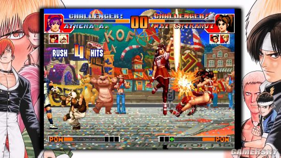
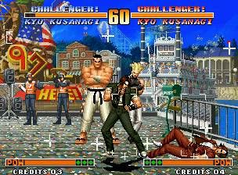
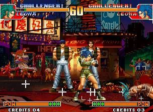
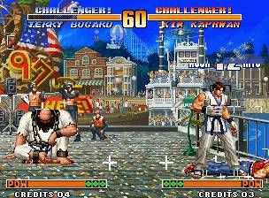

# KOF97 出招表

## 第1页：格斗术语

　　《拳皇97》这款游戏相信已经陪伴很多玩家很多年了，随着《拳皇97全球对决》的到来，很多朋友都想再次接触这款游戏，下面就为大家带来《拳皇97》从入门到精通全教程，从最基础的格斗术语，到出招表，再到连招一一为大家讲解，希望对各位玩家有所帮助。

**格斗术语**

**数字代表方向的约定**

　　123456789：以1P位为定，同小键盘的方向一一对应。

　　如8、2、4、6分别指上、下、左、右四个基本方向，1、3、7、9则为左下、右下、左上、右上，5意为摇杆居中。

　　例：八神的八稚女指令为2363214A，或简写为2624A。

**通用术语**

　　COUNTER：意为“反击”，俗称“红字”。一般来说是是指成功将对手的攻击截击，明显一点说，即是在对手作出招准备动作或攻击判定时之时，我方成功做出攻击拦截，COUNTER虽有反击的含义，但其实都是指我方的截击动作。

　　CRITICAL：俗称“绿字”，某些必杀或超杀中随机出现的攻击判定，如真吾的所有必杀或超杀，拉而夫的4蓄6B等。CRITICAL不仅可以使这些必杀或超杀攻击力大增，也能使对手受创硬直时间变长，从而使得平时无法成立的连招成为可能。

　　FRAME：中文意为“帧”。在KOF里，帧可以有两种解释：其一，一帧指一幅静态画面，就像普通电影里1秒钟由24帧画面组成。其二，时间帧，一个时间帧指显示刚才所说的一幅静态帧所持续的时间。在KOF98和02里，每局对战有60秒，而每秒基本上由50个帧组成。通常，我们指的是后者。

　　CANCEL：意思是取消了招式的收招动作而使出另一招。

　　BUG： 由于程序不够完善，从而使得玩家在某些特殊情况下遇到所控制的角色出现非正常的反应。

　　TASK OVER：任务中止。由于程序存在的BUG，导致系统资源耗尽，停止响应，表现为屏幕出现“TASK OVER”字样并死机。

　　互动：形容时间的词语，意思是我方和对手都能在同时行动；通常都会用来形容收招的时间。

　　指令：基本动作，意思是招式的输入步骤。

　　硬直：是指角色完全不接受任何输入（包括挡格）的时间。

　　防御不能：指对某些招式不能作出防御，但是要留意的是防御不能不等于必定击中，只不过是被攻击不能挡格罢了，简而言之，防御不能技都是可以回避的。

　　GUARD CRUSH：防御崩溃，意思是不能防守的不受控状况，通常都是防守者过分依赖挡格才会出现的的特殊系统。

　　眩晕：又叫气绝，意思是角色出现一段不受控制之硬直时间。有一些特殊的招式是立即令对手出现气绝的，如良的max天地霸皇拳。

　　强制：意思是计算机指定的特殊动作，很少做单一使用的词语。例如“强制挡格”，即使没有输入挡格的指令，计算机应会为玩家判别为挡格；“强制CANCEL”既是本身不能作出CANCEL连接的招式却可以利用某一特定的方法将招式作出CANCEL；“强制转身”，利用系统的转向设定在空中强制对手背对自己造成逆向。

　　追加输入：由于很多招式是由一连串的输入组成的，所以出现了这个[追加]的词语，意思是招式成功使出之后的复数输入。追加一词亦可用做其它的指代，例如“追加攻击”。

　　攻击判定：角色使出招式时，能够攻击对方的有效范围距离，而此范围便会称为攻击判定，一般情况下也会包括投技的有效范围。

　　相杀：意思既是双方同时作出攻击并同时击中对方。

　　无敌：不会受到任何攻击的形容，通常都是配合不同的词语使用的，例如“无敌时间、无敌判定”。

　　上/中/下段：意思是攻击判定的属性，中段是必须站立防守的，下段是必须下蹲防守的，上段是站立或下蹲均可防守或回避。

　　DOWN：主要是形容角色状况的形容词，意思是角色受到攻击并倒地，一般情况下都是用作连接其它词语使用的。例如“DOWN回避”“DOWN攻击”等等。

　　FLOAT：浮空，有2种含义：1、己方将对方打至飘起，并存在被攻击判定；2、KOF系列一直存在的传统（或称bug），己方通过特殊的指令动作可以“浮”在空中，此时没有被投判定，且用普通技攻击对手己方不会后退。

　　吹飞：将对手击中后打至飞离。一般来说是指一些特殊的攻击，令我方和对手分开一段距离。防御吹飞是指己方在有能量的情况下防住对手进攻后立即施以CD反击对手。

　　目押：一般是指普通攻击（或者是特殊技）与普通攻击（或者是特殊技）的衔接而构成的连续技。通常我们谈论的的目押定义，是指轻攻击接重攻击，如Ryo的2B.2C、红丸的2A.D等；还有就是连续的轻攻击次数较多，如Heavy D与Mary的5A狂点。还有一种大家经常谈论的软目押，如Ralf的2C.2D，Chris的3B.2C等，这通常发生在对手落地瞬间、起身瞬间或紧急回避动作结束瞬间，目押者的第一招收招时击中对手，然后再接以后面的普通攻击。

　　掴技：投技的一种，当成功捕捉对手后可以做连打以增加攻击力。大部分的掴技都是接受攻击者的输入故被攻击者之连打输入将会影响争脱的快或慢，此技例如陈国汗的D投。

　　受身：在角色被击中后出现的硬直时间中作出指定的输入，在KOF里为AB，成功的话角色便最快地回复作战状态。

　　起上：角色被打至倒下时，恢复正常作战状态的过程。

　　空振：又叫挥空，使出招式完全不接触到对手。

　　投技：其本投技词语，一般来说是不能以挡格来防御的捕捉系攻击，一般情况下均是有指定的攻击力，而且不会手修正值的影响。

　　指令投：主要是形容以特定指令输入的投技，而这个词语出现是因为通常指令投会有通常投技所没有的优势，故这个词语是用作分野两者使用。

　　连续技：意思是攻击者的连续攻击。而”连续技“的定义可以说是被攻击者会在强制的情况下完全被击中反过来说，对方挡格时被计算机判定为强制挡格的亦可称得上是连续技。

　　连携技：虽然字面上有连续的意思，但其实“连携技”一词是指连续使出的攻击技组合，而对手是能够在当中作出防守的回避。具体一点说是使出者的连续攻势，但其实组合中应存在着空隙，可以理解为我们通常所说的“伪连”。

　　通常技：是指单以按钮使出招式，当然也包括了蹲下、跳跃的简单方向杆操作。

　　特殊技：是指方向+按钮的招式，和必杀技的分别是特殊技通常是以“方向杆单一输入”+“按钮”，而必杀技是需要较复杂的输入。

　　必杀技：须以复数输入才能使出的攻击技；而必杀技的特点是技属性会较通常技、特殊技为多。

　　飞行道具：俗称“波”、“气功”、“镖”，意思是移动的攻击判定，部分格斗游戏之飞行道具会带有被攻击判定；但是飞行道具的共通点是飞行道具受到攻击后并不会影响到角色。

　　返技：也叫“当身技”，如Mary的214B/D、99香橙的超杀“心眼葛落”等，在招式使出后没有主动攻击判定，在一定时间内受到普通技、特殊技或打击性的必杀、超杀的攻击会自动中断对手招式反击对手。除超杀类返技外，一般返技都有稍微不同的段位限定，如Mary的214B只能返上中段，214D只能返上段和下段。大门的返技236B/D比较特殊，只能返掉地面上的普通技。

　　打防技：使出后若对手攻击己方则表现为类似于挡身技的反击效果，若对手不攻击己方则表现为一般的必杀技。

　　裸杀：超杀不是用于连续技中，而是单独使出。如97Iori用八稚女对空。

　　KO：英文Knock Out的缩写，意为“击倒对手”。本来是拳击术语，引入到格斗游戏中来同样指将对手击败。

**格斗技术术语**

　　牵制：通过普通技和一系列的组合技巧以打乱对手预想的进攻节奏和手段。

　　二择：让对手二中选一（进行防御）的意思，例如打击或投技、中段或下段便是最佳的二择例子。

　　N择：也称多择，上述二择的扩充。一般指击倒对手后，在多种需要对手作出不同反应对策的进攻方式中择其一而为之。比较典型的例子是Clark在指令投后对手起身前的多种攻击方式。

　　先读：也称“预读”，意思是预测对手下一步的行动，并做出相应的对策。如预测对手会跳起进攻，从而提前发出升龙来“先读”对手。

　　高级技术术语进阶：

　　暗示：实战斑竹“独孤八神”原创。指通过自己不断重复的做某个相同动作，是对手认为做另外一种动作是危险的，从而达到“暗示”对手不做某个动作的目的，以期掌握实战的主动权。例子：02的Billy在中远距离空放几个214A，可以暗示对手：你不要跳，跳则必被我截击下来，从而逼的对手被迫只能采用地面战。

　　抢招：应该是Syo的原创。指利用已方出招判定产生快的招式来瓦解对手几乎可以同时出招的招式。如8Kim在28B被对手防住后，再次以28B同急于反击的对手来抢先出招。

　　关厕所：我国台湾省的同胞原创。意为将对手逼入版边，然后使用包括牵制在内的各种手段进攻对手，务使对手无法逃脱直至被KO的一种战术。当然需要施术者具有较多的经验和较好的心理揣度水平。

　　防御切换：在己方角色因防守住对手的攻击作出防御动作后，立即有节奏地将摇杆不断地在下防与蹲防之间来回切换（即1P位时，不断地414141……）以保持防御动作不消失。防御切换可以使对手投技（包括指令投和普通投技）攻击无效。

　　确认：confirm，一个相当高深的技巧，首先需要玩家有极快的反映速度。指在普通技之后立即输入可以接驳的普通技、特殊技，或必杀或超杀（以超杀居多和华丽）的方向部分，然后视情况而动：若对手防前面的普通技，则不采用任何行动；若对手没有防住前面的普通技，则立刻使出接驳的必杀或超杀的按键部分，从而同前面的方向部分构成一个完整的指令，给对手致以最大的伤害。确认可以分为多hit确认和单hit确认两种。前者较为简单，可以给玩家以足够的时间来判断，例如Heavy D，可以在2B/2A后再多点几下2B/2A来判断是否击中对手，从而有较多的时间来判断是否接超杀；后者是我们通常意义上的确认，难度也大很多，如02Whip前冲2B>2426，如果2B命中，则立刻按A追加一个超杀，否则绝对不出。再给一个单hit确认的例子：Mature远A牵制，若命中，则要求立刻接驳24C\*3，否则什么都不出。

## 第2页：系统说明

**系统说明**

**共有系统**

　　重击：按CD，击飞

　　防御破坏：当角色一定时间内挡了一定量的攻击（8次吹飞攻击，或是共格挡了9次重攻击），这时他再次受到攻击的话，那么这招就会把他的防御状态破坏。

　　倒地回避：在角色被击倒要落地的一瞬间按A+B的话，那么角色就会向后滚，不会倒在地上。

　　挑衅：按START键，角色会作出挑衅的动作，不过不能减少对手的POWERGAUGE量。

　　队友援助：当血比对手少，且在队“友”旁被逮住、昏时（可挣脱的）时按ABC

　　可选的两种系统分别为ADVANCED模式和EXPERT模式

**ADVANCED MODE**

　　DASH（疾进）：本模式中，DASH是向前跑或向后疾退，在对空战术上也扮演着一个相当重要的角色

　　跳跃：当然也继承了《格斗之王'96》中跳跃的种类，分为普通跳跃、小跳跃、中跳跃及大跳跃

　　紧急回避：当玩家输入（→）A+B时，角色便会向前滚；若输入←A+B，角色便会向后滚。此动作既可躲避对手的攻击，还可作偷袭之用。

　　拆开投技：当被对手施以投技的一瞬间，只要输入A+B便可将其投技破坏掉（建议用↓方向+任一键）.

　　能量回避：当角色格挡对方攻击时，玩家可输入←A+B或→A+B进行GUARDCANCEL紧急回避。这招的作用与紧急回避并没有分别，但却会消耗一条能量槽。

　　能量反击：当格挡对方攻击时输入C+D，这也会消耗一条能量槽。

　　MAXIUM状态：当角色的能量槽储满超过一次，玩者再输入A+B+C便可启动MAXIUM状态.在此状态中，角色的攻击力会提升1.5倍，弹的也更开，超必杀变为最大版。（在我这里人们把“必杀技/超必杀技/MAXIUM超必杀技和潜在能力”称为“功/大功/超杀”。好象更好些）

**EXPERT MODE**

　　DASH：本模式中DASH时向前跳一步或向后跳一步，在向后DASH时有极为短暂的无敌时间。DASH此时可避开大部分角色的蹲下重脚，更比过去有了更高的速度。

　　跳跃：只分为两种，即普通跳跃和大跳跃.

　　回避动作：只要玩者按A+B，角色便会在原地作闪避动作，在此动作期间角色全身处于无敌状态，可避开对手任何攻击.

　　拆开投技：在本模式中不存在

　　储气：只要玩者按A+B+C，那么角色的能量槽便会逐渐长满。

　　濒死状态：当角色的体力低于八分之一，体力的显示便会不停闪烁，在这种状态下角色可无限次使用超必杀技。

　　MAXIUM状态：当角色的能量槽储满时，角色便进入MAXIUM状态。这时攻击力可提升1.5倍，并可使用超必杀技，如果同时体力低于八分之一，那么便可使用MAXIUM超必杀技。

## 第3页：出招表-日本队

**出招表**

**草薙京**

　　外式·轰斧阳：→+B

　　外式·奈落落：（跳跃中）↓+C

　　八十八式：↘+D

　　百式·鬼燃烧：→↓↘+A或C

　　七百七式·独乐屠：←↓↙+B或D

　　二百十二式·琴月阳：→↘↓↙←+B或D

　　七十五式改：↓↘→B+B或D+D

　　百十四式·荒咬：↓↘→+A

　　百二十八式·九伤：荒咬动作中↓↘→+A或C

　　百二十七式·八锖：荒咬动作中→↘↓↙←+A或C荒咬→九伤动作中A或C

　　百二十五式·七濑：荒咬→九伤动作中B或D

　　外式·砌穿：荒咬→八锖动作中A或C

　　百十五式·毒咬：↓↘→+C

　　四百一式·罪咏：毒咬动作中→↘↓↙←+A或C

　　四百二式·罚咏：罪咏动作中→A或C

　　九百十式·鹤摘（外式+虎伏/龙射）：↓↙←+A或C

　　\*里百八式·大蛇雉：↓↙←↙↓↘→+A或C

　　\*最终决战奥义·无式：↓↘→↓↘→+A或C

**二阶堂红丸**

　　旋转膝落：（空投）↑以外+C或D

　　杰克小刀踢：→+B

　　飞之技巧：（跳跃中）↓+D

　　雷韧拳：↓↘→+A或C

　　空中雷韧拳：（跳跃中）↓↘→+A或C

　　真空片手驹：↓↙←+A或C

　　超级闪电踢：→↓↘+B或D

　　居合蹴：↓↘→+B或D

　　反动三段蹴：→↘↓↙←+B或D

　　红丸投：（近身）→↘↓↙←→+A或C

　　\*雷光拳：↓↘→↓↘→+A或C

　　\*大发电者：（近身）→↘↓↙←→↘↓↙←+A或C

**大门五郎**

　　玉溃：→+A

　　头上拂：↘+C

　　地雷震：→↓↘+A或C

　　超受身：↓↙←+B或D

　　出云投：←↙↓↘→+A

　　切株返：←↙↓↘→+C

　　天地返：（近身）→↘↓↙←→+A或C

　　超大外割：（近身）→↓↘+B或D

　　根返：↓↘→+B或D

　　里投：→↘↓↙←→+B或D

　　\*地狱极乐落：（近身）→↘↓↙←→↘↓↙←+A或C

　　\*岚之山：（近身）←↙↓↘→←↙↓↘→+B或D

　　》续·切株返：岚之山中←↙↓↘→+B或D

　　》根拔里投：续·切株返中→↓↘+B或D

　　\*\*》续·天地返：续·切株返中→↓↘+B或D

## 第4页：出招表-饿狼队

**特瑞**

　　后打：→+A

　　步步高：↘+C

　　火焰冲拳：↓↙←+A或C

　　能量波：↓↘→+A或C

　　碎石踢：↓↙←+B或D

　　倒跃踢：→↓↘+A或C

　　灌篮强击：→↓↘+B或D

　　能量补充：←↙↓↘→+B或D

　　\*能量喷泉：↓↙←↙↓↘→+A或C

　　\*高轨喷泉：↓↘→↓↘→+B或D

**安迪**

　　上鳄：→+B上面↘+A

　　斩影拳：↙→+A或C

　　我弹幸：斩影拳击中后↓↘→+A或C

　　飞翔拳：↓↙←+A或C

　　升龙拳：→↓↘+A或C

　　空破弹：←↙↓↘→+B或D

　　击臂背水掌：（近身）←↙↓↘→+A或C

　　幻影不知火：（跳跃中）↓↘→+B或D

　　幻影不知火（下颚）：幻影不知火着地中→+A或C

　　幻影不知火（上颚）：幻影不知火着地中→+B或D

　　\*超裂破弹：↓↙←↙↓↘→+B或D

　　\*飞翔流星拳：↓↘→↓↘→+A或C

**东丈**

　　低踢：→+B

　　滑步：↘+B

　　旋风拳：←↙↓↘→+A或C

　　爆烈拳：A或C连按

　　爆烈拳终结：爆烈拳中↓↘→+A或C

　　虎破脚：→↓↘+B或D

　　电光踢：←↙↓↘→+B或D

　　黄金之踵落：↓↙←+B或D

　　\*死亡龙卷风：↓↘→↓↘→+A或C

　　\*爆烈飓风猛虎踢：↓↘→↘↓↙←+A或C

## 第5页：出招表-龙虎队

**坂崎良**

　　冰柱割：→+A

　　虎煌拳：↓↘→+A或C

　　虎炮：→↓↘+A或C

　　猛虎雷神刚跳跃中：→↓↘+A或C

　　飞燕疾风脚：→↘↓↙←+B或D

　　极限流连舞拳：（近身）←↙↓↘→+A或C

　　猛虎雷神刚：↓↙←+A或C（击中后可接虎炮）

　　猛虎雷神刹：↓↘→+B或D

　　\*龙虎乱舞：↓↘→↘↓↙←+A或C

　　\*霸王翔吼拳：→←↙↓↘→+A或C

　　\*天地霸王拳：↓↘→↓↘→+A或C

**罗伯特**

　　龙翻蹴：→+B

　　龙击拳：↓↘→+A或C

　　龙牙：→↓↘+A或C

　　飞燕旋风脚：→↘↓↙←+B或D

　　极限流连舞脚：←↙↓↘→+B或D

　　龙斩翔：→↓↘+B或D

　　飞燕龙神脚：（跳跃中）↓↙←+B或D

　　\*龙虎乱舞：↓↘→↘↓↙←+A或C

　　\*霸王翔吼拳：→←↙↓↘→+A或C

　　\*无影疾风重段脚：↓↘→↓↘→+B或D

**坂崎由莉**

　　燕落：（空投）↑以外+C或D

　　燕翼：→+B

　　虎煌拳：↓↘→+A或C

　　空牙：→↓↘+A或C

　　里空牙：重空牙着地时→↓↘+C

　　雷煌拳：↓↘→+B或D

　　百烈掌击：→↘↓↙←+A或C

　　飞燕疾风拳：↓↙←+B或D

　　飞燕旋风脚：↓↙←+A或C

　　\*霸王翔吼拳：→←↙↓↘→+A或C

　　\*飞燕凤凰脚：↓↘→↘↓↙←+B或D

　　\*飞燕烈孔：↓↘→↓↘→+A或C

## 第6页：出招表-怒队

**莉安娜（暴走莉安娜按住开始键不放输入↑↓↑↓↑↓+B＋D）**

　　黑登摔：（空投）↑以外+C或D

　　月光锯：↓（蓄）↑+A或C

　　威武军刀：←（蓄）→+B或D

　　粉碎者：重威武军刀中→+D

　　X口径炮：↓（蓄）↑+B或D

　　涡旋发射器：←（蓄）→+A或C

　　眼之斩：↓↙←+A或C

　　\*V字金锯：（跳跃中）↓↘→↘↓↙←+A或C

　　\*旋转的火花：↓↙←↙↓↘→+B或D

　　\*重力风暴：↓↘→↓↘→+A或C

**拉尔夫**

　　机炮拳：A或C连打

　　格林机关炮：←（蓄）→+A或C

　　急降下爆弹：↓（蓄）↑+A或C

　　急降下爆弹：（跳跃中）↓↘→+A或C

　　超级阿根廷攻击：（近身）←↙↓↘→+B或D

　　拉尔夫踢：←（蓄）→+B或D

　　\*超级机炮拳：↓↘→↘↓↙←+A或C

　　\*乘马机炮拳：↓↙←↙↓↘→+B或D

　　\*宇宙幻影：↓↘→↓↘→+A或C

**克拉克**

　　跳入死亡湖：（空投）↑以外+C或D

　　断踢：→+B

　　机炮拳：A或C连打

　　凝固汽油弹：→↓↘+A或C

　　旋转摇篮：←↙↓↘→+A或C

　　弗兰肯必杀投：→↓↘+B或D

　　超级阿根廷阻挠者：（近身）←↙↓↘→+B或D

　　烈火闪光肘：（指令投中）↓↘→+A或C

　　\*终结阿根廷攻击：（近身）→↘↓↙←→↘↓↙←+A或C

　　\*奔袭投掷：←↙↓↘→←↙↓↘→+B或D

## 第7页：出招表-超能力队

**麻宫雅典娜**

　　精神射击：（空投）↑以外+C或D

　　连环腿：→+B

　　凤凰弹：（跳跃中）↓+B

　　精神力球：↓↙←+A或C

　　凤凰箭：（跳跃中）↓↙←+A或C

　　精神力反射波：→↘↓↙←+B或D

　　划空光剑：→↓↘+A或C

　　空中光剑：（跳跃中）→↓↘+A或C

　　心灵传送术：↓↘→+B或D

　　超级精神穿透：（近身）←↙↓↘→+C

　　\*闪光水晶波：（跳跃可）←→↘↓↙←+A或C

　　》水晶超射：闪光水晶波中↓↙←+A或C

　　\*凤凰FANG箭：（跳跃中）↓↘→↓↘→+B或D

**椎拳崇**

　　虎扑手：→+A

　　后旋腿：→+B

　　超球弹：↓↙←+A或C

　　龙颚碎：←↓↙+B或D

　　龙连牙·地龙：←↙↓↘→+A

　　龙连牙·天龙：←↙↓↘→+C

　　龙爪袭：（跳跃中）↓↙←+A或C

　　龙连打：（近身）→↓↘+A或C连按

　　\*神龙凄煌裂脚：↓↘→↘↓↙←+B

　　\*神龙天舞脚：↓↘→↘↓↙←+D

　　\*仙气发动：（近身）↓↘→↓↘→+A或C

　　\*食肉馒：↓↙←↓↙←+A或C

**镇元斋**

　　醉步飘箪袭：→+A

　　瓢箪袭：↓↙←+A或C

　　柳磷蓬莱：→↓↘+A或C

　　回转的空突拳：←↙↓↘→+B或D（醉管卷翁中→+B或D） 或 望月醉中→+B或D

　　醉管卷翁：↓↘→+A或C

　　蝶袭鲑鱼：醉管卷翁中→+A或C

　　望月醉：↓↙←+B或D

　　龙蛇反蹦：望月醉中↑B

　　鲤鱼反蹦：望月醉中↑D

　　鬼醉酒：↓↘→+A或C

　　\*轰栏炎炮：↓↘→↓↘→+A或C

　　\*轰栏招来：↓↘→↘↓↙←+A或C

## 第8页：出招表-女格斗家队

**神乐千鹤**

　　百活·天神之理：→↓↘+A或C

　　二百式二活·神速之祝词：→↘↓↙←+任一键

　　二百式二活·神速之祝词+天瑞：神速之祝词动作中↓↙←+任一键

　　百八活·玉响之瑟音：←↙↓↘→+A或C

　　二百十二活·乙式顶门之一针：↓↘→+任一键

　　\*里面八十伍活·零技之础：↓↙←↙↓↘→+A或C

　　\*里而一活·三籁之布阵：↓↘→↓↘→+B或D

**不知火舞**

　　梦樱：（空投）↑以外+C或D

　　红鹤之舞：↘+B

　　花蝶扇：↓↘→+A或C

　　龙炎舞：↓↙←+A或C

　　飞翔龙炎舞：→↓↘+B或D

　　必杀忍蜂：←↙↓↘→+B或D

　　飞鼠之舞：↓（蓄）↑+A或C（按住不放）

　　飞鼠之舞：（跳跃中）↓↙←+A或C

　　白鹭之舞：→↓↘+A或C

　　\*超必杀忍蜂：↓↙←↙↓↘→+B或D

　　\*凤凰之舞：↓↙←↓↙←+A或C

　　\*水鸟之舞：↓↘→↓↘→+A或C

**金**

　　滑步踢：↘+D

　　毒蛇击：↓↘→+B或D

　　双毒蛇击：↓↘→↓↘→+B或D

　　落地击：→↓↘+B或D

　　龙卷踢：→↘↓↙←+B或D

　　惊异玫瑰：→↓↘+A或C

　　妄想踢：→↘↓↙←+A或C

　　\*幻想之舞：↓↘→↘↓↙←+B或D

　　\*沉默闪光：↓↙←↓↙←+B或D

## 第9页：出招表-韩国队

**金家藩**

　　多拉打击：→+A

　　定位打击：→+B

　　飞燕斩：↓（蓄）↑+B或D（接↓B或D）

　　半月斩：↓↙←+B或D

　　飞翔脚：（跳跃中）↓↘→+B或D

　　流星落：←（蓄）→+B或D

　　空砂尘：↓（蓄）↑+A或C

　　\*凤凰脚：↓↙←↙→+B或D（跳跃中可）

　　\*凤凰天舞脚：（跳跃中）↓↘→↘↓↙←+B或D

**陈国汉**

　　轮逃：↘+A

　　铁球粉碎击：←（蓄）→+A或C

　　铁球大回转：A或C连打

　　铁球飞燕斩：↓（蓄）↑+B或D

　　大破坏投掷：（近身）→↘↓↙←→+A或C

　　\*铁球大暴走：↓↘→↘↓↙←+A或C

　　\*铁球大压杀：↓↘→↓↘→+A或C

**蔡宝健**

　　二段斩→+A

　　通魔蹴：→+B

　　龙卷疾风斩：↓（蓄）↑+A或C

　　飞翔空裂斩：↓（蓄）↑+B或D（按住不放）

　　旋风飞燕刺突：←（蓄）→+B或D

　　方向转换：飞翔空裂斩、旋风飞燕刺突中方向键加攻击键

　　飞翔脚：（跳跃中）↓↘→+B或D

　　疾走飞翔斩：←（蓄）→+A或C

　　\*真！超绝龙卷疾风斩：→↘↓↙←→↘↓↙←+A或C

　　\*凤凰斩：↓↘→↘↓↙←+B或D

## 第10页：出招表-大蛇队

**七枷社**

　　滑步踢：→+B

　　飞弹强力锤：→↘↓↙←+A或C

　　升龙决斗：→↓↘+A或C

　　敲大锤：↓↙←+B或D

　　喷气反击：←↙↓↘→+A或C

　　\*百万大锤蒸汽：↓↙←↙↓↘→+A或C

　　\*最终冲击：↓↘→↓↘→+A或C

**夏尔米**

　　夏尔米站立：→+B

　　夏尔米螺旋打：（近身）←↙↓↘→+A或C

　　夏尔米重炮：←↙↓↘→+B或D

　　夏尔米旋转踢：↓↙←+B或D

　　夏尔米叠加：→↓↘+B或D

　　\*夏尔米大闪耀：（近身）→↘↓↙←→↘↓↙←+A或C

　　\*夏尔米狂欢：（近身）←↙↓↘→←↙↓↘→+A或C

**克里斯**

　　针刺：→+A

　　滑触：↓↘→+A或C

　　猎杀的空气：→↓↘+B或D

　　射杀舞者之突刺：→↘↓↙←+A或C

　　射杀舞者之舞步：→↘↓↙←+B或D

　　舞者之章：（跳跃中）↓↘→+B或D

　　\*滑行者的踩踏：↓↙←↓↙←+B或D

　　\*连续滑触：↓↘→↓↘→+A或C

## 第11页：出招表-特邀参赛队

**玛丽**

　　大锤击：→+A

　　上升之箭：↘+B

　　旋转下落：↓↘→+B或D

　　玛丽蜘蛛固：↓↘→+A或C

　　指天回旋脚：←（蓄）→+B或D

　　俱乐部飞标：指天回旋脚击中后↓↘→+B或D

　　垂直之箭：→↓↘+B或D

　　玛丽攫夺：垂直之箭击中后→↓↘+B或D

　　玛丽翻脸：↓↙←+B

　　头部飞弹：↓↙←+D

　　回身真落：（近身）←↙↓↘→+A或C

　　\*玛丽台风：（近身）→↘↓↙←→↘↓↙←+B或D

　　\*玛丽野玫瑰：↓↘→↘↓↙←+A或C

　　\*动感闪光：↓↘→↓↘→+B或D

**山崎龙二**

　　打刺：→+A

　　蛇使·上段：↓↙←+A（可蓄）

　　蛇使·中段：↓↙←+B（可蓄）

　　蛇使·下段：↓↙←+C（可蓄）

　　蛇使取消：蛇拳蓄劲中D

　　施虐：←↙↓↘→+B或D

　　倍返：↓↘→+A或C

　　制裁之首：→↓↘+A或C

　　爆弹：（近身）←↙↓↘→+A或C

　　踢砂：→↓↘+B或D

　　\*断头台：↓↘→↓↘→+A或C

　　\*射杀：（近身）→↘↓↙←→↘↓↙←+A或C（A+C连打蓄力）

**比利**

　　大回转蹴：→+A

　　棒高跳蹴：→+B

　　三节棍中段打：←↙↓↘→+A或C

　　火炎三节棍中段打：三节棍中段打中↓↘→+A或C

　　旋风棍：A键连打

　　集点连破棍：C键连打

　　强袭飞翔棍：→↓↘+B或D

　　火龙追击棍：↓↙←+B

　　水龙追击棍：↓↙←+D

　　旋元杀棍：→↓↘+A或C

　　\*超火炎旋风棍：↓↘→↘↓↙←+A或C

　　\*大旋风：↓↘→↓↘→+A或C

## 第12页：出招表-其他

**八神庵（暴走八神按住开始键不放输入←→←→←→+A＋C}**

　　外式·影舞·梦弹：→+A+A

　　外式·轰斧阴·死神：→+B

　　外式·百合折：（跳跃中）←+B

　　百式·鬼燃烧：→↓↘+A或C

　　二百十二式·琴月阴：→↘↓↙←+B或D

　　百二十七式·葵花：↓↙←+A或C（可三回连续输入）

　　屑风：（近身）←↙↓↘→+A或C

　　百八式·暗勾手：↓↘→+A或C

　　\*禁千二百十一式·八稚女：↓↘→↘↓↙←+A或C

　　\*里百八式·八酒杯：↓↙←↙↓↘→+A或C

**矢吹真吾**

　　外式·轰斧造型：→+B

　　百式·鬼燃烧未完成：→↓↘+A或C

　　百十四式·荒咬未完成：↓↘→A

　　百十五式·毒咬未完成：↓↘→C

　　百一式·胧车未完成：↓↙←+B或D

　　真吾踢：←↙↓↘→+B或D

　　\*外式·凤鳞：↓↘→↓↘→+A或C

　　\*燃烧真吾：↓↙←↙↓↘→+A或C

**草雉京KOF94版（按住“开始键”不放选草雉京）**

　　外式·轰斧阳：→+B

　　外式·奈落落：（跳跃中）↓+C

　　八十八式：↘+D

　　百八式·暗勾手：↓↘→+A或C

　　外式·胧车：←↓↙+B或D

　　百式·鬼燃烧：→↓↘+A或C

　　秘奥义里百八式·大蛇雉：↓↙←↙↓↘→+A或C

　　在选出暴走莉安娜后，按住开始键不放输入：↑←↓→↑↓+B＋C就可以选出大蛇七枷社、大蛇夏尔米、大蛇克里斯

**大蛇七枷社**

　　滑步踢：→+B

　　（不明）：←↙↓↘→+B或D

　　（不明）：（近身）→↘↓↙←→+A或C

　　（不明）：（近身）←↙↓↘→+A或C

　　挫大地：↓↙←+A或C

　　吼大地：↓↘→↓↘→+A或C（可蓄力）

　　\*荒大地：（近身）←↙↓↘→←↙↓↘→+A或C

　　\*暗黑地狱极乐落：（近身）→↘↓↙←→↘↓↙←+A或C

**大蛇夏尔米**

　　夏尔米站立：→+B

　　无云之雷电←↙↓↘→+A或C或B或D

　　雷神之鞭↓↙←+A或C

　　雷神之杖（跳跃中）↓↘→+B或D

　　（不明）↓↙←+B或D

　　\*暗黑雷光拳↓↘→↓↘→+A或C

　　\*（不明）↓↙←↙↓↘→+B或D

**大蛇克里斯**

　　针刺：→+A

　　射太阳之炎：↓↘→+A或C

　　摘月之炎：→↓↘+A或C

　　屠镜之炎：↓↙←+A或C

　　咬四肢之炎：（近身）←↙↓↘→+A或C

　　\*暗黑大蛇雉：↓↙←↙↓↘→+A或C

　　\*拂大地之禁果：↓↘→↓↘→+A或C

**大蛇**

　　“黑粒子”：↓↘→A

　　“神指”：↓↘→B或C

　　“反弹盾”：↓↘→D{吸收（飞行道具）并反击，也可用于狂加能量、硬直取消}

　　“灵气柱”：→↘↓↙←任一键

　　\*“掏魂”：→↓↘A或C

　　\*“阳光普照”：↓↙←A或C ……一切都归于『无』吧！

　　（一击必杀：远距↓↘→A）冲跳B）（↓）B）↓↙←A简单的一招）

## 第13页：连招表-日本队

**连招表**

**草薙京**

　　跳跃D+C+94暗勾手（↓↘→C）3HITS

　　近身B、B、B+鬼燃烧（→↓↘A）4HITS

　　近身B、B、B+94胧车（←↓↙B）4HITS

　　跳跃C+下蹲B+站立C+94胧车（←↓↙D）6HITS

　　近身蹲下B、B、A+无式（↓↘→↓↘→A或C）8HITS

　　跳跃C+落在对手背后C+D+琴月阳（→↘↓↙←+B或D）7HITS

　　跳跃C+落在对手背后C+D+大蛇雉（↓↙←↙↓↘→A或C）5HITS

　　94轻暗勾手（↓↘→A）命中+大跳跃C+站立C+94暗勾手（↓↘→C）4HITS

　　跳跃D+站立C+七拾五式改（↓↘→D、D）+大蛇雉（↓↙←↙↓↘→A或C）5HITS

　　跳跃D+下蹲B+站立C+毒咬（↓↘→C）+罪咏（毒咬中→↘↓↙←A或C）+罪咏（罪咏中→A或C）

　　跳跃C+站立C+七拾五式改（↓↘→D、D）+荒咬（↓↘→A）+八靖（荒咬中→↘↓↙←A）7HITS

　　跳跃C+站立C+七拾五式改（↓↘→D、D）+荒咬（↓↘→A）+九伤（荒咬中↓↘→A）+鬼燃烧（→↓↘C）7HITS

**二阶堂红丸**

　　跳跃D+下蹲B、B+真空片手驹（↓↙←C）9HITS

　　跳跃D+下蹲C+反动三段蹴（→↘↓↙←B）5HITS

　　跳跃↓D+雷光拳（↓↘→↓↘→A）8HITS

　　跳跃D+落在对手背后C+大发电者（近身→↘↓↙←→↘↓↙←A或C）

**大门五郎**

　　超重击（CD）+切株返（←↙↓↘→C）

　　跳跃D+下蹲A+天地返（近身→↘↓↙←→A或C）

　　近身D+下蹲C+天地返（近身→↘↓↙←→A或C）

　　跳跃D+站立D+天地返（近身→↘↓↙←→A或C）

　　跳跃D+站立D+下蹲C+岚之山（近身←↙↓↘→←↙↓↘→B或D）+续·切株返（←↙↓↘→B或D）

## 第14页：连招表-饿狼队

**特瑞**

　　跳跃D+站立D+火焰冲拳（↓↙←A）3HITS

　　跳跃C+落下C+MAX能量喷泉（↓↙←↙→A或C）6HITS

　　跳跃C+下蹲B、A+站立A+高轨喷泉（↓↘→↓↘→B或D）9HITS

　　跳跃D+落下C、C+能量补充（←↙↓↘→B或D）+能量喷泉（↓↙←↙→A或C）6HITS

　　对手在边角时跳跃D+落下C、C+能量补充（←↙↓↘→B或C）+碎石踢（↓↙←B）+倒跃踢（→↓↘C）14HITS

**安迪**

　　跳跃D+落下C+飞翔拳（↓↙←A或C）4HITS

　　近身时下蹲B、A+MAX飞翔流星拳（↓↘→↓↘→A或C）8HITS

　　下蹲B、A+斩影拳（↙→A或C）+我弹幸（斩影拳中↓↘→A或C）4HITS

　　对手在边角时跳跃D+站立C+击臂背水拳（近身←↙↓↘→A或C）+MAX超裂破弹（↓↙←↙→B或D）22HITS

　　边角时跳跃D+下蹲C+（近身←↙↓↘→A或C）+幻影不知火·上颚（跳跃↓↘→B着地中→B）+升龙拳（→↓↘A）14HITS

**东丈**

　　下蹲B、A+爆烈拳（A连打）+（↓↘→A）7HITS

　　跳跃D+站立超重击+电光踢（←↙↓↘→B或D）4HITS

　　下蹲B、B、B+站立A+死亡龙卷风（↓↘→↓↘→A或C）14HITS

　　对手跳起时黄金踵落（↓↙←B或D）+电光踢（←↙↓↘→B或D）3HITS

　　跳跃C+站立C+→D+黄金踵落（↓↙←B）+死亡龙卷风（↓↘→↓↘→A）17HITS

　　对手在边角跳起时黄金踵落（↓↙←B或D）+黄金踵落+黄金踵落+虎破脚（→↓↘D）9HITS

　　对手在边角时跳跃D+站立C+旋风拳（←↙↓↘→A）+下蹲C+→D+电光踢（←↙↓↘→B或D）6HITS

## 第15页：连招表-龙虎队

**坂崎良**

　　跳跃D+站立C+虎煌拳（↓↘→C）3HITS

　　跳跃D+站立C+霸王翔吼拳（→←↙↓↘→A或C）3HITS

　　近身下蹲B、A+天地霸王拳（↓↘→↓↘→A或C）3HITS

　　跳跃D+站立C+龙虎乱舞（↓↘→↘↓↙←A或C）17HITS

　　近身C+猛虎雷神刚（↓↙←A或C）+虎炮（→↓↘C）6HITS

　　跳跃D+站立C+极限流连舞拳（近身←↙↓↘→C）+飞燕疾风脚（→↘↓↙←D）8HITS

　　跳跃D+站立C+MAX天地霸王拳（↓↘→↓↘→A或C）+近身C+MAX龙虎乱舞（↓↘→↘↓↙←A或C）

**罗伯特**

　　下蹲B、B+飞燕疾风脚（→↘↓↙←D）6HITS

　　近身C+极限流连舞脚（近身←↙↓↘→D）+跳跃CD6HITS

　　跳跃D+站立C+→B+龙虎乱舞（↓↘→↘↓↙←A或C）18HITS

　　近身C+极限流连舞脚（近身←↙↓↘→D）+飞燕龙神脚（跳跃中↓↙←B或D）+C7HITS

　　近身站立C+极限流连舞脚（近身←↙↓↘→D）+无影疾风重段脚（↓↘→↓↘→B或D）8HITS

　　对手在边角时跳跃D+站立C+极限流连舞脚（←↙↓↘→D）+飞燕龙神脚（跳跃中↓↙←B或D）+龙牙（→↓↘C）9HITS

**坂崎由莉**

　　跳跃D+站立C+虎煌拳（↓↘→A或C）3HITS

　　下蹲B、A、A+飞燕旋风脚（↓↙←B）4HITS

　　下蹲B、A+飞燕烈吼（↓↘→↓↘→A或C）13HITS

　　下蹲B、A+飞燕凤凰脚（↓↘→↘↓↙←B或C）18HITS

　　下蹲B、A+空牙（→↓↘A或C）+里空牙（着地时→↓↘A或C）5HITS

　　跳跃D+站立C+空牙（→↓↘C）+里空牙（着地时→↓↘A或C）5HITS

## 第16页：连招表-怒队

**莉安娜**

　　跳跃D+下蹲B、A+X口径炮（↓蓄↑B或D）4HITS

　　跳跃C+站立D+重力风暴（↓↘→↓↘→A或C）6HITS

　　跳跃C+V字金锯（跳跃中↓↘→↘↓↙←A或C）2HITS

　　跳跃C+站立D+旋转的火花（↓↙←↙↓↘→B或D）5HITS

　　涡旋发射器（←蓄→A）+V字金锯（跳跃中↓↘→↘↓↙←A或C）7HITS

**拉尔夫**

　　跳跃C+下蹲A+格林机关炮（←蓄→A或C）6HITS

　　跳跃C+站立C+格林机关炮（←蓄→A或C）6HITS

　　跳跃C+下蹲C+超级机炮拳（↓↘→↘↓↙←A或C）17HITS

　　跳跃C+下蹲A+超级阿根廷攻击（近身←↙↓↘→B或D）3HITS

　　拉尔夫踢（←蓄→D）+乘马机关炮拳（↓↙←↙↓↘→B或D）14HITS

**克拉克**

　　跳跃D+站立C+终结阿根廷攻击（近身→↘↓↙←→↘↓↙←A或C）2HITS

　　下蹲B、A+超级阿根廷攻击（近身←↙↓↘→B或D）+烈火闪光时（↓↘→A或C）2HITS

　　跳跃D+下蹲A+超级阿根廷攻击（近身←↙↓↘→B或D）+烈火闪光时（指令投中↓↘→A或C）4HITS

## 第17页：连招表-超能力队

**麻宫雅典娜**

　　跳跃C+站立C+超级精神透（←↙↓↘→C）+精神力反射波（→↘↓↙←B或D）7HITS

　　跳跃C+站立C+超级精神透（←↙↓↘→C）+空中闪光水晶波（跳跃中←→↘↓↙←A或C）2HITS

　　近身A+超级精神透（←↙↓↘→C）+精神力反射波（→↘↓↙←B或D）+闪光水晶波（←→↘↓↙←A或C）8HITS

　　对手边角时跳跃C+站立C+超级精神透（←↙↓↘→C）+精神力反射波（→↘↓↙←B）+闪光水晶波（←→↘↓↙←A或C）

**椎拳崇**

　　站立C+神龙天舞脚（↓↘→↘↓↙←D）11HITS

　　跳跃D+站立A+龙连牙天龙（←↙↓↘→C）5HITS

　　跳跃D+站立D+龙连牙·地龙（←↙↓↘→A）5HITS

　　跳跃D+站立D+龙连打（近身→↓↘A或C连按）+B15HITS

　　跳跃D+站立D+MAX仙气发动（近身↓↘→↓↘→A或C）14HITS

　　下蹲A、A+仙气发动（近身↓↘→↓↘→A或C）+跳跃D+站立D+MAX仙气发动（近身↓↘→↓↘→A或C）15HITS

**镇元斋**

　　跳跃C+站立C、C+瓢拳击（↓↙←A）4HITS

　　下蹲B+站立B+柳磷蓬莱（→↓↘C）15HITS

　　跳跃C、C+站立C+柳磷蓬莱（→↓↘C）16HITS

　　跳跃C、C+站立C+轰栏炎炮（↓↘→↓↘→C）4HITS

## 第18页：连招表-女格斗家队

**神乐千鹤**

　　下蹲B、A+里面壶活之籁之布阵（↓↘→↓↘→B或D）25HITS

　　跳跃D+站立C+里面壶活之籁之布阵（↓↘→↓↘→B或D）23HITS

　　跳跃D+站立C+神速之祝词（→↘↓↙←任意键）+天瑞（神速之祝词中↓↙←任意键）4HITS

　　对手在边角时跳跃D+站立C+神速之祝词（→↘↓↙←任意键）+百话·天神之理（→↓↘C）4HITS

**不知火舞**

　　下蹲B、B+龙炎舞（↓↙←A或C）4HITS

　　跳跃D+站立C+白鹭之舞（→↓↘A或C）12HITS

　　跳跃D+下蹲C+超必杀忍蜂（↓↙←↙↓↘→B或D）8HITS

　　必杀忍蜂（←↙↓↘→B或D）+飞翔龙炎舞（→↓↘B或D）4HITS

　　对手在边角时飞鼠之舞（跳跃中↓↙←A或C）+白鹭之舞（→↓↘A或C）12HITS

　　对手在边角时飞鼠之舞（跳跃中↓↙←A或C）+飞翔龙炎舞（→↓↘B或D）3HITS

　　对手在边角时飞鼠之舞（跳跃中↓↙←A或C）+必杀忍蜂（←↙↓↘→B或D）3HITS

　　对手在边角时飞鼠之舞（跳跃中↓↙←A或C）+超必杀忍蜂（↓↙←↙↓↘→B或D）14HITS

**金**

下蹲B+站立B+落地击（→↓↘B或D）7HITS

　　跳跃D+站立D+妄想踢（←↙↓↘→B）7HITS

　　跳跃D+站立D+MAX沉默闪光（↓↙←↓↙←B或D）13HITS

　　对手在边角时跳跃D+站立D+惊异玫瑰（→↓↘A）+龙卷踢（→↘↓↙←D）11HITS

## 第19页：连招表-韩国队

**金家藩**

　　下蹲B、B、A+空砂尘（↓蓄↑A或C）7HITS

　　下蹲B、A+凤凰脚（↓↙←↙→B或D）14HITS

　　跳跃D+站立D、C+凤凰脚（↓↙←↙→B或D）15HITS

　　飞翔脚（跳跃中↓↘→B或D）+空砂尘（↓蓄↑A或C）5HITS

　　对手在边角向前跳跃时飞翔脚（跳跃中↓↘→B或D）+凤凰脚（↓↙←↙→B或D）14HITS

**陈国汉**

　　蹲C+铁球大回转（A或C连打）2HITS

　　跳跃D+下蹲A+铁球大回转（A或C连打）3HITS

　　近身C+铁球大暴走（↓↘→↘↓↙←A或C）12HITS

　　跳跃D+下蹲A+大破坏投掷（近身→↘↓↙←→C）2HITS

　　跳跃D+下蹲A+铁球大压杀（↓↘→↓↘→A或C）13HITS

**蔡宝健**

　　下蹲C+→D+凤凰斩（↓↘→↘↓↙←B或D）16HITS

　　跳跃C+落在对手背后下蹲B、A+站立C+凤凰斩（↓↘→↘↓↙←B或D）18HITS

　　跳跃C、C+落在对手背后下蹲C+→D+C+凤凰斩（↓↘→↘↓↙←B或D）19HITS

　　对手在边角跳跃时疾走飞翔斩（←蓄→A或C）+→A或C+→A或C+→A或C+←A或C+←A或C6HITS

　　在对手跳起时疾走飞翔斩（←蓄→A或C）+→A或C+→A或C+A或C+凤凰斩（↓↘→↘↓↙←B或D）18HITS

　　对手在边角时疾走飞翔斩（←蓄→A或C）+→A或C+→A或C+↘A或C+下蹲C+MAX凤凰斩（↓↘→↘↓↙←B或D）

## 第20页：连招表-大蛇队

**七枷社**

　　跳跃C+站立D+敲大锤（↓↙←C）6HITS

　　超重击（CD）+升龙决斗（→↓↘A或C）2HITS

　　近身D+百万大锤蒸汽（↓↙←↙↓↘→A或C）15HITS

　　下蹲D、A+百万大锤蒸汽（↓↙←↙↓↘→A或C）16HITS

**夏尔米**

　　近身下蹲B+站立B+鞭挞（→↓↘B或D）2HITS

　　跳跃D+站立C+大闪耀（近身→↘↓↙←→↘↓↙←A或C）2HITS

　　跳跃D+落在对手背后C+MAX狂欢（近身←↙↓↘←↙↓↘→A或C）2HITS

**克里斯**

　　跳跃D+站立C+滑触（↓↘→C）4HITS

　　跳跃D+站立C+猎杀的空气（→↓↘B或D）5HITS

　　跳跃D+下蹲A+站立C+滑触（↓↘→A或C）5HITS

　　跳跃D+下蹲A+→C+连续滑触（↓↘→↓↘→A或C）8HITS

　　近身下蹲B、A+滑行者的踩踏（↓↙←↓↙←B或D）12HITS

## 第21页：连招表-特邀参赛队

**玛丽**

　　跳跃D+站立C+→A+野玫瑰（↓↘→↘↓↙←A或C）12HITS

　　跳跃D+站立C+→A+马丽电闪光（↓↘→↓↘→B或D）5HITS

　　近身下蹲B+站立A+马丽台风（近身→↘↓↙←→↘↓↙←B或D）3HITS

　　跳跃D+站立C+指天回旋脚（←蓄→B或D）+转踵落脚（↓↘→B或D）5HITS

　　跳跃D+站立C+→A+垂直之箭（→↓↘B或D）+马丽掠夺（垂直之箭中→↓↘B或D）5HITS

　　对手在边角时下蹲B+站立A+回身真落（近身←↙↓↘→A或C）+垂直之箭（→↓↘B或D）+马丽掠夺（→↓↘B或D）5HITS

**山崎龙二**

　　爆弹（近身←↙↓↘→A或C）可连续5回

　　跳跃D+站立+制裁匕首（→↓↘C）6HITS

　　下蹲B、A、A+蛇拳中段（↓↙←B）5HITS

　　跳跃C+下蹲C+射杀（近身→↘↓↙←→↘↓↙←A或C）4HITS

　　跳跃C+站立C+断头台（↓↘→↓↘→A或C）连按AC作追打27HITS

**比利**

　　下蹲B+站立B+旋圆杀棍（→↓↘A或C）4HITS

　　跳跃D+站立C+大旋风（↓↘→↓↘→A或C）4HITS

　　近身下蹲B、B+站立B+集点连破棍（C键连打）5HITS

　　跳跃D+站立C+三节棍中段打（←↙↓↘→A或C）+火炎三节棍中段打（三节棍中段打中↓↘→A或C）4HITS

## 第22页：连招表-其他

**八神**

　　（跳跃中）←+B》站A》站C》↓↘→↘↓↙←+A或C

　　（跳跃中）←+B》站B》→+A.A》↓↘→↘↓↙←+A或C

　　（跳跃中）←+B》下B》站A》↓↘→↘↓↙←+A或C

　　（跳跃中）←+B》站B》→+A.A》（↓↙←+C）×3

　　（版边）（跳跃中）←+B》→+A.A》（↓↙←+A）×2》↓↘→↘↓↙←+A或C 注：罗伯特、胖子、小猴连不上

　　（版边 爆气 ）（跳跃中）←+B》→+A》（↓↙←+A）×2》MAX↓↘→↘↓↙←+A或C 注：部分人物连不上

　　（版边 爆气 ）（跳跃中）←+B》站C》（近身）←↙↓↘→+A或C》站C》（近身）←↙↓↘→+A或C》站C》MAX↓↘→↘↓↙←+A或C

**矢吹真吾**

　　近身B+胧车未完成（↓↙←D）4HITS

　　跳跃C+站立C+胧车未完成（↓↙←B）3HITS

　　近身下蹲B、B、A+毒咬未完成（↓↘→）5HITS

　　跳跃D+站立C+外式凤鳞（↓↘→↓↘→A或C）4HITS

　　下蹲B+站立C+燃烧真吾（↓↙←↙↓↘→A或C）6HITS

　　胧车未完成（↓↙←B）+毒咬未完成（↓↘→C）4HITS

　　MAX燃烧真吾（↓↙←↙↓↘→A或C）+MAX外式凤鳞（↓↘→↓↘→A或C）

**暴走八神庵**

　　下蹲B、A+葵花\*3（↓↙←A或C）5HITS

　　下蹲B、A+八稚女（↓↘→↘↓↙←A或C）10HITS

　　错位B+站立B+→C·C+葵花\*3（↓↙←A或C）7HITS

　　近身B+屑风（近身←↙↓↘→A或C）+C+葵花\*3（↓↙←A或C）4HITS

　　错位B+站立C+屑风（近身←↙↓↘→A或C）+C+屑风+C+葵花\*3（↓↙←A或C）4HITS

　　错位B+站立C+屑风（近身←↙↓↘→A或C）+C+屑风+C+MAX八稚女（↓↘→↘↓↙←A或C）

**大蛇七枷社**

　　跳D》站C》（近身）→↘↓↙←→↘↓↙←+A或C 》↓↘→↓↘→+A或C（可蓄力）

**大蛇夏尔米**

　　（爆气）跳C（逆向）》站C》→+B》↓↘→↓↘→+A或C

　　（版边 爆气 ）←↙↓↘→+A》站C》↓↘→↓↘→+A或C

**大蛇克里斯**

　　（版边）跳B》下B》站A》→+A》（近身）←↙↓↘→+A或C》↓↙←↙↓↘→+A或C

　　（版边）↓↘→+A或C》跳D》站C》（近身）←↙↓↘→+A或C》↓↙←↙↓↘→+A或C

## 第23页：一击必晕

**一击必晕**

　　特瑞：①跳重拳+站立重拳（两段）+步步高（↘+C）+能量补充+碎石踢+倒跃踢 （一击必晕）；②对手在版边，跳跃D，站立C（2HITS），上勾拳，轻能量冲击，重碎石踢，碎石踢（一击必晕）

　　坂崎良：跳跃D，站立C，极限流连舞拳，天地霸王拳（可MAX）（一击必晕）

　　神乐千鹤： 跳跃D，蹲下C，MAX三赖之布阵，连续D追打（一击必晕）

　　京：跳重拳+站立重脚（一段）+惊异玫瑰+龙卷踢. （一击必晕）

　　蔡宝健： 对手在版边，飞翔空裂斩连刺4下，抓住对面墙壁飞翔空裂斩连刺3下（一击必晕）

　　八神庵：对手在快接近版边时先爆气然后跳起白合折+站立重拳+屑风+站立重拳+屑风+站立重拳+百贰拾七式·葵花（三段）（一击必晕）

　　草薙京：跳跃C，站立C，重七十五式改2段，荒咬，荒咬，八靖，砌穿（一击必晕）

　　东丈：对手在版边，死亡龙卷风（不中第1HIT），黄金之踵落踢3次，虎破踢（一击必晕）

　　陈国汉：对手在版边，超重（COUNTER），MAX铁球大爆走（以一脚结束），铁球大回转（一击必晕）

　　山崎龙二：跳跃D（逆向攻击），站立C，踢砂，蛇拳取消，走前C，重制裁匕首（一击必晕）

　　矢吹真吾：跳跃C，站立D，驱凤麟，重胧车（一击必晕）

　　疯狂八神庵：对手在版边，轻暗勾手，跳跃D，站立C，梦弹1段，重葵花三段（一击必晕）

## 第24页：一击必杀

**一击必杀**

　　草薙京：跳跃C，站立C，重七十五式改2段，荒咬，荒咬，九伤（对手着火），挥空取消MAX大蛇雉（死机的一击必杀）

　　蔡宝健：①对手在版边时蹲重拳+飞翔空裂斩第1下是向→后3下要向↘按ABCD任意键都可以+蹲重拳+通魔蹴 +→B +站轻拳+凤凰斩；②对手在版边时旋风飞燕刺突一共可以扎4下，这4下你可以随心所欲的扎，但要记住一定要控制好对手浮空的高度。然后+飞翔脚+真!超绝龙卷疾风斩或凤凰斩。

　　玛丽：跳跃D，站立B，C，大锤击，玛丽野玫瑰，垂直之箭（不中）→玛丽掠夺。

　　矢吹真吾：外式·丘凤鳞（在对手被击中这招会有时会出现绿色的字体，不是COUNTER，那个字的意思大概就是在对手不出招时你用必杀技或其他什么击中他后电脑会自动判定你这招打得准不准，要是很准得话就会出线绿色的字体之后再）+外式·丘凤鳞+百式·鬼燃烧未完成 （一击必杀）

　　八神庵：对手在快接近版边时先爆气然后跳起白合折+站立重拳+屑风+站立重拳 +屑风+站立重拳+MAX八稚女（一击必杀）

　　特瑞：跳跃D（逆向攻击），站立D，上勾拳，能量冲击，MAX能量喷泉（全中）（一击必杀）

　　椎拳崇：对手在版边，跳跃D，站立D，后旋腿，D，MAX神龙天舞脚（一击必杀

　　山崎龙二：跳跃D（逆向攻击），站立C，踢砂，蛇拳取消，↓C（把对手打到版边），MAX断头台（一击必杀）

　　暴走八神庵：对手在版边，轻暗勾手，跳跃D，站立C，梦弹1段，MAX八稚女（一击必杀）

　　真夏尔米：跳跃C（逆向攻击），C，站立光雷，MAX暗黑雷光拳（一击必杀）

　　真克利斯：跳跃D，站立D，咬四肢之炎，MAX扫大地之业果（全中）（一击必杀）

　　暴走莉安娜：①跳跃C（逆向攻击），站立D（1HIT），威武军刀，前跳V字金锯 （一击必杀）

　　②MAX态，对手在版边，重旋涡发射器，轻威武军刀连斩3下，月光锯（无超杀的一击必杀）

　　大门五郎：MAX态，对手在版边，跳跃超重（COUNTER），头上拂2次，轻超受身2次，地雷震，切株返（一击必杀）

　　大蛇：距对手一屏幕，飞行道具，前冲，跳跃D，站立B，普渡众生（一击必杀）

## 第25页：无限连杀

**无限连杀**

**草薙京**

　　对手在角落

　　重七式五式改>下A挥空>重七式五式改>下A挥空…………

**金家藩**

　　对手在角落，且在空中，已方MAX

　　空中轻飞翔脚>空中轻飞翔脚…………

**蔡宝健**

　　1、对手在角落

　　下C>2蓄9B>方向转换\*3>下C>2蓄9B>方向转换\*3………

　　2、对手在角落

　　小跳C（2HITS）>空中轻飞翔脚>小跳C（2HITS）>空中轻飞翔脚………

**特瑞**

　　1、能量撞击>蹲A/站A/站（6+C）/站（6+D）挥空>能量撞击>蹲A/站A/站（6+C）/站（6+D）挥空………

　　2、对手限定比利，且在角落

　　能量撞击>碎石踢>碎石踢>碎石踢………

**东丈**

　　1、对手在角落，且在空中

　　轻黄金之踵>轻黄金之踵………

　　2、对手身材高大（前B省略也成立）

　　站C>前B>轻黄金之踵>站C>前B>轻黄金之踵………

**麻宫**

　　对手在角落且空中

　　空中24A>空中24A………

**椎拳崇**

　　对手在角落，且身材高大

　　站D>前B>前D>前B………

**不知火舞**

　　对手在角落且在空中，已方不在角落

　　轻必杀忍蜂（打到空中对手刚好取消收招）>轻必杀忍蜂………（第一个忍蜂命中1HITS，后面均2HITS）

**神乐千鹤**

　　影子超杀>前冲蹲（BBA）>影子超杀………

**金**

　　对手在角落

　　623A>下A挥空>623A>下A挥空………（第二个开始挥空和必杀慢点发可全中）

**山崎龙二**

　　砂>取消>砂>取消…………（可演变成N套连招）

**比利**

　　对手在角落且在空中，已方MAX

　　264A>264A>264A………（其实就是无限MAX火炎旋风棍超杀）

**八神庵**

　　1、屑风>鬼步………（可演变成鬼步屑风）

　　2、对手在角落且空中

　　小葵花两回>挥空………

**矢吹真吾**

　　对手在版边

　　2626A>下A挥空>2626A………（2626A须打出绿字，不是MAX版的）

**大蛇**

　　站B>426D（挥空）>前冲B>426D（挥空）………

## 第26页：能量反击攻破方法

**能量反击攻破方法**

**草薙京**

　　近身c或c+d（这时对方能量反击）接鹤摘（→↓←+a或c）对坂崎良和特瑞不行！比较实用！

　　近身c或c+d（这时对方能量反击）接大蛇稚（↓←↓→a或c）/接无式（↓→↓→+a或c）接大蛇稚破绽比较小！

**二阶堂红丸**

　　跳跃b[打得高位]（这时对方能量反击）马上在空中按↓+d，接着可以连一记轻真空片手驹（→↓←+a）。非常实用！

　　下c或站立c+d（这时对方能量反击）接轻雷光拳（↓→↓→+a）一般！

**大门五郎**

　　下d或c+d（这时对方能量反击）接根返（↓→+b或d）非常实用！

　　下d或c+d（这时对方能量反击）接超受身（↓←+b或d）躲避对方反击！一般！

**特瑞**

　　c+d（这时对方能量反击）接能量喷泉。不实用

　　能量冲击←↓→b或d（这时对方能量反击）接倒踢腿（→↓→+a或c）非常不实用！除非你反应极快！

**安迪**

　　下b或站立c+d（这时对方能量反击）接超破裂弹（↓←→b或d）/飞翔流星拳（↓→↓→+a或c）不实用！

**东丈**

　　一定要max状态！站立c+d或下d（这时对方能量反击）接↓→↓←+a或c/接↓→↓→+a或c

**坂崎良**

　　c+d或下d（这时对方能量反击）接轻猛虎·雷神刹（↓→+b）比较使用

　　如果对方是防御反击比较快的选手的话！你可以用猛虎·雷神刚

**罗伯特**

　　跳跃d（这时对方能量反击）空中接飞燕龙神脚（↓←+b或d）收招！不过就算打中对方也有破绽！不太使用！

　　下d或c+d（这时对方能量反击）接无影疾风重段脚（↓→↓→+b或d）一般！

**坂崎尤莉**

　　下c或站立c+d（这时对方能量反击）飞燕烈孔（↓→↓→+a或c）

**拉尔夫**

　　跳跃c+d或c打高位（这时对方能量反击）空中接急速下爆弹（↓→+a或c）比较实用！

　　下c（这时对方能量反击）接↓→↓←+a或c 比较使用！

**克拉克**

　　站立c+d或下a（这时对方能量反击）接阿根廷攻击（←↓→b或d）或超级阿根廷攻击（→↓←→↓←+a或c）很使用！

**莉安娜**

　　下c或站立c+d（这时对方能量反击）接↓←↓→b或d 一般！

**金家藩**

　　跳跃c+d打高位（这时对方能量反击）接空中凤凰脚（↓←→b或d）个人觉得比较实用！

**陈国汉**

　　下d或站立c+d（这时对方能量反击）接铁球大暴走（↓→↓←+a或c）很实用！

**麻宫雅典娜**

　　近身c或下b（这时对方能量反击）接←↓→a或c 很实用！不过时机要掌握的好！

**椎拳崇**

　　远身下d或远身c+d（这时对方能量反击）超球弹（↓←+a或c）很实用！

**镇元斋**

　　站立c（这时对方能量反击）接轻柳麟蓬莱（→↓+a）不实用

**神乐千鹤**

　　近身c（这时对方能量反击）接三籁只布阵（↓→↓→b或d）非常使用！

**不知火舞**

　　跳跃c或d打高位（这时对方能量反击）接飞鼠之舞（空中↓←+a或c）实用！

**玛丽**

　　远身c+d或下c（这时对方能量反击）接下挡身（→↓←+d）打中后还可以接超杀！比较实用！

**比利**

　　远身c+d或下c（这时对方能量反击）接下挡身（→↓←+d）非常使用！

**七枷社**

　　站立c+d或下d（这时对方能量反击）接→↓+a或c /接↓←+a或c！非常实用！

**夏尔米**

　　近身c（这时对方能量反击）接←↓→a或c，时机很重要！比较实用！

**八神庵**

　　下c或近身c（这时对方能量反击）接八稚女（↓→↓←+a或c）/接重鬼烧（→↓+c）！不实用！

**矢吹真吾**

　　近身c或下c（这时对方能量反击）接↓←↓→a或c/ 接真吾踢（→↓←+b或d） 不实用！

　　注：每个对手的能量反击都不同~有的快（比如大门）有的慢（比如克拉克）请注意使用！

## 第27页：系统BUG

**系统BUG**

**草薙京死机大法**

　　能量max，在角落里七十五式·改\*荒咬\*荒咬\*九伤（对方身上带火焰）\*下a挥空\*max版大蛇稚！（注意烧到上去不可少于烧2下）

**金家潘 背包必杀大法**

　　只需要3记拳背包就ko对方，max时只要2记拳背包（对手是蔡宝健）

**麻宫雅典娜 浮空术**

　　在自己的版边输入→↓←↖↗按b！对方在角落里，连续按下a就是无限了！55hits ko对方！

**麻宫雅典娜 飞行术**

　　在浮空的状态下回避（无论是前回避或后回避）在未着地前按↓+b！

**不知火舞 浮空术**

　　在自己的版边输入→↓←↖↗按a或c！舞的浮空术比较好！浮在空时的下b是不防技！同样的，对方在角落连续按下b是无限！不过舞会把对方打到头昏！不像麻宫那样！

**玛丽 浮空术**

　　对方在刚起跳时用←↓→+a或c（投机技）在角落里连续按下b或站立b都是无限！

**玛丽 高空站立术（对手是暴走莉安娜）**

　　当暴走莉安娜发出→↓←+a或c，当利昂娜的飞行道具快回来时，玛丽用←↓→+a或c（投机技）就搞定了！

**比利 太阳神比利**

　　当把对手打倒，发超旋风棍（切记要近身发）对手起身瞬间用投机打倒比利（其实用什么投机都行，比如草薙京的拳背包）这时比利就成太阳神了！但是用比杀的投机就比较简单，比如八神的肖风，大门的天地返，克拉克的阿根廷攻击，山崎的头撞。。。。但是有些角色的投机是不行的！比如真·七枷社，夏尔米

**山崎龙二 下c打两下**

　　近身下c打中后然后用蛇使（蓄着）\*按d（收掉蛇使）然后再按下c！这样就是2hits了！

**夏尔米 超高浮空术（对手是暴走莉安娜）**

　　当暴走莉安娜发出→↓←+a或c，当莉安娜的飞行道具快回来时，夏尔米用→↓←→↓←+a或c！

**金**

　　在自己用能量反击c+d后（如\果出现counter!!字样）可以用必杀抵消能量反击c+d。这样可以形成连续技！

　　比如京能量反击c+d后（如果出现counter!!字样）马上输入→↓←+d可以说这是京最实用的counter连招了！

**八神 多个八神（两个选手都是八神）**

　　在版边，两个八神对跑，八神1闪过（八神1继续跑）八神2发一个气功，然后向前奔跑，赶在气功前使出八稚女（先中八稚女），八神1在中了八稚女+气功后，会有一段时间可行动，立即使出鬼烧（→↓+a或c），这时候时屏幕上会出现多个八神。

## 第28页：指令简化

**指令简化**

　　97的超杀基本有正绕反绕（可减化为反绕反绕）；正绕正绕；反绕正绕；反绕反绕四种，而指令的减化也是围绕它们展开的。

**[1]蹲B`A连正绕反绕和正绕正绕指令的减化。**

　　蹲B时摇杆拉下，按A时摇杆至斜下，再输入超杀的后半段指令既可达成。如八神，二阶堂，玛丽，东丈，草雉京，蔡宝健，神乐千鹤等。

**[2]蹲B`A-前A可减化一个正绕半圈，再使用超杀的后半段既可。如八神，克利丝等。**

**[3]轻拳`轻脚`重拳`重脚直接连超杀**

　　先绕超杀的前半段再按A或B或C或D，之后再输入超杀的后半段，前提是前半段无必杀技发出（而真七枷社在用反绕A击中对手时是一特例）。如克拉克的一段重拳连超杀只须反绕重拳再反绕重拳既可发出；蔡宝健的立A接凤凰脚，须使用反绕A再反绕B既可。拥有此种减化方法的人还很多，且此种方法对方若使用防反或以强判定的必杀当身多半会吃大亏，参照上篇的连续技必能受益不小。

**[4]跳跃攻击后直接连指令投或超杀投**

　　有时的跳跃攻击打点不高也不是很低，连站立的拳脚又会被对方防住或者对方直接以指令投反击，这个时候如果用指令投或超杀取消既可连上（当然，打点低的也可连上）。最典形的是大门的跳D连岚之山，只须输入正绕D，落地时再用正绕D既可达成，像这种方法的连续技只要是有指令投或超杀投或超杀出招快的人（如八神）均可使用。

**[5]空中指令提前输入法**

　　此种方法大家再熟悉不过了，大跳过去使用十之八九不中且还会遭反击，建议用小跳，对手刚起身时使用，因为这时对方不知你是否出招；对方如使用对空技八成会被防住（除非对手一开始就猜到了你要跳，否则根本反应不了那么快）。当你使用有近身超杀的人，在有超杀时，小跳过去，对手犹其是高手，大都会跳起，这时就要看你的思想能不能想在他前面了，如果能，只要以小跳起始的基本连技阻止对方跳起既可给对手以重创。使用此法时也可先连续用几次空中小跳攻击对手，之后突然不用而使用超杀简直是防不胜防。（小跳攻击打点低，对方又要防跳跃攻击又要防对方使用投技，一心不得二用，防御上必然出现混乱，用你苦练的连续技来痛欧之吧！关健就是压迫对手使其出错。）

**[6]跑动近身超杀**

　　先绕近身超杀的前半段（距对手约两三个身位的距离），前冲再输入后半段既可。在当对手跳起攻击我方，而距离又不能使我方防御时（对方落地时敌我距离约二至三步），此时如对手出现精神放松或不是想连续跳跃时，这就是跑动超杀的最好时机。

**[7]按住键的减化方法**

　　在按住键的时候必杀技是不会发出的，如八神的立C-前A-八稚女，重拳击中对手后按住C不放，输入正绕A则不会发出暗钩手而只出特殊技，这时只要再反绕按拳既可。

**[8]跑动中的指令减化**

　　使用大门时，先将摇杆拉至蹲防的状态再按B，无论对手是否防住，直接前冲，只绕一个半圈既可使出岚之山（从蹲B到前冲时已减化了一个正半圈），令对手防不胜防；在跑过去使用天地返时，最好是用轻拳的发出，一但对方跳起，天地返立变为出云投（电脑判定），将对方击落。

**[9]跳起中的指令减化**

　　利安娜的垂直上跳的重脚蹲防不能且可连V字金锯，但在输入手法上困难一些，其关键是先绕一个正半圈之后再向上跳起按D，再反绕C既可连上。

## 第29页：制空跳法

**制空跳法**

　　跳跃在格斗游戏中起了很大的作用，谁拥有了制空权就相当于在对战时控制住了半边天，可想而知制空的重要性。凭我个人的经验，我想拥有制空权的人，他的水平一定很高，肯定在对地方面也很强，这样才算是真正的高手。我说怎么多的意思是制空太重要了！ 近两年来大陆的格斗游戏市场基本被KOF系列所垄断，而跳跃的多变性基本在KOF96到99中才能体现出来，其它游戏的系统很少见。所以想玩好KOF系列的游戏制空显得格外的重要！在KOF96到99中大部份玩家只知道小跳、前小跳、后小跳和中跳、前中跳、后中跳还有前大跳、后大跳这8种基本的跳跃。

　　小跳：轻拉“↖”“↑”“↗”

　　普通跳：重拉“↖”“↑”“↗”

　　中跳：先拉“↓”再轻拉“↖”“↑”“↗”就是带影的小跳

　　大跳：先拉“↓”再重拉“↖”“↑”“↗”就是带影的普通跳

　　其实，还有6种特殊的跳跃有很多人不知道，这些跳跃是反小跳、反前小跳、反后小跳和反中跳、反前中跳、反后中跳这6种特殊的跳跃！（统称反跳）据我本人所知掌握这几种跳跃方法的地方很少，在中国只有香港和北京的玩家，其它地方的玩家也许也知道但是我并很不清楚。好了，下面我就告诉大家这6种特殊跳跃的使用方法和一些特定角色在实战中运用特殊跳跃的战术演变和连续技。 大家在使用反跳时是需要一个条件的，就是使用的角色一定要用背对着敌人。在实战中有两种方法可以背对着敌人：

　　（1）是运用→+AB滚到对手后面背对着他；

　　（2）是跳到对手后面背对着他。其它还有一些办法对敌人造不成很大的伤害，我就不提了，请大家谅解！

**使用方法**

　　反小跳的方法：背对敌人时↓轻拉↑

　　反前小跳的方法：背对敌人时↓轻拉↗

　　反后小跳的方法：背对敌人时↓轻拉↖

　　反中跳的方法：背对敌人时↓拉↑

　　反前中跳的方法：背对敌人时↓拉↗

　　反后中跳的方法：背对敌人时↓拉↖

　　以上就是特殊跳跃的使用方法，以下就是一些特定角色在实战中运用特殊跳跃的战术演变！

　　因为只有反后小跳可以直接攻击到对手，所以先告诉大家在KOF97中有谁可以利用反后小跳直接攻击到对手。他们是：

　　KYO 草薙京： 的反后小跳重拳

　　BENIMARU 二介堂红丸： 的反后小跳重脚和轻拳

　　DAIMON 大门五郎： 的反后小跳重拳和轻脚

　　YURI 坂崎由莉： 的反后小跳重脚

　　ATHEMA 麻宫雅典娜： 的反后小跳轻脚

　　KENSOU 椎拳崇： 的反后小跳重拳、反后小跳轻脚和反后小跳重脚

　　CHIN 镇元斋： 的反后小跳超重击

　　MAI 不知火舞： 的反后小跳轻脚和轻拳

　　KIM 金家藩： 的反后小跳轻拳

　　CHOI 蔡宝健： 的反后小跳重拳

　　YASHIRO 山崎龙二： 的反后小跳重脚

　　SHERMIE 谢尔米 的反后小跳重脚和反后小跳重拳

　　CHIRS 克里斯 的反后小跳轻脚

　　MARY 玛丽 的反后小跳重脚和反后小跳超重击

　　BILLY 比利 的反后小跳重脚

　　IORI 八神庵 的前小跳百合折

**下面来讲解特定角色在实战中的战术演变和连续技**

　　在讲解之前先说明一下，上面所有角色反后小跳攻击的招数全部是可以运用在逆向攻击中，玩家可以结合这一战术再加上反后小跳和反后中跳来不断的攻击对手的逆向和正向，从而在一瞬间迷惑对手。这是一个很基本、很好用的战术，在下文中就不再提了！在这里要提一下CHOI，如果你真的了解他你就会知道他的阴险之处，他的反后小跳和别人的作用一样，可是他的反后中跳比一般人多一个作用，在反后中跳重拳时击中对手后，再用“飞翔脚”打回对方的背身，如果落地位置好的话下来还可以再+蹲下轻脚+蹲下轻拳+站立轻拳+凤凰斩，这一招非常实用，因为CHOI只有在空中才能体现出他的实力。下面就一一介绍特定角色在实战中的连续技：

　　KYO

　　反后小跳重拳击中对手后，可以+重拳+百拾五式·毒咬+四百壹式·罪咏+四百贰式·罚咏（或者+秘奥义 里百八式·大蛇雉）

　　BENIMARU

　　反后小跳重脚和轻拳击中对手后，可以至少+蹲下3个轻脚+雷 光拳，如果节奏掌握的好可以+4个轻脚（或者+真空片手驹）

　　DAIMON

　　反后小跳重拳和轻脚击中对手后，可以+重脚+头上浮+岚之衫（ 或者+天地返）

　　YURI

　　反后小跳重脚击中对手后，可以+重拳+任超必杀技（或者+空牙+里 空牙）

　　ATHENA

　　反后小跳轻脚击中对手后，可以+重拳+超级精神穿透+伽玛精神反射（或者+轻心灵传送术+闪光水晶波）

　　KENSOU

　　反后小跳重拳、反后小跳轻脚和反小跳重脚击中对手后，可以+ 重拳+龙连牙·天龙（或者+蹲下轻拳两下+仙气发动）

　　CHIN

　　反后小跳超重击击中对手后不可以再连招只能起到反打的作用

　　MAI

　　反后小跳轻脚和轻拳击中对手后，可以+重拳+必杀忍蜂（或者+超必 杀忍蜂）

　　KIM

　　反后小跳轻拳击中对手后，可以+蹲下轻脚+2个蹲下轻拳+空砂尘（或者+重拳一段+多拉打击（→+A）+凤凰脚）

　　CHOI

　　反后小跳重拳击中对手后，可以+重拳两段+蹲下轻拳2个+龙卷疾风 斩（或者+重拳两段+蹲下轻脚+蹲下轻拳+站立轻拳+凤凰斩）

　　YASHIRO

　　反后小跳重脚击中对手后，可以+重拳+飞弹强力锤（或者+百 万大锤蒸汽）

　　SHERMIE

　　反后小跳重脚和反后小跳重拳击中对手后，可以+重拳 +SHERMIE螺旋打+SHERMIE的天真（或者+SHERMIE大闪耀）

　　CHIRS

　　反后小跳轻脚击中对手后，可以+重拳+针刺（→+A）+滑触（或者 +滑行者的踩踏）

　　MARY

　　反后小跳重脚击中对手后，可以+重拳+大锤击（→+A）+垂直之箭（或者+玛丽野玫瑰+垂直之箭）MARY的反后小跳超重击击中对手后不可以再连招只能起反打的作用

　　BILLY

　　反后小跳重脚击中对手后，可以+重拳+三节棍中段打+火炎三节棍 中段打（或者+大旋风）

　　IORI

　　是唯一能直接利用反前小跳的角色，因为他有一个独特的招数明显可以看出是背对这敌人攻击的，这就是百合折。也是和下文分析的一样，只不过多了一个反前小跳的变化，就是背对敌人向前小跳在使用百合折。反前小跳是属于那种带有躲避性的攻击手段，而反小跳和反后小跳则更直接一些。后面可以+ 重拳+外式·梦弹（→+A）+百贰拾七式·葵花三段或者+禁千贰百拾壹式·八稚女

**下面就介绍特定角色在实战中的战术演变**

　　反后中跳的作用：再跳回去打敌人的正面。

　　反后小跳的作用：因为在快速的对战中，谁都会想怎么才能阻止对手的狂攻，最有效、最简单的办法就是防御时用CD反击。

　　其实，防御时用CD反击在很大程度上来讲是一个漏洞，因为在快速的打斗中就算是真正的高手也有一些是靠感觉来防御时反击CD的，很少有靠观察力来反击CD的。所以这一小小的细节其实是一个漏洞，如果你真正理解反跳并能适当用好它，而且这个战术不仅仅适用这些特定角色，所有的角色都适用，只要你的战术运用得当。说到这里也许只有真正明白反跳你才能明白我的想法。以上的战术演变说得不太全面，不是因为我懒得说，而是这些战术是要靠自己的创造力，换句话说是你自己随心所欲来改变的，战术是无止境的，我就是说了到最后还是要靠你自己去领悟。我认为格斗游戏最好是用自己的一套战术，不要去学任何人。 其它的几种跳跃除了反前小跳针对IORI来说有一些用处，剩下的则看情况使用。

## 第30页：特定连技

**特定连技**

　　什么叫特定连技，怎么说呢，就是有的招只打个别对手才能打到，大家还是看具体的分析吧。以下写的都是正向的特定连续技。

**草薙京**

　　特定连技：

　　1.C+→B，打以下人物可打出：

　　草稚京，大门，特瑞，东丈，安迪，板奇良，镇元斋，神乐，金家藩，陈可汉，菜宝健，七伽社，谢而美，山崎龙二，玛丽，比例，八神，真吾。

　　2.MAX状态 ↓↘→D.D+↓↘→A+↓↘→A+←↙←B，打以下人物可打出：红丸，大门，红丸，克丽丝

**大门五郎**

　　特定连技：↓D+→↘→A，打以下人物可打出：红丸，大门，特瑞，安迪，罗伯特，拉尔夫，麻宫，拳崇，金家藩，神乐，菜宝键，陈可汉，七伽社，夏而米，山崎龙二，玛丽。

**特瑞**

　　特定连技：↓↙←B×N，不爆气时只打比例成例。

**东丈**

　　特定连技：

　　1（C+↓↙←B）×N，打以下人物可打出：陈可汉，七伽社，山崎龙二。

　　2（C+→B+↓↙←B）×2，打以下人物可打出：陈可汉，山崎龙二。

**坂崎良**

　　特定连技：

　　1.对方在角落里JC+C+↓↙←A+→↘→A或↓B+↓A+↓↙←A+→↘→A打以下人物可打出：

　　红丸，大门，安迪，板奇良，列安娜（可不在角落里），陈可汉，七伽社，夏尔米，山崎龙二，比例。

　　2.↓↘→A+↓↘→↓↘→A（MAX）打以下人物可打出：草稚京，红丸，大门，比例，玛丽，真吾。

　　3.↓↘→A+↓↘→←A，只打比例成例。

**莉安娜**

　　特定连技：D二段+↓↘→↓↘→A，只打陈可汉成例。

**克拉克**

　　特定连技：JA（逆向）+C一段+→↘→A，只打陈可汉成例。

**麻宫雅典娜**

　　特定连技：

　　1.↙→C+↓↙←A+（分四种）+↙→D+↙→C，只有打克拉克打不到，打八神，克丽丝，玛丽必须快。

　　A.←←+↙→D的有：所有人，但有的得慢点。

　　B.←AB+↙→D的有：大门，列安娜，神乐。

　　C.←鬼步的有：所有人，但有的得慢点。

　　D.←小跳的有：神乐。

　　2.↙→C+↓↙←B+→↘→C（角落限定）打以下人物必打：草稚京，大门，红丸，玛丽，比例，真吾。

**椎拳崇**

　　特定连技：（D+→B）×3，只打陈可汉成立。

**金**

　　特定连技：

　　1.D二段+↓↙←↓↙←B，只打陈可汉成例。

　　2.→↘→A或C打不到的有：麻宫，镇元斋，菜宝键。

　　3.B+→↘→A或C，对方在角落里，以下人物打不到：麻宫，镇元斋 ，克丽丝，大门，菜宝键，金家藩，椎拳棕。

　　PS：椎拳棕用B+→↘→C能打。

　　4（→↘→A+↓A底）×3或（→↘→A+↓A底）×2+↓↙←D以下人物打不到：麻宫，克丽丝，大门，菜宝键，金家藩，椎拳棕。

　　5.→↘→C+↓↙←D能打到的人有：草稚京，大门，红丸，玛丽，比例，克丽丝，真吾。

**金家潘**

　　特定连技：C投，打菜宝健时可打两下，近半血。

**蔡宝健**

　　特定连技：

　　1.↓C+→B+J↓↘→B+A+↓↘→←B，角落限定，打以下人物打不到：菜宝键，镇元斋。

　　2.↓C+↓↑B，角落限定，打以下人物打不到：红丸，列安娜，拉而夫，克拉克，麻宫，椎拳棕，克丽丝，罗伯特，尤丽，火舞，京。

**玛丽**

　　特定连技：↓↘→A+→↘→B+↓↘→B（在外面可直接夹到对手），打以下人物可以打出：

　　陈可汉，山崎，克丽丝。

**比利**

　　特定连技：↓C+→B+↓C+↓↘→↓↘→A，打以下人物可以打出：大门，金家藩，陈可汉，菜宝键，特瑞，安迪，东丈，镇元斋，七伽社，八神，板奇良，山崎，玛丽，比例。

**八神**

　　特定连技：

　　1.↓B+↓A+→A+↓↙←A.↓↙←A+↓↘→←A，只打陈可汉成例。

　　2.C+→A+↓↙←A.↓↙←A+↓↘→←A，打陈可汉和菜宝键成例。

　　3.A+C+↓↙←A.↓↙←A+↓↘→←A，打克丽丝和罗伯特成例。

　　4.A+C+↓↙←A.↓↙←A+↓↘→←A（MAX），只打陈可汉成例。

　　5.A+C+→A+↓↘→←A，只打陈可汉成例。

　　6.B+→A+↓↙←A.↓↙←A+↓↘→←A（MAX），只打菜宝键成例。

　　7.JC+C+→A+↓↙←A.↓↙←A+↓↘→←A，只打陈可汉成例。

　　8.JC+B+→A+↓↙←A.↓↙←A+↓↘→←A（MAX），只打菜宝键成例。

　　9（C+↓↘→A）×N，打以下人物打不出来：安迪，板奇良，京，陈可汉，菜宝键。

　　10（B+↓↘→A）×N，打以下人物可打出：草稚京，真吾，克丽丝，麻宫。

　　11.↓↘→←A+↓↘→A，打以下人物可打出：麻宫，克拉克，拉而夫，玛丽。

　　12.→A.A+↓↙←A.↓↙←A+↓↘→←A，对方在角落里打以下人物不成立：克里丝、罗伯特、陈可汗、蔡保健。

**矢吹真吾**

　　特定连技：如果打出绿字后，可再连。

**疯八神**

　　特定连技：

　　1（C+↓↘→A）×N，打以下人物可走宵风：草稚京，真吾，克丽丝，麻宫。

　　2.剩下的与八神一样。

　　PS：9（C+↓↘→A）×N，所有人都可以打。

**疯莉安娜**

　　特定连技：D二段+↓↘→↓↘→A，只打陈可汉成例。

**大蛇**

　　特定连技：↓↘→A×N，只打陈可汉成例。

## 第31页：目押的极限

**目押的极限**

**第一章 理论篇**

　　1.1 什么是目押？

　　目押，一般是指普通攻击（或者是特殊技）与普通攻击（或者是特殊技）的衔接而构成的连续技，最直观的显示为屏幕上hit数的上升。而通常我们谈论的是较为狭义的目押定义，是指轻攻击接重攻击，如Ryo的2B.2C、红丸的2A.D等；还有就是连续的轻攻击次数较多，这最容易让人想起的就是Heavy D与Mary的5A狂点了。事实上，Iori的2B.2A难道不算目押吗？

　　还有一种大家经常谈论的软目押，如Ralf的2C.2D，Chris的3B.2C等。这通常发生在对手落地瞬间、起身瞬间或紧急回避动作结束瞬间，目押者的第一招收招时击中对手，然后再接以后面的普通攻击。

　　那么，本文中的目押主要指的是什么呢？

　　1.1.1 广义目押引论

　　个人以为，目押是可以包括特殊技的。如Takuma的2B\*4.2A.6A，最后的6A分为快速发出和较慢速cancel两种，区别就是前者不击倒对手并可再接其他必杀或超杀，而后者直接将对手击倒。对于这种情况，有人将第一种叫做“连招”，第二种叫做“目押”。但本人觉得并不妥当，因为后者难道不是所谓的“连招”或“combo”吗？所以本文对此两种结果并不加以区分，而统一视之为目押。另外，目押从空中拳脚或特殊技开始计算是比较合适的，其实按照这种计算法，Ex模式Kyo的66 2C\*5，以及Leona的JC.JD，以及Choi的5C.6B.JC都应该算是目押的。

　　1.1.2 广义目押定义

　　由1.1.1节的引论，在本文里，我将所指的目押定义为：从空中普通技或特殊技开始，到空中或地面普通技或特殊技终结，这一连招（指hit数不中断）的过程，称之为目押。过程中所能达到的最大hit数，称为目押的极限。

　　1.2 本文中用到的知识基础

　　1.2.1 帧的概念

　　在各个不同的领域，“帧”有不同的意义。在KOF里，帧可以有两种解释：其一，一帧指一幅静态画面，就像普通电影里1秒钟由24帧画面组成。其二，时间帧，一个时间帧指显示刚才所说的一幅静态帧所持续的时间。在KOF98里，每局对战有60秒，而每秒由50个帧组成。通常，我们指的是后者。事实上，两种意义其本质上是统一的。在本文里，帧也主要取后者的意思。

　　1.2.2 研究的好工具——判定框

　　判定框的作用我以前讲过不少，此处不再赘述，仅提一下调试方法。

　　以kawaks为例，载入游戏后（最好进入对战或练习模式），点“游戏”》Neogeo设定》再点最后一项“debug dipswitches”，然后出现两排复选框，将上面一排的第二个勾选后按“ok”即可。

　　kawaks的版本要求是1.45以上。

　　另外要注意的是 NEO-GEO.ROM 这个文件，NEO-GEO.ROM主要有三个版本，分别是：97年12月3日、98年8月10日和98年8月30日。 要想看判定框，要求使用修改日期为98年8月10日的NEO-GEO.ROM。

　　1.2.2 贪心算法

　　如果你是计算机专业的学生，又修过算法分析与设计方面的课程，这部分可略过不读。

　　之所以介绍这方面的知识，是因为它对于目押极限的表述有着极大的作用。

　　贪心算法（Greedy Algorithm）：总是作出在当前看来是最好的选择。也就是说，不从整体最优上加以考虑，它所做出的仅是在某种意义上的局部最优解。（注：贪心算法不是对所有问题都能得到整体最优解，但对范围相当广泛的许多问题它能产生整体最优解。但其解必然是最优解的很好近似解。）

　　上面的定义不用管它，举个简单的例子，买东西找零钱——如果只有一分、五分、一角等三种硬币，给出硬币数最少的找钱方式。假设要找1角四分钱的话，根据贪心算法，应该先选最大的，即先选一角、再选四个一分。这显然是正确的。但如果分币的面额分别为一分、五分、一角一分，要找1角五分钱的话，根据贪心算法，应该先选一角一分、再选四个一分。但这却是错误的，因为需要五个硬币，而直接用三个五分硬币即可满足条件。

　　由此可见，对于所有问题，贪心算法并不一定总能得出最优解，但值得庆幸的是，对于一部分满足特定条件的问题，贪心算法不仅能得出最优解，还是最快的解法。

　　看到这里，不知您有没有觉得郁闷？心里嘀咕着：“这和尚是不是傻了，没事说这些东东干什么？”

　　哈哈，事实上，后文将大量使用这个术语。而且，贪心算法对于目押的极限理论来说，总是完全正确的。

　　1.3 影响hit数的因素

　　在目押中，影响hit数的因素有很多，主要如下：

　　1.3.1 自身的状态

　　自身的状态一般指的是自身处于普通态还是max态。一般来说，因为max态的攻击力大于普通态，所以每次的普通攻击都会将对手“推”得更远，所以目押的的最大hit数要小于等于普通态。（多数情况，一般少1至2hit）。当然，如果对手在版边，则不是“推”对手，而是改为自身的“退”。这不是废话，后文将再次结合“定位”理论提起。

　　所以，本文的目押极限，如不特别说明，将默认为是在己方处于普通态的极限hit数。

　　1.3.2 对手的状态：姿势与正逆

　　显然逆向攻击对手要比正向攻击hit数打得多一些，因为对手背对着你时受到攻击后退得幅度要小一些。当然任何事都几乎有例外，Brain就是一个例子，打他时，正向、逆向基本没区别，有时候甚至正面更佳，主要是因为他的额头太突出了，汗……

　　还有一点就是对手受创前的姿态，是蹲状态还是站立状态。这决定在受创中仍然保持那个状态。两者的区别是，蹲状态对于2B攻击退得比站立状态慢一点点，这就决定了如果某人的目押基本以2B为主，那么让对手处于蹲状态是比较明智的。大家有兴趣可以去试一下，如果只算2B的hit数，Heavy D打Chang时，Chang处于蹲状态比站立状态能接收的2B hit数多。当但蹲状态有个致命的弱点，很多人蹲姿会造成目押者的5A打不着，所以对大部分目押者来说，一般都应选择让对手处于站立状态。本文也是默认对手处于站立状态。

　　1.3.3 对手的体质

　　目押还与对手的体质有关系？回答是肯定的。这里的体质指的是对手每次受到攻击以后后退的幅度。显然，欲达极限，后退的幅度越小越好。大家都知道，Terry就是这样的一个极品。另外，你可能想起了Chang，是的，Chang后退的幅度小主要是与他的体重有关。除上述二人外，下面几个也是拥有好身材与好的体质的：Rugal（普通的和老怪是一样的）、Yashiro、Chris、Kensou、Shingo。而其他的大部分均为普通人，如果同样用Heavy D轻攻击连点，一般都没有上述的几个人达到的最大hit数高。而根据贫僧个人经验，Terry和Rugal两人体质之佳，简直就是极品中的极品，实可笑傲98——当然是被打的笑傲，汗……

　　顺便提一下，Rugal除拥有丝毫不亚于Terry的体质外，还对其他很多少量人物限定的连招具有突出贡献——堪称“98十大杰出青年”之首。这里不打算深入展开，到9月份大家看我的录象便知。

　　1.3.4 起手式：跳打逆vs地面错位攻击

　　显然，跳攻击打逆向是最正宗的起手式。还有另一种方法，就是对方前紧急回避至目押者处造成错位，而目押者在对方回避刚结束产生被攻击判定（框）的一瞬间以（轻）攻击的收招击中对手。这两种方法效果几乎相同，但本文默认使用前者，原因很简单，前者是不需要对手配合的，而且有的跳攻击可以打2hits。

**第二章 目押篇**

　　2.1 目押者的分类

　　2.1.1 目押达人

　　指可以目押10hits以上的人。在98里，目前只有两人：Heavy D和Mary。

　　2.1.2 目押高手

　　指能够目押8~10hits的角色。如Tekuma、Mature、Terry等。

　　2.1.3 目押常人

　　指一些可以目押5~7hits的角色。如Rugal、Kyo、Shermie、Kim等等。

　　2.1.4 目押菜鸟

　　指只能目押2到5hits的人。98里有很多，如大门、Chang、Kensou、Ralf、King……

　　2.2 部分角色目押极限方法列表

　　下面是部分常在录象里出现的角色的目押极限。当然还有超越1~2hits的微弱可能性存在。所列方法仅共参考。

　　a、Heavy D

　　J C（2hits）打逆>2B\*n>A\*m>2A

　　这里有个公式：

　　3 ≤ n ≤ 8，且 n + m = 10。

　　总计13hits，为什么不是14hits？请参见3.2节。

　　b、Mary

　　J D打逆>B\*3>（A.C or A.D）\*4>B

　　总共13hits，原理见3.3节。

　　c、Tekuma

　　J B or D打逆>2B\*5>2A>6A

　　方法有很多，其中2B\*5可以用A和2B的任意组合来代替。

　　d、Mature

　　J B（2hits）打逆>2B\*3>2A\*2>A

　　f、Terry

　　J D打逆>B>A\*6>3C

　　最后1下也可以是2A。

　　g、Rugal

　　J B or D打逆>2A\*5>6B

　　这个在国外的录象里首次见到，不知是哪个神人首创的?

　　要点是2A的间隔要尽可能的长。

　　h、Shermie

　　J C or D打逆>A\*4>B

　　在B的1hit后可立即接214A。

　　i、……

**第三章 极限篇**

　　3.1 手指的艺术——谈节奏

　　谈节奏不能只限于谈论敲打按钮的节奏，我们先从“硬直”说起。

　　硬直包括出招硬直、收招硬直、防御硬直、受创硬直等几种情况。在本文中，比较有用的概念是收招硬直和受创硬直。两者分别对应目押者和受创者。通常，目押者出一下普通技或特殊技，比如说2B，对手中招后会有一段时间内处于硬直状态，比如说20帧，则在对手中了2B开始计时，在不考虑气绝等例外条件的前提下，1~20帧的时间内都可以接受目押者的后续攻击形成连招或增加hit数，这就是受创硬直。然而，并不是第0到20帧这个时间目押者可以随便出招，因为他还有刚才出2B的收招硬直。（本模型省略了对出招硬直的考虑，这样并不影响分析结果，而且可以简化模型的描述。）所以，如果假设收招需要10帧的时间，则目押者真正可以接下一招的时间范围是第11~20帧。另外，需要指出的是，如果目押者在第1~10帧的范围内按任何键，系统都是不会作出任何响应的。

　　根据贪心算法，要达到目押极限，显然需要在第11帧时正好出下一个普通技或特殊技。如果在第20帧的时候出，则浪费了“很长”的一段时间，而在这一段时间内，对手因为处于受创硬直，还在不断后退，从而拉大了二人间的距离。

　　那么，实际操作中应该怎么办呢？理想的情况当然是在每次能够出招的时间范围（本例中是第11~20帧）内的第1帧时发出下 1 hit。但，实际上基本不可能。然而一般相差1~2帧应该是无伤大雅的，即对最终结果没有什么大的影响，但差太多了就……

　　所以，“节奏”两个字对目押来说，意义非同小可。有的人每次“有节奏地”按2下A，结果出来一次。这是因为每次的第2下A在目押者的收招硬直范围内，系统不会作出响应。而有的人每次每个攻击只按一次，而且（按古龙的描述法）“一定出现在他应该出现的时候”。这当然是另外一种节奏。

　　每个人都必定有适合他自己的节奏，只要多摸索即可，不可能千篇一律，当然更不应该强调哪种方法的“正宗”。当然，那种“按键机器”型的方法，追求按键频率极限的方法，是应当避免的。因为受伤的，不仅是键盘或按钮，还包括您的手指。

　　3.2 极限的极限——定位论

　　看过我的《98非无限一击毙阶段性研究报告》的人都知道，真七枷社在对手处于近版边的某个神秘位置时，是可以大跳D>5C>6A>426A的。一开始很多人觉得不可思议，认为426A是第二时间指令投，怎么可能接在6A后面？事实上这种想法是不成立的，因为所谓的“第一时间时间指令投”和“第二时间指令投”在连招中的时间差别并不明显，完全在平时普通技和特殊技造成的硬直时间范围内。5C/D或5C>6A后接不上426A是因为距离问题，是5C/D或5C>6A将对手推出的距离超过了426A的投掷判定范围。然而当对手处于近版边的某个神秘位置时，就可以成立，为什么？

　　原因可谓智者见智，就本人而言，认为原因是，当真七大跳D>5C>6A中的6A击中对手前的一瞬间，对手已经极其接近版边了（这同样是一个神秘的定位），此时因为没有到版边，所以受到攻击会继续后退，然后受6A攻击才到版边，可是后退的幅度没有正常情况下大（因为本来就与版边很近了）；而且正因为不是版边，攻击者真七才恰好不会后退。综合上面两点原因，可见真七与受创者之间的距离因此而没有像通常6A击中对手所拉开的距离那么大，使得426A的判定范围正好能够达到对手，从而使连招成立。

　　同理，Vice也可以在C或D后直接接426A，同样要在近版边的某个神秘位置才成立，相似的例子还有Clark的C>6B>624624A。

　　为什么要谈这些看似与目押毫无关联的东西呢？其实，在目押里，同样有着极限定位。很多人都知道的就是Heavy D vs Terry，一般情况只能13hits，可是，当Terry处于近版边的某个神秘位置时，却可以达到14hits！原理跟刚才说的一样，不再罗嗦。问题是，我们如何才能做到14hits？答案是，可遇不可求。汗……这个东西，非有莫大的勇气和惊人的耐心莫办，只有成百上千次的不断重复找定位，才有可能成功。

　　所以，我们似乎可以得出如下结论，即几乎现在所知的所有人的极限都可以再提升1hit，条件就是——让对手处于近版边的某个神秘位置。

　　3.3 取消的技巧——Mary

　　在98里，另一个除Heavy D的目押达人就是Mary，她有自己独特的一套目押绝技——按键取消。顺便提一下，在2000里，小Boss Kula似乎也会这一手，可能是Mary的徒弟：）

　　这套称之为按键取消的绝招，其方法是在远A连按时，用有节奏的（A.C）\*n或（A.D）\*n来代替AAAA……其中每次的A.C或A.D效果相当于 远A\*2。

　　为什么要使用这种按键取消？直接AAAA……不行吗？行是行，可是没有按键取消打的hits数多啊。按键取消最大的好处就是，每次的A.C或A.D后，自己的远轻拳（注意这里贫僧使用的是“远轻拳”这三个汉字，而非A或C等，因为从宏观上看，对手一直受的都是Mary的远轻拳打击）被加快了收招速度（提前了几帧），从而使下一循环的远轻拳始动提前了几帧时间；从另一个角度来说，因为少了几帧后退的时间，受创者没有像以前退得那么远了。这就造成了按键取消比直接连点远轻拳要多几hits的原因。根据贪心算法，要达到Mary的目押极限，显然需要使用按键取消。

　　再总结一下，用C或D按键取消的精髓就在于本身相当于1hit的远A，同时可以“加快收招速度”。

　　3.4 另类的目押——跳 & EX模式

　　写累了，此部分留待将来心血来潮时完成。只留一个预告式的思考题：Athena的这招 J D>J A>J 2B 成立否？

**第四章 结语篇**

　　从上面的叙述可以看出，要想较为清楚的把目押的极限理论说明白，并不是一件容易的事，因为它不是一个孤立的模块，它跟KOF的其他各个系统都有密切的关联。其实，推而广之，生活中的很多事情都是有着千丝万缕的联系的。

　　事实上，在结束语部分里，贫僧想再罗嗦一点，使大家在娱乐之余，还能有其他“意外的”收获。在此，我想向大家介绍的是“系统工程”理论的初步知识。系统工程是从系统的观点出发，运用运筹学、控制论和信息论等技术方法，使系统的设计、规划、管理、运行和控制等都能达到最优状态，从而实现最优设计、最优管理和最佳功能的目的。 目前，系统工程的思想已广泛应用于工农业生产、城市工程建设、国防建设和企业管理等各个方面，并都取得显著的效果，同样也完全适用于KOF的研究。

　　个人以为，“系统工程”的灵魂核心就是“从整个系统的观点来看待问题、发现问题、研究问题”。不仅在写论文、搞科研时我们经常需要用到这种思想，平时生活中，包括玩游戏时都可以用。比如高手对战就要经过先作好准备工作，包括对按键布局的适应、从多方面了解对手信息等，然后在决战前沐浴更衣、斋戒等等，最后才是决战一刹那的辉煌……当然只是说笑，希望大家理解系统工程思想的精髓。

## 第32页：鬼步

**鬼步**

　　说明几点：

　　1.决大部分人都有鬼步

　　2.鬼步不仅能向前也能向后

　　3.有能量点（POW满一格）时是不能出鬼步的

　　4.在收招/开局/起身（恢覆到普通状态）时才能够发动鬼步

　　不废话了，以下是鬼步的具体出法：

　　草稚京：2626A/C

　　二级堂红丸：2626A/C

　　大门五郎：无

　　特瑞：2626B/D

　　安迪：2626A/C

　　东杖：2626A/C

　　板崎良：246A/C

　　罗拨特：246A/C

　　板崎尤莉：246A/C

　　利安娜：246B/D

　　拉而夫：2626A/C

　　克拉克：2626B/D

　　麻宫雅典娜：24246A/C

　　稚拳崇：2646B/D

　　镇元斋：2626A/C

　　神乐千鹤：246A/C

　　不知火舞：246B/D

　　京：24246B/D

　　金家潘：246B/D

　　陈国汉：2626A/C

　　蔡宝奇：2646B/D

　　七加社：246A/C

　　夏而米：无

　　克里丝：2626A/C

　　马丽：2626B/D

　　山崎龙二：2626A/C

　　比利：2626A/C

　　八神庵：246A/C

　　失吹真吾：246A/C

　　疯利：246B/D

　　疯八神：246A/C

　　疯七：无

　　疯夏：2626B/D

　　疯克：246A/C

　　大蛇：没试过，但是他有26D好象用不着鬼步

　　说明一点，我是玩街机的，对键盘不精通，如果有什么错的见谅呀!

　　由于后鬼步只是用来拉开距离，实战用处不大（个人认为）所以就偷个懒^\_^

## 第33页：倒地

**倒地**

　　这是一个KOF通用技巧，也是一个实战中很重要的技巧。看到最近有很多朋友问到类似的问题，所以特发此贴，希望大家看后会有帮助。

　　倒地的姿势基本可以分四种。

　　1..头朝自己面朝上。（背对自己起身）

　　2..脚朝自己面朝上。（面对自己起身）

　　3..头朝自己面朝下。（面对自己起身）

　　4..脚朝自己面朝下。（背对自己起身）

　　1P利用2P“1和4”的倒地动作，在版角高点出招可以打背，落地后却还是1P方向。（可以理解为强转）

　　2P利用1P“1和4”的倒地动作，就算1P在版角，也可以轻易AB进去，或跳跃进去打背。（通常说的2P逆向优先。）

　　如果出现“2和3”的倒地姿势，起身影跳是可以跳开对手地面普通攻击的（如果对手出的站立普通技，将会在空中命中。），但对手的跳攻击却不能躲避。

　　如果出现“1和4”的倒地姿势，起身将面对强制多折，这时不能跳开普通技。也不能用第一时间指令投打击对手。甚至，在4的情况下，对手的第一次攻击你不能吹灰（CD），也不要妄想回避（AB）。

　　另外，起身时的身位和倒地前的姿势也有必然的关系。

　　对手站着被打倒，起身时，身位筐就是站着的。

　　对是蹲着被打倒，起身时，身位筐就是蹲着的。（这时候可以小跳打背，常见的就是KYO的JC和八神的小跳百合择）

　　其他的东西，就靠大家自己领悟了。呵呵。

## 第34页：起身时间表

**起身时间表**

**前言**

　　主要是用"判定框"以及"帧进"进行测试。

　　注：时间仓促，恐有差误，两表不一致，表2为准。

　　表1　数据表

　　单位：帧（F）

　　草薙京　46

　　红丸46

　　大门45

　　特瑞45

　　安迪51

　　东丈40

　　坂琦良　41

　　罗伯40

　　尤利36

　　莉安娜　47

　　拉尔夫　41

　　克拉克　41

　　雅典娜　41

　　包子45

　　镇元斋　49

　　神乐58

　　KING　  46

　　舞　41

　　金家潘　41

　　陈国汉　55

　　蔡保奇　46

　　七枷社　45

　　夏尔米　53

　　克里斯　51

　　龙二39

　　比利51

　　八神49

　　真吾46

　　表2　总结表（仿98）

　　单位：帧（F）

　　36　尤利

　　39　龙二

　　40　东丈、罗伯

　　41　坂琦良、拉尔夫、克拉克、雅典娜、舞、金家潘

　　42　玛丽

　　45　大门、特瑞、包子、七枷社

　　46　草薙京、红丸、KING、蔡保奇、真吾

　　47　莉安娜

　　49　镇元斋、八神

　　51　安迪、克里斯、比利

　　52　夏尔米

　　55　陈国汉

　　58　神乐

