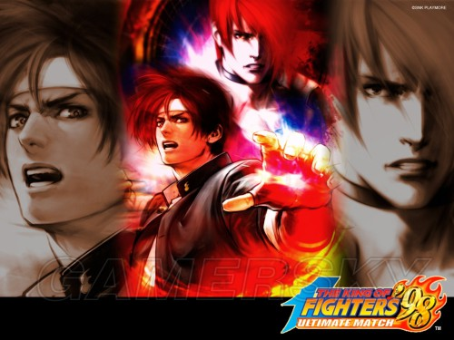
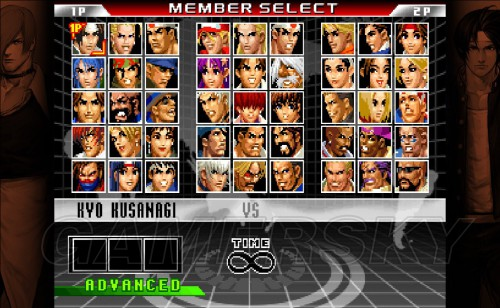

## KOF98 出招表

随着拳皇98:终极对决的推出，很多新玩家还不是很熟悉出招表，下面小编带给大家全角色的出招表

　　按键：A（轻拳）B（轻腿）C（重拳）D（重腿）

**里特别队**

**里 玛丽** 

　　投

　　冲刺肘击 近身←或→+C

　　大摔击 近身←或→+D

　　特殊技

　　大锤击 →+A

　　上升之箭 ↘+B

　　双滚 →+B

　　必杀技

　　轻落脚 ↓蓄 松开同时B或D

　　旋转逆踢 轻落脚中B或D

　　近身蜘蛛固 轻落脚中A或C

　　玛丽蜘蛛固 空中↓↘→+A或C

　　指天回旋脚 ←蓄→+B或D

　　俱乐部飞标 指天回旋脚击中后↓↘→+B或D

　　追击踩踏 ↓↓+B

　　真正反击 ↓↙←+A或C

　　回身真落 真正反击中←↙↓↘→+A或C

　　油锤冠顶 真正反击中←↙↓↘→+B或D

　　垂直之箭 →↓↘+B或D

　　玛丽掠夺 垂直之箭击中后→↓↘+B或D

　　超必杀技

　　玛丽特殊打击 ↓↘→↓↘→+A或C

　　旋转下落 玛丽特殊打击发动后↓↘→+B或D

　　玛丽蜘蛛固 旋转下落中↓↘→+A或C

　　俱乐部飞标 玛丽特殊打击发动后 指天回旋脚中↓↘→+B或D

　　双重掠夺 玛丽特殊打击发动后 玛丽掠夺中→↓↘+B或D

　　玛丽闪光 以上两招中任意一招结束同时↓+A或C

　　玛丽钻石破 玛丽特殊打击发动后 玛丽蜘蛛固中 ↓+A或C

　　动感闪光 →↘↓↙←→↘↓↙←+B或D

## **里 山崎龙二**

　　投

　　缔上 近身←或→+C

　　乱投 近身←或→+D

　　特殊技

　　打刺 →+A

　　必杀技

　　蛇拳上段 ↓↙←+A

　　蛇拳中段 ↓↙←+B

　　蛇拳下段 ↓↙←+C

　　大蛇 蛇拳蓄满后松键

　　蛇拳CANCEL 蛇拳蓄力中D

　　SADOMASOCHISM ←↙↓↘→+B或D

　　倍返 ↓↘→+A或C

　　制裁之匕首 →↓↘+A或C

　　爆弹 近身→↘↓↙←→+A或C

　　踢砂 →↓↘+D

　　淬火 →↓↘+B

　　致命 ↓↓+B（可以追击）

　　超必杀技

　　断头台 ↓↘→↓↘→+A或C

　　射杀 近身→↘↓↙←→↘↓↙←+A或C （射杀LV4 连按AC)

　　射杀LV5 射杀LV4完成时，山崎叫声时ABC同按

## **里 比利**

　　投

　　地狱落 近身←或→+C

　　一本钓投 近身←或→+D

　　特殊技

　　大回转蹴 →+A

　　棒高跳蹴 →+B

　　必杀技

　　三节棍中段打 ←↙↓↘→+A或C

　　火炎三节棍中段打 三节棍中段打中↓↘→+A或C

　　旋风棍 A键连打

　　集点连破棍 C键连打

　　强袭飞翔棍 →↓↘+B或D

　　雀落 ↓↙←+A或C

　　火龙追击棍 ↓↙←+B或D

　　超必杀技

　　超火炎旋风棍 ↓↘→↘↓↙←+A或C

　　SALAMENDA STREAM ↓↘→↓↘→+A或C

　　红莲杀棍 ↓↘→↓↘→+B或D

## **乱入BOSS如月影二**

　　投

　　空中一本背负投 近距离←或→+C或D

　　必杀技

　　气孔炮 ↓↘→+A或C

　　流影阵 →↓↘+A或C

　　天马脚 ←↓↙+B或D

　　霞斩 ↓↙←+A或C

　　骨破斩 ↓↙←+B或D

　　影逸 ↓↘→+B或D

　　骸缝 空中↓↘→+A或C（可以追击）

　　超必杀技

　　斩铁螳螂拳 ↓↘→↘↓↙←+B或D

　　斩铁波 ↓↘→↘↓↙←+A或C

## **藤堂香澄**

　　投

　　百足叠 近身←或→+C

　　蜗牛挂 近身←或→+D

　　特殊技

　　肘当 →+A

　　必杀技

　　重当 ↓↘→+A或C（空中可）

　　对空重当 →↓↘+A或C

　　白山桃 ↓↙←+B或D

　　灭身无投 ←↙↓↘→+B（对空当身）

　　杀掌阴蹴 ←↙↓↘→+D（对地当身）

　　龙卷枪打 近身→↘↓↙←→+A或C

　　雷咆吼 →↓↘+B或D

　　双掌弹 →↘↓↙←+A或C

　　诸手返 双掌弹中↓↘→+B或D

　　甲割 诸手返中↓↓C

　　超必杀技

　　超重当 ↓↘→↓↘→+A或C（空中可，但只有地面版可蓄力）

## **最终BOSS高尼茨**

　　投技

　　冥府之门 近身←or→C

　　双活杀 近身←or→D

　　特殊技

　　背拂 →A

　　必杀技

　　夜之风 ←↙↓↘→ AorBorCorD（可以追击）

　　腕电·常世↓↙← A

　　腕电·磨灭↓↙← C

　　真琴月·爪牙 →↘↓↙←→ B或D

　　冯河↓↙← B或D

　　超必杀技

　　暗黑恸哭 近身→↘↓↙←→↘↓↙← AorC

　　真·八稚女 ↓↙←↙↓↘→ AorC

## **大蛇 OROCHI**

　　投技

　　门客人 近身←or→ CorD

　　必杀技

　　解除·祓↓↘→ A

　　誓约 →↓↘BorD

　　显齐·映祝↓↘→ BorC

　　轧·拨正 ↓↘→ D

　　火阑降·ほのすそり→↘↓↙← AorBorCorD（可以追击）

　　超必杀技

　　混·まろかれ↓↘→↓↘→ A或C

　　大神·おおみわ ↓↘→↓↘→ B或D

## **里 金**

　　投

　　颜面蹴 近身 ←或→+C

　　足勾摔 近身 ←或→+D

　　特殊技

　　滑步踢 ↘+D

　　必杀技

　　毒蛇击 ↓↘→+B或D

　　猛袭脚 近距离←↓↙+B或D

　　落地击 →↓↘+B或D

　　龙卷踢 →↘↓↙←+B或D（B和D动作不同）

　　超必杀技

　　惊异玫瑰 ↓↘→↓↘→+A或C

　　双毒蛇裂波 ↓↘→↓↘→+B或D

## **里 东丈 ­**

　　投

　　膝地狱 近身←或→+C

　　脚投 近身←或→+D

　　特殊技

　　低踢 →+B

　　滑步 ↘+B

　　必杀技

　　旋风拳 ←↙↓↘→+A或C

　　爆烈拳 A或C连按

　　爆烈拳终结 爆烈拳中↓↘→+A或C

　　虎破脚 →↓↘+B或D

　　电光踢 ←↙↓↘→+B或D

　　威压膝踢 →↓↘+A或C

　　黄金之胀胫 威压膝踢中↓↙←+B或D

　　超必杀技

　　死亡龙卷风 ↓↘→↓↘→+A或C

　　闪光火焰踢 ↓↘→↓↘→B或D

## **二阶堂红丸**

　　新增超必杀技

　　雷光片手驹 ↓↙←↓↙←+B或D

**麻宫雅典娜**

　　新增超必杀技

　　水晶波爆发 ↓↘→↓↘→+A或C

**镇元斋**

　　新增超必杀技

　　大强饮酒 近身→↘↓↙←→↘↓↙←+A或C（MAX版一击必晕）

　　仙岛醉步 ↓↘→↓↘→+B或D

**克拉克**

　　新增超必杀技 凝固汽油弹爆击 →↘↓↙←→↘↓↙←+B或D

　　其他出招同原版98（暴走八神和暴走莉安娜出招同普通版）

## **主人公队**

**草薙京**

　　外式·轰斧阳 →+B

　　外式·奈落落 （跳跃中）↓+C

　　八拾八式 ↘+D

　　百式·鬼燃烧 →↓↘·A或C

　　R.E.D.Kick（七百七式·独乐屠） ←↓↙·B或D

　　贰百拾贰式·琴月阳 →↘↓↙←·B或D

　　七拾五式改 ↓↘→·B·B或D·D

　　百拾四式·荒咬 ↓↘→·A

　　百贰拾八式·九伤 荒咬动作中↓↘→·A或C

　　百贰拾七式·八锖 荒咬动作中

　　荒咬→九伤动作中A或C

　　百贰拾五式·七濑 荒咬→九伤动作中B或D

　　外式·砌穿 荒咬→八锖动作中A或C

　　百拾五式·毒咬 ↓↘→·C

　　四百壹式·罪咏 毒咬动作中→↘↓↙←A或C

　　四百贰式·罚咏 罪咏动作中→A或C

　　九百拾式·鹤摘（外式·虎伏/龙射） ↓↙←A或C

　　秘奥义 里百八式·大蛇薙 ↓↙←↙↓↘→·A或C

　　最终决战奥义"无式"（三神技之一） ↓↘→↓↘→·A或C

## **二阶堂红丸**

　　旋转膝落 ↑以外·C或D

　　杰克小刀踢 →+B

　　飞之技巧 （跳跃中）↓+D

　　雷韧拳 ↓↘→·A或C

　　空中雷韧拳 （跳跃中）↓↘→·A或C

　　真空片手驹 ↓↙←·A或C

　　超级闪电踢 →↓↘·B或D

　　居合蹴 ↓↘→·B或D

　　反动三段蹴 →↘↓↙←·B或D

　　红丸投 （近身）→↘↓↙←→·A或C

　　雷光拳 ↓↘→↓↘→·A或C

　　大发电者 （近身）→↘↓↙←→↘↓↙←·A或C

　　雷光片手驹 ↓↙←↓↙←+B或D

## **大门五郎**

　　玉溃 →+A

　　头上拂 ↘+C

　　地雷震 →↓↘·A或C

　　超受身 ↓↙←·B或D

　　出云投 ←↙↓↘→·A

　　切株返 ←↙↓↘→·C

　　天地返 （近身）→↘↓↙←→·A或C

　　超大外割 （近身）→↓↘·B或D

　　根返 ↓↘→·B或D

　　里投 →↘↓↙←→·B或D

　　地狱极乐落 （近身）→↘↓↙←→↘↓↙←·A或C

　　岚之山 （近身）←↙↓↘→←↙↓↘→·B或D

　　续·切株返 岚之山中←↙↓↘→·B或D

　　根拔里投（正常态） 续·切株返中→↓↘·B或D

　　续·天地返（最大能量态） 续·切株返中→↓↘·B或D

## **饿狼队**

**特瑞**

　　后打 →+A

　　步步高 ↘+C

　　火焰冲拳 ↓↙←·A或C

　　能量波 ↓↘→·A或C

　　碎石踢 ↓↙←·B或D

　　倒跃踢 →↓↘·A或C

　　灌篮强击 →↓↘·B或D

　　能量补充 ←↙↓↘→·B或D

　　能量喷泉 ↓↙←↙↓↘→·A或C

　　高轨喷泉 ↓↘→↓↘→·B或D

## **安迪**

　　上鳄 →+B

　　上面 ↘+A

　　斩影拳 ↙→·A或C

　　我弹幸 斩影拳击中后↓↘→·A或C

　　飞翔拳 ↓↙←·A或C

　　升龙拳 →↓↘·A或C

　　空破弹 ←↙↓↘→·B或D

　　击臂背水掌 （近身）←↙↓↘→·A或C

　　幻影不知火 （跳跃中）↓↘→·B或D

　　幻影不知火（下颚） 幻影不知火着地中→·A或C

　　幻影不知火（上颚） 幻影不知火着地中→·B或D

　　超裂破弹 ↓↙←↙↓↘→·B或D

　　飞翔流星拳 ↓↘→↓↘→·A或C

## **东丈**

　　低踢 →+B

　　滑步 ↘+B

　　旋风拳 ←↙↓↘→·A或C

　　爆烈拳 A或C连按

　　爆烈拳终结 爆烈拳中↓↘→·A或C

　　虎破脚 →↓↘·B或D

　　电光踢 ←↙↓↘→·B或D

　　黄金之踵落 ↓↙←·B或D

　　死亡龙卷风 ↓↘→↓↘→·A或C

　　爆烈飓风猛虎踢 ↓↘→↘↓↙←·A或C

## **龙虎队**

**坂崎良**

　　冰柱割 →+A

　　虎煌拳 ↓↘→·A或C

　　虎炮 →↓↘·A或C

　　猛虎雷神刚跳跃中→↓↘·A或C

　　飞燕疾风脚 →↘↓↙←·B或D

　　极限流连舞拳 （近身）←↙↓↘→·A或C

　　猛虎雷神刚 ↓↙←·A或C

　　猛虎雷神刹 ↓↘→·B或D

　　龙虎乱舞 ↓↘→↘↓↙←·A或C

　　霸王翔吼拳 →←↙↓↘→·A或C

　　天地霸王拳 ↓↘→↓↘→·A或C

## **罗伯特**

　　龙翻蹴 →+B

　　姣龙降脚蹴 →+A

　　龙击拳 ↓↘→·A或C

　　龙牙 →↓↘·A或C

　　飞燕旋风脚 →↘↓↙←·B或D

　　极限流连舞脚 ←↙↓↘→·A或C

　　龙斩翔 →↓↘·B或D

　　飞燕龙神脚 （跳跃中）↓↙←·B或D

　　龙虎乱舞 ↓↘→↘↓↙←·A或C

　　霸王翔吼拳 →←↙↓↘→·A或C

　　无影疾风重段脚 ↓↘→↓↘→·B或D

## **坂崎由莉**

　　燕落 ↑以外·C或D

　　燕翼 →+B

　　虎煌拳 ↓↘→·A或C

　　空牙 →↓↘·A或C

　　里空牙 空牙着地时→↓↘·A或C

　　雷煌拳 ↓↘→·B或D

　　百烈掌击 →↘↓↙←·A或C

　　飞燕疾风拳 ↓↙←·B或D

　　飞燕旋风脚 ↓↙←·A或C

　　霸王翔吼拳 →←↙↓↘→·A或C

　　飞燕凤凰脚 ↓↘→↘↓↙←·B或D

　　飞燕烈孔 ↓↘→↓↘→·A或C

## **怒之队**

**拉尔夫**

　　机炮拳 A或C连打

　　格林机关炮←（蓄）→·A或C

　　急降下爆弹 ↓（蓄）↑·A或C

　　（跳跃中）↓↘→·A或C

　　超级阿根廷攻击 （近身）←↙↓↘→·B或D

　　拉尔夫踢 ←（蓄）→·B或D

　　超级机炮拳 ↓↘→↘↓↙←·A或C

　　乘马机炮拳 ↓↙←↙↓↘→·B或D

　　宇宙幻影 ↓↘→↓↘→·A或C

## **莉安娜**

　　黑登摔 ↑以外·C或D

　　打击 →+B

　　月光锯 ↓（蓄）↑·A或C

　　威武军刀 ←（蓄）→·B或D

　　粉碎者 重威武军刀中→+D

　　X口径炮 ↓（蓄）↑·B或D

　　涡旋发射器 ←（蓄）→·A或C

　　眼之斩 ↓↙←·A或C

　　耳环爆弹 ↓↙←·B或D

　　V字金锯 （跳跃中）↓↘→↘↓↙←·A或C

　　旋转的火花 ↓↙←↙↓↘→·B或D

　　重力风暴 ↓↘→↓↘→·A或C

## **克拉克**

　　跳入死亡湖 ↑以外·C或D

　　断踢 →+B

　　机炮拳 A或C连打

　　凝固汽油弹（投） →↓↘·A或C

　　旋转摇篮（投） ←↙↓↘→·C

　　超级阿拉伯拉力赛阻止者（投） ←↙↓↘→·A

　　弗兰肯必杀投（投） →↓↘·B或D

　　超级阿根廷阻挠者（投） （近身）←↙↓↘→·B或D

　　烈火闪光肘 （指令投中）↓↘→·A或C

　　终结阿根廷攻击 （近身）→↘↓↙←→↘↓↙←·A或C

　　奔袭投掷 ←↘↓↙→←↘↓↙→·B或D

　　凝固汽油弹爆击 →↘↓↙←→↘↓↙←+B或D

## **超能力队**

**镇元斋**

　　醉步飘箪袭 →+A

　　瓢箪袭 ↓↙←·A或C

　　柳磷蓬莱→↓↘·A或C

　　回转的空突拳 ←↙↓↘→·B或D

　　醉管卷翁中→·B或D

　　望月醉中→·B或D

　　醉管卷翁 ↓↓·A或C

　　蝶袭鲑鱼 醉管卷翁中→·A或C

　　望月醉 ↓↓·B或D

　　龙蛇反蹦 望月醉中↑B

　　鲤鱼反蹦 望月醉中↑D

　　鬼醉酒 ↓↘→·A或C

　　轰栏炎炮 ↓↘→↓↘→·A或C

　　轰栏招来 ↓↘→↘↓↙←·A或C

　　大强饮酒 近身→↘↓↙←→↘↓↙←+A或C

　　仙岛醉步 ↓↘→↓↘→+B或D

## **椎拳崇**

　　虎扑手 →+A

　　后旋腿 →+B

　　超球弹 ↓↙←·A或C

　　龙颚碎 ←↓↙·B或D

　　龙连牙·地龙 ←↙↓↘→·A

　　龙连牙·天龙 ←↙↓↘→·C

　　龙爪袭 （跳跃中）↓↙←·A或C

　　龙连打 （近身）→↓↘·A或C连按

　　神龙凄煌裂脚 ↓↘→↘↓↙←·B

　　神龙天舞脚 ↓↘→↘↓↙←·D

　　仙气发动 （近身）↓↘→↓↘→·A或C

　　食肉馒 ↓↙←↓↙←·A或C

## **麻宫雅典娜**

　　精神射击 ↑以外·C或D

　　连环腿 →+B

　　凤凰弹 （跳跃中）↓+B

　　精神力球 ↓↙←·A或C

　　凤凰箭 （跳跃中）↓↙←·B或D

　　精神力反射波 →↘↓↙←·B

　　伽玛精神反射 →↘↓↙←·D

　　划空光剑 →↓↘·A或C

　　空中光剑 （跳跃中）→↓↘·A或C

　　心灵传送术 ↓↘→·B或D

　　超级精神穿透 （近身）←↙↓↘→·C

　　闪光水晶波 ←→↘↓↙←·A或C

　　水晶超射 闪光水晶波中↓↙←·A或C

　　空中闪光水晶波 （跳跃中）←→↘↓↙←·A或C

　　空中水晶超射 空中闪光水晶波中↓↙←·A或C

　　凤凰FANG箭 （跳跃中）↓↘→↓↘→·B或D

　　水晶波爆发 ↓↘→↓↘→+A或C

## **女格斗家队**

**金**

　　滑步踢 ↘+D

　　毒蛇击 ↓↘→·B或D

　　双毒蛇击 ↓↘→↓↘→·B或D

　　落地击 →↓↘·B或D

　　龙卷踢 →↘↓↙←·B或D

　　惊异玫瑰 →↓↘·A或C

　　妄想踢 →↘↓↙←·A或C

　　幻想之舞 ↓↘→↘↓↙←·B或D

　　沉默闪光 ↓↙←↓↙←·B或D

## **神乐千鹤**

　　除活·铮铮 →+A

　　除活·瑜瑜 →+B

　　除活·淙淙 ↘+B

　　百活·天神之理 →↓↘·A或C

　　贰百式贰活·神速之祝词 →↘↓↙←·A或C或B或D

　　贰百式贰活·神速之祝词·天瑞 神速之祝词动作中↓↙←·A或C或B或D

　　百八活·玉响之瑟音 ↓↘→·A或C

　　贰百拾贰活乙式顶门之一针 ↓↓·任一键

　　里面八拾伍活零技之楚 ↓↙←↙↓↘→·A或C

　　里而壹活三籁之布阵 ↓↘→↓↘→·B或D

## **不知火舞**

　　梦樱 ↑以外·C或D

　　红鹤之舞 ↘+B

　　黑燕之舞 →+B

　　大轮风车落 ↓+A

　　花蝶扇 ↓↘→·A或C

　　龙炎舞 ↓↙←·A或C

　　飞翔龙炎舞 →↓↘·B或D

　　必杀忍蜂 ←↙↓↘→·B或D

　　飞鼠之舞 ↓（蓄）↑·A或C

　　（跳跃中）↓↙←·A或C

　　白鹭之舞 →↓↘·A或C

　　超必杀忍蜂 ↓↙←↙↓↘→·B或D

　　凤凰之舞 ↓↙←↓↙←·A或C

　　水鸟之舞 ↓↘→↓↘→·A或C

## **韩国队**

**金家藩**

　　多拉打击 →+A

　　定位打击 →+B

　　飞燕斩 ↓（蓄）↑·B或D

　　半月斩 ↓↙←·B或D

　　飞翔脚 （跳跃中）↓↘→·B或D

　　流星落 ←（蓄）→·B或D

　　空砂尘 ↓（蓄）↑·A或C

　　霸气脚 ↓↓·B或D

　　三连击 ↓↙←·A或C （可三次）

　　凤凰脚 ↓↙←↙→·B或D

　　（跳跃中）↓↙←↙→·B或D

　　凤凰天舞脚 （跳跃中）↓↘→↘↓↙←·B或D

## **陈可汉**

　　轮逃 ↘+A

　　铁球粉碎击 ←（蓄）→·A或C

　　铁球大回转 A或C连打

　　铁球飞燕斩 ↓（蓄）↑·B或D

　　大破坏投掷 （近身）→↘↓↙←→·A或C

　　铁球大暴走 ↓↘→↘↓↙←·A或C

　　铁球大压杀 ↓↘→↓↘→·A或C

## **蔡宝健**

　　二段斩 →+A

　　通魔蹴 →+B

　　龙卷疾风斩 ↓（蓄）↑·A或C

　　飞翔空裂斩 ↓（蓄）↑·B或D

　　旋风飞燕刺突 ←（蓄）→·B或D

　　方向转换 飞翔空裂斩、旋风飞燕刺突中方向键加攻击键

　　飞翔脚 （跳跃中）↓↘→·B或D

　　疾走飞翔斩 ←（蓄）→·A或C

　　回转飞猿斩 ↓↙←·A或C

　　奇袭飞猿斩 回转飞猿斩动作中·A或C

　　真！超绝龙卷疾风斩 →↘↓↙←→↘↓↙←·A或C

　　凤凰斩 ↓↘→↘↓↙←·B或D

## **特别队**

**玛丽**

　　大锤击 →+A

　　上升之箭 ↘+B

　　双滚 →+B

　　旋转下落 ↓↘→·B或D

　　玛丽蜘蛛固 ↓↘→·A或C

　　指天回旋脚 ←（蓄）→·B或D

　　俱乐部飞标 指天回旋脚击中后↓↘→·B或D

　　垂直之箭 →↓↘·B或D

　　玛丽攫夺 垂直之箭击中后→↓↘·B或D

　　玛丽翻脸 ↓↙←·B

　　头部飞弹 ↓↙←·D

　　回身真落 （近身）→↘↓↙←→·A或C

　　玛丽野玫瑰 （近身）→↘↓↙←→↘↓↙←·B或D

　　玛丽台风 ↓↘→↘↓↙←·A或C

　　动感闪光 ↓↘→↓↘→·B或D

## **山崎龙二**

　　打刺 →+A

　　蛇拳上段 ↓↙←·A

　　蛇拳中段 ↓↙←·B

　　蛇拳下段 ↓↙←·C

　　蛇拳CANCEL 蛇拳储劲中D

　　SADOMASOCHISM ←↙↓↘→·B或D

　　倍返 ↓↘→·A或C

　　制裁之首 →↓↘·A或C

　　爆弹 （近身）→↘↓↙←→·A或C

　　踢砂 →↓↘·D

　　淬火 →↓↘·B

　　断头台 ↓↘→↓↘→·A或C

　　射杀 （近身）→↘↓↙←→↘↓↙←·A或C

## **比利**

　　大回转蹴 →+A

　　棒高跳蹴 →+B

　　三节棍中段打 ←↙↓↘→·A或C

　　火炎三节棍中段打 三节棍中段打中↓↘→·A或C

　　旋风棍 A键连打

　　集点连破棍 C键连打

　　强袭飞翔棍 →↓↘·B或D

　　火龙追击棍 ↓↙←·B

　　水龙追击棍 ↓↙←·D

　　旋元杀棍 →↓↘·A或C

　　超火炎旋风棍 ↓↘→↘↓↙←·A或C

　　大旋风 ↓↘→↓↘→·A或C

## **大蛇队**

**七枷社**

　　标准大锤 →+A

　　滑步踢 →+B

　　飞弹强力锤 →↘↓↙←·A或C

　　升龙决斗 →↓↘·A或C

　　敲大锤 ↓↙←·B或D

　　喷气反击 ←↙↓↘→·A或C

　　喷气反击·钢 喷气反击击中后↓↘→·A或C

　　百万大锤蒸汽 ↓↙←↙↓↘→·A或C

　　最终冲击 ↓↘→↓↘→·A或C

## **夏尔米**

　　SHERMIE站立 →+B

　　SHERMIE螺旋打 （近身）←↙↓↘→·A或C（必杀投）

　　SHERMIE鞭答 ↓↙←·A或C （必杀投）

　　SHERMIE重炮 ←↙↓↘→·B或D （必杀投）

　　SHERMIE旋转踢 ↓↙←·B或D

　　SHERMIE叠加 →↓↘·B或D （必杀投）

　　SHERMIE的天真 必杀投动作中↓↘→·B或D

　　SHERMIE大闪耀 （近身）→↘↓↙←→↘↓↙←·A或C

　　SHERMIE狂欢 （近身）←↙↓↘→←↙↓↘→·A或C

## **克丽丝**

　　针刺 →+A

　　颠倒混乱踢 →+B

　　卸下踢 ↘+B

　　滑触 ↓↘→·A或C

　　猎杀的空气 →↓↘·B或D

　　射杀舞者之突刺 →↘↓↙←·A或C

　　射杀舞者之舞步 →↘↓↙←·B或D

　　舞者之章 （跳跃中）↓↘→·B或D

　　乱冲 ↓↘→·B或D

　　方向变换 →↓↘·A或C

　　滑行者的踩踏 ↓↙←↓↙←·B或D

　　连续滑触 ↓↘→↓↘→·A或C

## **八神庵队**

**八神庵**

　　外式·梦弹 →+A·A

　　外式·轰斧阴死神 →+B

　　外式·百合折 （跳跃中）←+B

　　百式·鬼燃烧 →↓↘·A或C

　　贰百拾贰式·琴月阴 →↘↓↙←·B或D

　　百贰拾七式·葵花 ↓↙←·A或C(可三回连续输入)

　　屑风 （近身）→↘↓↙←→·A或C

　　百八式·暗勾手 ↓↘→·A或C

　　叁百拾壹式·抓节 →↓↘·B或D

　　禁千贰百拾壹式·八稚女 ↓↘→↘↓↙←·A或C

　　里百八式·八酒杯 ↓↙←↙↓↘→·A或C

## **麦卓**

　　CREMATORY →+B

　　死亡之爪 ↓↙←·A或C(可三回连续输入)

　　大金属 ↓↙←·B或D

　　秘书决定 ↓↘→·A或C

　　秘书支出 ←↙↓↘→·B或D

　　SACRILEGE →↓↘·A或C

　　晶莹的眼泪 ↓↘→↘↓↙←·A或C

　　天堂之门 ↓↙←↙↓↘→·B或D

　　死亡之光 ↓↘→↓↘→·A或C

## **薇思**

　　魔式攻击 →+A

　　大外割 ↓↙←·B或D

　　狂波怒吼 （跳跃中）↓↙←·B或D

　　鹿典之舞 （近身）→↘↓↙←→·A或C

　　DACIDE ←↙↓↘→·B或D

　　侧面袭击 （近身）←↙↓↘→·A或C

　　MEIHEM ↓↙←·A或C

　　悲观厌世者 上面二式动作中↓↘→·A或C

　　不屑赚取 （近身）→↘↓↙←→↘↓↙←·B或D

　　环面攻击 ↓↘→↓↘→·A或C

## **大师队**

**哈迪伦**

　　垂直驱动 ↑以外·C或D

　　妙打 →+B

　　除草者 ←（蓄）→·A或C

　　月光 ↓（蓄）↑·A或C

　　颈部错位 ↓（蓄）↑·B或D

　　风暴制造者 （近身）→↘↓↙←·A或C

　　谋杀制造者 →↘↓↙←·B或D

　　终结者↓↘→↓↘→·A或C

　　黑登谢幕 ↓↙←↙↓↘→·B或D

## **草薙柴舟**

　　外式·轰槌 →+A

　　外式·头椎 →+B

　　百八式·暗勾手 ↓↘→·A或C

　　百式·鬼烧 →↓↘·A或C

　　四百贰拾七式·神悬 →↘↓↙←·B或D

　　百拾式·铊车 →↓↘·B或D

　　七百贰拾式·炎重 ↓↙←·A或C(可二回连续输入)

　　里百八式·大蛇薙 ↓↙←↙↓↘→·A或C

　　千百贰拾七式·都牟割 ↓↘→↓↘→·A或C

## **坂崎琢磨**

　　鬼车 →+A

　　瓦割 →+B

　　虎煌拳 ↓↘→·A或C

　　斩烈拳 →←→·A或C

　　飞燕疾风脚 ↙蓄→·B或D

　　翔乱脚 →↘↓↙←·B或D

　　霸王至高拳 →←↙↓↘→·A或C（可按键蓄劲）

　　猛虎舞赖岩 ↓↙←·A或C

　　真·神鬼击 （近身）↓↘→↓↘→·A或C

　　龙虎乱舞 ↓↘→↘↓↙←·A或C

## **运动员队**

**拜仁·巴特勒**

　　秃鹰击 （跳跃中）↓+A

　　布莱恩飓风 ←↙↓↘→·A或C

　　超级打击 ←↙↓↘→·B或D

　　残酷身躯压 （跳跃中）↓↘→·A或C

　　布莱恩锤 ↓↙←·A或C

　　老虎出山 布莱恩锤击中后←↙↓↘→·A或C

　　侍魂炸弹 老虎出山中↓↓·A或C

　　肩顶 老虎出山中↓↓↓·B或D

　　打击者与炸弹 肩顶中↓↑·A或C

　　双锤 布莱恩锤击中时↓↙←·A或C

　　敌敌畏 双锤中↓↙←·A或C

　　摇滚打击 →↓↘·B或D

　　老大出手 ↓↘→↓↘→·B或D

　　美式足球击 ↓↘→↓↘→·A或C

## **洛奇·古洛巴**

　　扣篮落地 （跳跃中）↓+A

　　洛奇踢 →+B

　　死亡跳跃 ↓↘→·A或C

　　洛奇景象 ↓↘→·B或D

　　回转急停 ↓↙←·B或D

　　死亡灌篮 ↓↙←·A或C

　　死亡投 ↓↓·任意键

　　死亡回合 →↓↘·B或D

　　地狱爆弹 ↓↘→↓↘→·A或C

　　洛奇超杀 ↓↘→↓↘→·B或D

## **哈维D**

　　铁锁冲 →+A

　　R.S.D ↓↘→·A或C

　　勾拳 ↓↘→·B或D

　　花儿的灵魂 ↓↙←·B或D

　　阴影 ↓↓·A或C

　　组合上篮 ↓↙←·A或C(可二回连续输入)

　　投手攻击 （近身）→↓↘·A或C

　　我疯了 ↓↙←↙↓↘→·A或C

　　银弹终结 ↓↘→↓↘→·A或C

## **96BOSS队**

**MR.BIG**

　　投

　　棍压投 近身←或→+C

　　棍投 近身←或→+D

　　特殊技

　　砍棍 →+A

　　必杀技

　　大地爆弹 ↓↘→+A或C

　　疯狂之鼓 A或C连按

　　加州罗曼史 →↓↘+A或C

　　十字冲击 →↘↓↙←+A或C

　　旋转长矛 →↘↓↙←+B或D

　　连续鼓击 近身→↘↓↙←→+A或C

　　超必杀技

　　飞龙升天棍 ↓↘→↓↘→+A或C

　　台风之鼓 近身→↘↓↙←→↘↓↙←+A或C

## **克劳撒**

　　投

　　膝击 近身←或→+C

　　压击 近身←或→+D

　　必杀技

　　帝王踢 →↓↘+B或D

　　上段火焰球 ↓↙←+A或C

　　下段火炎球 ↓↙←+B或D

　　战斧踢 ↓↘→+B或D

　　帝王绝灭踢 ←↓↙+B或D

　　帝王压制投 近身→↘↓↙←→+A或C

　　帝王天地投 近身→↘↓↙←→+B或D

　　凤凰埋葬 ↓↘→+A或C （返技）

　　超必杀技

　　凯撒波 →←↙↓↘→+A或C

　　亿万雷霆风暴 近身→↘↓↙←→↘↓↙←→↘↓↙←+A或C

　　解限雷爆拳 ↓↘→↘↓↙←+A或C

## **吉斯·霍华德**

　　投

　　杀阵片手投 近距离←或→+C或D

　　特殊技

　　雷光回旋蹴 →+B

　　必杀技

　　烈风拳 ↓↘→+A

　　双烈风拳 ↓↘→+C

　　疾风拳 空中↓↙←+A或C

　　上段当身投 →↘↓↙←+B

　　中段当身投 →↘↓↙←+D

　　下段当身投 ←↙↓↘→+B

　　雷鸣豪破投 对方倒地时↘C（倒地追加）

　　邪影拳 →↘↓↙←+A或C

　　飞翔日轮斩 →↓↘+A或C

　　真空投 近身 →↘↓↙←→+A或C

　　超必杀技

　　斗气风暴 ↙→↘↓↙←↘+A或C

　　潜在能力 ↓↘→↘↓↙←+A或C

## **里 吉斯·霍华德**

　　投

　　杀阵片手投 近距离←或→+C或D

　　特殊技

　　雷光回旋蹴 →+B

　　必杀技

　　烈风拳 ↓↘→+A

　　双烈风拳 ↓↘→+C

　　疾风拳 空中↓↙←+A

　　双疾风拳 空中↓↙←+C

　　上段当身投 →↘↓↙←+B

　　中段当身投 →↘↓↙←+D

　　雷鸣豪破投 对方倒地时↘C（倒地追加）

　　邪影拳 →↘↓↙←+A或C

　　真空投 近身→↘↓↙←→+A或C

　　超必杀技

　　斗气风暴 ↙→↘↓↙←↘+A或C

　　罗生门 近身→↘↓↙←→↘↓↙←+A或C

## **矢吹真吾**

　　外式·轰斧造型 →·B

　　百式·鬼燃烧未完成 →↓↘·A或C

　　百拾四式·荒咬未完成 ↓↘→·A

　　百拾五式·毒咬未完成 ↓↘→·C

　　百壹式·胧车未完成 ↓↙←·B或D(三回连续输入)

　　真吾KICK ←↙↓↘→·B或D

　　肘落 ↓↙←·A或C

　　真吾版·吾式·花研 （近身）→↓↘·B或D

　　外式·丘凤鳞 ↓↘→↓↘→·A或C

　　燃烧真吾 ↓↙←↙↓↘→·A或C

## **卢卡尔.伯恩斯坦**

　　双秃鹰 →+B

　　烈风拳 ↓↘→·A或C

　　凯撒波 →←↙↓↘→·A或C

　　裁剪者 →↓↘·B或D

　　黑暗制裁 ↓↘→B或D

　　上帝保佑 →↘↓↙←·A或C

　　巨人压杀 ↓↘→↘↓↙←·A或C

　　死亡尖叫 ↓↘→↓↘→B或D

　　暴走八神和暴走莉安娜出招同97

## **最终BOSS欧米茄·卢卡尔**

　　生化磁能 ↓↘→·A或C

　　裁剪者（B） →↓↘·B或D

　　黑暗制裁 ↓↘→·B或D

　　千·年·杀 →↘↓↙←·A或C

　　天国之门（B） ↓↘→↘↓↙←·A或C

　　死亡尖叫 ↓↘→↓↘→·A或C

　　巨人压杀 ↓↘→↓↘→·B或D

　　生化磁能 ↓↘→·A或C

　　裁剪者（B） →↓↘·B或D

　　黑暗制裁 ↓↘→·B或D

　　千·年·杀 →↘↓↙←·A或C

　　天国之门（B） ↓↘→↘↓↙←·A或C

　　死亡尖叫 ↓↘→↓↘→·A或C

　　巨人压杀 ↓↘→↓↘→·B或D

