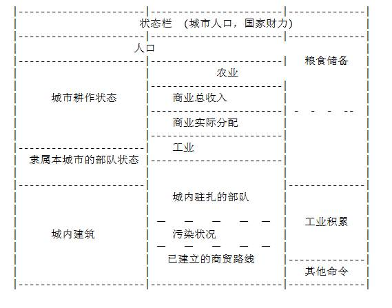

# 文明2 金元帝国

Chxou　

Civilization（以下简称 Civ）是有史以来最成功的战略类模拟游戏，但其上手很难，其玩家几乎可分为超级狂热和绝对菜鸟两种。市面上有好几篇关于 Civ 的攻略，但基本上都是些稿费小偷所写，水平低下，漏洞百出，没有 300 小时以上的浸润，哪能领会人类社会发展的真谛？

笔者本寒假又花了一周 100 小时的功夫将 Civ 爆机，意尤未竟，现写下这篇 攻略，希望培养更多的 Civ Fanatics。本文是针对 Civ2 English version 所写的，但对 Civ 一代同样适用，只不过少了最后几个阶段，中文版除了名称不同，画面粗糙，兼容性差外，没什么不同。

Index:

一. 基础概念----专为新手上路
二. 深入了解----游戏规则
三. 纵横四海----帝国的时代
四. 战略战术----打法策略
五. 精细结构----发挥极限
六. 无法无天----提高４个数量级

请根据水平选择阅读，建议从 King 开始

## 第一篇 基础概念

(如果您已了解，请跳过这一章)

众所周知，人类物质生产分三类，农业，工业，消费业。文明继承这一概念， 但把它限止于城市（农业民族不能指望打猎）。

一路回车到底，最后会获得有两个小人，这就是 Settles（移民团），可用来建造城市，移到任意位置，按下 b 键（`order` \ `build new city`），就会有一个小人变成 Beijing，同时报告 `Beijing founded 4000 BC`。这说明小人在他当前所在位置定居下来，并形成城市 Beijing，从此你的一切活动都以城市为基础。

用鼠标点Beijing，就进入城市画面，你可以由此建造部队，或发展城市。



１）首先看城市耕作状态，正中是城市位置，以此为中心的 5*5=25 格是本城隶属范围（实际边角四格不能控制，应为 21 格），本城这格是 FREE 的，以后城市人口是1，就可以在周围 21-1=20 格内任选一格耕作。

２）人口栏依人口的多少会有不同个脑袋，现在你拥有的是第一个城市 Beijing，一个脑袋，加上本城 FREE 的一格，共有两块区域在耕种，将地皮上的 `黄草`/`蓝盾`/`红箭头` 相加，就是你的 `农业`/`工业`/`商业` 总收入了。

３）看看农业栏，一共有 3-4 颗草，分为两部份，消耗 (左) 和节余 (右) ， 每个城市人口必需消耗 2 颗草，故剩余 1-2 颗草节余，储藏在粮食储备栏中，当储备存满， 就会长 1 个人口，变为 2，储备清空。

４）同理，工业栏内即所有蓝盾总和，分为三部分，`消耗`/`浪费`/`节余`，

- 城市隶属战斗部队每支消耗一个盾牌，
- 在奴隶/原始社会，当盾牌多到一定数目就会产生浪费而不起作用，
- 节余盾牌会积累在工业积累中，你可以选择建造不同的部队/建筑/奇迹 ，当盾牌积满时就造好了。

５）商业收入由城内贸易和城间贸易组成，城内贸易即所有红箭头总和， 城间贸易通过建造 Caravan（骆驼商队）并走到别的城市而建立，并永远保持。最多可建立 三条，列在 “已建立的商贸路线” 处。

总的商业收入再分为两部分，收入/腐败。腐败就扔入历史的阴沟中了，实际收入再分为三部分，(商业实际分配栏) 收钱/奢侈/研发，收钱（金币）就是袋袋平安，奢侈 （酒杯）可以让人民快乐，研发（灯泡）推动科技进步。

可用 `shift-t = T(Kingdom\TaxRate) ` 来调节三者比例。

- 钱是最有用的，当造好建筑，需要钱来维护，当急需完工时，可用钱来买盾牌，钱还可以煽动对方城市叛乱，购买对方部队，金元外交是成功率最高的，即使野人兵临城下，也可以花钱买命。
- 奢侈并不总是件坏事，当城市人口增长到一定等级（Chieftain 是 10-9， Diety 是 3-2-1），人民就渴望休息，新增加的人口会逐步由普通-不快乐-很不快乐，给他们一定酒杯，使城市保持正常。
- 科学是大头，只有新的科技被开发，才可以制造新的部队/建筑，当有科研投入时，电脑会提示所要研发的项目。灯泡积满就造好了。

６）本城隶属部队和城内驻扎部队意义不言自明，点图标会有菜单。

７）其他栏是一些辅助命令，看一下即可。

在对你的城市有初步了解后，你可以制订一个城市规划，如果要让城市快快长大，就把耕作放在草多的地方，如要造部队/研究科学，就放在盾/箭头多的地方。一般来说，初期以草为重。

不久，约几百年后（石器时代日子过得飞快），你造出了第一支部队，你可以让他 去看看路，周围会有一些村庄，闯进去会有好东西/野人。你也可以再造几只 Settle，去建造你的第二，三，四...个城市，随着科技发展，你还可以建造各种建筑，抢造 Wonder， 使你的城市更强大。如果你发现别人，和他保持融洽或用部队把他淹没，去吧，一个伟大的文明正在你的手中诞生！

## 第二篇 深入了解

 (如果你非常熟悉，请跳过着一章)

如果您不满足于 Chieftain，那看一下较复杂的游戏规则。

１）在耕作状态图上，你可以用鼠标点现有耕作位置来休息，再点空白位 置放上。耕作者有快乐，普通，不快乐，很不快乐四种状态，休息者有猫王，财迷， 爱因斯坦三种状态。点主城，电脑会自动调整最佳方案，初学者一般不必更改。

２）人类好逸恶劳，当城市增长到一定等级，工作者会越来越不快乐。当不快乐人口超过快乐人口时（很不快乐抵两个），城市就会暴乱，工商业停滞不前，只有粮食倒是照长。你可以让一个工作者改为休息，或增加奢侈。

避免暴乱办法共有四种:

- 在城内驻扎部队镇压人民，但仅限于奴隶/封建/赤色/内乱，
- 建造各种建筑/奇迹，如庙宇/教堂/基因工程，给人民以安慰，但代价昂贵且非短期内可以见效。
- 或者干脆选择偏方--伊斯兰原教旨主义一劳永逸。
- 最有效的办法是增加奢侈（酒杯）率。将所有商业总收入的一部分交给老百姓去消费。将一个工作者改为猫王是应急之策，维持全社会一定的消费开销是长远之计。

3）点人头可改变不工作者三种状态，猫王／财迷／爱因斯坦。分别会加 三个酒杯／金币／灯泡。让人民从事消费而非生产的主要问题是容易引起粮食短缺。
４）当快乐人口超过一半后，并无不快乐人口，城市就会狂欢，对独裁政 府可加箭头，对民主政府会加人口。
５）当急需完工时，可用 Buy 花钱买盾牌，但必须一次买满。代价是建筑两块钱／盾，奇迹四块钱／盾，部队视所差多少而定，约 2.5 块钱／盾。如从零买起， 代价加倍。
６）当造到中途，可以换种类，在部队/建筑/奇迹系统中间换是 FREE 的， 但在不同系统间切换会造成 50% 损失。
７）当城市被敌人攻占时，所有隶属部队自动死亡。
８）在民主制下，部队出城在外，人民会不快乐，建造不人道部队（Bomber） ，人民不快乐。
９）若有 Granay 建筑，人口升级后粮食储备可留下一半。
１０）部队经过艰苦战斗，会升级为 Veteran（老兵），战斗力乘以1.5，若有Barrack（兵营）之类建筑，天生就是老兵。
１１）部队原地休息会加血，城内休息加两份血，若有 Barrack（兵营）之类 建筑，血加满。
１２）部队所在地可控制周围区域，敌方普通部队不可通过。
１３）每个部队都有指数标记，如 Cavalry（8/3/2），这代表攻击／防御／移动。
１４）部队在城内解散化为 ５０％ 盾牌，城外解散没有。
１５）只有陆军才能攻占城市。
１６）没城墙受攻击人口减少，没法律城市毁灭。
１７）Settles（移民团）是一种特殊的部队，他的产生使城市人口下降1，且每年要花费1-2颗草维持，但他可以移到别处建造新城，也可以在野外修路，灌溉，开矿， 除污，建造堡垒，加工过的地皮可收获更多东西。
１８）当人口和盾牌多到一定程度后会产生污染，显示在污染栏中，污染积累会排放在城市四周，有污染的地皮一切加工作废。
１９）长期污染积累会造成温室效应，三次警告后发作，所有靠海地皮变成沼 泽，同归于尽。
２０）温室效应所造成沼泽很难恢复，洪水会把工作的Settles冲走。
２１）Settles 修路后，不仅可以增加箭头（商业），而且部队移动力只伤 １／３。
２２）城内建好 SuperHighway，有路的地方箭头乘以 1.5。
２３）Settle 灌溉后，可增加粮食收入，再灌溉粮食乘以 1.5，但需城内有 SuperMarket方可享用。
２４）灌溉必须周围有水。
２５）山脉可以开矿，可增加盾牌收入。
２６）有铁路的地方，盾牌乘以 1.5。永不伤移动力。
２７）Settles 升级成 Engineer 后，可改变地形。
２８）有河流的地方，加一个箭头。
２９）有些地形有特产，如丝绸，葡萄，鲸鱼。这都是外快。
３０）建城于普通地形，会自动更换到较好地形，以保证城市发展。
３１）建城之地自动完成所有土地加工。
３２）等级１的城市建造 Settles 就会毁灭，但地形恢复到建城前的情形。
３３）海上建筑必需沿海城市才能建造。
３４）堡垒内的部队受攻击，一支一支死亡，且防御力乘以 1.5。
３５）点建筑旁的小圆点，可将建筑卖掉，每个盾牌一块钱。
３６）建筑每个回合都要消耗金币，若没钱自动卖掉换钱。
３７）奇迹造好后不需维护，且能带来特殊利益。
３８）奇迹每种全世界只能造一个，故要大家拼抢。
３９）对方开造奇迹会向你报告，若说即将完成，则表示下个回合对方将完 成，除非你这个回合把盾牌弄满，才可抢先。
４０）科技是无形之物，文明之间可互相传授，交换。还可以用Diplomat/Spy 到对方城市去偷，或用大图书馆自动获得。
４１）Diplomat/Spy 走向对方城市，可以建立大使关系，观测对方城市，破坏建筑，及“购买”城市！
４２）非 Democrazy 国家的城市可用 Diplomat/Spy 购买，价格和人口成正比， CourtHouse 会乘以 1.5，对方首都影响很大，越近越贵。另外，不同种族价格差异很大。
４３）第一个城市自动有 Palace，即为首都，首都没有腐败，第一个人口 不会不快乐，首都附近城市腐败很小，价格很贵，相对快乐。另造 Palace 即为迁都，如首都被敌抢掉，会提示用１０００圆立即迁都。首都不能被购买。
４４）有五种特殊科技：Monarchy，Communism，Republic，Democrazy，Fundmentalism，发明后可以改换相应政府。革命期间，举国内乱。
４５）整数周年会提示开会，每次开会回合缩短，由５０－２０－１０－５ －２－１，难度低，日子慢。
４６）当国力增加一个百分比后，人民会帮你造宫殿，一般游戏开始后会 连造五次。纯属好玩。
４７）屏幕右边状态栏，酒瓶表示科技发展状况，污染后会有太阳，大太阳就可准备 Load Game 了。
４８）Caravan 有三种用途，和其他城市建立丝绸之路可获得一笔稳定的 收入，建立之时有一笔交易费，及助造 Wonder。
４９）Caravan 走到正在造 Wonder 的城市，可转化成５０盾而不是２５， 正所谓 “一个好汉三个帮”，在早期，Caravan 是造奇迹的主要力量。
５０）Caravan 获得的交易费可能很夸张，甚至是你财政收入的十倍（早期）
５１）在后期，城间贸易很重要，甚至可以超过城内贸易，但在石器时代， 几乎没有力量建造 50 盾的 Caravan，即使造了，由于城市很鸟，收益也很小。
６２）高山伤移动力 ３，山脉伤移动力２，但即使是移动力１的部队，只要移动力满盈，均可走上任何地形。

另外，让我们看一下,您可以建造的：51 种部队／34 种建筑／28 种 Wonder（奇迹） ／ 4 种其他，其作用和评估是什么？ 他们列于附表。

## 第三篇 纵横四海

（如果您很有经验，请跳过这一章）

每个文明开始的时候都会有２－１个移民团，并随机掌握几个科技，你的任务是 带领你的人民踏上历史舞台，去征服别的文明或别的星球。

在厌倦了野人生活后，你找了一个地方定居下来，公民被组织起来，形成Warrior （民兵）防御家园或其他部队，征战或开拓。不久，人口增长，都市扩大，你会考虑再 建造几个新城以加快发展速度，Settles（移民团）形成了，一部分人离开家园去远方。也或者，你希望让人民过得更好，就在城里建造各种建筑／奇迹，提高生活水平。智者的收获，使你远离野蛮。

正当你专心致志建设国家之时，远方卫戎部队传来消息，发现了其他的文明。 你心中充满了忧虑，不知他们是善意的朋友还是地狱的使者。双方会谈后发现，彼此互补性很强，于是互相交换了科技，并牵定了互不侵犯条约。贪婪的客人摸清了对方的 底细，邪恶的种子在心中发芽，你突然撕毁了和约，将部队开进了他人的城池。你获得了 这座城及所属的一切，一个免费的科技，但失去了宝贵的名誉。

当最后一个城池被攻占，一个文明灭亡了。对方大酋长临死时充满了诅咒，“ 天要亡我，非吾不能也。”但你显然很高兴分数上升了。

野人出现了，在最安全的后方，他悄悄的冒出来，横冲直撞，你紧急调部队回 防，但仍难保全，孤立的城市很容易就被攻占，你开始意识到紧凑的本土，完善的交通 线的重要性。并致力于建立起全国公路网。幸好野人终究是文盲，不会建造新城也不懂 建造建筑，不成气候。

你终于将你的帝国铺展开来，建造了大量的新城，心中充满希望，甚至有人建 议向海外扩张，建设殖民地，你考虑再三，认为除了本土以外，所有力量都是虚假的，海军发展可暂缓。

你的地盘终于稳固了，没有敌人，没有野人，城市也造了不少，道路基建也不错 。但正如东南亚金融危机一样，瓶颈说来就来，新造的城市越来越不开心，甚至第一个人口就是（很）不快乐，旧城市开始暴乱，科技研发缓慢，财政赤字。你正踏在中世纪的门槛上，痛苦而漫长的黑暗岁月即将来临。

政府提出了一揽子解决方案，包括增设部队镇压人民，修建庙宇，及需要８０ 盾牌的市集和图书馆，甚至政治体制改革，但这一切需要大量的时间去完成。

你更没有想到，吸干你最后一滴血的是 Wonder。尽管不情愿，但你别无选择，建造奇迹只不过现在痛苦，不造奇迹将来更痛苦。

蝉蜕的岁月令人窒息，几千年的流沙洗褪的是一成不变的城貌，只有中世纪神学的吟唱在天际回荡，你在那里，埋头内政，手持人民币，喃喃自语：“我对中国有信心” 
...

随着１５００年会议的结束，时钟的更动试乎也宣告着一个新时代的到来。城市的基础建设基本完成，现在已从创业转向享成。城市人口有了很大的增长，再也不是昔日的小村落了。贸易增加，国力强盛，奇迹建成，人类腾出手来开拓世界，当然，驾着飞翔 的翅膀。

科技的发展也度过了漫长的神学之旅，人类开始享受一些实用文明（而且研发 很快），铁路，火药，蒸气机的发明，将人类带入一个新世纪。文艺复兴，工业化，商业化，枯寂的心颤抖着迎接扑面而来的轻新的风。所有的城市都乒乒乓乓动起来。我们正在 以指数形式增长。

不知不决中我们获得了在海外投放力量的能力，并不象石器时代那样自杀式的 穷兵黩武，而是持续打击力量，一艘艘满载士兵和移民的海船从港口出发，一切不发达民 族都将被灭亡，很可能就从你身边数千年的宿敌开始。坚船利炮敲开一扇扇大门，就象克伦威尔一样，一手捧着宝剑，一手捧着福音书。

海军的发展是畸形的，其火炮威力远远超过任何地面部队。而且其还享有机动力高，没有地形障碍，没有城墙，及最重要的不受攻击，使其对陆基作战取得绝对优势。这是一个争夺海上霸权的年代，其赢家也是相应的殖民地（海外孤岛）霸主。

铁路的出现多少为陆军挽回了一点面子，它最终使你的国家形成一个帝国。陆基 的机动力由微不足道变为无限，通过铁路，任意两个城市间都可以自由来往，他使得你可以倾全国之力完成目标，并予以维持。

１００个回合很快就过去了，回顾百年沧桑，我们看到的是铁和火，和约和纵横虽然彼此的国力都增加了好几倍，但势力均衡并没有打破，随着本土工业化和基础建设的 逐步完成，我们必须为庞大的生产力寻找宣泄口。海外殖民地过于分散，易攻难守，且不易开发，我们把目光投向了对方的腰包，现成的建设良好的城市，交通发达，可能还有你梦昧以求的 Wnoder。征服世界是所有统治者的梦想，世界就是这样。

经过几个回合的较量，所有文明都转向一部战争机器，在无数次流血和拚斗后唯一的结果就是战火越烧越旺，部队越来越多，速度更快，战线更长。轰炸机的出现，将战火一直烧到敌营后方，海陆空谍一体作战形成默契，快速，机动是不二法诀。游击队的出现，使国家可以充分发挥他的战争潜力。潜艇，航母，直升机，舰载导弹，宙斯顿防卫系统.... 这是一场国运相赌的游戏。

最后，对破坏永无止境的追求打开了潘多拉魔盒，核子武器毁灭世界，又或着胜 者为王，统一天下。你还可以和平建国，建造宇宙飞船登向外星....人类的文明掌握在你手中，就看你的决断了。

## 第四篇 战略战术

（如果您成竹在胸，请跳过这一章）

有时候我们会想，人类文明发展的真谛是什么，这问题我至今无法回答。 Civ提供了两种完成条件，一种是战争的，征服其他所有文明，独霸地球。另一种 是建造外星飞船，开拓一片新天地（约需１００００个盾牌）。我想，Civ的回答是： “发展－>为了更好的发展”，这虽然不是令人满意的结果，但总比没有强。

当然你也可以穷兵黩武，手持核弹狂轰乱炸，但这是目光短浅的军阀和涉世 未深的王子们所干的。成熟的君王应该将他的人民带上发展的道路，提高他们的生活 质量，而不是满足于征服更多的人口。你的土地在不懈努力下被逐步开发，道路纵横， 万里良田一块接着一块，一眼望不到边，沼泽被填平，污染杜绝，人口密集，贸易发 达，远方的商人带来你所需的商品，带回本地的特产，人民安居乐业，科研迅速发达。 也许你也会夺取他人的土地，但那只不过想让当地的资源从愚昧的统治者手中解救出 来，你应该让新征服的居民过得更好，才可以宣称自己的行动是正义的。最痛心疾首 的是长看到某些玩家疯狂军事化，不搞自己的内政，以征战掠夺为生，强下他人的城 市后砟锅卖铁造部队，达到以战养战。文明的意义在于发展，而不是征服！现在，我 就Civ游戏而论，谈一下怎样建造庞大的文明帝国。

一）内政

攮外必先安内，强盛的本土国力是长远目标的最终保障。正如开宗明义所说的 ，人类共有三大产业：农业／工业／商业，那么，什么是综合国力的最终体现呢？
照政治课的所法，三者互相依赖，互相转化，缺一不可，互有重点。而事实上 婆婆妈妈，面面俱到是成不了大气候的。全力发展商业（收钱）是制胜妙诀。

农业是基础，他直接决定人口的多寡，而国力由两者相乘所得，人口数量和人 口质量。但农业发展过于缓慢，要靠粮食储备将人口撑上去，路漫漫其休远兮。而且农 业副作用很大，人口多了刁民就会要求休息，引发暴动，农业立国是没有前途的。而最 主要的是，Civ中设了捷径可走。

正象大多数人的误以为的一样，工业强国颇具吸引力，不管是造部队投入战斗 ，还是造宇宙飞船开拓外星，归根到底靠的是工业生产力，但工业化代价太大，请看：

```
１.５倍 ２倍 ２.５倍
商业化： MarketPlace Bank StockExchange
（８０盾牌） （１２０） （１６０）
科技化： Library University ResearchLab
（８０） （１６０） （２００，有奇迹）
工业化： Factory HydroPlant Manufacting Plant
（２００） （２４０，有奇迹）（３２０）
```

可见，工业化最小的造价也比别人最大的大，徒耗国力得不偿失。更何况工业化副 作用极大，盾牌多了以后就会有工业污染，需要进行除污。

```
４０ 盾牌以下 MassTransit（１６０ 盾牌）
４０－６０ MassTransit+RecyclingCenter（１６０＋２００）
６０以上 MassTransit+SolarPlant（１６０＋３２０）
```

再者，工业化开销太大，Factory每回合要消耗４圆钱，比赚的还多，除污也很贵，国 有大中型企业是亏损大户。但是，工业的致命弱点是盾牌资源太少，一般地皮只有 ０－１个盾牌，即使是发展到顶的大城（等级３０左右），也只有２０个左右的盾牌， 基数太小，即使高度工业化收益也很小，２０个盾牌乘以２.５后是５０，收益是３０ 盾，扣除工厂４圆，大规模生产（Mfg.Plant)６圆，MassTransit４圆，RecyclingCenter ２园，近１０００盾的投资，实际收入只有１５圆，还没有８０盾的MarketPlace收益 多，故工业化只能强国而不能富国，当你需要投放力量，或免于亡时，适当造一些工业， 但如果你想把国力尽快提高，工业化是老牛破车。

商业化，或者所是资本主义化，是清洁廉价的康庄大道。商业享有基数高， 一容俱容，投资回报率高，无污染，无副作用等优点。但商业需要政府，奇迹，资本原 始积累等一体化配合，必需有一个完善的社会体系才能维持高度发达的资本运行，非一 蹴而就。

马公主义对人类社会的划分是很有道理的，Civ刚开始时是奴隶制，以后可革命 到独裁制及民主政府，奴隶／独裁／民主对任一块耕地上箭头的影响是－１／不变／＋１ ，显然高级的政府形式有利于解放生产力，获得更多收入。但正如生产关系不可脱离生 产力一样，独裁／民主政府部队需要盾牌支持，在原始社会如贸然切换，部队的消耗即 会耗完你所有的生产力，而再难以发展。民主政府部队不能镇压人民，若无足够的生产 供人民奢侈或城市建设到一定规模，必然会大面积混乱，就象１９１１一样。

商业化的关键就是先用特殊手段建立起运行有效的民主政府，再用民主政府的 优越性来完善自身，最后走向滚雪球般的指数增长。而这种特殊手段就是Wonder，这段 民主政府从脆弱到完善的过程就是资本原始积累。

当资本主义初期阶段完成，就进入高速发展的黄金阶段，巨额财富的收入和再 投资，使强者俞强。商业的发展，使奢侈（酒杯）数大大增强，从而解决了农业瓶颈 －－人民快乐的问题，通过用钱买工厂，可迅速完成工业化。事实上，金元帝国，有 更好的武器：用外交官煽动敌方城市叛乱，这可避免电脑部队又多又硬的优点而直击电 脑不善发展的死穴，工业化变得相对不重要了。

商业化对农业的帮助是决定性的，不仅使人民免于暴动，更重要的是要让城市 狂欢，在民主政府下，另一个重要优点就是当城市狂欢时，只要有草，就不停长等级。 所以说农业发展根本不重要，有更好的捷径可走。但维持这种增长必需保持城市狂欢， 民主政府，粮食足够和建造人口建筑(Aqeduct,Sewer System)， 所以说资本主义是一 套精密的系统，需要各环节紧密配合。

商业化和科技也是互通的，都由箭头转化。这使你很容易在科研上远超对手， 落后挨打，双方的胜负已经很明显了。

商业化的优点归根到底是因为箭头资源远多于盾牌，在民主政府下，造一条 路（只需１点移动力），就获得一个箭头，因政府优良而加个箭头，成为２个，而后 期城市多有SuperHighway（高速公路），有路的敌方箭头乘以1.5，独裁政府１个箭头 乘以１.５仍是１个，而民主政府即可获得３个箭头，是对方的三倍。以发展后期标准 大城等级３０计，前２０个人口是有工作的，可获得６０个箭头，后１０个人口是休息 的，虽不产生粮食和盾牌，但消费增长是有的，每个人可产生３个箭头，共计３０个， 其次，还可以建立三条商贸路线，对等级３０的大城而言，每条可加１５个贸易箭头， 共计４５个。全城箭头基数就有６０＋３０＋４５＝１３５个，乘以２.５倍后约有 ４００圆收入，而开销只有MarketPlace+Bank+StockExchange=１＋３＋４＝８圆， 投资也不过８０＋１２０＋１６０＝３６０个盾牌。即使所有工业建设全部由商业买 办完成，４００个金币也可抵得４００／２＝２００个盾牌。可见，商业收益远高于 工业改造，实是一本万利。

二）军事

军事是政治的延伸，拥有强大国力的基础上战争不会有太大的逆差。但对发 展军事力量的时机仍有争议。笔者认为，Civ中军事态度分为两种完全不同的时期。

１）石器时期

这时期的战争完全是国运相赌，当发展初期发现敌人，应立即选择是战是和， 若战，就不顾一切的穷兵黩武，造尽量多的部队将敌人彻底消灭。因身边的敌人，会 将你拖入永无休止的消耗战，若不能将其尽快消灭，必然是两败俱伤。这时期的战争， 特点是不惜代价，全力以赴，对方一般和你在同一块大陆上，对土地的共同需求决定 了你们不可能和平相处。

２）发达国家

当度过了初级阶段艰难期，你的种族已经很象一个国家了，这时其的战争是建 立在国力基础上的持续打击力量。你本土大陆已牢固掌握，对方一般处于另一块大陆上 ，他的城市即使攻占也很难保持，同理，你也享有安全保障。地域的限制使你并不需要 急着和对方拼个你死我活。同时，你也没有海外远征力量。除非你本土太小，否则没有 必要学小日本样。

隔海相望的日子过了几千年，其中当然有登陆和反击，但并不会造成全局大的 影响。终于有一天，你不满足于本土的狭小，且正好拥有了一些犀利的武器，就会爆发 另一场战争，但战场是设在对方家门口，赌注是对方的国运。你心里很清楚，即使输了 ，对于金元强国来说，再赌一次也很容易。这一时期战争的特点是很悠闲，强国的胜利 只是一个时间问题，即使核子武器也只能略为苟延残喘几天而已。

总的来说，海空军比陆军优越，因为他们处于不受攻击的地位，而可以大量建 造攻击性部队，而隐藏其弱点。在后期，进入现代战争时期，每抢下一个城市均会有铺 天盖地的游击队，导弹的出现使海军作为一种打击力量而最终消亡。隐形Bomber成为主 要攻击手段，隐形Fight可以迅速清理游击队。Carrier（航母）控制大洋，从而保证易 守难功的战略优势。

Bomber/Paradrops/Spy 三位一体的组织提供了世界大战的能力。 一般来说，精密计算，一夜之间全线出击，现强下敌方首都，用军事力量消灭敌方尽可 能多的大城，包括第二，第三个临时首都，将对方削弱后用Spy购买敌方大城。尽量消灭 敌方大城是重点，因为下个回合对方反扑，城内的Fight会使你损失大量的Bomber， Missile会击沉你的船舰和最关键的：“敌方若有核子武器”，可以彻底摧毁你的力量， 并留下无数的污染。所以一定要尽量消灭对方大城，小城市发展还早，很可能没有重要 军事力量，游击队更无所谓，他们盘踞山岭，龟缩于堡垒之中，但只会搞搞破坏，妨碍 行军，若用于正面战场，其指数仅为４／４／１，对Bomber毫无作用，攻城也是九死一 生。如无必要，完全可以不予理会，先全力扫荡敌军主力，然后慢慢收拾。甚至，当对 方海外殖民地少时，可以一口气将其灭光，游击队自动消失。

其实，以上都是废话，决战在对方首都面前展开，结局已经很清楚了。

三）外交

平等的地位，及所谓的双赢，决定了不可能产生太大油水。你可以缔交盟友， 签订和约，但千万不要将希望寄托在他们身上，盟友协同作战，及电脑之间狗咬狗都 只会限于小规模战争，不会对世界格局产生影响，一切还要靠自己。电脑外交倾向于 保持均势，当你取得胜利后，你的盟友就会倾向于背叛你，而和弱者结盟。笔者在后期 长遇到其余六国一齐联盟抵抗Chinese Aggressive。但仍然被我一一揿灭，也没遇到 援军救命．

值得一提的有三点：

- 民主国家不能撕毁和约，但有办法可克服。
- 游戏初期，可选一强国，送一笔厚礼，即可骗其与你签订永久性和约， 以后每隔一段时期即可向其索取援助，一个科技或一笔钱。（高手不用）
- 六国连横的唯一难点是对方会互相交换科技，六国合力，发展急快， 但如果电脑受到攻击，就会将科研停下转入军事状态，故六国同盟意味者全线出击。

四）科研和奇迹

每一个科学的研发都可建造相应的建筑／奇迹，或研发新的科学。Civ中科研 的费用是依科技的个数而增加的，故应全力直扑最有用的科技，偏门不重要的科技不 妨先放在一边，甚至不研究。如果上手陷入石器时代的苦战，那是双方的不幸，从 Wheel（轮子）入手，发展战争武器。但如果和平建国，应重文轻武，尽快完成资本 主义改造。

文明中科技的研发必须在现有科学的基础上研发深层的科技，形成树状发展 ，不能凭空获得。针对商业化的路线，最重要的科研路线有以下几条：

```
Alphabet-> { Code of Law } -> Literacy
{ Writing }
Literacy } -> Republic
Code of Law }
Ceremony Bury -> Mysticism } ->Philosophy
Literacy }
Ceremony Bury } ->Polytheism } ->Monotheism
HorsebackRiding}
Philosophy }
Warrior Code }
Monarchy }-> Fedulism }->Thelogy
Monotheism }
```

Alphabet（文字）和CeremonyBury（葬礼）都是直接可以研发的，在研发 Code of Law（法律）和Writing（书写）后有望在第四，五个科技即拥有Literacy （文学）和The Republic（共和制），Literacy 可建造奇迹“大图书馆”， Republic即所需的民主制度。但是，并不能贸然两级跳进入民主政府，而必需做一些 准备工作。葬礼的发明可以建造庙宇（４０盾牌），可减少一个不快乐人口。

Ceremony Bury -> Mysticism ->Philosophy

Mysticism（神秘主义）可增强庙宇的作用，减少两个不快乐人口。由此，可基本缓 和民主制的脆弱。第一个发明Philosophy（哲学）的文明可自动再获得一个科技， 可选Currency（货币）以建造MarketPlace（市集），以后就可进入资本原始积累 阶段。将Republic的税率分配钱／奢／科调为８／２／０，全力收钱，在所有城市 逐步造成MarketPlace（收钱乘以１.５），以达到钱生钱。选一个盾牌较多的城市 建造“大图书馆”，“大图书馆”的作用是自动获得被两个文明了解的科技，在全力 建造金元帝国的期间，它可使你的科技不致于太落后，甚至领先。

让人民安居乐业不致暴乱始终是Leader最关注，最头痛的事。Temple的作用 很快就显得不够了，是建造价值１００盾，年耗４金，改善３个不快乐人口的Colossum， 还是另有良策？事实上，游乐场基本不造，而是设法走Polytheism（多神论）-> Monotheism（一神论）的路线，Monotheism可建造奇迹"米开朗基诺壁画",这是最重要的 奇迹，在每个城市提供一个Cathedral（大教堂），减少４个不快乐人口，可认为一劳 永逸解决了快乐问题。从此，你可以全力发展国力，新城市甚至不需要赶造Temple。

一般来说，Michelanglo's Chapel已经足够了，某些特殊情况，你可以再发明 Thelogy（神学），建造巴赫大教堂，每个城市再减少２个不快乐。这个奇迹也很重要， 你可以在国力和需求之间自由判断。

早期奇迹中还有一个麦哲伦航海是有用的，但它是长远利益，失掉不会致命。慢慢你度过了艰难的黑暗时期，资本化终于完成了，各个城市相继造好了Market Place／Bank，甚至StockExchange，“大图书馆”也快过期了，这时你的岁入约有３００ －５００圆，而别人约３０－５０圆，您可以考虑继续收钱／发展科学／投放力量。 如果您发展科学，第一个回合你就可以在你最大五个城市建起图书馆，如果投放力量， 用海船载外交官出去游荡，用金元强行购买对方城市，对凝聚国家，中等城市（６－７） 约１０００圆，对离心国家只要３００－５００圆。即使对等强国，在买去３－４个大城 后，此消彼长，也会走向没亡。如果继续搞内政，应逐步建立起城间贸易，但要花精力去 钭科技了。

在这段大发展时期，文艺复兴，涌现一大批科技和奇迹，但最重要的是两个： RailRoad（铁路）和 Explosive（爆破）。铁路的作用不仅是将盾牌乘以１.５，关键 是提供了无限的移动力，他将你所有领土连成一片。铁路国家更容易防御和组织进攻， 可以将全国兵力集中于一点。

```
Iron working }
Construction } ->Bridge Building } ->RailRoad
Physics }
Invention } ->Steam Engining }
```

爆破之后, Settles升级为Engineer（工程师），工作能力增加一倍，但最重要 的是，很多事可以在一个回合内完成。如第一个Engineer走前去，耗一个移动力，另一个 移动力即可修成路，第二，三个Engineer上去，即可修成铁路。如此只要精心准备，可以 一夜间将铁路修到敌方城下，本来一些攻城武器（６／１／１，８／１／１）根本没机会 出手，现在是它们大展拳脚的时候了。

文艺复兴时期唯一的痛苦是，你已经很有力量了，但还不是充分大，正是鱼和熊 掌不可兼得。你的力量不管是发展科学／海外战争／发展实力都绰绰有余，但不能同时进 行，商队助建奇迹就不能建立商贸关系。具体打法，各有不同，一般可以将奇迹造着，若 时间紧迫，才全力以赴。幸好期间奇迹都不是致命的，只有一个贸易公司非抢不可，嘲讽 的是，他的作用正是两全其美，他省去你的大部分开销，而腾出手来完成目标。

在这些奇迹之中，Darwin's Voyage是稳赚的，３００盾获得两个科技。若是民主 政府，还不妨建造Women's Suffrage（妇女选举权）。民主有两大毛病：

１）不可撕毁停战协议，但可先购买对方城市，用２倍价格，第二次走到对方身 边时，即会通知和约作废。
２）部队在外，人民不快乐，需要建造Police Station（警局）以抵消。Women's Suffrage自动在每个城市提供一个警局。

工业革命时代过去以后，你的高度商业化的国力已经领先对手很多了。当收入破 １０００圆后，奇迹已是小菜一碟。不仅不需重工城市苦苦卖力，也不需倾国之力建造商 队，即使是最贵的６００盾牌的奇迹，用钱买也不过２４００圆而已，两年收入罢了。 一些好的奇迹应立即不惜工本建造出来，如HooverDam,Cure for Cancer,SETI Program, 一些无用的奇迹如Statue Of Liberty,Effile Tower,可以随意。Manhatton Project （可以建造原子弹）千万别去造，即使别人造，也应尽量阻止。奇迹的选择可看附表。

值得一提的是，除了笔者推荐的商业化道路之外，还有一种打法：

```
Colossus + (Hanging Gardens)+ Copernicus's Observatory+ Issac Newton's College
```

Colossus（青铜巨人）在本城每个地皮加一个箭头，Hanging Gardens的副作用 是使首都有三个人快乐，如果两者配合，很容易使首都狂欢，独裁政府可象民主政府一样 每个地皮再加一个箭头，民主政府可以迅速将人口提高。总之，首都会迅速成长成一个超 级大城（相对石器时代）如等级１０，而且每个地皮至少有三个箭头。然后再在此处建造 哥白尼观察站，科技乘以１.５，牛顿学院，科技再翻倍，即增加３倍，累计Library, University之类建筑，这一个城就可收获５００个灯泡（后期可以破１０００），比对方 整个国家还多，走科技兴国的路线，用飞机大炮去轰炸土兵。出于对个城英雄主义的痛恨 ，笔者不推荐这种打法。

另一条叉道是如果水平实在很糟糕，奇迹也没抢到，以致没有走上商业化发展的 道路，那就只能选Monarchy -> Communism/Fundmentalism的道路了。这些政府都可用部 队镇压人民，尤其是Civ对社会主义很推崇，不象民主政府后期，每一个人口都是很不快乐 （等级２０的城市甚至有４０点不快乐指数！），社会主义不会有“很”不快乐人口，且 每个城市都认为有Palace，不仅第一个人口是普通，而且没有腐败（约５０个箭头才会腐 败一个），前三支部队不需盾牌支持，每个可镇压２个不快乐，即不需任何付出即可维持 等级７。Communism的弱点是钱少，但工业毫不受损，可以任意撕毁盟约，间谍富有经验， 这使他倾向于在全世界兴风作浪，挑起战争，火拼盾牌，如果陷入长时期的冷战，则会被 脱垮。

Fundmentalism（伊斯兰原教旨主义）是一道偏方（独裁级）。他完全没有不快乐 人口，宗教建筑由开销转为对等的收入。部队几乎不要支持，还可以拥有廉价的Fanatics （狂热者），但其科研不得超过５０％，且收益减半。虽然穷兵黩武时他的确很好，但出 于对政府的拥护和个人信仰的原因，笔者从来不用。

Monarchy所有指数都比Communism低，是唯一没有特长的政府，不如升级吧。

五）贸易

在传统农业国家（如我国），人民对贸易并没有太大的关注，但对发达资本主义 国家，它至关重要，对Civ中高度发达商业化国家也是一样。

贸易有两笔收益，建立之际的一笔回报，和建立商贸关系后定期的城间贸易收入。

１）城间贸易

后期城市工业总收入大致和建筑总开销相抵，箭头成了剩余净收入。如第一篇开 卷所说，商业总收入由城内贸易和城间贸易组成，大家一定对培养起一个超级大城的艰辛 记忆尤新，土地被灌溉，沼泽被填平，各种建筑需要大量的投资，以及长时间的细心呵护 。但城间贸易很容易使你的成果增加一倍，只需３个Caravan，１５０盾的投资，就可以 建立起３条丝绸之路，其总和可以达到甚至超过城内贸易。但正所谓皮之不存，毛焉附彦 ，城间贸易直接和城市大小成正比，如果城市发展很鸟，城间贸易也微不足道，故本城发 展仍是基础。这又一次体现了资本主义泡沫经济，一容俱容，一损俱损。

有几个因素是影响商贸额的。决定性因素当然是城市的大小，同样大小工业化城 市收益似乎少于箭头多的城市，时间影响可以忽略。一个迷惑人的地方，是Supple and Demand（供求关系），事实上，这只影响抵达时的一笔收入，而不改变长期贸易的大小。 如果不在乎交易时的收入，商贸关系应越近越好，加的最多。

城内建筑唯一可做的和极有效的是SuperHighway（高速公路），Civ一代中通过 修铁路，可将当地所有收入增加５０％，Civ二代中将其划分为三块：

```
土地开发 城内建筑 副作用
－－－－－－－－－－－－－－－－－－－－－－－－－－－－－－－－－－
农业 再灌溉 SuperMarket 有AirBase的山脉也加
工业 铁路 铁路提供无限移动力
商业 修路 SuperHighway 增加城间贸易额
```

可见，商业是最省力的，只需建一个城内建筑，而不需完成费力的土地开发， 其副作用很大，SuperHighway几乎可将城间贸易提供一倍。

若贸易是通过空运在不同大陆之间完成，Airport（空港）可起相同作用。

２）贸易即时收入

和长期贸易相反，贸易即时收入两城隔开越远越好，如果供求关系对口，收益 加倍，如果和其他文明贸易，收益再加倍，如果和野人贸易，收益加四倍。隔海加很多。

关于用商队帮助建造Wonder之间一直有争议，一种看法认为６００盾牌的Wonder 可以建立１２支商队，其收益不小于奇迹，更何况还有一笔可观的资金回报，建立了城间 贸易，国力大大提高，可用钱来换Wonder。他们也许是对的，尤其是当你发现隔海不远有 一敌国中大城市，可以设一海船将商队源源不断的运去，每支可收获１５０圆左右，正好 可以再购买一支商队。如此良性循环，飞快就可完成城间贸易，国力增加一倍，这是笔者 见到过的最快的发展方法。

第四支以后的商队会将前三支中最少的一条替换掉，故小城市盲目和大城市乱交 有可能使商贸下降。如果货物是粮车，就搬运本城一颗草让目的城市享受，Trade 收入 为 ０ ！ 粮车路线永不会被替换，这意味着你每年失去３０圆以上收入，而获得一颗无 用的小草。当笔者看到小报攻略提示温室效应来临时，后方造粮车为沼泽城市补粮时，差 点没吐出来。

有谣传说和敌人／野人建立商贸关系可使城间长期贸易额也增加２／４倍，笔者 未试出这一点，有人宣称每条商路高达５０个箭头，２０个城市收入就破３００００， 笔者用了１５０个城市才完成这一点，我想，这也许和文明种族有关（Chinese VS Zulu）

六）其它

即使是原子弹，也不能轰光你１００个以上的大城市，唯一可怕的是“温室效应” 。一旦发生，所有沿海土地化为沼泽，且很难灌溉：看不见的洪水会将工人冲走。粮食暴 减，人口下降，道路冲毁，箭头不收，连带城间贸易的减少，正是一损俱损，文明趋向毁 灭。故在后期，污染是最主要的，笔者为此甚至不用污染太大的原子弹。

## 第五篇 精细结构

（如果您轻松过关，请跳过这一章）

人生充满了不测，尤其是当您还缺乏力量的时候。如果您想更有把握，请看下去。

１）建城是件大事，但并不象小报攻略所说的选择有很多特产，有河流，气 候宜人的地方定居。笔者认为，上手在可见区域内，选一块没有圈的GrassLand定居即可。
一定要选GrassLand／Plain,因为它们草多，人口增长快，这在初期是最重要的。 周围不必有特产，因为根本没有力量去收获。初期粮食第一，必把精力投于GrassLand， 而城市建设的主要目的就是建造更多的城市，一般等级２－３还没Settles移民出去的情 况很少。

周围也不必有河流，因为没有Bridge Building，河上不能造桥，毫无价值。 选择没有圈的地形是因为建城会自动将其换为有圈的好地形(有圈多一个盾牌）。就近建 城，因为时间就是生命，早一点发展强大很多。

２）唯一值得注意的是，建城应该靠海／不靠海，其实两者都好，最忌讳望 海。因为靠海则可建很多海上建筑，提高海上收获。陆地发展到顶比海好，但需要太多投 入，需要Settles长期开发，灌溉。最怕有海域，但不靠海，无法建造海上设施，仅有一 颗草三箭头，还不如沙漠。

３）别忘了将税率调为收钱／奢侈／科研＝４／０／６。

４）第二个Settles则走开建城，以免资源冲突。但他应是一路修路而去。 虽晚到几年，但Beijing收获的箭头即可从一变二，影响很大。但也不必修太多的路，短 期内Beijing人口不会超过三。再者，将道路将Beijing和Shanghai联接起来也有利于军事 化。

５）Shanghai不用建得太远。离Beijing三格左右即可，小报攻略建议城市 离开以免冲突，笔者认为不对。

初期城市不妨造得近近的，易于互相支援，靠近首都，腐败少，建造速度也快。
中期作为你进攻退守的本土，大本营，布满密集城市群，充分发展利用到最大限度。
直到后期，资源冲突矛盾才突出，但你已不主要依靠它了，再者商路（靠近加得多） 的提高也能弥补一定损失。

６） 看一下Beijing的资料，判断一下其长草和积盾的速度，一般造两支 Warrior后开造Settles,一支探路，一支驻守（主要是镇压），然后把你的帝国铺展开来， 此后发展，存乎一心。

７） 出去探路的部队会看到很多小村庄，一般应该进去，好东西概率很大。 若遇野人，必死无疑。但野人不会离村庄很远，一般不会对城市造成威胁。

８） 初期野人是很可怕的，但野人素质较差，据笔者分析，野人（３／２ ／１）兵临城下，可用（１／１／１）歼灭之，有时主动出击，会有奇效。野人首领单独 打死会有１５０圆，初期是一笔很大的财富，但必序冒险让掩护部队先死于攻城。再用 移动力２的部队才追得上。

９） 不久，你会遇到其它的文明，应该和他们交换科技，以使你领先于其 他文明，然后，设法探明他的位置，观测一下，他建造了第几个城市，国力如何，及最关 键的，他是什么样的文明。你必需立即作出决定，决战或挚友。一山不容二虎，强敌掣肘 ，会消耗完你的所有精力！

如果他离你较远，暂时没有抢建城市的现象，国力较强，城多兵多，地形又好， 及最关键的，是印度，巴比伦，迦太基之类的发展型文明。那就和他签订和约，而且最好 是永久性互助条约，开始榨取他的力量。在以后的５０００年中你就不要去惹他了。 如果他就在你身旁，或是蒙古，俄国，日本等战争狂人，真是大家的不幸。你应 立即停止一切生产活动，全力穷兵黩武，准备４－５支Chariot，Elephant或其他移动力 ２的攻击性部队（城边很危险），在他身旁布置，然后一夜之间，突然翻脸，猛扑进去。 如果输了，就再也不要攻击，在你最前线的城市筑扎防御力量，修建围墙，让他把潮水般 源源不绝的复仇力量消耗在坚城之下。２０００年后你再去回头收拾他。如果嬴了，一定 要斩草除根，彻底灭亡，即时对方只有一个城市，也会疯狂反扑，而你则必须选择维持一 支庞大的防备兵力或另一次远征。

最担心的就是战争陷入僵局，电脑一旦进入军事化状态，他每个城市每个回合可 以制造一支部队，且有地利之优，无止境的消耗战会把双方拖死，而且多半你死得更惨。 这时候上策是在前方建立一个无敌堡垒，城墙老兵防守，转入战略防御。让他消耗宝贵 实力，徐图大计。不要迷信外交，北极熊沾到血腥味，还会放手吗？

１０） 早期奇迹需要约２００－４００个盾牌，选择一个周围森林，山脉 （盾牌）多的地方，调整他的耕作分配，将粮食侧重改为工业侧重，不妨让他的农业增长 停下来，以免人口多了闹暴动。如果别人也在造，可再选几个城市造Caravan，一起帮忙。

１１） 最强大的部队永远是Diplomat/Spy。

１２） 如果和平建国，不妨不造２０个盾牌的Phalanx（１／２／１），而造 １０个盾牌的Warrior（１／１／１），因达芬奇工作室同样会将其升级到Musketeers （３／３／１），发一笔小财。

１３） 野人抢城前会提出警告，可以花钱买命，但其实是水涨船高，要你现 金的一个百分比。

１４） 部队／建筑凭空买起是要受讹诈的，不妨先买个Temple／Diplomat ,再改换就好多了。部队买起更和缺的盾牌数挂钩，可先选盾牌少的买成，再一级级换上 去，可达到平均２５圆／１０盾牌的代价。

１５） Republic是初级的民主政府，当有了Democrazy后应立即改换，两者区别是：

- Republic腐败还是很厉害的，Democrazy绝对没有腐败。
- Republic部队在外一人不乐，Democrazy两人。
- Republic是假民主，当认为开战利益很大时（如敌方几支部队叠在一起时）议会 会同意开战。Democrazy永不主动开战。
- Democrazy任何一个城市暴乱两年，就举国内乱。

民主制国家都不能拒绝对方和平建议，Republic的对策是永远不要和对方对话， Democrazy即使这样议员仍会和对方接触，但只能签订停火协议，而不能签订盟约。
解决对策是：

大城市不在乎多几个人不快乐，最多从狂欢到普通。

让你的肥肉部队，如Settles,Explorer在对方领土内游荡，对方会经不住诱惑 Sneak Attack，你即可正义开战，即使停战，几次后对方身名狼藉，你即可获议会支持。
对停战协议，用Diplomat／Spy花双倍价钱买一个对方城市即可解除（单倍会被 议会指责不道德而内乱）。

如果实在没有借口开战，不惜工本革命一次。

鉴于以上各条，推荐玩家选择Democrazy。

１６） 只有Marine（海军陆战队）可以两栖作战，但Armor登陆伤一格移动力 后仍远为强大，何乐而不为呢？

１７） 陆军在Armor出现以前其实没有太大的远征能力，陆军的致命伤是地形， 山地和沼泽使你步履维艰，而敌人从丛林中冒出轻轻松松将你的攻击性部队杀光 (6/1/1，8/1/1，一般防御力不超过2)，再让你的防御性部队在他的坚城下，进退两难。 陆军最好的用法是乘坐海船在对方的城市旁登陆，但这样做Diplomat效果更好，再或者用 Engineer修铁路直到对方门前，但并不是处处都能快速修路。Armor的出现，解决了这一切 ，它移动力高，走得快，防御力也不错对方不用坦克决战未必能赢，攻击力也很好，正好 可以将城墙内的AlpineTroops一枪打死(当然，你的所有Armor都是Veteran的)。且抢下城 市就加满血了。

１８） 中期对方常会有舰船在你领海出现，不要睬他。

１９） 早期海军很脆弱，没有大用，但从蒸汽机发明以后，海军一举成为 SuperPower,路上部队根本无法和Navy Force抗衡，如Battleship，其指数高达12/12/4 (一代中是18/12/4)，事实上，IronClad(4/4/4)就足以摧毁敌方城市。且海军还享有机 动力高，没有地形限止等优势，使人不由感慨一个坚船利炮的时代！

２０）BattleShip（战略舰）是海上无敌力量，除了对方BattleShip，永远不死。

２１） 空军的出现彻底改变了世界，Fight威力太小，Bomber是主要打击力量， 其威力大，航程远(12/1/8)，不易受攻击(只有Fight可以攻击Bomber)，主要优点是可以 攻击敌人后方，而没有地形/海岸限制，这对实际战争模拟的很好。

Bomber/Paratroops 两位一体，构成了黄金拍挡。想练习的话，可试一下附送的WWII(二战)场景。

２２） 如果有人建造曼哈顿计划，不顾一切，直扑Laser，在每个城市建造 SDI Defense，电脑是疯子，会不顾一切狂轰乱炸。

２３） 电脑飞弹不受１２格移动力限制，导弹和Fight均可在外过夜，舰载 导弹甚至还会伤血不死。要放止航母不受攻击的唯一办法，不是数格子，而是用Bomber 在外包一圈。

２４） 如果你抢了电脑的城市，第二个回合他就会用核弹轰炸。可用城市群 将 SDI Defense造到他家门口。

２５） 电脑核弹只炸城市，舰载导弹只炸野外部队。

２６） 掌握宇宙飞船后，电脑会耗费国力建造飞船（当然他不可能完工）， 那是个无底洞，从而被你赶超，轻松格毙（赖着，高手不用）。

## 第六篇 无法无天

（如果您岁入３００００，请跳过这一章）

当游戏开始是，年收入约为２－３圆，不懂商业化的玩家最终会有２００－３００ 的收入，我相信没看过这篇攻略正常人，全上海没有一个收入超过１００００圆的，甚至 ５０００圆的也没有。在一般所谓的Civ高手中，２０００圆已是一个很大的数目，我要 告诉你，我年收入４００００，并在一夜之间花光。

侠客行的前２３句只不过是皮毛，真正的精髓全在第２４句“白首太玄经”， 本文也是一样，前５篇全是废话，内行根本可以不看，真正的精髓全在本节，前五篇只不 过打打基础，使读者能够看懂这节罢了。

当所谓的“金元帝国”着手征服世界时，他的年收入可达２０００－３０００圆， 或每年１０支Armor（坦克），以后每征服一个文明，并将其纳入商业化的轨道，可增加 １０００圆左右的收入，或者说，当你征服世界时，你的岁入是８０００圆，但其实最后 １－２个文明往往很弱小，实际收入应在６０００－７０００左右。这时不要急着统一， 留一个弱小文明的城市，周围放上几个Spy严密监视，不停破坏，使他根本无法发展。 然后马放南山，开始全力发展。

在研究完９０个预定科技后，可将科技停滞，全力收钱，然后将钱全部投资掉 （本人原是个超级大财迷，在Civ洗礼后，性格有了很大改变）。如果早期商业化做得不 是太好，可将奢侈调为４０％以使人民狂欢，一般２０％也够（４０％以上效果不大）。 狂欢的结果使人口疯狂增长，这时全力收来的钱即用于建造Aqeduct（谷仓）／Sewer System（卫生局），以打破人口瓶颈（不然人口不可超过８／１２）。不要吝啬，傻傻 的等工业生产盾牌慢慢积满，而是大手笔的投资，只要有一个盾牌即将其买满，工业损失 完全忽略不计（这时更体现出工 业的无用）。我的某些疯人朋友，甚至不等一个盾牌，直 接买起，每个回合造一个建筑（这样多花８０圆钱）。
由于人口的疯长，耕作面积扩大，收入暴增，很快踏入１００００圆的门槛，但 这只是发展第一阶段。在人口增长不成问题以后，要完成全面商业化，收入的钱不再投入 农业项目，而是MarketPlace/Bank/SuperHighway/StockExchange，钱能生钱，投资这些 商业化的项目给你很高的回报，而且没有副作用，相信你可以获得５％以上的增长率， ２０年内就有２００００圆以上的收入。

同时，有一部分先富起来的城市（主要在本土），让他们大规模造Engineers， 任何等级２０以上的闲杂人口都化为工程师外出工作，每个人原本可贡献３个箭头，加 上城间贸易，使得他们每人每年值１０圆钱，但这仍是值得的，因为有大量土地没有人 去开发，想想只要两处灌溉就可使增长一个人口，即５－６年收回本钱。

但是Engineer的主要工作不是灌溉，而是修路，因为灌溉太慢，５个回合才获得 一颗草，不如修路，一个回合即可完成，有路之处获得一个箭头，民主征服再加一个， ２个在SuperHighway作用下即成了３个，３个在２.５倍的金融泡沫下即时７.５圆，可 谓钞票大大的有。

笔者随攻略附送的进度有２４０个Engineer在外面工作，一般玩家当然不用这么 疯狂，一半就够了。然后开始大量的造Freight（商队），建立商业关系，使得你的收入 再上一层楼。而且，有了这些额外的箭头，城市更容易狂欢。

这是大发展的第二时期，每年都有１５０００圆以上的收入，不要吝惜，全部投 资掉，他们会给你带领更多的钱！ Civ玩多了，人的确会大方起来。

很快你会迎来第一个爆机，帝国人口到３２０，０００，０００就不上升了，随 着，你会发现钱到了３２７６８圆以上就不能自由使用，而是提示钱是负数。再看一下你 的完成度，前不久我的一个朋友告诉我，通过成功的远征，他的完成度由８９％飙升到 １０１％超过了游戏的要求，我说他比我高，３０年前我的完成度是负数，现在还不知道 。事实上，Civ的完成度超过３２７％就是负数了，而这个数字就象是小孩吃豆。我们的目 标是把分数打正，即６５０％以上。（我打赌，设计者水平决没想到会有如此高分）

但真正让你沮丧的是年收入也变成负数了，从－３２０００多慢慢增加直至 －２００００多，于是你开始陷于脑瘫境界，决定做一点好事。

第三阶段是发展又臭又贵的工业，其实他根本没有利润，但为了彻底击倒不服气 的人，我仍决定发展一下。第一个造的并不是Factory（工厂），而是MassTransit（除污） 然后才开始工业化，记住，即使是只有一个污染标志，也会不停的破坏环境。

工业化的完成是很快的，以１５０个工厂计算，每个４００圆，共计６００００ 圆，而年收至少是２００００，即３个回合即可完成普通意义上几世纪的辛劳。而第二个 ０.５倍由奇迹HooverDam提供（所以说HooverDam只要６００的盾牌实在太廉价了， ６０００个还差不多）。真正耗费国力的是最后的０.５倍，Mfg.Plant需要３２０个盾牌 ，实际开销还要包括因此而增加的除污费用，１５０个城市至少要１５００００圆左右的 投资。

工业化完成后，可以建造宇宙飞船玩玩，普通玩家和小报攻略将宇宙飞船挺当会 事的。其实他一共约需１００００个盾牌，由于奇迹用钱购买是１：４，故要４００００ 圆，但对于一个完成度６００％的文明来说，３００００圆左右的收入，和全面完成的工 业化，以１５０个城市每个４０盾牌计算，就已有６０００盾牌，３００００圆抵 ７５００盾牌，共１３５００盾，所以说，每年造一艘宇宙飞船毫不为过，甚至２艘也有可能。

但是高手间的比试取决于真正的无底洞：科研。首先，建造图书馆和大学（研究 所有奇迹代替）的开销决比不上工业化的代价。我们在第四阶段－科研阶段开始时先件起 完善的教育体制，以免投资白花。

当我们以目前的国力研发传统科技时，可达到４－５个每年。那么，未来科技怎 么样呢？第一个约需４０００，前３０个变化很缓慢，但从第４０－５０个开始，科技的 代价明显提高。由于笔者的科技总能力是负数，所以可以很清除的看到每个科技所要的投 入。基本上，是２００的倍数，即第５０个需要１００００个灯泡，第８０个需要 １６０００个灯泡，第１００个需要２００００个灯泡。

我曾有过一个梦想，当发明至１６０个未来科技后，总需求量将成为负数，届时 是否会发生爆机事件？估算一下所需的力量：以每个（３２０００＋４０００）／２＝ １８０００计，１６０共需３，０００，０００个研发灯泡，而笔者的研发能力越为 ３５０００－４００００，即需８０个左右的回合方可完成。可惜的是，笔者这个进度 在工业化上花费了太多的精力，以致仅有５０个回合就要退休了，而另开一个新进度又 实在精疲力尽，看来只好委托各位玩家完成大志了。作为比较，Civ中预定了约９０个 文明，以每个１０００个灯泡计算，共需９００００个灯泡，是未来科技的３％， 如要笔者重新研发一遍，越需３个回合不到一点。

总而言之，Civ体现的是一种发展的快感，当一个庞大的文明帝国由一个微不足道 的小移民团慢慢发展起来时，这种感觉是美妙的。普通玩家和一代玩家在完成前五个阶段 后就收手了，这是极为可惜的，因为他们正踏在大发展的门槛上，再走一部就进入了无限 力量的新天地。

附上典型进度一个，以证明我没有撒谎。这是一个No Cheat , No Fpe, No L/S, No Nuclear 的进度，年收入约３３０００（已打爆成负）。

时刻表：
- ９８／１／２８－１／２９ 开始到统一
- ９８／１／３０－２／４ 大发展
- ９８／２／４－２／８ (0:55am) 写攻略

## 附表

建筑评估：
 作用 评估

农业类：
- Granay(谷仓) 升人后粮食保留一半 可用Pyrimid完成
- Aqeduct(水渠) 允许人口超过8 初期不急，后期很急
- Sewer System(卫生局) 允许人口超过12 同上
- SuperMarket(超市) 支持再灌溉 无人(再)灌溉
- Harbor(港湾) 海上加棵草 一般

工业类：

 | Factory(工厂) 工业加50 %(1.5倍) 太贵，工业化不合算
PowerPlant(火力发电)
HydroPlant(水力发电) |--工业再加50 %(2倍) 一个HooverDam全搞定
NuclearPlant(核力发电) |
SolarPlant(太阳能发电) 同上，但除污 后后期与Mfg.Plant一起
ManufactingPlant(大规模生产)工业再加50 %(2.5倍) 太贵，装饰用
OffShorePlatform(石油平台) 海上加个盾 一般，凑盾牌用
MassTransit((除污) 彻低杜绝人口污染 环境高于一切
Recycling Center(回收站) 除污2/3 40-60盾用
商业类：
CourtHouse(法院) 腐败少50 % 制度好不用法院
MarketPlace(市集) 金币/酒杯加50 %(1.5倍) 最重要
Bank(银行) 金币/酒杯再加50 %(2倍) 最重要
StockExchange(股市) 金币/酒杯再加50 %(2.5倍) 最重要
Library(图书馆) 灯泡加50 %(1.5倍) 很重要
University(大学) 灯泡再加50 %(2倍) 重要
ResearchLab(研发中心) 灯泡再加50 %(2.5倍) 可用SETIProgram完成
SuperHighways(高速公路) 有路之处箭头加50 % 最重要


 军事类：
Barrack(兵营) 路上老兵，休息满血 开销太大，选择使用
PortFacility(军港) 同上，水中 同上
Airport(空港) 同上，空中 同上
CityWall(城墙) 地面防御加倍，不死人 前线
CoastalFortress(海岸工事)同上，海上 前线
SamMissileBattery(萨姆基地)同上，空中 前线
SDIDefense(防核) 核武不能攻击 视敌无/有核-》0/FULL

 侈类：
Temple(庙宇) 一个不快乐->普通 小CASE，人手一个
Colossum(大竞技场) 同上，3-4(Electronics) 开销太大，不如造奇迹
Cathedual(大教堂) 同上，4-3(Communism) 可用Mich's Chaple完成
PoliceStation(警局) 民主制反战-1 可用Women's Suff.完成
Palace(宫殿) 首都标志 你的首都会被攻陷吗？

奇迹评估：
Pyrimid(金字塔) 给每个城市一个Granay(谷仓)
最有用的奇迹之一，在早期若能抢到，定能稳操胜券，民主制下作用有所减弱.

--------------------------------------------------------------------
Hanging Gardens(空中花园) 使每个城市一个普通->快乐
会过期，要看打法不同，注意首都会加3个快乐，很容易Celebration.

--------------------------------------------------------------------
Colossus(青铜巨人) 所在城每个有箭头处加一箭
直到Fight才过期，若能和其它Wonder混和使用能起到巨大杀伤力，见后.

--------------------------------------------------------------------
LightHouse(灯塔) 海上移动力加1，小帆船不翻
过期前不会起到大作用，垃圾.

--------------------------------------------------------------------
GreatLibrary(大图书馆) 任何两国知道的科技，自动获得
笔者最喜欢的Wonder，商业化的必背良药，建议全力拼抢.

--------------------------------------------------------------------
Oracle(神谕) Temple功能加倍
和Oracle公司一样无事生非，我用Thelogy使你过期，并立即有J.S.Bach's
Cathedral，效果更好.

--------------------------------------------------------------------
GreatWall(长城) 每个城市一个CityWall,防野人加倍
过期前没有大用.(因爱国才不批评)

--------------------------------------------------------------------
SunTzu's WarAcademic(孙子兵法) 地面部队自动老兵
当最有用的地面部队Armor出现的时候,他过期了.

--------------------------------------------------------------------
KingRichard'sCrusade(十字军) 本城每个加一个盾牌
还没造好就已过期,一定要让敌人造.

--------------------------------------------------------------------
MarcoPolo'sEmbassy(马可波罗之旅)和所有国家建立外交关系
可以作科技商人,如科技落后很多可以一下子赶上但渔翁(大图书馆)货利.

--------------------------------------------------------------------
Michelanglo'sChapel(米开朗基诺壁画)每个城市一个Cathedral
最重要的Wonder!有了它就赢了七成,记住以Polytheism->Monotheism顺序发展

--------------------------------------------------------------------
Copernicus'Observatory(哥百尼观察站)本城科技乘以150 %
若不和其它Wonder配合使用,就不要造.

--------------------------------------------------------------------
Magellan'sExpedition(麦哲伦航海) 海上移动力加2
LightHouse的升级品,有深远的长期利益,但短期被人抢掉也不要紧.

--------------------------------------------------------------------
Shakespear'sTheatre(莎翁剧院) 本城无人不快乐
300盾足够让任何人快乐.

--------------------------------------------------------------------
Leonardo'sWorkshop(达芬奇工作室)旧部队自动升级
有他不多,没他不少.

--------------------------------------------------------------------
J.S.Batch'sCathedral(巴赫大教堂)每城2个不快乐->快乐
比较重要,尤其是城市较多的时侯

--------------------------------------------------------------------
IssacNewton'sCollege(牛顿学院) 本城科技加倍
一种经典打法就是Colossus+Copernicus'sObservation+IssacNewton'sCollege
如此一个城市就有1000左右的灯泡,比对方一国还多,天下无敌.

--------------------------------------------------------------------
AdamSmith'sTradingCo.(贸易公司) 所有一块钱的东西免费
很重要,刚造好的时侯它几乎能将你的支出减少80 %,以使你科技收钱两手抓,
在后期虽然重要性下降,但看着舒服,全力制造吧.

--------------------------------------------------------------------
Darwin'sVoyage(达尔文航海) 获得两个科技
300盾换两个科技,值得.因为当时水平研发两个科技已约需要1000灯泡.

--------------------------------------------------------------------
StatueOfLiberty(自由女神像) 可选择所有政府,没有内乱
骗人的把戏,仍有一个Turns的内乱,且Democrazy已是最好的政府,不用再选.

--------------------------------------------------------------------
EiffelTower(埃菲尔铁塔) 增加你的名誉
只有声名狼藉,才可以不停战争,不然议会老是签停战协议,我怎么吃得消?

--------------------------------------------------------------------
Women'sSuffrage(妇女选举权) 每个城市一个PoliceStation
虽然没有也撑的住,但还是造一个吧.

--------------------------------------------------------------------
HooverDam(胡福水库) 每个城市一个HydroPlant
和SETI Program一起是后期文明最赚,最无耻的两个Wonder,600盾就可在所有
城市造240盾的HydroPlant,减少污染,还免去4/year的开销,当然是不惜工本
去造,真不知PowerPlant,HydroPlant,NuclearPlant设计着干吗?笔者玩Civ
不下20 times /500 hours,这些Plant一个也没造过.

--------------------------------------------------------------------
ManhanttanProject(曼哈顿计划) 允许造原子弹
潘多拉魔盒,不管谁打开都会后悔的。

--------------------------------------------------------------------
UnitedNations(联合国) 和所有国家建立外交关系,对方不能拒绝
和平建议,Democrazy 50 % 不停火.
进度到此,外交关系基本建立,一向是我在侵略别人,倒是50%不停火很有用.

--------------------------------------------------------------------
ApolloProgram(阿波罗登月计划) 可以建造宇宙飞船,看清世界地图
电脑会浪费精力建造飞船,全球地图有利于扫清隐藏在角落中的逃亡者.

--------------------------------------------------------------------
SETIProgram(外星探索计划) 每个城市一个ResearchLab
同HooverDam一样无耻,200盾一个ResearchLab,600盾一个HooverDam,且Resear
Lab都不需要Library和University,一有Computer就一个Turns内造一个.

--------------------------------------------------------------------
CureForCancer(治疗癌症) 每个城市一个普通->快乐
HangingGardens的现代版,对Celebration帮助很大,抢造.

--------------------------------------------------------------------

部队评估:
部队的种类太多了,且随着时代的进步而不断更新换代,随打法不同而不同, 有些甚至从来不造,主要可将地面部队分为三类,攻击/防守/野战,每一次新的防守部 队出现,都会出现一批新的攻城部队,同时有一批机动部队比上不足,比下有余,用于 野战,移动快.
Catapult(发石车)(6/1/1) Musketeers(火枪兵)(3/3/1) Knight(4/4/2)
Cannon(加农炮)(8/1/1) RifleMan(来福枪兵)(5/4/1) Dragoons(5/5/2)
Artillery(火炮)(10/1/1) AlpineTroops(5/5/1) Cavalry(8/3/2)
Howitzer(榴弹炮)(12/2/2) Mech.Inf(现代步兵)(6/6/3) Armor(10/5/3)
－－－－－－－－－－－－－－－－－－－－－－－－－－－－－－－－－－－－－－－
 海军分为两类-- 军船/运输船，大致是两条路线：
 运输类： Trireme(小帆船)->Caravel(木船)->Galleon(大帆船)
->Transport(运输船)
军船类： Frigate(战船)->Ironclad(铁甲船)->Destory(驱逐舰)
-> Crusier(巡洋舰)->Battleship(战略舰)
－－－－－－－－－－－－－－－－－－－－－－－－－－－－－－－－－－－－－－－

空军就两支，Fight/Bomber，可以理解为空战／攻击。Fight除了打Bomber没 甚大用，Bomber除了Fight什么也不怕。
总而言之，Armor/Battleship/Bomber是最终打击力量，其数量多少，决定战 争结果，不过一般来说，对方灭亡的速度，取决于你部队移动的速度。(限于常规战争)

政府评估:
名称 箭头变化 特殊优点 特殊缺点
Anarchy 内乱 －１ 首都很快乐 地方很不快乐
Despotism 奴隶制 －１ 免费支持城市等级个部队 第三颗草无用
Monarchy 封建制 〖各项指数均比Communism差】
Fundamentalism 伊斯兰原教旨主义 幸福人生 科技末日
Republic 共和制 ＋１ 钱多，狂欢加人口 人民颓废
Democracy 极端民主制 ＋１ 同上，绝对无腐败 同上

热键介绍:
注意：大写的说明必需大写
Settles用键： i 灌溉／r 修路／e 空军基地／Ｐ 除污 
 f 筑堡／b 建城／o 改变地形／m 开矿
部队用键： w 待机／u 离船／s 警戒／f 驻守
 g 走向／h 回城／h* 改隶／l 空运
 Ｄ 解散／c 居中／Space 休息
系统用键： Ｒ 革命／Ｔ 税率／Ｓ 存盘／Ｌ 读盘
Ｚ 视窗／Ｃ 定位／t 地形／v 网格
z 放大／x 缩小
城市用键： a 更换／Esc 退出

注： １*）h当不在城市上是为回城，在城市上时改隶该城
２**）v 键适合于查看步数是否足够。

计分标准:
１） 人口：每人１分，快乐加１分，不快乐减２分
２） 宇宙飞船：４００分
３） 野人：２５分（似乎总是２５分）
４） 未来科技：每个５分
５） 拥有奇迹：每个２０分（５６０分）
６） 和平：每年３分，战争清零
７） 污染：每个骷髅减１０分
完成度基本和分数成正比，但不同难度相差很大。

