# 最终幻想6 图文攻略

　　《最终幻想6》是一款非常经典的日式RPG，如今已经发布了PC加强版，让新玩家们也可以体会到FF系列2D时代的辉煌，下面为大家带来《最终幻想6》全剧情流程图文攻略，一起来看看吧。

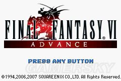

## 前言

　　FF6一直是RPG历史上的一个巅峰之作，至今仍有很多人认为FF6无愧于史上最佳RPG的称号，无论日本国内还是欧美都有大量的爱好者。FF6特别出彩的地方不仅仅在于它的剧情，同时在于它的玩法丰富多彩，攻关技巧变化多端，同一个BOSS可以有多种打法，最典型的就是剑圣齐格飞的打法，一直被认为是低通无解的齐格飞现在有三种低通技巧可以对付，这也正是FF6的魅力所在。个人认为FF6A有四大BOSS，卡夫卡，龙帝，创世和齐格飞，在本攻略中除了龙帝以外，其它三个都被痛揍了至少两次以上，总之一句话，本攻略乃集前人经验及本人心得之小成，有兴趣的可以慢慢品味。

　　另外，一点点小常识，攻略中所有的方向都以上北，下南，左西，右东的地图方向为准，所以如果说世界东北角的意思就是世界的右上部，跟现实生活中保持一致。游戏中在驾驶飞空艇的时候，按选择键可以打开或关闭地图，万一不小心关掉了世界地图，再按选择键便可以再次打开。

　　最后说一下本攻略的特色，本攻略对于玩家精力非常看重，对于疯狂跑步，练级这种套路不太欣赏，同时对于超前的行为，比如提前跳到瓦砾之塔拿装备也不是很推崇，更建议玩家按照顺序来，一地一点地慢慢击破，所以可以看到本攻略到了最后才介绍几个凶狠技，而且从最简单威力最小的开始介绍，到了最后再把最猛的招数拿出来，这样就保证了每个BOSS在遇到的时候能够使用的技巧都不会过分凶猛，一两个回合就处理掉BOSS的情况出现，当然不死系被凤凰羽翼秒杀这种不能算是凶狠伎，这是针对属性弱点打击。基本上本攻略是按照我本人低通的顺序杀掉的怪物完成的，所以玩家可以直接参考攻略顺序破关。

## 序章-迷之少女

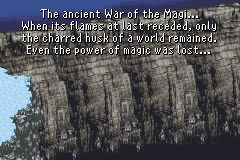

很久很久以前，一场魔法大战摧毁了一切，当战火逐渐退去时，魔法也随之失传。一千年之后，随着铁器，火药和蒸汽机的发明，贫瘠的土地又依稀恢复了往日的生机，但是有人试图唤醒沉睡的魔法的力量，并以此来征服世界，人类会重蹈千年前的覆辙吗？

寒风萧萧的悬崖上出现了三个人形的机甲……帝国军士兵维奇和比克斯还有一位神秘的少女驾驶着人形机甲魔导甲出现在这杳无人烟的冰冷悬崖上，原来帝国军打算夺取炭坑都市里面埋藏了千年的幻兽。而神秘的少女曾经是帝国军的敌人，用魔法一次性消灭了五十位帝国军士兵，在被俘获后强行带上了控制思想的头箍，而被帝国军控制，成为可行走的战斗机器。来到炭坑都市门前，维奇和比克斯让神秘少女打头阵，一口气杀入炭坑都市……

进入炭坑之后就可以自由行动了，村庄中的战斗没什么难度，如果想低等级通关的话，必需让少女避开遭遇战胜利后的经验，可以在首战就把少女打成战斗不能，然后用两个小兵一路消灭敌人冲锋，或者每战都逃跑（按住L+R键）注意，左图那场战斗是可以绕过去的，但有两场战斗是无论如何都绕不过去的，而且不能逃跑，造成逃跑不能的原因是敌人队中有畜生，也就是有狗或猛犸象（不是野猪），消灭狗或猛犸象后就可以逃跑了；

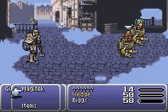

还有被夹击的时候，同样无法逃跑，必需消灭其中一边的敌人方能逃跑，但还会提示无法逃跑，不必理会。推荐后一种策略，也就是逃开所有的遭遇战，因为跟多数游戏不同，即将遇到的第一个BOSS并不是废材，有一定实力，而少女实力同样不容小觑，可以在BOSS战中发挥巨大作用，所以建议留着少女。此外游戏中多数BOSS战胜利后没有经验，所以低通时候BOSS战不必回避经验，也无法回避。

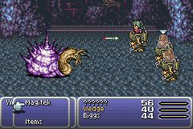

进入山洞后在一个栅栏前停了下来，英勇的维奇撞开了栅栏，遇到了炭坑都市的守军，开打。第一场BOSS战，注意不要攻击壳，会招致闪电魔法的反击，如果没有刻意练级，被击中一次就足以让我方角色战斗不能。如果头缩进去，耐心等待，很快就会钻出来。

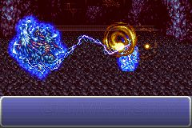

如果少女没有被打成战斗不能的话，可以使用魔导甲攻击的最后一个选项，导弹攻击，一次可以打击头部大约400多一点的HP，BOSS总共HP是1600，所以基本上三四轮打击过后就结束了。消灭蜗牛后进入矿井，发现幻兽之后神秘少女跟幻兽产生了共鸣，维奇和比克斯受不了这巨大的共鸣而被无情地消灭，神秘少女随即也昏了过去……

## 第一章-财宝猎人

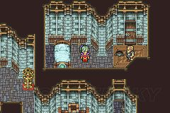

当少女醒来，发现自己被一位陌生的老人所救，老人还把控制她思想的头箍给取了下来，少女想不起来曾经发生过什么，依稀记得自己名字叫做蒂娜。很快炭坑都市的守卫就找上门来，要逮捕少女，老人劝蒂娜从老人房子的后门逃走，可是刚出门，就被守卫发现，情急之下蒂娜慌忙逃入坑道之中，进入坑道之后就会随机遭遇敌人，低等级通关的话，必需在所有遭遇战中逃跑以回避经验，从现在开始能逃就逃吧。

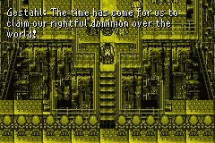

沿途的坑道中有许多几个宝箱，不开也罢，迟早都要回来的。在弯弯曲曲的坑道深处，蒂娜被守卫们找到并围了起来，无路可逃之时，蒂娜一个失足跌落至炭坑深处……蒂娜在昏迷中隐约想起曾有个叫做卡夫卡的人给她带上了头箍，并指使她战斗，以及帝国皇帝阅兵等记忆片段……

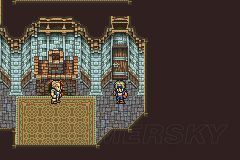

此时老人的房子里来了一位男子，老人见到他就开心地跟他寒暄起来：”哟你来啦，做小偷有什么收获？“

 ”小偷？你应该称呼我为财宝猎人！“

 ”呵呵，都一样。“

 ”叫我来何事？“

 老人便把少女被炭坑都市守卫追捕一事说明，并委托财宝猎人洛克（注意每个新人登场都可以改名）护送神秘少女前往费加罗城。男子领命出门……

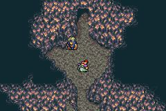

洛克在坑道中找到蒂娜，同时炭坑都市的守卫也赶到了，双方免不了一场大战。不过洛克毕竟势单力薄，一拳难敌众手，危机时刻，住在坑道中的飞天猪一族赶到，协助洛克拯救失足少女。此时遭遇游戏中第一次SLG，我方分成三队，共12个队员，第一队领队是洛克，第三队领队是莫古，本身作战没什么难度，但是如果想要低等级通关的话，应避免让洛克跟任何一队遭遇，因为此战哪怕是BOSS都有经验。注意此时莫古的装备可卸。

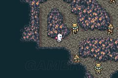

此战正规作战方法是，一开始就用选择键切换到二队，将二队上移，腾出通道给洛克队，然后按选择键跳过三队，回到洛克队，将洛克队移动到后方，然后再按选择键跳过二队，选择三队，往下走一点挡住路口，再按选择键跳过洛克队，回到二队，移动到三队身后，挡住敌人通向蒂娜和洛克的通道，然后再按选择键回到三队，快速将三队移动到地图左下角，待机，等敌人倒数第三队走过之后，直接冲向敌人倒数第二队，歼灭之……

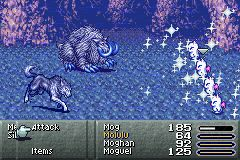

战时应着重打击敌军的猛犸象，猛犸象会使用全体的暴风雪魔法，伤害较大，此战胜利后莫古学会新舞蹈。消灭敌军倒数第二队之后，先别急着冲向BOSS队，鉴于BOSS战后就没有机会打开菜单，所以在BOSS战前应及时卸下莫古的装备，秘银盾和枪在短时间内都是好东西，打开菜单，卸下莫古装备秘银盾和枪。

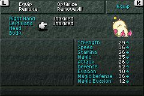

等敌人最后一队右移之后，冲向BOSS，说是BOSS，其实也就是一普通兵而已，一旦莫古开始舞蹈，此战必胜。另外，在三队也就是莫古队冲到敌BOSS队之前，挡在路口的二队有可能与敌军的其它小队遭遇，没啥说的，以保护蒂娜和洛克之名挨个歼灭。

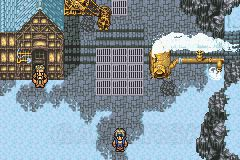

消灭了炭坑追兵后，洛克带着蒂娜来到了坑道口，此时蒂娜恢复了意识，但是她还是失去了绝大部分记忆……洛克向她承诺，在她恢复记忆之前会照顾好她。然后洛克会急速走向炭坑都市的出口，在出口处的左上角是初心者之家，可以在此了解一下游戏的基本运作。如果去城门，会被守卫觉得脸熟，危机时刻洛克会拉着蒂娜走开。逛够了就出城吧，向费加罗城进军……

## 第二章-沙漠城堡

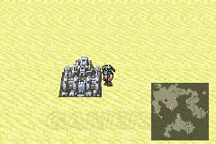

出城之后，打开菜单，把刚从莫古身上卸下的秘银盾给蒂娜装备上。费加罗城在大陆的腹地，沙漠之中，出了城之后往西南方向移动，过了片森林之后便是沙漠，沙漠正中就是费加罗城。洛克的特技是偷窃，沿途遇到的敌人身上都可以偷到不少药剂，多准备点药剂。低等级通关的话，就一路逃到费加罗城吧。

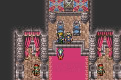

进入费加罗城之后见到了国王艾德，艾德迎接了两位客人，并告诉蒂娜，费加罗城和帝国是同盟，所以不用担心。见完艾德之后自由活动时间，去大厅右边的房间购买机械，理论上每样机械只能拥有一件，但是因为见过艾德之后会送一把十字弓，所以如果在见艾德之前就买入一把十字弓的话，装备栏中就会有两把十字弓，注意生化武器和超声波震裂这两样机械一定要买入。

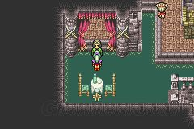

来到主城左翼的国王寝宫中，跟老妇聊天，说起国王还有一位弟弟，叫做马修，为了追逐自由的梦想，闯荡天涯……

 回主城复见艾德，门卫报告说帝国使节来访。

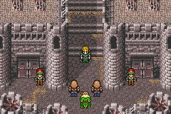

来访的正是帝国军师卡夫卡本人，沿途卡夫卡不停地抱怨费加罗城恶劣的地理位置并戏弄随行的两个士兵。在见到艾德之后，卡夫卡表明来意，说已经听闻神秘少女正躲在费加罗城中，要艾德交出少女，艾德装作不知情，卡夫卡威胁到，如果不交出少女，将会有不太好的事情发生。打发走卡夫卡之后，艾德让洛克把蒂娜安顿好。跟着洛克走……

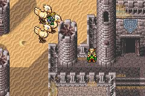

在右翼的房间中，洛克告诉蒂娜，他和艾德都是地下抵抗组织回归者的成员，所以不会轻易将其交出，并让蒂娜安心休息。入夜，艾德被骚乱声吵醒，来到主城一看，四处火起，原来卡夫卡为了让艾德交出蒂娜，不惜放火企图烧毁城堡，愤怒的艾德带着蒂娜和洛克骑陆行鸟逃跑，并让费加罗城变形，潜入沙漠之中。卡夫卡下令追杀三人，很快陆行鸟就被两个帝国军士兵驾驶的魔导甲赶上，开打。

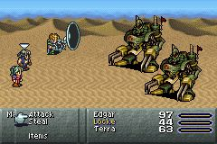

注意，此战魔导甲主要有两种攻击方式，一种是导甲激光，还有一种是普通的物理攻击，如果是低通的话，蒂娜和洛克很难抵御激光的攻击，基本上挨到便战斗不能。所以此战一开始就要转到艾德身上，由艾德最先出手，艾德使用机械超声波震裂使魔导甲混乱改向之后，就容易多了，敌人混乱的时候不要物理攻击，用魔法和生化武器放毒，自然解决战斗，洛克乘机偷窃。

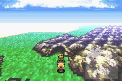

战斗中艾德见到蒂娜使用魔法，大惊失色，一番言语说明之后，艾德方才接受了魔法依旧存在的事实。消灭完魔导甲后，三人商量决定前往回归者组织本部，打算利用蒂娜魔法的力量来抵抗帝国的入侵。骑着陆行鸟是不遇敌的，去回归者本部要穿过沙漠东南部的南费加罗山洞，向南费加罗山洞进军吧。

## 第三章-武斗家之魂

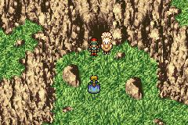

到了南费加罗洞之前，跳下陆行鸟之后就可以进入。进洞之后喝泉水恢复体力，如果是低等级通关，这个洞穴里面的所有宝箱都不要开，因为如果将来再来，藏在这个洞穴宝箱中的物品会有所变化。出了洞穴往南走，来到南费加罗镇。

一进镇，就可以看到一个黑衣男子，尾随着这位黑衣男子进了酒吧，在吧台前，洛克上前问路，可黑衣男子没有反应，洛克对黑衣男子傲慢的态度甚为不满，正欲发作，艾德上前拉开洛克，原来黑衣男子是一位知名刺客影忍，传说曾经为了一个合适的价钱杀死了自己最好的朋友……

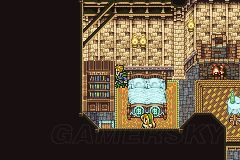

又到了自由活动时间，在城镇上方的大富人家中有密道，密道中还有密道，第一个密道在书柜后面，如右图所示，进去后可以发现几个房间，最靠里那个房间里面可以发现几千大洋，如果是低等级通关的话，这钱十分关键。

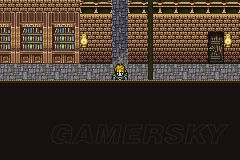

第二个密道在第一个密道里面，站在如左图所示的位置，向下走到底后向右拐，就可以进入，进入后有两个宝箱，不要错过，尤其是在靠里的那个狱室里的那个宝箱中有赫尔墨斯之靴，在战斗中使装备者处于加速状态，可以制得先机，给艾德装备吧。出城前到城镇右边的道具屋里买上几十个解毒剂和药剂，然后向东北方向的科洛兹山进军。

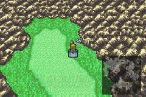

如果此时去南费加罗城北方的小木屋中，艾德会认出有马修生活过的痕迹，出来后会遇到一个老者，得知马修在师傅被杀后就不知所踪了……

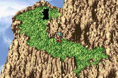

进入科洛兹山，迷宫，此时敌人陡然加强，要注意用道具恢复，蒂娜的魔法留着BOSS战时候使用，别牺牲了，因为现在手头的凤凰羽翼很少。另外低通的话，把队伍的顺序调整一下，把蒂娜和艾德调换一下，因为排位低的似乎在开打时候似乎行动总会快一点，这样艾德上来就用超声波震裂混乱敌人，然后就可以惬意逃跑。没什么值钱的东西，洛克这段时间不偷也罢。

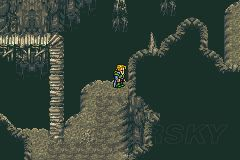

注意有暗道，站在如右图所示位置，向右走，然后向上，然后向右，再向上，再向右，再向下，再向右，就可以露出角色，然后沿途向前，就可以找到巨人的手腕，装备后物理攻击大幅提升，给艾德装备。在前进的过程中，似乎总有个黑影走在众人的前面，当快出山时，遇到了一个神秘人……上前搭讪前打开菜单，将众人的HP&MP补满……上前打听，结果不由分说被打翻在地，众人怒，开打。

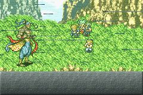

BOSS战，先要消灭前面两头熊，基本上艾德用三次十字弓后蒂娜放一次火就可以消灭两只熊，所以前面几个回合由艾德主打，洛克和蒂娜注意恢复，洛克用道具单体恢复，蒂娜用白魔法给我方全体恢复（在选择对谁使用魔法时按L或者R键，就可以转换为对全体使用魔法，对敌全体使用黑魔法亦然）。这样几个回合后消灭两只熊，然后艾德转向使用生化武器毒气进攻，因为BOSS的弱点是毒。几个回合后马修现身，BOSS吹飞其它人……

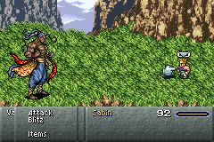

单挑，上来马修就中了终死拳，开始倒计数，数字到0后，马修死亡，所以要在数字结束前解决战斗。马修的必杀技使用如下：一开始选择第二个选项，也就是马修的特技，不要按太快，按一下，光标对准马修本人后，如图，此时顺序输入←、→、←，然后再按确定，这样马修就可以使出必杀，消灭敌人。原来此人是马修的师兄，也是马修师傅的儿子，因不满他父亲将必杀技传给马修而对亲生父亲下毒手，马修算是为师傅报仇了。战胜后费加罗兄弟相认。

## 第四章-回归者组织

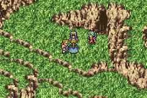

马修解决掉师兄后与艾德相认，洛克和蒂娜都很惊讶体型相差如此之大的两人居然是双胞胎，蒂娜觉得马修就像是山中的一头熊，马修则把这个比喻当成是一种恭维……艾德邀请马修加入，一起对抗帝国军，马修表示等这一天已经很久了……

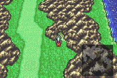

穿过科洛兹的后山，沿途向北，就可以看到回归者组织总部所在的洞穴；在进洞之前先打开菜单把洛克的装备全部卸下；在洞穴中众人见到了抵抗者组织领导人巴拿。巴拿早已听闻蒂娜的传言，他向蒂娜解释说，魔法是她的天赋而不是诅咒，最后邀请蒂娜加入组织，而蒂娜则因为曾有过被人控制的经历，对这个邀请感到十分恐惧。巴拿让蒂娜先休息，认真思考后再做决定。

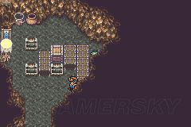

蒂娜醒来后找同伴谈心，了解各位同伴的想法，此时可以四处翻翻，开开宝箱，这个洞窟内有一个密道，入口如左图所示。都谈完后去洞口去找巴拿做决定。蒂娜同意协助组织之后巴拿送了一个护手给她。如果连续拒绝三次以上，则会得到源氏护手，建议还是要前者，后者将来挺多，而前者在前期的作用显而易见。最后巴拿让蒂娜召集同伴们开会。

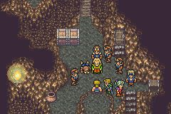

在会议上巴拿解释说，帝国军正四处寻找幻兽并拥有了一定的魔导之力，为了对抗帝国，组织希望跟幻兽交流，但是异常危险，所以希望得到蒂娜的协助。正交谈的时候，突然组织的一位密探报告说，帝国军已经占领了南费加罗镇，正在向这里进军，危机时刻洛克自告奋勇去引开帝国军，掩护大部队撤离。其它人则跟着巴拿从组织的秘密通道撤离。

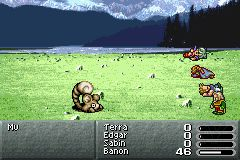

此时先别急着前进，打开菜单看看状态。如果是低等级通关的话，巴拿Lv.2实在太低，抗不住将来章鱼怪的打击，建议先回头出去打松鼠，把巴拿练到至少Lv.6再去。打的时候先消灭其它怪物，剩下一只松鼠，然后其它人全部自杀，巴拿一个人吞掉全部经验，然后回到组织内部睡一觉，再出去打……如此反复，大约战5次，就可以让狮子头升到6级。此外还需要加强蒂娜的防御力，给蒂娜装备秘银盾，

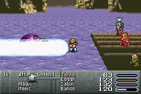

最后全员退到后排提升防御力（打开菜单，按左键，双击人物头像）。搞定后回到组织内部，从当初见巴拿屋子的正下方进入密道，一路往下，来到悬崖边，跳下木筏便可向炭坑都市前进，途中两次选择，均选左便可前进，沿途战斗可以逃跑，小心飞龙的全体火球术。然后遇到恼人的章鱼怪，BOSS战，章鱼怪的打击顺序一定是蒂娜，马修最后是巴拿，所以第一回合很重要，巴拿用特技祈祷恢复。

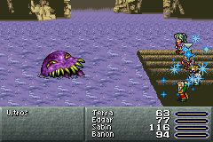

马修特技，依次输入↓、↙、←，确定，就是波动拳。轮到蒂娜时注意，第一轮蒂娜防御，按右键就可以看到防御选项了，为的是抗住章鱼的第一次攻击，这次攻击如果成功防御，大约去掉50+的HP，不致死，等到章鱼怪打完蒂娜之后，再选择巴拿特技，祈祷，全体恢复，然后蒂娜放火烧章鱼……第二个打击对象是精肉男马修，一般打不死，打击章鱼怪到一定程度，章鱼怪会来一次全体攻击，很有可能蒂娜会撑不住这一轮的全体攻击，挂了就挂了，不管。

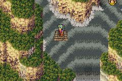

全体攻击后会紧接着两次单体攻击，所以很有可能是巴拿连着挨打三次，所以在章鱼怪打击完马修之后就要留意，章鱼怪打人之前会说废话，一旦开始说，就让巴拿选择防御，这样就可以抗住这三次攻击，顶住之后赶紧恢复，再来几下，章鱼怪就逃入水中，马修跳入水中追捕，结果跟章鱼怪一起飘向另外一条支流……

## 第五章-重返炭坑

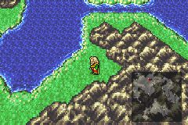

与马修分开后角色分成了三拨，玩家可以通过莫古自由选择先开始玩哪一拨，个人建议先从主流的三人开始，不仅因为这一拨最简单，同时也因为其它人需要他们身上的装备。

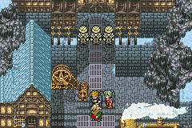

在木筏上继续漂流，登陆后向西行走一段时间就可以看到炭坑都市了。可是在炭坑都市的城门处，蒂娜一行却被门卫粗暴地赶了出来，因为怀疑他们跟帝国是一伙的，无奈之中蒂娜和艾德想起了洛克曾经说过的那条秘密通道，就是洛克救出蒂娜时候的那条坑道……

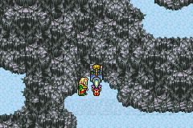

不用进入城门，左拐走到底之后往上一点，便来到当初秘密坑道的入口处，四处按按，拉动机关，打开通道便可继续前进，一路前行，沿途敌人实力都较弱，

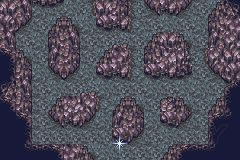

路过飞天猪之家后来到了一处坑道，希望之光指引着我们前进，如果不按照希望之光指引的道路前进，就会遇敌，可以逃跑，逃跑之后会被打回原点，需要重新按照希望之光的指引走一遍，鉴于这种敌人游戏中仅在此处出现，为了图鉴考虑，建议各位还是在此遇一次敌比较好。

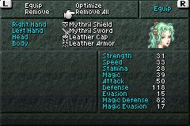

还记得当初蒂娜逃跑时候的路线么？原路返回，在进入老人屋子之前，把蒂娜和艾德的装备和饰品全部卸下来。

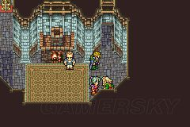

与老人再次相遇，巴拿和艾德与老人交谈起来，炭坑都市的居民还是不愿意正面对抗帝国，也不愿意加入回归者组织，更不愿意让他们接触深藏在炭坑里的幻兽，而为了与幻兽交流，就必需让蒂娜见到幻兽，这就陷入了一个困局。巴拿建议，如果用一种适当的方式建议炭坑都市的领导者，或许能够行得通。一边的艾德听后自言自语道：“幻兽到底是救世主呢，还是地狱使者？”……

## 第六章-妙手神偷

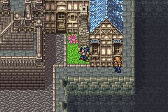

洛克在引开帝国军主力引开之后逃至南费加罗镇，此时洛克要设法前往炭坑都市与其他人汇合……镇子各个要道路口都有帝国军守卫，在中间屋子里有个孩子霸占着楼梯口不让过，说只允许商人才让过。去道具屋里找商人的茬，战斗中洛克用特技偷到商人的衣服，这样楼梯口挡路的孩子就会放过了。另外在书房中遇到一老头，老头曾是大富人家的佣人，但他说他不愿意跟陌生人说话，嚷嚷着要酒喝……

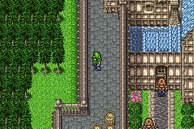

路口有帝国军士兵堵着不让过，到左上方的城墙上去找帝国军官的茬，一言不和双方开打，洛克用特技偷到帝国军军服，然后再下去找堵路的帝国军士兵……“啊，你来换防啦，太好了！”帝国军士兵让路。注意不要去碰魔导甲。

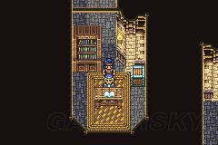

到酒吧的地下室去偷酒，被商人发现，开打，由于那个孩子霸占的楼梯口只允许商人通过，所以此时还是把衣服给换了吧。偷到商人衣服后商人就会逃走，洛克偷到酒后拿给老头喝，死老头说孩子知道有密道通向大富人家，但是要对口令，想了半天居然不记得口令了，没有办法，洛克只有硬着头皮下楼去跟孩子对口令。

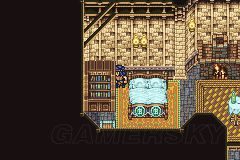

口令是第二个选项：勇气，如果选错，洛克身份会被识破，则要重来一遍这章流程。在孩子打开密道的门之后，一路前行（注意调查一下途中的时钟），来到大户人家，还记得书柜后面那个密道么？从书柜后进入密室，进入密道后可以选择除去伪装，或者不除去，都无所谓。

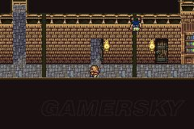

偷看第一间房，发现帝国军正在拷问以前的帝国将军莎莉丝，原来莎莉丝因看不惯卡夫卡向多马城投毒而背叛了帝国一方，被囚禁于此。军官跟看守交代一番后离去，梁上君子洛克现身，进屋解救莎莉丝，莎莉丝加入，然后从昏睡的看守身上拿到时钟螺丝，到最里面一间最靠里的那个时钟装上螺丝打开密道。第二间房间里有记录点，进入密道前要给莎莉丝装备，没有剑莎莉丝无法使出特技魔封剑。

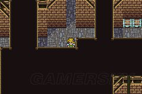

注意这个迷宫有密道，站在左图位置向下走三格再向左走三格，然后再向下走，一路走到底就可以看到密室了。

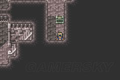

如右图所示的隐藏的宝箱无论如何不能错过，里面是缎带，防止所有不良状态。另外这个迷宫最后一个宝箱中的魔法增幅耳环也很重要，一定要拿到。

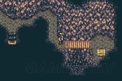

出了南费加罗镇之后来到了南费加罗洞，如果之前没有开宝箱的话，现在是收获宝物的时候了，打开如左图所示的宝箱，拿到游戏初期很关键的物品，雷杖。此物如果莎莉丝装备魔法增幅耳环后扔即将出现的BOSS，一击必杀，不过由于此物在游戏前半段比较少见，所以不推荐马上就用掉。其它宝箱可以暂时不开。喝过泉水后洛克和莎莉丝就会遇到BOSS挖掘机……

如果是低等级通关，在打挖掘机之前，先做好准备，首先，对于洛克，鉴于由其主攻，所以速度一定要快，下手一定要狠，为了达到速度快，给洛克装备赫尔墨斯之靴，这样别人打一下，我可以打两下，为了达到下手狠，给洛克装备护手，双手持刀，这样一次可以打掉挖掘机大约100的HP，会心一击可以达到200+；对于莎莉丝，保护为主，先让其站后排，增加防御力，其次，给其佩戴缎带，防御所有不良状态，但是即便如此，由于是低等级通关，

还是无法硬吃对方任何一个魔法，所以还是要每回合都使用魔封剑。最后，其实魔法增幅耳环可以不用装备，因为我们暂时还不想扔掉雷杖。虽然可以一击必杀，但是硬吃这个BOSS似乎并不太难。弱点：洛克如果遇到电钻的直接攻击，打到便死，不过即便对方使出电钻，打到的几率也不算很高，50%吧，如果挖掘机上来就使用电钻，就打中洛克，那还是reset吧，莎莉丝可以挨好几下，洛克哪怕是物理攻击都只能挨两下，主要靠回避和道具恢复。

战术：洛克不要上来就打，很容易遭致反击，最适合打击对手的机会是在挖掘机刚使完魔法之后，这个机会一定要抓住猛攻。所以第一轮莎莉丝使用魔封剑，洛克使用特技偷窃，可以偷到刀，然后等挖掘机出手后猛攻，如遇到物理攻击，用道具给自己恢复，莎莉丝如无意外基本不用恢复。BOSS的HP1300，此战关键在于挖掘机有没有在中前段将洛克击倒，如果没有，我方获胜的几率极大。这样做可以省下一个关键的雷杖，留作备用。

## 第七章-精肉男大冒险

熊之男马修一路漂流到一片陌生的土地上，注意到附近有个小屋子，进去看看吧。

骑着陆行鸟的帝国军官是个军火商，左边喂狗的就是影忍，上面屋子里面住着一个疯疯癫癫的老头，把熊之男误认为是机械师，还说什么讨厌孩子之类的话，不可理喻。在军火商那边买入20个飞镖以及3个木叶蝶之术，也就是第一种卷轴，飞镖和卷轴都有特殊图标，影忍特技专用。跟影忍对话可以邀请其加入，但随时可能离开。从对话中得知帝国军正在进攻多马城，要去炭坑都市得从南边的蛇道走，出发吧。

在野外遇敌时候影忍使用特技投掷木叶蝶之术，也就是透明卷轴，隐身，隐身效果战后依然可以持续。在帝国军阵地外记录一下，如左图所示，那一小片沙漠就是帝国军阵地，在帝国军阵地上，听到了两个士兵的对话，卡夫卡决定下毒多马城，士兵们都觉得这事太过于下作，并说雷欧将军绝对不会同意这种行为。卡夫卡出现后威胁了两位在背后嚼舌头的士兵，很快帝国将领就来召集两位士兵去攻打多马城市。

剧情转到多马城下，多马城中有一位忠心耿耿的东方武士，名字叫做加源，正当多马城就快陷落的时候，加源出马，随行两位士兵挡住其他士兵，加源攻击帝国将领。不要去跟其他帝国士兵搭讪，直接冲向黑色盔甲的帝国将领，战斗中使用加源特技，要等，别按太快，到第二级的时候确认，等加源再次遭到攻击，会自动使出反击剑天，消灭帝国将领。此战有75%的几率掉落黑带，如果不是读档。消灭帝国将领后帝国军撤退。

剧情转回影忍和马修一方，继续前进，不要招惹帝国军士兵，来到一个营地前，雷欧将军正在部署，帝国军士兵建议直接进攻，但是雷欧将军觉得这样伤亡太大，拒绝了这个提议……帝国士兵给雷欧将军送来一封信，信上说皇帝召回雷欧将军……卡夫卡现身，在河边喃喃自语，雷欧走了之后，他要将多马河变成鸩水河，很快雷欧就离营返程了……正当卡夫卡打算投毒的时候，影忍和马修果断出手打算阻止卡夫卡的卑劣行径。

基本上卡夫卡不经打，打几下就跑，在间歇期去左上方的帐篷中开宝箱，总共有三个宝箱，在两个帐篷中，最上面那个帐篷要跳过去，绕道帐篷后面，正对着上面帐篷的入口，按上即可跳过去，下面的帐篷中有两个宝箱，左边的宝箱中有怪物，硬拼即可，没有经验，不要吝惜影忍的飞镖，尽情地扔吧。如果有缎带的话，给马修装备上，可以防止异常，没有的话也无所谓，硬拼也能拿下此战。拿全宝物后继续回去砍卡夫卡。

可最终马修和影忍还是无法阻止卡夫卡投毒，多马城全灭，国王以及加源的妻儿都被毒杀，愤怒的加源冲到帝国军阵地上一阵砍杀……马修和影忍上前援助壮士，但帝国军数量终究还是太多，情急之下，马修把畏惧机械的加源强行推上魔导甲，三人驾驶着魔导甲冲出帝国军阵地……在杀出帝国军阵地后，加源说要去炭坑都市只有穿过南面的魅影之森……

冲出帝国阵地后往南，来到魅影之森，来到林中的不老泉处会被强制喝水恢复，如果此时影忍是隐身状态的话就会被强制解除。从泉水处出来，直接拐进最近的一个路口后再往前走一点就可以进入魔列车站台，马修冒冒失失地就登上了列车，等到影忍和加源都进入列车之后，列车开动了，车厢门此时已无法打开，加源回忆起这是运送亡灵的魔列车，通向另一个世界，马修决定去引擎室制动列车。

三人来到车尾部的列车长室，拉动阀门，可惜列车并没有停下来，看来只有去车头试试运气了。

 在列车长室外面那个幽灵与其对话便可邀请其临时加入队伍，在列车长室里有记录点。

从列车室里出来后往前，穿过马修一行登陆的那节车厢，别跟幽灵搭讪，出来后先别急着进下一节车厢，这里有一种敌人比较关键，要遇一次，就是右图中的火球炸弹，一定要遇上一次，这样将来嘎才能在兽之原上学习它的技能。最好遇一次，低通的话逃跑既可。

路上被幽灵追杀，马修等人跳过两节车厢后，在最后落地的那个车厢里拉动阀门，断开后续的车厢以摆脱追兵。进车厢，再次拉动阀门，挡路的闸门就会开启……沿途遇到冒牌的齐格飞，很弱，放心。然后进到一个四个连续宝箱的车厢，其中之一是魔法增幅耳环，一定要拿到，最左边有怪物，不死系的，用凤凰羽翼可以秒杀。但是要防止对方先制攻击，全体魔法很容易使我方全员灭，所以最好先走到下一节车厢中的记录点记录一下再回头来开宝箱。

到了车头，扳动第一个跟第三个阀门，然后到列车头前调查烟囱便会发生战斗，火车头也是不死系的，用凤凰羽翼秒杀。战胜列车头后列车到站，下车后加源发现他的妻儿登上了魔列车，还没来得及道别魔列车就再次发动，加源撞飞马修，追着列车与妻儿告别……

从魅影之森出来，影忍用一个隐身卷轴就可以轻松解决一路上超高的遇敌率，把加源和马修送到巴伦瀑布，进山洞之前记得把影忍的装备卸下来，让加源装备之前从帝国将领身上获得的黑带反击和巨人的手腕强化物理攻击，马修装备魔法增幅耳环强化特技效果。影忍与二位告别，马修和加源跳下瀑布，遇敌，BOSS战。杂鱼物理攻击即可消灭，BOSS的HP不高，争取尽快解决战斗，因为如果是低等级通关的话，一旦BOSS使出厄尔尼诺，我方必定全灭。

马修顺流而下，漂流到兽之原，醒来后发现身边站着一位兽孩，名字叫做嘎，正当马修准备开口询问的时候，嘎受到惊吓，逃开了。在兽之原上瞎逛，这里的敌人消灭后只给钱不给经验，所以是低通敛财的好去处。有时候消灭掉敌人会出现嘎，嘎一直说饿……到东面的莫比莉斯村里买肉干，然后再到兽之原上瞎逛，再次遇到嘎之后对嘎使用道具，干肉。嘎吃完后会缠着马修要更多的肉，马修和加源一起驯服嘎，嘎说有宝藏在新月山……

嘎特技第一项是怒，在任何时候都可以使用，就是在战斗中变身为各种怪兽作战，包括魔导甲，火球，飞龙等，几乎所有非BOSS怪兽都可以模拟，特技第二项只有在兽之原才会出现，就是跳入兽群学习怪兽的技能，显然大多数特技要先学会后才能使用，有一个是一定要学的，就是刚在魔列车上遇到的火球炸弹，技能是烈焰，火吸收加浮空术，其他推荐的有在木筏上遇到的飞龙，技能火球术，以及在科洛兹山上遇到的延龄草，技能剧毒。

在兽之原出现的怪物一定是曾经在战斗中遭遇过的敌人，如果没有遭遇过，就一定不会出现在兽之原上，嘎也就无法学习这些未曾现身过的怪物的技能，而游戏中每个怪物出现的场合地点有所不同，一些敌人只出现在游戏某个阶段的特殊场合，一旦错过就无法再次遭遇，该场合出现的怪物也就无法在兽之原上遭遇到，这些特殊场合均会在攻略中标识出来，敬请留意。

另外，在兽之原上消灭的敌人之后无法收获任何经验，但是有钱，被消灭的敌人亦会被收入怪物图鉴，所以想低通收集图鉴的同仁可以好好地利用兽之原收集各种怪物。最后说一下第二个特技如何使用，在战斗中选择第二项把嘎放牧到兽群中之后，在兽之原上瞎逛，随机遇敌，消灭敌人，几次战斗胜利之后，嘎就会出现，不要攻击他，原地防御或待命，嘎就会被回收，如果攻击他，他就会逃开而无法被回收。

如果放牧时几种怪兽同时出现，那么嘎回收之后就可以学全这个兽群里面所有怪物的技能，火球炸弹和飞龙总是跟其他怪兽一起出现。在GBA版本中，reset和全灭后重新读取进度都会打乱怪兽出现的顺序，所以如果没有即时存储，那需要一点运气，不过低通的话，也正好在利用这段时间在这里攒点钱。此时在兽之原东面莫比莉斯村的左边屋子里躺着一位伤兵，思念着他远方的情人……

可以去帮他送信，信纸在桌子上，拿到后送到屋子右边有护栏门前有信鸽的屋子里去找人帮忙写信和投递，一次500，然后出村庄打怪，打到HP差不多没了需要恢复的时候去宿屋睡一觉，醒来后再去拿信纸，送信，然后再出去打怪物，再回来睡觉，如此反复五次之后再回去找那位受伤的士兵就能得到报答：宗座铃。钱存够了，技能学得差不多了就出发吧，在兽之原南方可以看到一个山洞，那就是新月山入口。

进入洞穴后，嘎一路摸索，最终挖出一个潜水头盔，有了这个就可以在水中呼吸了，然后三人跳下蛇道，向达尼科亚海港游去。蛇道选择时候两次选右即可顺利通过蛇道，每个海底洞穴均有宝箱，不要错过，蛇道中的战斗都可逃，若是低通不要误伤怪物。到达海港后去买两件魔法师帽，魔防＋5，花费1200；在酒吧里加源对于风尘女子的调戏不具备有免疫力，因此遭到了马修的嘲笑……逛完后跟船长对话，选择第二项就可以出发去炭坑都市了……

## 第八章-雪原攻防战

在炭坑都市，巴拿正在劝告炭坑都市的长老一起对抗帝国，可是长老似乎不太情愿卷入回归者和帝国的冲突，正说着，马修三人赶到，带来了多马城被毒屠城的消息，所有人都惊呆了，即便如此，炭坑都市的长老依旧还是不愿卷入与帝国的纷争，此时洛克和莎莉丝赶到，带回了帝国军正打算进攻炭坑都市的消息，加源一听到莎莉丝曾是帝国将领，一把推开嘎，就要开打，艾德洛克等人赶忙拉住加源，一旁的蒂娜喃喃说出了自己也曾是帝国兵……

正说着，炭坑都市守卫回报，帝国军正在卡夫卡的带领下向炭坑都市进军……同行的士兵提醒卡夫卡炭坑都市不过是一个中立的城市，丧心病狂的卡夫卡不顾一切地决定屠城夺取幻兽……长老无奈之下只好同意与回归者组织结盟，长老指挥守卫们把幻兽转移到雪原高地，由巴拿带领众人在沿途狙击帝国的进攻。众人向雪原高地前进……

布防，右上角是记录点，在此时给众人调整装备。此战低通亦可以强攻BOSS，说一下战前准备，强攻人选：艾德，加源，马修，嘎，这四人HP多，物理攻防高，耐打，而蒂娜，莎莉丝和洛克此战无用，把他们身上的装备和饰品全卸下来，艾德装备黑带用以反击和秘银枪手套重盾，马修装备一对魔法增幅耳环和秘银盾，嘎装备赫尔墨斯之靴和缎带防止异常，加源装备护手双手持刀以及巨人的手腕加强物理攻击，准备好后跟巴拿对话便可列阵开打。

另外，如果选择常规战，常规战人选：洛克，蒂娜，莎莉丝和马修这四人，把之前在海港买好的魔法师帽给蒂娜和莎莉丝装备，如果不偷东西，用艾德或者加源代替洛克也可以，装备参考前面强攻战术装备。分组列阵时候把选好的四人放在第一组，其它两组就随便了。卡夫卡带队冲锋，开打……帝国军士兵毒属性弱，如果非低通的话，战斗中嘎变身延龄草，艾德使用生化武器可以迅速消灭敌人。

低通的话，要注意躲避敌人士兵，一开始一口气冲到左图所示位置，应该时间比较富裕，然后等左边的走上去之后，快速往左下角冲，小心右边第三队会左转，不过时间应该够，并不难。

到了左下角等最后一队从眼前走过之后赶快冲向卡夫卡，卡夫卡前面那个跑来跑去的禁卫队可打可不打，如果使用低通常规战术，注意把所有的经验留给蒂娜，如果是低通强攻战术，不要打，注意，从左下角冲向卡夫卡的时间不是很富裕，基本上不能等第二次机会，看准了直接冲过去，一等左上角那一队就会遇敌……躲禁卫队要看准时间，注意任何时候靠近敌人一格之内都会开战，无论什么方向。所以看准禁卫队到左边往右的时候就冲向卡夫卡吧。

遇到卡夫卡BOSS战，传统的作战方法是，莎莉丝每轮使出魔封剑，洛克主偷，马修主攻，蒂娜协助，慢慢将卡夫卡折磨致死。注意卡夫卡如果使出群体魔法而莎莉丝又来不及使出魔封剑的话，就会被全灭。而每次给莎莉丝下完指令后到莎莉丝出来放光的那段时间内，是没有魔封效果的，一旦这个时候卡夫卡使出全体魔法，那就是全灭，所以如果不能保证莎莉丝是下一个行动的时候，还是先别急着给莎莉丝下指令，可以先跳过。

低通强攻战术：开战后嘎变身火球炸弹，艾德的十字弓，马修的波动拳和加源的必杀剑牙，如果都活着的话，大约四个回合可以解决战斗，如果有人被击倒，不管，其他人照打，不要患得患失，卡夫卡一般的物理攻击打不死任何一人，就是不少单体魔法攻击这四个人也都能硬吃下来，进攻的效果经过前面装备强化后明显要凶猛得多，此战关键就看双方谁出手快。胜利后卡夫卡逃走，蒂娜与幻兽产生共鸣，暴走，猛飞一阵后一头栽倒在不知名的地方……

## 第九章-如烟往事

洛克从昏睡中苏醒后和伙伴们商议，决定兵分两路，一路保卫巴拿，另外一路出发去寻找蒂娜。组队出发，跟留下的伙伴聊天即可重组队伍。此时如果是低等级通关的话，很快就要进入崩溃前难度最大的几个部分，要做些准备。先选择洛克，嘎，艾德和马修组队，先调查钟摆，然后去炭坑右下的炭坑仓库里把能开的宝箱全开了，然后给洛克装备盗贼的护臂和盗贼的小刀强化偷窃成功率。然后去道具屋多买几个烟玉烟雾弹。

然后去炭坑的暗道，走到希望之光引领我们向前那个坑道，故意走错，遇敌，有几种组合，有一种组合小概率出现，就是左图所示的五怪队。五个敌人中的巫师身上有冰杖，这是目前唯一能偷到冰杖的地方，所以要在这里多偷几个冰杖，如果之前打挖掘机时扔掉了雷杖，那一定要在这里多偷几个冰杖。但是大多数时候出现的不是冰杖，只有小概率能够偷到冰杖，所以如果没有模拟器即时存储的话，这里偷到一个冰杖要遇小概率敌，

还要偷小概率的物品，成功率实在太低，很痛苦，但是如果使用即时存储的话，并不要花多长时间。当希望之光指引完后，会遇到什么敌人已经确定了，所以在此时即时存一下，然后故意走错，遇敌，如果遇到的不是五怪队，逃跑，再次让希望之光指引我们前进，即时存一次，然后遇敌……如此反复，直到遇到五怪队。然后偷巫师物品，如果偷到冰杖，逃跑，如果不是冰杖，读取之前的进度，再偷……如此反复，确保每次遇到五怪队都能偷到冰杖。最少在这里偷五到六个冰杖。搞定后出城向费加罗城进军！

马修在离开费加罗十年之后再次回到费加罗城，不免心情激动，撇下众人跑开了。调整队伍顺序，让艾德领队，然后到大厅右侧的房间内购买机械，艾德领队机械半价出售，买入新机械电钻和闪光灯。然后到皇城左侧的宿屋中休息……夜晚马修坐在皇座上想起十年前那个夜晚，费加罗国王被帝国毒杀的那个夜晚，马修选择了自由愤而出走，而艾德则为了费加罗城选择留下，十年过去了，当兄弟俩再次相聚在费加罗城时难免唏嘘感慨……

睡醒后出城，回到炭坑都市，把嘎跟马修留下，换上莎莉丝，记得把他们俩还有加源的饰品和装备都卸下。看看冰杖，烟玉，艾德的新机械都搞定没。全搞定后就出城回到费加罗城，进城堡后左拐往下，来到机械室，跟年长的机械师对话，开动费加罗城，潜入地下，往西潜行……

出城后向西，来到了洛克的家乡科林根村，在酒吧再次遇到了影忍，花三千大洋便可邀请其加入。来到村子左上的小屋中，洛克回忆起他前女友瑞秋的往事……在一次探险中，瑞秋为了保护洛克坠落深渊，当瑞秋再次苏醒时，已失去了记忆，因此洛克被瑞秋的父母轰了出来，而瑞秋则恳求洛克离开，洛克含泪离开了村子，当洛克再次回到村子时，瑞秋已死于一次帝国军的袭击，临死前喊着洛克的名字，洛克因不能保护瑞秋而陷入了深深的自责中……

来到村子右侧的一个屋子里，走到地下室，会看到群花擁簇着瑞秋的遗体，原来洛克在瑞秋身亡之后用此屋老人的秘方来保存女友遗体，同时四处寻找能够起死回生的幻之秘宝……众人离开后莎莉丝又回头看了看瑞秋的遗体……从现在开始，只要影忍在队，去宿屋睡觉，影忍就会做梦，想起他当盗贼克莱德的过去，在一次追捕中，他的同伴比利受伤被擒，危机时刻，比利怕受折磨请求克莱德动手杀了他，但是克莱德还是无法下手……

在保存瑞秋遗体的屋子里盔甲背后有个箱子，要绕道从屋子的后门进入方可打开。出村后往北，有间小屋，屋子里靠左的罐子里有枚英雄之戒。小屋再往北的森林里有陆行鸟出租，花钱租个陆行鸟一路跑向山谷中的佐佐镇……先向南，绕过群山之后往东一点，再向北，就可以看到被群山怀抱中的佐佐镇了。

来到佐佐镇之后，影忍先在战斗中使用木叶蝶之术，隐身，然后留意一种敌人，就是左图中的绿色机械工，经常四个一起出现，遇到之后用艾德的超声波震裂使其混乱，然后就会对我方使用隐身，如果是低通的话，遇到BOSS前至少保证除影忍之外另外三人中艾德和另外一人是隐身状态。左上方宿屋里面把把时钟调到6:10:50就可以开启秘道，拿到艾德的机械电锯，不过如果是低通的话电锯作用有限，暂时先不拿。从镇左下开始爬楼……

辛苦爬完楼之后BOSS战，此BOSS会召唤两个武斗家，有经验，低通的话不要打，集中攻击BOSS，BOSS的攻击大部分是物理攻击，打不到人，用艾德的电钻迅速解决战斗。另外当BOSS召唤两武斗家出来后，两武斗家是毒属性吸收，所以艾德可以用生化武器先吹一吹，给两武斗家加HP，免得战斗中误伤。胜利后继续往上走便可找到蒂娜，两侧的宝箱别忘记开了。来到顶层，见到了蒂娜，一位老人模样的幻兽拉姆正在照顾她。拉姆告诉众人，

蒂娜也是幻兽的一员，很多年以前，人与幻兽和平共处，后来爆发了魔大战，人类从幻兽身上抽取魔法之力与幻兽开战，战后幻兽们畏惧自身的力量再次为他人所利用，于是创造了幻兽界，将人界隔离开来，二十年前，帝国皇帝加斯特拉闯入幻兽界，掠走了幻兽，从中抽取力量，集结了强大的军队……警觉的幻兽制造了巨大的魔封壁将人类挡在外面……那时被俘获的幻兽至今仍关在帝国的魔导研究所中，或许那些幻兽的力量能够救蒂娜……

而帝国军使用幻兽力量方式是错的，幻兽只有死后变成魔石才能发挥出真正的魔导之力，拉姆随后拿出从魔导研究所逃跑时候死去的幻兽化身而成的魔石，连同拉姆自己也化身为魔石一并托付给众人。使用幻兽的方法是选择能力一栏后选择第一项，便可装备幻兽，装备后，在战斗中选择魔法，然后按上，就可以召唤出幻兽进攻，一场战斗只能用一次。低通的话，此时把影忍身上的装备和饰品卸下来。马修等人已赶到，正等在门口，跟他们汇合吧……

## 第十章-歌剧惊魂

在佐佐镇汇合后众伙伴商议，莎莉丝对帝国内部比较了解，毛遂自荐带队前往，而洛克建议说要去帝国的话，不妨先去佐佐镇南边的夏多鲁镇看看。重新组队出发，洛克和莎莉丝是必选，另外两人选艾德和嘎。剩余众人回到炭坑都市加强防卫。组队完成后，莎莉丝偷偷问洛克为何要同她一起前往？洛克说是想找个理由去帝国看看，兴许有什么秘宝可以挖呢……向夏多鲁镇进军吧。

来到齐多鲁之后，如果是低通，要再做些准备工作，先租一个陆行鸟往北，来到费加罗城，跟机械师对话，向东潜行，出城后往南，去南费加罗洞，科洛兹山，回归者组织总部，巴拿屋中最靠下的密道，跳下木筏，来到马修当时登陆的地方。然后穿过魅影之森，然后跳下巴伦瀑布，来到兽之原，让莎莉丝装备魔石凯特·西，嘎装备拉姆，艾德装备麒麟，洛克装备塞壬，打怪赚钱练魔法，凯西魔石能够习得的第一项灰魔法混乱很重要，一定要学会。

另外塞壬魔石可以习得的催眠魔法以及麒麟魔石能够习得的一级医疗魔法是稍后低通破关的关键，在兽之原上也要学会。学会混乱魔法之后，将来要练魔法就可以使用混乱＋烟玉大法。同时让嘎学习蛇道中遇到的三个水生物的特技，记住电水母和水蛇，尤其是电水母的招数：百万伏特非常好用，学完后在兽之原上先试用一下。

混乱＋烟玉大法简介：对己方角色使用混乱魔法，同时在混乱魔法动画开始后结束前，让这名角色使用道具烟玉。这样当这名被混乱的角色开始行动时，他就会对敌人使用烟玉，强行让敌人逃跑，敌人逃跑后可以获得AP，就是练魔法必需的技能点数，装备魔石并积累一定的AP之后便可学会魔法，但是无法获得经验，低通的话就不会升级，通过这种方式，可以在兽之原以外的地方战斗练魔法。注意，如果战斗中己方无法逃跑，那么对敌人使用烟玉，敌人也无法逃跑。

给嘎装备魔法增幅耳环和赫尔墨斯之靴，艾德装备缎带，洛克装备冲刺靴，检查看看三种关键魔法：混乱，催眠，医疗魔法是否学全，嘎的技能是否学会，金钱要达到一万八以上，都搞定后跳下蛇道到港口，坐船到南费加罗镇，再穿过南费加罗洞来到沙漠中的费加罗城，开动费加罗城向西潜行，出城后往北走，在原先拿英雄之戒的小屋周围的森林里租个陆行鸟，一路跑回夏多鲁镇，进入夏多鲁镇之后，先去道具屋补充几个金针。

然后去镇最上方歌剧院剧团团长的家里，发现他正在为歌剧的女主角而发愁，因为驾驶着著名黑杰克号飞空艇的赌徒西捷亚给剧团发来一封勒索信，威胁要绑架歌剧的女主角……洛克和伙伴们商议，决定让长相酷似女主角玛丽亚的莎莉丝假扮女主角，然后利用黑杰克号飞空艇前往帝国所在的南方大陆。在团长家最右上的罐子里有一个以太，取到手后到镇入口处租一个陆行鸟往南跑，歌剧院就在南方大陆的尽头。

来到歌剧院，洛克说服团长让莎莉丝代替玛丽亚做女主角，诱捕西捷亚。恼人的章鱼怪又出现了，在偷听了团长与众人的计划之后，章鱼怪决定破坏歌剧的演出……在莎莉丝进入后台准备的时候，洛克与团长一行来到观众席观看演出，很快轮到莎莉丝上台了，洛克决定到后台看看莎莉丝。到了后台，洛克竟然脸红得不敢看莎莉丝……此时控制莎莉丝行动，看看剧本预习一下台词，出台后台词顺序是1-2-1。

唱完之后来到二楼，跟着男主角起舞，随后男主角化作鲜花，莎莉丝将其捡起，来到天台扔下以表达思念之情，远方流星划过天际……后台洛克在返回座位的路上发现章鱼怪的威胁邮件，方才发现章鱼怪的企图，赶忙将其交给团长……章鱼怪打算从天棚砸一个4吨重的铁锤破坏演出，但太沉了需要5分钟才能推下……洛克和伙伴们决定出手制止章鱼怪的恶行。先去右上方的控制室，拉下最右边的扳手，然后再从左上方的路口处进入天棚……

如果是低通的话，此时进入低通难点之一，天花老鼠回避。目标是章鱼怪，沿途有五群老鼠捣乱，可能遇到3只或者5只老鼠的组合（一黄两绿或两黄三绿），战斗无法逃跑，理论上要维持低通的话，最多只能杀一只黄老鼠，而且经验必需全员分享，不能有任何一人在战斗结束时战斗不能，杀掉黄色老鼠之后给绿色老鼠补血，绿老鼠就会逃跑，所以只能选择遇到一群老鼠，而且这群老鼠必需是一黄两绿的组合，遇到5只老鼠就reset。

一般来说前两群老鼠比较难躲，尤其是第二群老鼠，相当难躲，所以一般来说选择躲开第一群老鼠，处理掉第二群老鼠。老鼠的行动路线在团长交代完之后就已决定，所以如果有即时存储的话，在进入左上门前可以即时存一下，然后进门之后看清第一群老鼠的活动路线，然后记住老鼠的活动路线，再次读取进度之后老鼠的活动路线不会改变，要避开第一群并不算太难。一般来说来到左图的位置就大概算是避开第一群老鼠了。

躲开第一群老鼠的关键在于当老鼠活动到H形的边角的时候，也就是当老鼠活动到上方的时候是躲避的最好时机，快速冲过去便可搞定。按住B键可以冲刺，如果装备有冲刺靴的话，可以在冲刺的基础之上再加速，也就是达到4倍速冲刺，这样回避的空间会更大。如果不使用即时存储的话，可以在首次进入天花板的时候就主动遇敌，然后不要杀任何一只老鼠，全体自杀，这样会回到歌剧院外，游戏不会因此结束，只有连续三次被天花老鼠全灭，游戏才算真正结束，再次进入歌剧院，可以略去大量剧情，直接进入天花老鼠回避的部分，无法或不屑使用即时存储的玩家可如法炮制。从跟团长对话完之后开始计时，必需在5分钟之内来到章鱼怪处，时间还算充裕，并不是很紧张，稍微留意一下即可。在遭遇章鱼怪之后，众人与章鱼怪扭打起来，一不小心，双双失足跌落至舞台上……

BOSS战，嘎变身电水母，两回合使出百万伏特，艾德再用一次电锯即可以干掉章鱼怪。如果没有学会电水母的招数，变身成火球炸弹也可以，不过比较耗时。章鱼怪本身的HP不多，才2550，但是这是章鱼怪在每一个位置的HP，所以基本上只要章鱼怪变换一次位置，HP就会恢复，也就是说必需在同一位置上打掉章鱼怪2550的HP战斗才会结束，速战速决是首选。战斗结束后西捷亚劫走莎莉丝……

莎莉丝在被绑架之后，从飞空艇上放下绳索，将同伴们拉上飞空艇，很快西捷亚就发现了众人，并愤怒地发现莎莉丝不是玛丽亚，遂要赶走众人，在众人的恳求之下，西捷亚似乎改变了心意，约伙伴们稍后再谈。来到飞空艇大厅，跟西捷亚谈判，西捷亚提出要莎莉丝做他的妻子，莎莉丝同意但是有一个条件，就是要求掷硬币来决定，西捷亚欣然接受。莎莉丝用艾德和马修双面头像的硬币胜了西捷亚，西捷亚无奈只得同意前往帝国大陆……

洛克：“这种破烂的船能飞得起来吗……不会掉下来？”

 西捷亚：“该坠落时它自然会坠落……所谓人生，就是不断地跟命运赌博，冲破命运的束缚……”

 众人乘上飞空艇黑杰克号，飞空艇在西捷亚的驾驶下飞向帝国的首都维克多……帝国首都维克多出现在海平面上……

## 第十一章-魔导工厂

飞空艇落地之后右边就是阿尔布克镇，进去买入三枚魔法反弹戒指，然后出城，向西北方前进，帝都就在这块大陆的正中心脏位置。帝都的宿屋是间黑店，晚上睡觉会被偷钱……往上走是皇城，不过遍地的帝国军，无法正面突破，在左图所示位置找到回归者组织的接应人，跟他接头，由他去吸引帝国守卫的注意力，然后跳上内侧的箱子，爬上钢管，顺着钢管绕到守卫后面，往上走就可以潜入魔导工厂。

进入魔导工厂之后，先从右图所示位置进入管道，可以找到一个宝箱，里面是火焰剑，一定几率启动炎系魔法，然后跳上铁钩，再从右边的管道下去，拿到一个以太，然后再从左边的管道进入传送带，沿途有三个宝箱，一路捡……

来到左图位置，别急着往右跳上传送带，先往下走，有两个门，穿过之后可以发现一个宝箱，箱中是一个帐篷。然后原路返回，再往左下方走，别急着上楼梯，楼梯口靠里有一个宝箱，里面是龙骑士之靴，战斗时高高跃起，下一回合从天空中攻击敌人，在跃起之后可以回避敌人所有攻击，是个好东西。然后上楼梯，有一个宝箱，里面是金盾，然后下升降机，再上传送带返回……

再次回到先前的位置之后，还是别急着往前，这次往右上方走，在右图位置有密道，密道中往右有密室，有两个宝箱，开了之后再从管道中掉回原地，此时再跳上传送带，来到地牢之中，变态的笑声传来，卡夫卡现身，赶忙躲藏起来，看到卡夫卡把两个幻兽扔入地牢之中，地牢中累累白骨记载着卡夫卡的罪行，跟黄色的伊夫里特对话即开打……

在此之前先去左边的房间里面记录一下，装备魔法反弹戒指，嘎装备一对魔法增幅耳环，BOSS战，敌人是伊夫里特和希瓦，分别只吃冰属性魔法和炎属性魔法，HP分别是3300和3000，干掉其中任何一个便可获胜，如果冰杖多的话扔冰杖吧，嘎扔一个就可以打掉伊夫里特HP2000+，两个可以处理掉伊夫里特，如果冰杖少的话，嘎变身火球炸弹，集中攻击希瓦。结束后伊夫里特和希瓦感应到拉姆的力量，遂决定自杀化身为魔石加入，

拿到魔石之后进右门，沿楼梯往上走，此时有机会遇到一种敌人跟踪器，最好在此遭遇一次，随后逃跑，在稍后冲出魔导工厂六连战之后再遇也行，但是稍后那段游戏难度颇大，不易操作，建议在此处遭遇一次。进入魔导研究所，注意在此有密道，站在右图所示位置，往下走到底，然后往左拐到底，然后往上，就可面对宝箱，打开后里面是一把石化刃。来到内室，遇到一个看门的守卫24号，一言不发即开打，BOSS战……

这个BOSS吃催眠和河童魔法，所以上来就先对BOSS催眠，然后其它人用魔法以及艾德的闪光灯猛攻，如果有人会河童，则对其使用河童魔法，注意不要用物理攻击，会打醒，一旦BOSS醒来要立即施以催眠，否则等24号转换属性之后很多魔法就失效了，要针对弱点打击。此战依然可以强攻，嘎装备一对魔法增幅耳环，变身电水母，一回合打掉24号HP1000+，大约放四次就可以搞定BOSS，如果嘎用物理攻击，则给24号补催眠。

往上走，来到魔导研究所内，两边的密封舱内存放着濒死的幻兽，幻兽的力量已竭尽，为了协助众人，幻兽们集体自杀变身成魔石加入。莎莉丝的养父西德博士现身，见此情景，倍感愧疚，打算进谏帝国皇帝，希望能够说服他放弃这种愚蠢的战争……卡夫卡现身，用言语离间了莎莉丝和洛克，使得洛克以为莎莉丝是潜入回归者组织内部的间谍，混乱之中卡夫卡指挥魔导甲击倒众人……

危机时刻，莎莉丝使出时空转换魔法，强行将自身与卡夫卡以及魔导甲脱出。方才巨大的冲击导致密封舱内能量倒流，引发震荡，魔导研究所内部就快坍塌了，西德博士领着众人乘坐升降机逃生，沿途西德博士告诉众人，他被卡夫卡胁迫从幻兽中抽取能量……

出了升降机之后，来到一个记录点前，在这里记录一下，马上将迎来恶战，低通的话再此要做点准备工作。首先，全员装备魔法反射戒指，艾德装备刚拿到的石化刃，洛克装备魔石魅影，其次如果刚领队的是莎莉丝，那么此时要调整队伍顺序，让嘎，艾德或洛克任意一人领队，这会影响等下敌人出现的顺序。准备好后记录一下，跟西德博士对话，卡夫卡就快追来了，西德博士赶忙把众人推上矿车脱出……

魔导工厂脱出六连战，这也是低通难点之一，不过如果计算得当并不算太难。当洛克，嘎或者艾德排头的时候，一般来说，第一战遇到的是一个紫色怪物暴走族，偶尔会遇到一个紫色和一个红色暴走族的组合，如左图所示，遇到这种情况就reset吧，六连战中只要遇到红色怪物就reset，低通只能承受紫色暴走族的经验。第一战战术：让艾德自己砍自己，要么石化要么战斗不能，一旦艾德被石化或战斗不能，嘎马上变身火球炸弹，解决战斗。

第二战，此战正常情况下是两个紫色暴走族，但是有低概率遇到四个红色的怪物，遇到这种情况还是reset吧，这一战目的是让嘎全吞所有经验，所以必需让洛克战斗不能，让洛克自己砍自己。这战难点并不在于杀敌，而在于洛克能不能快点死，因为洛克装备有魔法反弹戒指，所以嘎的怒和魔法都伤不了洛克，而敌人会不停地放魔法，一不小心就被反弹死了，所以必要时候要给暴走族补血。此战过后嘎升一级。

第三战，一个紫色暴走族，嘎马上用凤凰羽翼复活洛克，然后跟洛克一起解决战斗。注意，洛克复活之后没有魔法反弹，所以很容易被打死，要小心。此战过后，洛克升一级。第四战，两个紫色暴走族，用金针解除艾德石化或者用凤凰羽翼复活艾德，同理，艾德刚恢复的时候也没有魔法反弹，要尽快补充。第五战，两个紫色暴走族，没什么难度，三个人都站着呢，直接打死就是了，注意解决战斗时候保存足够的HP。

第六战，BOSS战，让艾德对洛克使用一个以太，补充MP，然后让洛克放幻兽魅影，全员隐身，嘎变身电水母，艾德用电钻和闪光灯解决战斗。并不算太难的一个BOSS，只要洛克放出魅影，基本上就搞定了。六连战所有恢复性道具诸如恢复剂，以太，金针之类的，能用就用，不要省，这里冲过去之后就自由了，后面想要啥有啥。撞飞守门的魔导甲之后，向出口处狂奔，

如果是低通的话，别走太快，留意这里一种敌人，就是左图中的那个跟踪器，在战场上砍掉之后会变成三个捕猎器，很重要，将来学习Lv.5即死基本上就靠它了，如果之前没有遇到过，这里一定要遇上一次，随后逃跑。来到出口处，西捷亚接应来了，上黑杰克号。变态的卡夫卡放出两个巨型的机械手臂钳制住了黑杰克号……BOSS战，夹击，不管第一轮如何，幸存的人向左边的机械手臂扔冰杖，三个冰杖可以解决掉左边的机械手臂；

接下来右边的机械手臂，雷属性弱，还记得洛克在南费加罗洞找到的雷杖么？就是留在这时候用的，扔吧。嘎变身电水母，艾德用电钻，迅速解决战斗。注意，此战左右两边的手臂都有属性吸收，左边是雷右边是炎，每吸收一次，就会储备能量并提示升级，储备能量到达三级之后就会放出全体魔法，如果是低通的话，挡不住这个全体魔法，所以低通此战一定要速战速决。右边的机械手臂有艾德的新机械弱点追加器可以偷，低概率出现。

如果此时没有冰杖和雷杖的话，也不是全无胜算，就是几率比较低而已。在开打之前让嘎装备一对魔法增幅耳环。有两种具体战术，第一种战术：嘎就变身成水蛇，水蛇的吐息全体水属性攻击对左右边的机械手臂都很管用，装备了魔法增幅耳环之后一击可以达到1300+的伤害，艾德用电钻强攻，洛克偷右边机械手臂，西捷亚如果活着就协助恢复，死了就不管了。因为左边的机械手臂的HP1800，右边机械手臂HP2100，所以先左后右比较合适，不过嘎打哪边不受控制，艾德和西捷亚集中攻左边吧，一旦左边被击破，右边就简单了，这样连冰杖和雷杖都可以不用就灭掉这个BOSS，胜率还行。

另外一种战术则是让嘎一开始变身电水母，祈祷嘎会向右边的机械手臂使出百万伏特，艾德再用电钻打一次便可解决右边的机械手臂，然后全体攻击嘎，打成石化或战斗不能都可以，再恢复嘎，最后嘎变身水蛇，群殴左边的机械手臂，注意不要让嘎对左边的机械手臂使出百万伏特……这样打的话，胜率似乎还高一点，总得来说就是依靠嘎的技能强攻掉一边的机械手臂，这是决定胜负的关键。

摆脱机械手臂之后，黑杰克号振翅翱翔在天际，飞空艇上洛克想起蒂娜，众人带着魔石来到了蒂娜身边，在魔导研究所拿到的六个魔石中一个就是蒂娜的父亲马丁，魔石与蒂娜产生共鸣，蒂娜恢复了意识，想起了她的身世……很久以前，在幻兽界，幻兽马丁在幻兽界的入口处救回了一名人类女子玛德琳娜，玛德琳娜对人类社会的贪婪和虚伪感到失望，于是投身于风暴之中试图结束自己的生命，不成想却被风暴吹到了幻兽界……

马丁挽留下玛德琳娜，并与之结为夫妇，两人爱情的结晶就是蒂娜……两年之后，帝国入侵幻兽界，危机时刻，幻兽们打算用魔法构建魔封壁，将人类社会与幻兽界隔离开；一些激进的幻兽将这场灾难归咎于玛德琳娜，玛德琳娜愤而出走，马丁追着玛德琳娜来到了入口处，马丁表达了对玛德琳娜的信任，巨大的风暴将马丁夫妇连同蒂娜卷出了幻兽界。在出口处，帝国皇帝发现了马丁夫妇，从玛德琳娜怀中夺走了蒂娜并下手杀害了玛德琳娜……

## 第十二章-魔封壁

救醒蒂娜之后，伙伴们决定回炭坑都市与巴拿汇合，交通工具自然就是西捷亚的黑杰克号，登上飞空艇之后西捷亚会解释如何驾驶飞空艇，在飞空艇上可以换人，可以恢复，还有道具商店，是个必不可少的后勤支柱。开始驾驶飞空艇之后先别急着去炭坑都市，刚在帝都道具和金钱消耗得过大，先去兽之原赚点钱，大概赚到三万以上吧，如果遇到合适的怪物，嘎可以学习一下相关怒技，最后有必要让给蒂娜练一下魔法，一定要学会混乱魔法。

搞定后就出发去炭坑都市，到了炭坑都市见到了巴拿，巴拿告诉众人，炭坑都市终于决定对抗帝国了，但是光靠回归者组织和炭坑都市的力量还不够，还需要幻兽的力量，所以巴拿打算打开魔封壁，让幻兽从东面冲击帝国，同时回归者组织从北面攻击帝国，两面夹击，一举击破帝国军……要打开魔封壁只有一个人可以做到：蒂娜，蒂娜虽然畏惧幻兽的力量，但是毕竟幻兽和人类曾经共存过，蒂娜的存在就是证明……

最终蒂娜还是同意去魔封壁走一趟……注意此时可以去收莫古了，但如果是低通的话，由于莫古的等级比较高，很容易就拉高了平均等级，会导致稍后新加入的角色斯特拉格斯和丽姆自动升级，所以低通的话，暂时先不收莫古……出城后蒂娜驾驶黑杰克号来到帝国大陆东面的魔封壁监视所，奇怪的是这里居然一个人都没有，但是不能继续耽搁下去了，蒂娜只得带着众人硬着头皮往前……

穿过了监视所之后，就来到了通向魔封壁的山洞中，迷宫，这里的杂鱼都是不死系的，可以用凤凰羽翼或者圣水秒杀，不过低通的话就别招惹他们了，战斗中用一个魅影，全体隐身逃跑……注意低通的话在左图所示位置别碰右边这个扳手，有刺客，死忍者还是挺猛的。扳动左边的扳手就可以打开记录点的暗道，里面有一个帐篷和一个记录点，照顾得还是比较周到的嘛，不过一旦睡觉之后隐身效果就没了……

在山洞中可以拿到重要武器：创世兵器，创世兵器的攻击力跟HP成正比，低通的话也不完全是废物一个，将来砍小仙人掌时候还是挺管用的，所以一定要拿到。另外创世兵器只能手动装备，如果选择自动最佳装备的话，这个兵器会被忽略掉，虽然装备后名义攻击力高达255……

来到了魔封壁前，蒂娜上前变身打开魔封壁大门，伙伴们惊讶地发现卡夫卡跟踪至此，双方一言不和即开打，混乱中蒂娜打开了魔封壁，众多幻兽蜂拥而出，巨大的能量吹飞了卡夫卡，也吹倒了众人，蒂娜和伙伴们苏醒之后决定尽快回到飞空艇上去，往下走会发现新开了一个出口，进去就可以抄近道回到山洞的出口……在监视所出口处遇到了加源，加源告知众人幻兽们朝着帝都杀过去了……伙伴们决定跟着幻兽前往帝都……

正当西捷亚驾驶着黑杰克号即将到达帝都的时候，遇上了暴走的幻兽群，愤怒的幻兽们冲击了黑杰克号，飞空艇遭受重创后坠落在帝国大陆的西南角，帝都在东北方，走路过去吧。到帝都之后有强制战斗，所以如果是低通的话，要在此时换人，经验快满的艾德，嘎和洛克就留下吧，换西捷亚，加源和马修。另外，出飞空艇前看看烟玉是否有三个以上，如果没有在飞空艇出口处的道具店买上几个……

沿途路过玛兰达镇，到处搜刮一下……到了帝都之后发现遍地狼藉，显然愤怒的幻兽们袭击并摧毁了这座城市……回归者组织和炭坑守军也已赶到，对如此混乱的情景感到迷惑，巴拿隐约觉得这是幻兽造成的，但是对于如此强大的力量却深感恐惧，不愿相信……帝都往上就可以进入皇城，帝国皇帝正在皇城里等着伙伴们呢，上去找皇帝吧。

## 第十三章-帝国盛宴

进入皇城之后，一个侍卫领着蒂娜觐见帝国皇帝，见到帝国皇帝之后皇帝表示帝国军已经放下武器并愿意和抵抗者们谈判，此时西德博士现身，向蒂娜说明了幻兽们已经到过帝都，并企图拯救被困在魔导研究所的伙伴，但是发现魔导研究所里的幻兽全死了，愤怒的幻兽们暴走并摧毁了帝都，帝国皇帝骇于幻兽们强大的威力，不得不乞求跟抵抗者们和谈，最后皇帝邀请伙伴们赴宴，在宴会上共商大计，在此之前，请尽可能多地与帝国士兵交谈。

离宴会开始总共还有四分钟时间，倒计时开始之后要尽可能多地与帝国士兵交谈，有些家伙并不愿意放下武器，所以会遇上战斗，宴会前总共有二十四个士兵要聊，其中有四场战斗要打，一开始先往外冲，沿途的士兵全部交谈，然后出大门，大门外有两个魔导甲和一个普通士兵，左边的魔导甲必打，不可逃跑，砍死，然后进入大门之后，先左后右，左边直接上二层，进屋，一堆的伤兵，厕所里还有一个，这一屋伤兵中有两位企图玉碎……

对付普通士兵可以逃跑，但是如果逃跑就不能获得相关交谈点数，低通的话用混乱＋烟玉大法让帝国士兵逃跑就可获得相关点数，出伤兵屋后上楼，上天台，到嘹望台，机械手臂控制室的士兵并不友好，上来就动武，用混乱＋烟玉打发，从右边下去，右边二楼里面还有最后三个士兵，聊完后搞定，右边最底一层地牢里关着卡夫卡，不要去找它，变态的笑声浪费太多时间，沿途有不少宝箱，等宴会后再拿不迟，四分钟后宴会开始……

宴会开始，与皇帝交谈，第一个问题，为什么干杯，回答第三个选项，为了家乡，第二个问题，该如何处置卡夫卡，回答第一个选项，把它留在地牢里，第三个问题，皇帝对多马城发生的事很抱歉，回答第二个选项，那是不可原谅的，第四个问题，关于莎莉丝将军……，回答第二个选项，她是我们中的一员，第五个问题，有什么问题么？选择第一个问题，为什么要开战？因为贪婪的权欲，然后皇帝想聊幻兽，选择第一个，别急，还没问完，

然后选择第二个问题，为什么要结束战争？因为幻兽太恐怖了，唯一的希望只有合作，皇帝又再次建议聊幻兽，回答第一个选项，急啥，还有问题，然后选择第三个问题，为什么要跟帝国士兵交谈？因为有些顽固不化的份子满脑子想的都是玉碎，要教训后才会学乖，皇帝又建议聊幻兽，选择第二个，那好吧，聊幻兽。皇帝问，怎么看幻兽的行为，选择第一个，它们走得太远了，然后皇帝问，你问的第一个问题是？第一个，为什么要开战？

西德博士起身建议，休息一下吧，选择第一项，好的，让我们休息一下。然后上去找皇帝身边的帝国精英聊天，精英想较量较量，选第一个，当然，两分钟内灭了三个帝国精英，帝国士兵毒属性弱，蒂娜装备一对魔法增幅耳环，变身后对全体放毒，搞定。回到座位，继续交谈，皇帝问，希望他怎么做，回答第二个选项，发誓战争结束了，皇帝请蒂娜帮忙与幻兽沟通，选择第一项，好的。最后皇帝介绍雷欧将军，将由雷欧将军与蒂娜同行。

宴会后众人商量，决定由洛克陪蒂娜同行，其它人留下监视帝国。出门后一个侍卫带来了皇帝的口信，鉴于宴会期间的杰出表现，帝国军从南费加罗和多马城撤军，同时开放魔封壁监视所里的东方帝国基地仓库；同时由于在宴会上的完美问答，帝国皇帝额外赠予一个特殊的礼物：宗座铃；最后，作为对宴会上的完美无缺表现的奖励，皇帝又再送了一个大礼：退魔手镯，降低平常遇敌的几率，对于低通来说是一个不可错过的珍宝。

出了帝都先往北，进兹恩镇去镇上方森林中的盗贼手中把炽天使魔石买下来，虽然世界崩溃后会便宜得多，但是由于该魔石练白魔法相当迅速，所以还是早些拿下为好。然后往东去魔封闭监视所，进仓库大肆收刮，一定要拿到饰品天使羽翼，右图中的宝箱以及火炉中的火焰剑不要遗漏。此时如果往西走回黑杰克号的话会发现西德博士正在协助西捷亚修复飞空艇……逛够了就去南方的阿尔布克镇，雷欧将军在港口等着呢。

到了海港见到了雷欧将军，雷欧告知另一位帝国将军以及一名雇佣兵将会陪同前往，然后引荐二人和洛克蒂娜相识，来人正是莎莉丝和影忍，洛克一见大惊失色，蒂娜和洛克上前问候莎莉丝，可莎莉丝并没有搭理二人，转身跑开了……雷欧说先在镇里的宿屋休息一晚，明早出发。去宿屋睡觉，深夜，洛克起身出门，在宿屋外遇到莎莉丝，洛克尝试着跟莎莉丝交谈，试图解释跟莎莉丝之间的误会，可莎莉丝还是没有搭理洛克，依旧走开了……

次日，众人坐船从海港启程……入夜，蒂娜仰望星空，无法入睡，在甲板上遇见雷欧将军，蒂娜渴望知道爱是种什么感觉，可对此雷欧也无能为力，唯有鼓励……雷欧走开后影忍现身，无意中影忍听到了二人的对话，可影忍对此也没有什么办法，蒂娜转身欲走，影忍叫住蒂娜，告诉她，这世界上有很多人扼杀了自己的情感，比如他……蒂娜走开后洛克出现在甲板上，晕船晕得厉害，狂吐不止……

很快船就要到达目的地了，雷欧将军分组，洛克，蒂娜和影忍一组，雷欧和莎莉丝一组，分头行动。临出发前，莎莉丝主动跟洛克打招呼，可是洛克并没有搭理莎莉丝，而是喊上影忍出发，莎莉丝倍感痛苦，蒂娜想安慰一下莎莉丝，可对于此她也不懂该说些什么，只得匆忙赶上洛克一行。靠岸后往东北方向走，大陆的尽头就是魔导村……影忍归队，注意低通的话不要给影忍装备任何一个魔石，将来砍齐格飞时需要影忍有针对性地学习魔法。

先别急着进魔导村，村子外面平地上有一种敌人巨雄马非常有用，如右图所示，在它身上能够偷到大地之衣，世界崩溃前魔防最高的同类装备，将来打帝国空军时必备，至少偷到三件以上；卖的话，一件可以卖三千，所以要想赚钱的话就多偷几件拿去卖。偷到的几率不高，此物属于珍稀物品，但是由于此怪没有普通物品，所以只要此怪出现，身上一定有大地之衣，洛克装备盗贼的护臂和赫尔墨斯之靴，全体隐身，慢慢偷，一定能偷到。

## 第十四章-魔导后裔

进入魔导村，先去武器屋买两根冰杖，然后来到村子正上方的屋子里，遇到一个奇怪的老头斯特拉格斯，和他的孙女丽姆，当洛克询问斯特拉格斯关于魔法和幻兽的事时，斯特拉格斯慌忙否认，让人好生蹊跷，众人遂决定在此村多呆些时日，以便摸清真相。到宿屋过夜，半夜斯特拉格斯突然闯入宿屋叫醒洛克和蒂娜，丽姆被困，恳请众人前去帮忙，洛克试图叫醒影忍，可是叫不起影忍，时不待人，救人要紧，洛克抛下影忍前往搭救丽姆……

混乱中斯特拉格斯使出魔法救火，可是遭到了村长的劝阻，但是毕竟救人要紧，全村的村民一起使出魔法救火，可火势太大，即便众人一起努力，还是无法扑灭大火。危机时刻斯特拉格斯决定冲入火中救人，洛克和蒂娜决定同去救人。进屋之后可以看到敌人，不过很难躲，遇敌后可以逃跑，如果被夹击，消灭一边的敌人后即可逃跑，斯特拉格斯的特技青魔法对敌人有特效，屋内有一根冰杖和一根火杖可以拿，在一单间中找到火源……

BOSS战，蒂娜装备一对魔法增幅耳环，变身后扔冰杖，一击打掉HP 4000+，两个足矣，但是小心冰杖一开始是针对全体攻击，按方向键或者LR键调整为对敌单体攻击，前面四个小火球有经验，低通的话不要对它们出手。此战一开始隐身状态会失效，所以要及时放出魅影；BOSS的火系魔法比较强，要注意及时恢复。消灭火源之后，众人找到了丽姆，可是被火包围，关键时刻，影忍出手，救出众人……

为了答谢洛克等人的救命之恩，斯特拉格斯说出原委，原来这个村子是由一千年前魔大战结束后魔法师们为了逃避众人的追杀，到此地避难，他们便是魔导村村民的祖先……斯特拉格斯说西方的山散发着怪异的魔法属性，传说那里是魔石的发源地，或许在那能找到幻兽，而为了答谢众人的救命之恩，斯特拉格斯决定协助众人一同前去寻找幻兽，而影忍决定离队独自行动。出村前先去武器屋买十根以上火杖，出村后向西，一会就可看见山洞……

进洞后遇敌先使用魅影，全员隐身，然后遇到三斗神像，蒂娜感受到一股惊人的魔力，斯特拉格斯解释说，三斗神是魔法和幻兽的造物主，疲于长年征战，化为石像，由于是魔法的始祖，所以被幻兽们崇为神明放在此地以供祭祀。蒂娜估计正是由于这股魔力的吸引，使得幻兽们都聚集于此。看完三斗神后众人转身欲走，马上要遇敌，低通要做些战前准备，洛克装备魅影，然后给所有人装备魔法增幅的饰物，比如魔法增幅耳环，英雄之戒……

章鱼怪从天而降，来抢黄金（三斗神像）开打，BOSS战，章鱼怪的HP有两万二，打去一万后丽姆乱入，忽悠章鱼怪给它画像，丽姆出现后只要成功使出特技素描，即可打跑章鱼怪。所以一开始上来就对章鱼怪扔火杖，如果装备有足够的饰物，一击大约有1500-2000+的伤害，五个左右就结束了，然后丽姆出现，洛克召唤出魅影，协助丽姆隐身，然后让丽姆不停地素描章鱼怪，成功一次就结束了，不过成功率并不是很高，要小心。

章鱼怪HP有两万二，其实并不多，蒂娜此役不能变身，但是装备了魔法增幅耳环的话，一击可以打掉2000+的HP，理论上章鱼怪被打十一次就挂了，所以十一根火杖可以作为主攻方式，如果选择强攻，丽姆出现后就不管了，挂了就挂了，作用不大，注意恢复其它人，章鱼怪大部分攻击都是物理攻击和魔法单体攻击，所以全灭的可能性不太大，如果注意恢复的话，彻底击败章鱼怪并不是什么难事，就是太浪费钱了……

搞定章鱼怪后往上走，可以遇到一个记录点，下来有三个坑，最近的一个坑先别跳，先跳其它两个坑，打开三个宝箱之后再跳最近的那个坑，一路向前遇见幻兽群，跟幻兽的首领尤拉说明来意之后，幻兽们同意跟帝国军和谈，回到魔导村，尤拉和雷欧沟通之后均表示不愿意重复一千年前的错误，双方愿意放下武器言和，达成协议后，莎莉丝主动上前招呼洛克，洛克跟莎莉丝消除了相互之间的猜疑，丽姆对二人的调侃惹得周围人一阵哄笑……

## 第十五章-帝国变节

此时突然卡夫卡带着三驾魔导甲现身，卡夫卡一声令下，三驾魔导甲就开始在魔导村杀人放火，并击倒众人，混乱中雷欧将军上前质问卡夫卡，卡夫卡则回答说是皇帝的命令，并将尤拉等三位幻兽变成魔石，同时指挥魔导甲击倒雷欧，雷欧昏迷过去，醒来后愤怒不已，找卡夫卡算账，正当雷欧打算击倒卡夫卡的时候，卡夫卡伪装成帝国皇帝现身，并刺杀了雷欧将军，幻兽们看到这一切彻底愤怒了，撞开魔封壁后向魔导村冲来……

卡夫卡见到众位幻兽冲来，狂喜不已，先利用魔导甲的力量将众幻兽的力量中和之后，再将幻兽们都变成了魔石……卡夫卡离开后众人安葬了雷欧将军……此时影忍的爱犬拦截者带伤走来，众人见此大为惊讶，毕竟影忍受雇于帝国，而帝国居然连友军也加以伤害……西捷亚带着其它伙伴驾驶着黑杰克号赶来汇合，原来艾德通过勾引送茶水的小姐识破了帝国军的阴谋，并逃了出来……

此时斯特拉格斯询问洛克能否同行？洛克和蒂娜向艾德等人引荐了斯特拉格斯，此时丽姆在一旁聒噪，也要同行，可是斯特拉格斯似乎并不愿意丽姆冒险，马修也说不能让小孩子碍事，丽姆怒，打算素描马修，众人赶忙阻止。众人走后，艾德停步，若有所思，丽姆回身问帅哥何故停步？艾德问了问丽姆的年龄，丽姆回答年方二五，艾德拍了拍脑袋说道：“这可真是犯罪啊……还是算了吧……”飞空艇上西捷亚告诉众人，帝国军向着魔封壁过去了……

帝国皇帝和卡夫卡二人进入魔封壁并试图夺取三斗神的力量……此时魔封壁周围的大地裂开，一块陆地飞上了天空，大陆顶端上陡然屹立着石化了的三斗神……斯特拉格斯解释说，三斗神用中和其冲突力量的方法把自己给封印了，若把三座石像从原来的位置上错开的话，那时就会破坏平衡，其力量就会毁灭这个世界……此时驾驶飞空艇会多出一个选项，第一项：向着魔大陆进军！如果是低通的话，别急着进军魔大陆，要先做点准备工作。

第一步按选择键打开地图，去炭坑都市收飞天猪莫古，还记得曾经收刮过的炭坑仓库么？在炭坑右下一点的位置，先上右边的台阶，然后走到底……在仓库中遇见一只狼在偷东西，见到众人前来，慌忙逃窜，一路追着狼来到了曾经存放着魔石的山顶，狼无奈之下，抓着飞天猪的首领莫古当人质，莫古借机反抗，争执中，狼和莫古相互弹开，分别挂在两端的悬崖上，选择救谁，一般都选择救莫古，救狼的话会得到一个魔法值消耗减半的道具。

第二步去多马城，把能开的宝箱都开了，然后由艾德带队去费加罗城，买入大量的凤凰羽翼还有以太！没钱了吧，第三步换洛克，装备盗贼的护臂，赫尔墨斯之靴和魅影，然后去魔导士村旁边偷巨雄马身上的大地之衣去卖，至少赚够四万块钱左右。第四步，进魔导村，买下五个以上冰杖，以及四个以上雷杖，有钱的话尽可能多买雷杖，雷杖越多越好，第五步，去兽之原。

去兽之原之前先去两个地方，把该遇到的怪物先遇到一下，否则该怪物不会出现在兽之原，先去帝都旁边的森林里面转悠，目标是遇到红色的双足飞龙，这个怪物出现的概率并不低，如果之前遇到过，就别去帝都了，然后去兽之原西边的火球森林，里面遇到的都是火球炸弹，只有一种稀有怪物，黑色的火球手雷，目标就是这个黑色的火球手雷，低概率遇到，所以得多转转，而且注意，火球炸弹使用的是青魔法，无法反弹，别挂了。

然后带上嘎和斯特拉格斯回到兽之原。兽之原有三个目标，第一个是捕猎器，从魔导工厂逃出来的那一小段路上遇到跟踪器，把它砍死就会变成三个捕猎器，捕猎器很喜欢放Lv.5即死，让嘎和斯特拉格斯学会Lv.5即死。战斗中如果嘎变身为某种怪物，对敌使出相应特技，或者怪物使出相应特技，而恰好此特技也是斯特拉格斯的青魔法之一的话，战斗胜利后只要斯特拉格斯在队中并存活，他就能学会该青魔法。

第二个和第三个目标就是刚刚遇到的那两个怪物，黑色的火球手雷和红色的双足飞龙，让嘎学会它们的技能。向魔大陆进军吧，低通的话只允许有三人参战，而且只能是级别最高的三人，分别是莫古，嘎和斯特拉格斯，战前三人装备魔法增幅耳环以及赫尔墨斯之靴，防具装备大地之衣，魔石装备塞壬，凯特·西和魅影。沿途遇到帝国空军，八连战，分为三个部分，前六连战和连续两个BOSS战，低通的话，这八连战难度非常大，要小心应付。

前六连战是帝国空军，分为两种组合：三驾魔导甲（一红两黄）和两架魔导甲（一红一黄）的组合，低通最多只允许遇到最多三次三驾魔导甲，超过就只有reset。前六战的关键是能否及时召唤出塞壬或凯特·西，一旦塞壬召唤出来，战斗就解决了大半，召唤凯特·西可以让我方有充分时间召唤塞壬，对付红色喷火式魔导甲用斯特拉格斯的青魔法Lv.5即死，嘎变身电水母后的百万伏特对敌亦相当有效，小心喷火的绝对零度，几乎挡不住……

前六连战的经验分配，其中一场三驾魔导甲组合的战斗，经验让斯特拉格斯和莫古分，战斗结束时嘎必需战斗不能，还有其中一场两架魔导甲组合的战斗，经验让嘎和莫古分，战斗结束时斯特拉格斯必需战斗不能，剩下所有的战斗，经验都留给嘎一个人，战斗结束时斯特拉格斯和莫古必需战斗不能。建议先敲掉喷火或者可能有的另外一个黄色魔导甲天之装甲，剩下一个天之装甲并已召唤出塞壬封住敌人技能之后再调整角色。

战斗间歇可以打开菜单，注意及时恢复。消灭掉帝国空军的杂兵之后，恼人的章鱼怪又来捣乱，一开始只有章鱼怪，放出魅影，全体隐身，然后嘎变身电水母，几下百万伏特之后，章鱼怪顶不住了，召唤大师兄前来助战，大师兄冰属性弱，莫古和斯特拉格斯朝它扔冰杖，五根冰杖左右即可搞定。最后章鱼的大师兄也招架不住这顿猛攻，遂吹飞众人，从空中掉落的众人遇到了帝国空军的战舰……

最后一战BOSS战，帝国空军战舰，不宜久拖，所有人向战舰本体扔雷杖，注意一开始雷杖是指向敌全体，用方向键或LR键调整，针对战舰本体，大约四个雷杖就可以搞定，速战速决，消灭完这个BOSS之后便可成功登陆魔大陆。此系列战过后嘎连升四级，达到十二级。记录点就在眼前，赶紧记录一下并恢复。旁边躺着的是影忍，叫醒他便可拉其加入队伍，若是低通的话，切记此时不可让影忍加入队伍，因为嘎还在队中，会拉升等级。

## 第十六章-魔大陆

历尽千辛万苦终于成功登陆魔大陆，换上退魔手镯，准备逃出魔大陆，影忍躺在那边先不要去叫醒他了，让他睡吧……战斗中遇到敌人召唤一次魅影之后一路往前冲，低等级通关如果遇到两个成一线站立的忍者，那就认倒霉读记录吧，遇到这种敌人无法逃跑。在遇到魔大陆的BOSS创世兵器前有一次跳回飞空艇黑杰克号的机会，选择第二项，跳回飞空艇……

跳回飞空艇之后带上洛克，先去魔导士村旁边，找巨雄马偷大地之衣赚钱，赚够至少四万之后，去夏多鲁镇右上方的拍卖行里拍卖，出高价拿下两个关键魔石异维搜索者和魔像，如果之前没有在慈恩镇右上的森林中买下魔石炽天使的话，现在去把它买下来。然后进飞空艇的道具屋，买入多个烟玉和凤凰羽翼，最后去世界东北角的一个三角形岛屿中找睡狮用混乱＋烟玉大法练魔法，对洛克使用混乱，在满屏大鸟飞舞的时候选择洛克使用道具烟玉……

睡狮开战时候隐身不可见，如果对其使用魔法会唤醒它，然后用各式各样的威武魔法反击，GBA版睡狮对即死免疫，所以只有用混乱＋烟玉大法练魔法了，强迫睡狮逃跑之后，睡狮会对烟玉使用者施以流星魔法反击，虽然运气好可以躲过，但是一般都会被干掉。异维搜索者能够修得的魔法前两个粗锉和渗透很重要，一定要让嘎，莫古和斯特拉格斯学会，装备后打一只睡狮就能学会，三战之后便能让三人都学会这两个魔法。

都学会后再上魔大陆，再一次，因为嘎在队，所以不要招影忍入队，直接进迷宫。走过跳飞空艇的狭小过道之后，往左上方走，会出现一条路，然后就可以遇见BOSS创世兵器了，三人装备魔法反弹戒指，开打，BOSS战，对付这个BOSS不难，抽它！用粗锉消耗创世兵器的MP，一旦我方角色的MP见底，用渗透抽取它的MP补充我方角色的MP。创世兵器的主要攻击方式无非三种，物理攻击，青魔法烈焰，炎属性攻击，

前两者挡不住，但是打不死全员，注意恢复，最后一个会被反弹。注意不要攻击它的HP，一旦它HP下降到一定程度，攻击方式就会多样化，也不要全员隐身，一旦隐身，魔法反弹即告无效。低通搞定这个BOSS之后回飞空艇，别急着冲上去。去兽之原，把嘎身上的装备，饰物和魔石都卸下，然后把他留在兽之原的兽群里。然后换洛克，去魔导村外找巨雄马赚钱，赚够至少三万六之后进村买下十根火杖和两根雷杖。

然后飞向世界东北角的三角岛，练魔法，给莎莉丝装备魔石毒瞳牛卡托布雷帕斯，这个魔石能够修得的最后一个魔法即死一定要学会，练魔法的组合挑莎莉丝，费加罗兄弟艾德和马修还有西捷亚四人，这四人是世界崩溃后最早汇合的四人，所以在崩溃前练练魔法是有必要的。先从异维搜索者和魔像开始练，快得多，先修灰黑魔法，后修白魔法，尤其是灰魔法。最后去兽之原或者是魔导村外赚钱，剩下大约一万一以上，留作崩溃后使用。

再次向魔大陆进军吧，这次人选蒂娜，艾德和莫古，莫古装备一对魔法增幅耳环，艾德装备赫尔墨斯之靴，魔石魅影，蒂娜装备退魔手镯，战斗中艾德抢先放出魅影，然后一路冲向魔大陆的中心，到了中心高地见到了帝国皇帝和卡夫卡，此时莎莉丝赶到，帝国皇帝在众人面前抽取了三斗神的力量击倒并困住众人，并命令莎莉丝下手杀了其它人，混乱中莎莉丝刺伤了卡夫卡，见血后卡夫卡暴走，冲向三斗神石像，企图复活三斗神毁灭世界……

帝国皇帝见状上前制止卡夫卡，结果反被卡夫卡利用三斗神的力量所杀，并抛尸下界。随后卡夫卡推动三尊神像，企图破坏三座神像之间的力量平衡，危急时刻，影忍现身，反向推动神像，将卡夫卡关在力量的漩涡中，并用身体堵住了能量的流出，使得其它人能够摆脱三斗神的压制。此时影忍让众人尽快逃走，他会随后赶上。卡夫卡可没那么轻易放过众人，抛出一颗星飞向魔大陆的出口……

沿途会遇到杂鱼，莫古装备一对魔法增幅耳环，其它人装备魔法反弹戒指，莫古扔火杖，艾德补上一个电钻就可以解决，记得装备退魔手镯，最后一战BOSS战，BOSS会给所有人一个死亡宣告，倒计时结束后必死，速攻，莫古扔一个雷杖秒杀BOSS。到了魔大陆的尽头之后，别急着跳下去，选择第二项，等影忍，最后时刻，影忍现身，众人逃上飞空艇，可是黑杰克号也无法承受世界崩溃的巨大威力，龙骨断裂，一分为二，坠落……

那一天，世界崩溃了……

## 第十七章-费加罗传奇

莎莉丝从昏睡中醒来，发现自己跟西德博士被困在一个孤岛上，博士告诉莎莉丝，她已昏睡一年多了，期间都是博士在照顾着她，不过莎莉丝醒来了，他却累倒了，吃点新鲜的鱼也许会好些。出门往下走，去海滩上捕鱼给博士吃，倒计时开始，死神在向博士走近，游得快的鱼能延长他喘息的时间，但游得最慢的鱼则会加速他的死亡，所以要抓游得快的鱼给博士吃，而且速度要快，不要让他等太久，苟延残喘一段时间之后，博士就能逐渐康复。

如果没有成功救活西德博士，莎莉丝会绝望得跳崖，随后被海浪冲上沙滩，远处飞来一只海鸥，莎莉丝醒来后意外发现海鸥身上缠着洛克的班丹纳绸巾，暗示着洛克还活着，遂燃起了新的希望，回到屋子内，会看到博士的遗书，博士告诉莎莉丝，从火炉边上的楼梯下去，就可以找到通向自由的道路……如果成功救活博士，博士会亲自告诉莎莉丝，她的伙伴们都还活着，他熬夜做成了一只木筏……从火炉前桌子边上的密道下去便可找到木筏。

莎莉丝登陆之后就可看见阿尔布克镇，进去补充点道具，可以去买点烟玉。莎莉丝此时裸身，要记得装备。出了阿尔布克镇往北走，可以路过瓦砾之塔，再往北可以进入慈恩镇，进镇之前先记录一下。一进慈恩镇，就看到一阵闪光，原来慈恩镇正在遭受着制裁之光的攻击，往上走到底，会看到马修支撑着一个快塌屋子，屋内还困着一个孩子，莎莉丝奋身冲进屋去救孩子，装备退魔手镯后走到地下一层可以找到孩子，顺利逃生后马修归队。

出了慈恩镇之后往西北方向走，有一片小森林，森林里有陆行鸟出租，租个陆行鸟先向东跑，跨过一座桥之后进入一条弯弯曲曲的陆地，那就是世界崩溃后的蛇道，沿着蛇道往北跑，跑到头可以看见一海港，进入海港之后，会有前回归者组织的人来接应，提供点无关痛痒的所谓的情报。然后到酒吧跟四个盗贼聊天，盗贼们说他们有了一个新的领袖，并要经过一个秘密的洞穴进入城堡……跟四个盗贼聊完后盗贼们就起身出酒吧上船去了……

来到集市上会看到一个艾德打扮的人自称是杰拉德，莎莉丝询问他是否是艾德，杰拉德予以否认，莎莉丝说只有艾德才会使用小姐这个词，杰拉德回答对待女士要有礼貌这是常识……进入港口后会看到杰拉德给众盗贼训话，鼓劲。船就要开了，莎莉丝躲在船后偷渡到南费加罗镇，到二楼的宿屋找到杰拉德，杰拉德对莎莉丝的一再纠缠颇为反感，此时盗贼来报，说找到山洞了，遂离开，出城后往西，来到南费加罗洞……

注意，艾德在上船之前会在某一个小孩的摊位前端详半天，那个小孩的摊位是隐藏的饰品店，好东西非常多，不少所卖的商品只有这个地方有售，一定要记住这个摊位，看来艾德眼光还是不错的。

进洞后会看到冒牌的传奇剑圣齐格飞，询询告诫莎莉丝，洞里很危险，要注意安全……出南费加罗洞往上走，跳过乌龟之后就可以进入费加罗城，来到费加罗城堡的地牢中，出地牢进入另外一侧，下到地下三层，有趣的是盗贼们居然放过了这里的宝箱，全部撬开，先进入左边的房间，往上进入一单间，找到皇冠，给马修装备，进入中间的主引擎室之前做点准备，全员装备魔法反弹戒指和赫尔墨斯之靴，用白魔法解除隐身，使用以太补充MP。

进入主引擎室，看到引擎被触手缠住，所以无法发动，在盗贼们走开后，杰拉德艾德招呼莎莉丝马修一同对付触手。BOSS战，艾德此战只有一个任务，用生化武器放毒，放毒完之后如果被干掉就不用管了，没有饰物的他很难抵挡触手的攻击；莎莉丝首回合用即死处理掉左下的触手，然后注意用道具恢复；马修用波动拳攻击，几个回合之后两个触手就会被毒死，然后集中对付左上的触手，注意恢复，此战应该不算太难。胜利后艾德归队。

原来世界崩溃之后，费加罗城受困于此，费加罗地牢中的盗贼们乘机逃走，艾德想回到费加罗城，却不知道怎么走，听说这群盗贼们是从费加罗城逃出来的之后伪装成杰拉德，利用盗贼们找到所谓的秘密洞穴，回到费加罗城。在此之前可不能让盗贼们知道他的真实身份，因为他就是把这群盗贼送到监牢中去的费加罗国王啊……盗贼们出来后找不到杰拉德，纷纷猜测杰拉德可能被触手们给吃了，可怜的头跟他们原来的头一样短命……

盗贼们离开后进入房间，调查雕像可以找到魂之利刃……从引擎室出来后回到控制室，发动费加罗城，上浮，费加罗城重新出现在地面。此时改由艾德领队，去大厅右边的房间购买机械，新机械弱点追加器一定要买到，如果之前已经偷到并没有卖掉，就不用再买了。然后去左边的房间里补充点其它道具，再去宿屋睡一觉，然后去控制室发动费加罗城，向西潜行……

## 第十八章-鹰击长空

出城之后向西北方向前进，来到了科林根村，在酒吧中遇到了西捷亚，西捷亚对这种混乱的世界感到伤心失望，觉得无能为力，在莎莉丝的劝说下，西捷亚重新燃起斗志，决定挥动沉睡在墓中的羽翼……西捷亚归队。离开科林根村后往西南方向走，来到塔妮露之墓，西捷亚拉动机关，开启墓地，在坟墓中可能会有魑魅魍魉出没，西捷亚提醒众人睁大眼睛……墓中的怪物多是不死系的，用凤凰羽翼可以秒杀，低通的话就别惹他们了。

下到地下二层后先往右下，撬开宝箱拿到源氏头盔后出来往上，调查墓碑后出现暗道，进入暗道后拉动阀门，涨水。然后从进入中间的房间，跳过乌龟，出来后先别拉动右边的机关，先直接往下走，调查四个墓碑，然后原路返回，跳过乌龟出来往左上走，在墓碑上刻字依次选WHET，DLRO，QSSI，ERAU，意思是倒着写的：这世界是史克威尔。出现提示，地下三层有密道……出门后直接向下，进入地下三层，房间正中有一个宝箱，

撬开宝箱拿到公主礼服，走到最右边就可以看到密道了，从房间右下位置摸进去吧，撬开宝箱之后是一个成长之卵，经验加倍。出密道后进入上面那个门，进入乌龟游泳的那个池子中拉动机关后原路返回地下二层，随后进入中间的房间，跳过乌龟，拉动机关，再骑着乌龟过河，看到记录点了，记录一下，莎莉丝装备魔石毒瞳牛卡托布雷帕斯，然后打开左上方的宝箱，遇敌，BOSS战，召唤毒瞳牛秒杀BOSS。

继续往上走，调查墓碑后就会遇到真正的BOSS无头骑士，做点战前准备，全员装备魔法反弹戒指，调整金钱个位数不为级别的约数，比如低通这里都是6级，那么个位不为3和6，如果是3和6第一轮攻击就会被全灭，开打，艾德使用机械弱点追加器，给BOSS加弱点，一直加，加到miss为止，miss表示所有的弱点都已追加完了，无法再追加了，其他人不要碰BOSS。然后出去喝杯茶，吃顿饭，等着无头骑士慢慢地被自己的魔法弹死……

消灭无头骑士后，众人跟着西捷亚从雕像后的暗道向下走去，沿途西捷亚想起他过世的女友塔妮露……多年前，塔妮露驾驶着飞鹰号和西捷亚驾驶的黑杰克号一起翱翔在天空中，一天塔妮露为了打破速度的纪录决定冒险并交代西捷亚万一她出了什么事，照顾好飞鹰号……不幸的是，塔妮露在挑战极限的冒险中遇难，留下西捷亚在悬崖上孤独地等待飞鹰号归来……一年后，西捷亚在遥远的山谷中找到了飞鹰号的残骸并将塔妮露安葬于此……

现在是取出飞鹰号自由飞翔的时候了，西捷亚驾驶着飞鹰号冲出海面，刺向天空……天空中一只鸽子飞过，莎莉丝直觉告诉她，跟着鸽子走可能会遇到伙伴们，于是让西捷亚跟着鸽子飞，鸽子一路将飞鹰号领到了玛兰达镇，降落后进入玛兰达镇便可打听到一些关于散落在各地的伙伴们的传言……玛兰达镇是世界崩溃后非常重要的地点，不少关键的物品和剧情都在玛兰达镇及其周围可以找到或触发，所以一定要记住玛兰达镇所在的地理位置。

聊完了就出城上飞空艇吧，先去世界北方的正中，在一个五棵松呈十字排列的地方，马修意外遇到了他的恩师邓肯，师徒久别重逢，难免有些激动，马修的眼角闪着泪花……多年不见，恩师对于自己的弟子的成长颇为欣慰，不过还是有些绝技未传授，现在是传授的时候了，于是邓肯教会了马修最终必杀技：梦幻斗舞！最后邓肯嘱咐马修去消灭卡夫卡，好！马修与众人很酷地摆了个pose。

## 第十九章-大爱无疆

在方才到过的玛兰达镇南方一点的沙漠里，有一种怪物小仙人掌非常有用，击毙一只可得AP10点及钱10000G，所以是世界崩溃后练魔法和赚钱的首选，打小仙人掌的时候，装备创世兵器和狙击眼，保证命中率，一击毙命。另外打够十个小仙人掌之后，在这个沙漠中央会固定遇BOSS，练魔法和赚钱的话还是先不要去惹它了，检查一下魔法，确保在队四人都学会了催眠魔法，如果没学会，装备魔石塞壬，打一只仙人掌就可以让装备者学会。

搞定之后来到世界正东方蛇道尽头的村子，进村前，全体装备魔法反弹戒指。一进村，就遇到两只狗，狗狗的叫声引出屋内的孩子，进屋，遇到蒂娜，原来世界崩溃后，蒂娜在此建立了一个孤儿院，照顾乱世中的孤儿，这里的孩子都称呼蒂娜妈妈。伙伴们招呼蒂娜归队，但是蒂娜无法离开孤儿院，孤儿院需要蒂娜，蒂娜是孤儿院唯一的依靠……无奈，众人只好离开……众人离开之后，怪物芬巴来袭，蒂娜出击迎敌，被击倒，众人回身救援……

芬巴系列战第一场，并不难，注意恢复应该可以轻松搞定芬巴，如果一开始是隐身状态的话，用西捷亚的老虎机转出杂牌便可解除隐身。芬巴被击退后，众人把蒂娜送上了病榻，蒂娜对自己能否继续战斗产生了怀疑，谢绝了众人的再次邀请……离开前看门的孩子赠送魔石，雪狼芬利尔。出村后记录一下，马上回到村子，进入左边的那个屋子，跟着狗进入左边的密道，遇见蒂娜，蒂娜告诉众人，卡特里娜怀孕了……此时芬巴再次来袭……

芬巴系列战第二场，与上一场一样的招数招呼芬巴，很快被击倒，芬巴怒，随机吹走两人，蒂娜变身幻兽赶来支援，进入芬巴系列战第三场，此时芬巴可以被催眠，催眠后用魔法尽情蹂躏，芬巴毒属性弱，蒂娜放几个毒魔法轻松击倒芬巴。击倒芬巴后孩子们看到蒂娜变身后的样子，面有惧色，这也使得蒂娜颇为伤感，直到一个小女孩上前称呼蒂娜妈妈，这才使得众人解除了戒心，并开始跟蒂娜亲近起来……

蒂娜终于明白自己还能战斗，并且理解了爱的真正含义是要保护自己所爱的人，遂告别卡特里娜和孩子们，决定重返队伍，为了让他们所居住的环境更加安全而战斗……

蒂娜归队之后乘飞空艇去世界正北偏西一点的位置，有一个山洞，那就是曾经炭坑都市，进去后别走正门，直接左拐，进暗道，去飞天猪之家，来到飞天猪之家，莫古正在面壁，上去打招呼之后，莫古便会归队，调查莫古站立时候面对的墙壁，会得到崩溃后最重要的道具之一，莫古专用饰品：莫露露的护身符，莫古在队时，装备后遇敌率为0%，从此跟杂鱼拜拜。

## 第二十章-龙窟凤穴

世界崩溃后大陆被分为几个部分，东北方向上的就是以前的兽之原，在兽之原南部有一个洞窟，调整队伍后众人来到兽之原洞窟。进洞之前检查是否学会了河童魔法，没学会装备凯特·西去砍仙人掌。一进兽之原洞窟，就会遇到影忍的爱犬拦截者，跟着拦截者走，沿途注意翻翻宝箱。在一个宝箱中会有怪物出没，不死系的，用凤凰羽翼秒杀。有三个宝箱，在最后一个宝箱中可以找到影忍的兵器一击之刃，一定概率发动即死。

继续向前，可以遇到重伤倒地的影忍，众人慌忙上前探望影忍，却没留意身后，被巨兽王偷袭……BOSS战，第一回合，这个BOSS吃河童魔法，上来就对它使用河童魔法，封住所有技能，然后全体隐身，剩下的就自由发挥了，注意，这个BOSS也会使用河童魔法，要留意及时给它补河童。巨兽王被杀死之后，它的鬼魂马上前来复仇，自动进入第二回合，强制被偷袭，第二回合更简单，不死系的，用凤凰羽翼秒杀，胜利后掉落巨兽装。

顺利击退兽王之后，众人把影忍带回魔导村休养，影忍又开始做梦了，过去的回忆总是在不停地折磨着他……在魔导村可以补充点影忍专用道具。然后飞到西北角的竞技场，世界崩溃后章鱼怪和它的大师兄合伙开了一家竞技场，生意比较红火，用刚找到的一击之刃做赌注，便可引出影忍，随便找个装备齐全的伙伴便可击败影忍，胜利后影忍归队。注意，现在还是不要给影忍装备任何魔石学任何魔法。

影忍归队后去玛兰达镇武器店购入圆月弯刀，这种刀全世界只有玛兰达镇有售，一口气购入四把以上，钱不够就去砍仙人掌赚钱。然后返回竞技场，用圆月弯刀做赌注，引出忍者，此忍者吃即死，我方影忍出战，影忍装备刚得到的一击之刃，利用一击之刃一定概率发动即死的特性，秒杀敌人，胜利后换回烈焰盾。由于在竞技场内无法控制角色作战，失败的可能性比较大，所以最好在竞技场外记录一下再进去，适当S/L便可换回四面烈焰盾。

返回玛兰达镇略做休整，恢复补充一下各种道具，然后从玛兰达镇向东偏北方向飞，飞过海洋之后还没到蛇道之前的那片大陆上，有一格群山环绕着的绿地，飞到那格绿地上方，登陆，分队战，把艾德，莎莉丝，蒂娜和马修编为一队，莫古编为二队，第一队全员装备烈焰盾，同时装备退魔手镯，第二队莫古装备莫露露的护身符，突入。注意，这个迷宫中有一个怪物弥勒头会导致无法逃跑，如果同时出现两个弥勒头就只有reset了……

弥勒头主要出现在洞穴背景中，所以首层尤为凶险，第一队无论如何不要久留，尽快进入地下二层，进入地下二层之后可以看到记录点，然后让二队站在记录点上，随时切换便可随时记录。这个迷宫中的绝大部分宝箱是空的，除了一队在岩浆冷却后的一个高地上能拿到缎带，其它时候一队能逃则逃，二队沿途会遇到八龙之一的红龙，红龙吃混乱，毒，艾德用超声波震裂，蒂娜莎莉丝放毒，加上我方全体炎属性吸收，轻松搞定，八龙还剩下七只。

战胜红龙之后得到天之严云，继续往前遇到洛克，原来洛克在此的目的是为了不死鸟凤凰魔石，试图用凤凰的力量来复活他以前的女友瑞秋，回到村子里，见到了瑞秋的遗体，凤凰魔石的确有起死回生的作用，可是无法持久，瑞秋用短暂的时间向洛克告白，告白后瑞秋还是不可避免地要离开了人世，临终前瑞秋嘱咐洛克找一个与他相爱的人，好好地活下去……洛克归队，带回来一堆道具和武器，看来这趟没白跑。

从村子出来之后，带上莫古，去世界东北角的三角岛，崩溃前打睡狮的地方，先把莫露露的护身符卸下，会遇到一种敌人，如左图所示，会把角色全部吸进地下，全部被吸进地下之后，再把护身符装备上，走到迷宫尽头会遇到模仿师Gogo，模仿师Gogo说已经很多年没有人来看他了，现在是他出山的时候了，Gogo加入，打开菜单，选择第五项，看Gogo的状态，按选择键，便可以为Gogo自由选择特技，这些特技都模仿自同伴。

另外，在Gogo迷宫中，紧挨着Gogo房间的那层跳板迷宫中有一个机关，从机关所处位置的上方跳入便可踩到机关，触动机关后会弹出通向左边宝箱的跳板，宝箱中是雷神盾，装备后效果是雷属性魔法吸收；在被绿帽子绿衣服的人推下去的地方可以取得艾德和马修专用的衣服红夹克，装备后效果是炎属魔法吸收；在绿帽子那层的宝箱中有一个是假胡须，丽姆专用，装备后效果是将素描指令变成操纵。同样在绿帽子那层宝箱中能够找到源氏装备之一的源氏铠甲。

去世界西北角的竞技场，进去前先调整一下，让Gogo领队，把天之严云放到物品栏的第一个，调整Gogo特技为三个偷窃并装备盗贼的护臂，这样战斗中使出偷窃的概率就比洛克要高，记录一下。进去后用天之严云做赌注，吸引刚在凤凰洞遇到的紫尾大鸟出战，我方选择Gogo出战，大鸟身上有三星环，低概率出现，一般情况下是凤凰羽翼，没偷到或是凤凰羽翼就reset，直到偷到三星环为止，至于竞技场上的胜负不重要。

另外，这里有个小插曲，竞技场有一个超级牛逼的人物，剑圣齐格飞，在竞技场左边的武器室就可以遇到他，物理攻击以及各种特技十分凶猛，可以说是最难搞定的敌人了。要引出齐格飞，首先先去莎莉丝出发的那个小岛的沙漠中找左图中后排站立怪物的大地余辉，低概率偷到道具超级万灵药，每战只有一次机会，它的HP只有2，第二回合就会自毙，所以一定要在第一回合成功偷到超级万灵药，然后同时第二个人用烟玉逃跑，一回合搞定。

然后去任意一个商店，把艾德除了超声波震裂以外所有的机械全部卖掉，剩下一个超声波震裂，再调整Gogo的特技，换成三个机械，记录之后去龙之首竞技场用超级万灵药把齐格飞引出来，选择Gogo跟他单挑，齐格飞速度奇快，所以如果第一回合被毙掉是正常的，不断地S/L，直到Gogo第一回合成功使出超声波震裂，然后就看齐格飞怎么虐自己吧。击败齐格飞之后成功换得第三个宗座铃，然后去费加罗城把机械都给买回来。

齐格飞不一定得现在打，将来还有机会，尤其到了游戏后期，配以大量增加回避效果的武器以及饰物，就可以成功躲避齐格飞的物理攻击，这样第一回合使出超声波震裂的几率大增，另外，齐格飞全属性弱，还可以辅以其它魔法予以打击，效果更佳，不过由于在竞技场打齐格飞的时候是无法控制的，所以学什么魔法很有讲究，这也是为什么之前建议不要拿艾德机械电锯以及影忍不要学任何魔法的原因。电锯一旦卖了，就买不到了，影忍的魔法一旦学了，就忘不掉了。

## 第二十一章-扫荡炭坑

下一个目标是被怪兽们占领的炭坑都市，去之前要做点准备工作，首先先去世界西北角的龙之首竞技场，用巨兽装吸引忍者出战，我方选择影忍，策略与之前的方式相同，用一击之刃的即死对付忍者，可装备源氏护手和刺客匕首以增大即死发动的几率。胜利后获得莫古装备雪绒围巾，然后用烈焰盾做赌注，吸引洋葱骑士出战，洋葱骑士比忍者容易对付，适当S/L后便可用三面烈焰盾换回三面寒冰盾。

炭坑之战人选：艾德，洛克，莎莉丝和莫古，给莫古装备雪绒围巾和莫露露的护身符，莎莉丝装备三星环，其它人装备寒冰盾以及魔石魅影。先检查看看这四人中是否学会魔石魅影可以修得的第一个魔法狂暴，如果没有学会先去砍仙人掌把狂暴学会，搞定后就向着炭坑都市进军吧。洛克在队中的话便可以打开炭坑都市众多紧锁着的大门，先去武器店，在武器店中遇到一位老铁匠，铁匠告诉众人，他经营武器店七十年，

从来没遇到过像这块一样蕴藏着无穷力量的石头（魔石），他可以把它锻造成一把宝剑，你觉得呢？选第一项则要求铁匠直接赠予魔石诸神黄昏，选择第二项则得到魔石锻造成的宝剑诸神黄昏。低通的话，个人建议选择第一项，因为低通时候物理攻击次数极少，而且可以在最终战中的第三层圣母身上偷到此宝剑，另外诸神黄昏魔石还可以在战场上把敌人幻化成道具，将来河童装备靠诸神黄昏来变比去遇低概率敌并偷低概率物品要轻松得多。

然后来到武器店上方的一个屋子里，遇见一位病倒了的老人，老人给了众人一面血涂之盾，并嘱咐说一旦诅咒被解除，将会成为最强的盾……装备血涂之盾胜利255次之后，血涂之盾会变成超强盾牌：英雄之盾，现在就开始练英雄之盾吧，给莫古装血涂之盾，同时装备缎带，防止各种异常状态，另外，即便装了了缎带，在战斗中还是无法防止死亡宣告，倒计时之后死神降临，必要时复活装备血涂之盾的角色。

装备魔石诸神黄昏或者英雄之盾就可以学习黑魔法创世，无属性攻击，很好用，崩溃后期非常重要的攻击方式，一定要学会。继续往上走，在曾经和帝国军血战过的雪原上遇到八龙中的冰龙，冰龙吃毒，混乱，艾德每回合使用超声波震裂，其它人放毒，加上我方冰属性吸收，要搞定冰龙并不难，一旦我方被冻住了，用小火烧被冻住的角色便可，寒冰盾虽然不吸收炎属性魔法，但是可以使炎属性魔法无效，搞定冰龙后八龙还剩下六只。

走过雪原，来到了悬崖边，遇到了久违了的冰封幻兽，开打，有什么炎属性魔法就尽管往上招呼吧，我方全体冰属性吸收，大部分攻击对我方无效，但是冰封幻兽会使用粗锉，一旦MP被抽，以太准备又不足的时候，此战就会僵持，此时使用莎莉丝的魔封剑可以封住对方魔法的同时补充自身的MP，这样就不愁以太了。胜利后幻兽幻化成魔石，得到魔石迦楼罗之后，从悬崖上跳下去……

落地之后打开菜单，先卸下莫古装备的莫露露的护身符，然后找个杂鱼开打，放出魅影，全体隐身，然后逃跑，往左走绕开两个陷阱之后打开一个宝箱，宝箱中有三只千年龟，只要不用魔法攻击他们，就不会招致魔法反击，所以隐身状态很安全，唯一要做的就是让艾德不停地使用生化武器，最终毒死三只千年龟。然后往右走到底，有一个扳手，

拉动之后掉落到雪男洞穴中，调查骨雕，发现骨雕中有魔石，挖取魔石尘世巨蟒，触怒雪男，开打。用狂暴使其疯狂，然后放出魅影，全体隐身，艾德用生化武器放毒，其他人随意发挥，轻松搞定雪男。胜利后雪男会蹲在一边，上前跟他对话，莫古出队，跟雪男说，我是你的BOSS，跟我走！雪男点头同意，雪男乌玛加入。雪男告诉众人，他先上大飞艇……跟着雪男走，掉落曾经走过的高架桥畔，往右转入洞后原路返回便可。

## 第二十二章-走火入魔

下面的战斗有强制经验，先去世界东北那块大陆上的兽之原把嘎给收回来，组成三人队伍，然后在兽之原上瞎逛，灭了几群怪物之后嘎出现，不要攻击他就会加入。全员装备大地之衣，大地之衣如果不够就去世界西北那块大陆上靠东面的南费加罗镇的防具店中买入。从玛兰达镇往西，在一片狭小的陆地上可以找到歌剧院，进入歌剧院二楼遇到团长，团长说有只龙盘踞在舞台上，去右上方的控制室，拉动左起第三个扳手，掉落到舞台上，BOSS战。

BOSS战地龙，装备大地之衣后地龙的魔法攻击毫无威胁，注意及时恢复被地龙物理攻击打死的伙伴，地龙吃毒和催眠，催眠后全体放毒，轻松搞定地龙，搞定地龙后八龙还剩下五只。拯救了歌剧院之后从歌剧院沿着那块狭小的陆地往北，来到了夏多鲁镇，给嘎装备雪绒围巾和源氏头盔还有雷神盾。然后去镇正上方歌剧院团长的家里，开灯，上楼，调查绘画，画都活了，低通的话能逃则逃。调查左下角的美女画，遇敌，此战不可逃跑，强制吞入经验，

开战后所有人先给两美女放毒，放完毒后除嘎以外全体自杀，嘎变身电水母解决战斗，嘎吞下全部经验后升一级。胜利后画背后出现暗道，进入迷宫，在迷宫中可以得到莫古装，遇到强制战斗逃跑即可。调查画相会再次强制遇敌，敌人炎属性弱，开战之后除嘎以外其它人自杀，嘎装备一对魔法增幅耳环，战斗中变身火球炸弹或火球手雷解决战斗，嘎吞下全部经验后再升一级。胜利后出现暗道，进去记录完后从左边门退出迷宫，把嘎的装备全部卸下，

将嘎放回到兽之原的兽群中去。在魔导村的武器店买入十根圣杖，之后装备狙击眼和普通兵器以及魔石诸神黄昏去玛兰达南边的沙漠幻化仙人掌，仙人掌的HP只有3，预先砍两刀之后再召唤诸神黄昏可以增加成功率，可以带上Gogo，第一次召唤诸神黄昏之后让Gogo不停地模仿召唤诸神黄昏，成功之后会变成四种河童套装中的一种，除了沙悟净的禅杖外其它三种防御性河童装备都可以吸收水属性魔法，幻化出三件防御性河童装备后回夏多鲁镇。

看到记录点之后做点战前准备，全员装备饰品魔法反弹戒指，莫古装备雷神盾，源氏头盔以及雪绒围巾，其余人装备防御性河童装备以及三星环和缎带，继续往前，遇到丽姆和奥泽，奥泽请求众人救救她的画，一个恶魔因为她画中的女神而霸占了她的画，丽姆正在协助她救回她的画呢……BOSS战，BOSS有女神和恶魔两种形态，集中攻击恶魔形态，当恶魔出现后，全体朝它扔圣杖，蒂娜变身后再扔，艾德用弱点追加器给BOSS追加弱点，

追加弱点之后装备三星环的角色改由各种属性魔法攻击，此BOSS有威胁的魔法攻击基本上都会被吸收，及时恢复取胜应该在意料之中。胜利后奥泽告诉众人，她捡回来一块石头，突然之间她有种强烈的欲望要给吉祥天女画像，找了不少画师，都不尽如人意，直到她找到了小丽姆，可是当画快完成的时候，那个恶魔不知从何而来，霸占了画中的女神，她猜测正是那块石头引来了恶魔，伙伴们则好奇那块神奇的石头在哪，奥泽回答说在书架上，

调查右边的书架后得到魔石吉祥天女，而后丽姆依依不舍地跟奥泽道别，丽姆归队。另外，乘坐飞空艇在天上飞行的时候会遇到死神鸟，死神鸟圣属性弱，我方至少有一人装备雷神盾和魔法反弹戒指，其余人装备寒冰盾以及一对魔法增幅耳环，全员朝它扔圣杖便可击退死神鸟，可以让蒂娜变身后再扔，小心死神鸟的全体风属性魔法，每次战斗的伤害可以累加，累加伤害到一定程度便可杀死死神鸟，胜利后获得巴哈姆特魔石。

## 第二十三章-翻江倒海

有了防御性河童装备之后就可以吸收水属性魔法了，先检查装备，保证全员都装备有防御性河童装备，不够的话就去变仙人掌，然后带上莫古去世界西北大陆东端南费加罗镇的港口，坐船出海，行至半途，遇到了巨大的海兽利拜亚桑，BOSS战，GBA版新增幻兽利拜亚桑，装备了防御性河童装备后海兽的招数基本上是给我方全员补血用的，小心物理攻击，莫古不要跳舞，用炎属性魔法磨死幻兽。胜利后莫古学会了新的舞蹈，然后再乘船回南费加罗镇。

去沙漠中的费加罗城，先检查队伍中有没有人会催眠和混乱，没有的话去砍仙人掌或换队员，费加罗城应该停在西北方向中沙漠中，下到机械室，跟老机械师对话，发动费加罗城向东潜行，行至半途，引擎停住了，选择第二项，停在这，从右边的地牢下去进入隧道。从最右边的出口下去的一个宝箱中会遇到冬贝利之王，BOSS战，龟王吃催眠和毒，放一个催眠魔法后全员放毒，慢慢磨死龟王。

经过一道弯弯曲曲的隧道之后来到一座废弃的城市前，这里是千年前魔大战被摧毁的城市，这座城市遭受攻击的时候放出了守城的幻兽奥丁，但是奥丁最终败于一位魔法师手下，被变成石像……先别急着进正门，从城市左边进到一个侧室中，有一个宝箱，打开后有位刀客在里面，开打，BOSS战，此BOSS吃混乱，对BOSS使用混乱，BOSS混乱后会对自己使出刺杀刃，发动即死，搞定，胜利后得到皆传之证。另外正门入口右边的小门不要错过……

从正门进入之后在大厅看到了石化了的奥丁，调查奥丁可以获得奥丁魔石，然后从右边的楼梯下去，看到书架上有闪光点，调查书架，发现皇后日记，皇后爱上了奥丁……幻兽和人的爱情……回到大厅，站在右边王座向下数第六格的台阶上按确定，打开密道，回到取日记那个书架的房间，从新打开密道楼梯上走下去就可以看到八龙之一的蓝龙在那边游荡，过去废了它，蓝龙同样吃毒，炎属性弱，装备防御性河童装备后针对弱点打击蓝龙，轻松搞定。

战胜蓝龙后会掉落斩铁剑，八龙还剩下四只，往上走可以遇到皇后的石像，众人看到皇后的石像后颇为伤感，即使是皇后也变成了石像……皇后的石像中流出了眼泪，眼泪滴下，滴在奥丁魔石，奥丁变成了雷神……逛完后就原路返回吧，发动费加罗城继续向东，然后再发动费加罗城往西潜回去。

最后乘坐飞空艇飞回世界最南边靠西一点的莎莉丝出发的小岛上，来到给西德博士抓鱼吃的海滩上可以发现魔石羽蛇神绿咬鹃。

## 第二十四章-夕阳红

去世界中心蛇道正中一点的位置，可以看到一座塔被山围绕着，在塔前的空地上降落，带上丽姆进塔，可以遇到斯特拉格斯在跟着一群卡夫卡的信徒在游行，丽姆上前喊醒斯特拉格斯，原来斯特拉格斯以为丽姆已死，伤心过度的他行为不免有些失常，不过丽姆的及时出现唤醒了斯特拉格斯，斯特拉格斯开心归队。

检查装备，看看是否学会凤凰魔石可以修得的第三个魔法，涅槃，以及塞壬魔石能修得的第二种魔法，沉默，如果没有学会去砍仙人掌或者是换队员，然后全员装备魔法反弹戒指，开始清塔。注意，在进入第一个宝箱的房间之后，调查宝箱右边的墙壁，会触发机关，出房间后会看到下一层多出了一个房间，进去后找到艾德的新机械，空气锚。已胜过剑圣齐格飞之后就打开吧，如果还没有，等胜了齐格飞之后再回来取不迟，毕竟这种机械卖了就没了。

再往上就会遇到八龙之一的圣龙，BOSS战，圣龙不对沉默免疫，上来就对圣龙施以沉默魔法，剩下的就自由发挥了，轻松搞定圣龙。杀掉圣龙后得到圣枪，八龙还剩下三只。还有一个宝箱中有重要饰品安全比特，全员可用防即死、石化、僵尸，很好用。另外还能拿到源氏装备之一的源氏盾牌。继续往上走，在顶楼的宝箱里是饰物魔导之魂，装备后一回合可以使用两次魔法，一定要拿到。

离开顶楼的房间出来被众多的信徒给堵在顶楼上，要求归还卡夫卡的宝物……魔法师出现，开战。BOSS战，全员装备魔法反弹戒指，等着BOSS被自己的魔法弹死吧，不过这个BOSS临死前会放一个创世魔法，低通会全灭，所以低通的话先给己方全员施以魔法涅槃，这样就不怕BOSS的创世魔法了，另外，算准BOSS的HP快耗光之前放出绿咬鹃，全体上天回避也是可行的。

然后去龙之首竞技场，进去之前记录一下，然后用刚得到的圣枪换取天之严云，敌人是死亡机械，吃即死，影忍装备一击之刃同时装备皆传之证后可以连砍四刀，如果装备源氏护手和刺客匕首后，可以连砍八刀，胜率大增。必要的话S/L之后，再用天之严云引出紫尾大鸟出战，Gogo偷吧，低概率偷到三星环，装备盗贼的护臂和三个偷窃特技提升成功率，成功后第二个三星环到手。

带上斯特拉格斯和丽姆来到世界东南角的魔导村，回家的感觉真好啊……不成想却听说斯特拉格斯的好友甘霍受伤了，甘霍说是被怪物西顿打伤的，愤怒的斯特拉格斯决心为好友报仇。先回飞空艇换人，换上洛克，莎莉丝，莫古和斯特拉格斯，洛克装备盗贼的护臂，斯特拉格斯装备莫古装，莫古装备缎带，莎莉丝装备魔石奥丁或雷神，饰物三星环，必需学会魔法创世和涅槃，如果不会装备诸神黄昏或凤凰去砍仙人掌，除莫古外全员装备魔法反弹戒指，

最后准备点凤凰羽翼。出村后往北走，北面的新日月山中开了一个口，带上斯特拉格斯进去吧，进去之后要四处收集珊瑚，一次性收集满二十二片珊瑚之后给拦路的宝箱吃，宝箱吃饱后就会让路，继续往前走就是BOSS战。BOSS战第一回合莎莉丝放出奥丁或雷神杀死前面三只小怪，左下角那一只对即死免疫，BOSS身上有珍稀物品刺冠，有兴趣的此时可以用洛克反复地偷BOSS，不过多数时候是传送之石，

物品到手之后莎莉丝放一个涅槃给斯特拉格斯，之后连续放创世处理左下角的小怪，莫古首回合自杀吸引西顿对它使用僵尸魔法，左下角小怪被灭之后西顿会放出杀招无敌大三角，我方全灭，斯特拉格斯涅槃重生，对西顿使用凤凰羽翼，搞定，斯特拉格斯学会了新青魔法大三角。

胜利后的斯特拉格斯兴奋地冲回魔导村，将好消息告诉好友甘霍，甘霍一听兴奋地跳了起来，伤似乎也全好了，当天夜里斯特拉格斯兴奋地向甘霍描绘战斗，直到疲倦地睡着……甘霍出门后遇到丽姆……原来丽姆为了帮助斯特拉格斯实现年轻时的梦想，铲除恶魔，与甘霍密谋，让甘霍假装被西顿打伤，让犹豫不决的斯特拉格斯下定决心铲除恶魔，了却心愿……

在右图所示位置可以找到纪念戒指，丽姆加入时身上就装备有一个纪念戒指，加上这个一共是两个，只能给两个人装备，正好影忍一个，丽姆一个，可以防止即死，石化，僵尸三种异常状态，好东西。另外，不停地骚扰在村中游荡的甘霍，甘霍就会告诉你西顿又出现了，此时便可以再次进入山洞杀西顿，这样便可有机会再次偷得珍稀物品刺冠。

## 第二十五章-随风而逝

去龙之首竞技场，用公主礼服可以换得女武神的胸衣，强力盔甲，仅蒂娜和莎莉丝能够装备。对战的敌人是死亡机械，死亡机械尤其喜欢用即死，但是自身却不对即死免疫，装备魔法反弹戒指就可以把即死反弹给它自己，让女武神蒂娜或者莎莉丝装备魔法反弹戒指出战吧。轻松搞定死亡机械后获得女武神的胸衣。然后回玛兰达镇……

回到玛兰达镇之后，进入镇子右侧的屋子里，美丽的房屋女主人劳拉正在谈恋爱，说她的男朋友给她寄来很多的花还有信，并把信给众人看，众人一看，那笔迹像是加源的笔迹，劳拉恳请众人帮忙寄信，应承后出屋把信交给劳拉屋子左边的鸽子，放飞信鸽，只见信鸽飞向了北方一个群山怀抱中的镇子，乘坐飞空艇来到齐多鲁北面的佐佐镇，在镇口又遇到了歇息的鸽子，再次放飞之后只见鸽子飞向了佐佐镇的后山……

去镇子中心位置的钟楼里面把时钟调到6:10:50，会触发机关，打开密道，进入密道后的宝箱里面是艾德的机械电锯，低通如果已经处理掉剑圣齐格飞的话，现在可以拿了。出了钟楼后有一个商人在外面徘徊，从他手中买下除锈剂，然后上后山前的那栋楼的三楼，用除锈剂打开生锈了的锁，进入后山。注意，进入后山之后所有的机关都不要碰，直接往前走过这一段，这里有八龙之一的风龙，现在还不是对手。

一直往前走就看到一个山洞，在书桌上可以读到加源给劳拉的信，原来劳拉的男友早已过世，加源路过玛兰达镇时候听说了可怜的女孩一直等着男友的回信却没有消息，为了安慰劳拉，假冒是劳拉的男友给她写信，但加源不希望继续这个谎言，于是写了封信向劳拉道歉，世界崩溃了，但关于以前平衡世界的回忆还依旧留存，同样保存下来的还有人们对未来的希望。在露天的平台上遇到加源，加源神色慌张，称这是他解闷的一种方式……

加源突然意识到什么，赶忙赶回洞内把花给收了起来，可惜还是被众人看到，一番言语调侃之后，加源归队，加源说他听说嘎在兽之原，建议我们去兽之原找嘎，众人点头表示同意。之前如果打开洞内的宝箱，会看到几本黄色书籍……然后组成三人队去兽之原打怪，怪物消灭后嘎现身，不要攻击他，稍等片刻之后嘎归队，这样所有角色都到齐了。然后回到佐佐镇，准备杀风龙，选择嘎，莫古，蒂娜和莎莉丝组队。

先去把佐佐镇后山能开的宝箱全开了，其中有一个宝箱中是雷神盾，加上Gogo洞里的那个雷神盾，目前有两个雷神盾，还有一个是羊皮盾。蒂娜装备女武神的胸衣，嘎和莎莉丝装备雷神盾，蒂娜和莎莉丝装备三星环和赫尔墨斯之靴，两人都必需学会涅槃和创世，嘎装备一对魔法增幅耳环，莫古装备雪绒围巾，源氏头盔以及羊皮盾，饰品装备骑士心得，没有骑士心得可以去阿尔布克镇买，在世界的中南部。最后全员后排站立。

此战是低通难点之一，具体战术第一步，莎莉丝和蒂娜当保姆，先保证自己处于死后可复生的状态，也就是首要工作就是给自己施加魔法涅槃，第二步，在保证自己死后可立即复生的前提下，莎莉丝和蒂娜给嘎以及莫古施加涅槃并及时恢复嘎和莫古，第三步，嘎和莫古主攻，嘎变身电水母，用久违的百万伏特招待风龙，莫古则用水之舞和谐之音。第四步，蒂娜和莎莉丝在全员都站立并全员都有涅槃做二次备份的前提下，用创世猛攻风龙。

风龙的物理攻击因为莫古装备了雪绒围巾以及其它防具之后，物理防御高达255，加上后排站立，任何物理攻击打莫古均无效，同时因为莫古装备有骑士心得，会主动承担敌人对于濒死队员的攻击，所以风龙对于HP低的角色的攻击会被莫古的骑士行为抵消。风龙的普通风属性魔法攻击只能打倒莫古，此时蒂娜和莎莉丝分别给莫古复活并施以涅槃，唯一麻烦的是木叶蝶乱舞，一旦扫过，如果都有涅槃做二次备份的话，都会复活，要及时给所有人补涅槃，

先从蒂娜莎莉丝自己开始补。另外，由于被木叶蝶乱舞扫过之后，涅槃效果出现的顺序是从最下排的角色开始，所以建议把蒂娜和莎莉丝放到三四号靠下的位置，领队和副手的位置留给嘎和莫古。另外，莫古装备如果不够强的话，可能需要另外一个饰品加物理防御，这时候秘银护手，白披风等就自由选择了，注意此时如果卸下莫露露的护身符就会遇敌，所以从踩到机关到记录点之间还要细心准备准备。消灭风龙后八龙还剩下两只。

然后别换装备检查雪狼芬利尔可以修得的第二项魔法流放是否有人会，还有即死和催眠。然后去兽之原西边一点，蛇岛东边一点的一小块陆地上，有座城堡，那就是多马城，带上加源一起去多马城里借宿，如果有莫古，借宿前打开菜单，调整莫古到四号位，也就是最靠下的位置，次日发现加源竟一睡不醒，此时出现了三个小孩，自诩是梦之三兄弟，加源的灵魂是他们的了！然后跳入加源梦中，同伴们赶紧跟入加源梦中，汇合之后遭遇梦之三兄弟，

BOSS战，第一回合用即死处理掉左下角的那个小孩，催眠中上位置的小孩，剩下右下角的小孩雷属性攻击，毫无威胁。消灭梦之三兄弟之后，场景会转到魔列车上，列车上的宝箱都可以开，眼疾手快便可，在左图位置，将宝箱开合顺序排列得与前车厢一致，拉动闸门后便可继续前进。到了车头之后进车头马上转身出来，场景就会改成帝国军在追加源，这个场景一直往前走走不到头，必需回头一次，便可走出这个场景。

梦中加源的孩子和妻子请求众人救救加源，自然应承下来，走出房间后往上走到大厅便会遇到BOSS梦魇，BOSS战，此战必需同时消灭两个杂鱼才行，否则杂鱼会不停地再生，放一个魔法流放两个小兵到异次元空间这个BOSS就搞定了，或者召唤奥丁/雷神也可秒杀这个BOSS。胜利后加源跟妻子告别，临别时候的眼泪汇聚成一把名刀正宗，同时加源觉悟出所有的必杀剑，剑技达到巅峰。醒来后去大厅王座上捡魔石亚历山大。

然后选择嘎，马修，艾德和洛克组队，去兽之原北方的一个小屋子里，会遇到一个疯老头，马修怀疑他是嘎的父亲，但是嘎不能穿着兽袍去见他的父亲，于是众人给嘎打扮了起来，打扮的装束真是众口难调，每个人都希望嘎穿得跟他自己一样，可是这一队里面都是怪人，谁的打扮都不太得体……最后嘎打扮整齐之后去认自己的父亲，可是疯老头不肯相认，说他曾经有个孩子，但那是个恶魔，因此他把它遗弃在兽之原……

愤怒的马修上去就要揍疯狂的老头，但是嘎拦住了马修，并独自走出屋外，众人尾随而出，嘎喃喃说到，父亲还活着，他已经很开心了……最后，带着加源去玛兰达镇找劳拉，劳拉说她已知晓实情，想见见写这些信的好心人，正当伙伴们准备说出实情的时候，加源制止了众人，加源对劳拉说，向前看，无论天空多么阴霾，也总会有黎明破晓的一刻，明天又将是新的一天。世界崩溃了，但是不灭的是人们对过去美好的回忆以及对未来的憧憬和希望。

## 第二十六章-斩妖除魔

驾驶飞空艇来到曾经路过的位于慈恩镇和阿尔布克镇之间的瓦砾之塔上空，降落。众伙伴商议，是时候揍卡夫卡了，但是，三斗神是魔法的创世之神，如果他们消失了，幻兽，魔法和魔石也都有可能消失，那样的话，蒂娜又会发生什么事呢？众人带着这个疑问开始了向卡夫卡挑战的艰苦征程。首次来到瓦砾之塔，这里BOSS太多，一个个来，先把蒂娜，莎莉丝，莫古和Gogo编入二队，往前突击，其余两队随便，用选择键换队。

二队一路往前走，开启的第一个宝箱就是女武神的胸衣，好东西，这样蒂娜和莎莉丝一人就有一件这样的强力装备了。除莫古外全员装备寒冰盾，莫古装备雷神盾，源氏头盔和雪绒围巾，饰品装备骑士心得和赫尔墨斯之靴，全员后排站立。第一个遇到的BOSS是杂种创世，老方法，抽它，19000的MP，很辛苦很耗时，但是如果没有英雄之盾等强力装备，还是慢慢抽吧，注意恢复，必胜，就是浪费时间。

继续往前走，会遇到八龙之一的金龙，雷属性魔法攻击，莫古和Gogo装备雷神盾，蒂娜和莎莉丝装备女武神的胸衣，用创世和毒魔法轰它，轻松解决战斗，搞定金龙后八龙还剩下最后一只。搞定金龙后是时候回飞空艇了，按选择键换三队，等一个大钩子飘过来，等钩子飘到三队站立的位置之后按确定，就能回到飞空艇上去。下一步也是类似，把蒂娜，莎莉丝，艾德和莫古编入三队，其它两队随便，然后选择第三队突击。

往前走，有一个缎带，再往前走有记录点，记录后做点准备工作，首先先卸下莫露露的护身符，然后到处逛逛，如无意外会遇到一种敌人，原型魔导甲，会炎冰属性攻击，让除莫古以外角色全灭，莫古逃跑。然后打开菜单，恢复其余三人，但是不要补满HP，艾德装备红夹克和雷神盾，饰品安全比特，莫古装备雷神盾，源氏头盔和雪绒围巾，饰品骑士心得和缎带，蒂娜和莎莉丝装备女武神的胸衣，饰品缎带和三星环，全员后排站立。

艾德和莫古一定要学会雪狼芬利尔可以修得的第三种魔法，静止。BOSS战，此战是低通难点之一，BOSS用炎和雷属性魔法，此战莎莉丝和蒂娜主攻，用雷魔法打本体，艾德和莫古做保姆，第一回合对BOSS前臂/左臂施以静止魔法，注意静止效果会消失，要及时补上，BOSS的炎魔法除了莫古外无人中，莫古满HP被打一次不至死，抓紧恢复，保证满HP，蒂娜和莎莉丝保持濒死状态，这样莫古骑士心得才会发挥作用，及时恢复应该可以取胜。

取胜后不要补满HP，装备保持不变，记录一下，往前走，会遇到八龙中最后一只，腐龙，居然不吃凤凰羽翼，无法秒杀。莫古装备骑士心得当肉盾，蒂娜和莎莉丝用炎属性魔法轰腐龙，艾德机动，这样江湖最后一个大佬倒下了，八龙全部被消灭，拿到三斗神魔石。然后选择其它队伍脱出，再把莫古编入一队，往前走，开宝箱，没有BOSS，打开的第二个宝箱中是固定骰子，瓦砾之塔突击部分到此就结束了，下面是分队战。

分队战前先做点准备，去学习一下神奇的青魔法步数杀招旅行者，在玛兰达镇南方的非沙漠地形上会遇到如左图所示的怪物牵引者，它就会此青魔法，但平常不用，带上丽姆装备假胡须控制它之后就可以看到有这招，然后控制它用这招自己杀自己，斯特拉格斯在队的话便会学会。但是，这个怪物是有经验的，低通的话需要处理经验，有两种方法，一种去兽之原，嘎可以去兽之原学；

另一种方法是直接吞了，但是低通一个人吞肯定不行，会升级，那么选择级别高的来承担经验，嘎级别最高，但是前面吞了两战的经验后还有20+就升级了，换莫古和Gogo，加上丽姆和斯特拉格斯，总共四人，平均一人364点经验，无论谁都不够升级。一般来说牵引者会三只一起出现，控制一只用此招自杀后，用混乱+烟玉让剩余的怪物逃跑，这样就能学会青魔法旅行者，每次固定伤害步数/32，无视所有属性，现在开始拼命跑吧。

分队战，战前看一下雪狼芬利尔能修得的第一个魔法传送是否学会，要确保有人学会，这样深入敌后才可退出来。其次，三种防御性河童装备必需拿到至少六件，每样至少一件，不够去玛兰达南方的沙漠中去幻化仙人掌，然后再去购入大量的以太和凤凰羽翼。分队战人员分配如左图所示，斯特拉格斯，嘎必需在一队，影忍，丽姆，艾德必需在二队，除影忍外三人都必需学会魔法涅槃，同时二队中必需有人学会凯特·西魔石能够学会的第二种魔法河童，

莫古必需在三队，三队必需有人学会魔石芬利尔能够学会的第三种魔法静止以及涅槃。一开始先选择三队一路往前冲，因为莫古在队中，不会遇敌，一直冲到记录点，然后三队踩着记录点记录后用选择键切换到一队和二队，随时切换回三队便可做到即时存储，这样被全灭后自动读取记录便可调整遇敌乱数，不要reset，也不要用模拟器自带的即时存储。一队进入主城左右选择时候，选左边。这样三队将会连续遇到两个BOSS。

三队遇到的第一个BOSS是帝国首都的守卫机械，莎莉丝装备女武神的胸衣，魔导之魂和三星环，莫古装备雷神盾，雪绒围巾，源氏头盔，骑士心得和缎带，其余人装备寒冰盾和缎带，西捷亚装备固定骰子和皆传之证，战斗时西捷亚用物理攻击。总体感觉虽然这个BOSS攻击丰富多彩，但是比较缺少能够一次性击倒我方全员的招数，注意恢复，必要的话给全员施以涅槃做二次备份，赢下应该不难。

干掉守城机械之后往上走，遇到鬼神，全员装备烈焰盾，如果马修在队，则装备雷神盾和红夹克，会静止魔法的角色装备三星环，战斗中这名角色就是不停地给鬼神放静止魔法，无论鬼神醒没醒，其它人攻击，注意恢复，鬼神拿下应该问题不大。搞定鬼神后全员卸下装备，切换到三队，用河童魔法将影忍变成河童，然后给影忍装备三件防御性河童装备，将物理防御提升至255，同时装备饰品骑士心得，

并调整为后排站立，这样就有肉盾了，丽姆装备纪念戒指和魔法反弹戒指，影忍装备纪念戒指和骑士心得，然后给艾德装备安全比特和魔法反弹戒指，剩下一人装备装备三星环和魔法反弹戒指，全员装备防御性河童装备，开战后艾德用弱点追加器给女神追加雷属性弱点，这样反弹的雷属性魔法会给女神造成的极大伤害。女神在受到八次进攻之后会放出变态的咒之宣告，一旦被打中，就一定会变成僵尸，

无法解除，但这算是即死攻击，装备有纪念戒指和安全比特的人不会被打中，打到接近第八次进攻的时候，把那个没有安全比特和纪念戒指的家伙干掉，等到咒之宣告发出之后再复活。过了咒之宣告之后，会涅槃的队员给全员施以涅槃魔法，女神每四回合有四分之三几率发动类星体，时间应该足够给全员施加涅槃，同时装备有魔像的放出魔像。女神应该还是比较温柔的，胜利应该在预料之中。

搞定后卸下装备，切换到一队会遇到魔神，此BOSS以冰属性以及物理攻击为主，嘎装备雪绒围巾，源氏头盔，源氏盾牌和骑士心得当肉盾，其它人装备烈焰盾，然后自由发挥，不过因为魔神之气激烈摇动之后会使出一招青魔法，强力气场，会使得某一种属性魔法无效，所以属性攻击并不是首选。另外，强力气场这种魔法斯特拉格斯被打到后就会学会，因为可以免疫某种属性，很好用，一定要学会。搞定之后全员用传送魔法脱出……

## 第二十七章-亢龙有悔

去世界西北方龙之首竞技场再往北一点的一个小岛上，如果此时已经杀光八龙，这个小岛的迷宫就会开启，在小岛上降落便可进入GBA版新增迷宫龙之巢，分队战，迷宫内有记录点，记录点房间内有红色的闪光点，三只队伍都在房间内，调查红色闪光点便可换人。另外，只要有足够耐心，龙之巢中所有的BOSS是可以由其中一队全部打掉，所以不太可能出现因为缺少哪个关键队员导致迷宫进行到一半无法继续的情况发生。

先把莫古调整到第一队，降落之后要面对的第一个BOSS是四只冰龙，做点准备工作，首先让莫古装备魔石魔像，然后全员装备烈焰盾，最后先卸下莫古的饰品，找个杂兵让我方全员除了莫古以外濒死，可以先战斗不能后再复活。然后让莫古装备骑士心得和雪绒围巾，一定要把物理防御提升到255，同时后排站立。往最右边走到底就可以看到风龙，开打，第一回合莫古召唤魔像。

魔像在GBA版中新增的效果是类似骑士心得一样抵挡敌人的攻击，被打掉一定HP后消失，但是如果莫古装备了骑士心得，那么在我方角色受到攻击的时候，莫古和魔像的巨手都会出现，如左图所示，而且伤害值按照莫古的攻防予以计算，由于莫古的物理防御是255＋后排站立，所以是0伤害，同时由于魔像并非实际角色，所以打击魔像的巨手所附加的任何效果，诸如冰冻啊，毒啊全部无效。

另外，要像让莫古挺身保护其它角色，其它角色必需濒死，所以此战一定要装备烈焰盾而非寒冰盾，寒冰盾会吸收冰属性魔法，从而使得角色站起来，那样的话莫古就不会挺身保护，这样几个回合之后魔像的巨手就会有一定的伤害，撑不了几个回合，所以其它角色濒死＋莫古骑士心得＋魔像效果＋烈焰盾可以完美地处理此战，进攻方面就随便了，用创世轰吧。胜利后得到西捷亚的扑克最终手段。

下一个遇到的可能是地龙或者是风龙，先说地龙，对付地龙比较简单，最关键的是饰品天使羽翼，给肉盾（莫古，嘎，河童）装备，其它人装备大地之衣，战斗中有人浮空地龙就会用50倍重力将其拉下，如果没有天使羽翼，光是浮空状态的话无法防御地属性魔法攻击，另外地龙的地属性攻击会给它自己加HP，让艾德出战用弱点追加器追加地属性弱点，这样地龙的敌我不分的魔法就会给自己造成严重伤害，

建议让艾德当肉盾，先给艾德装备防御性河童套装，骑士心得和天使羽翼，然后正常状态出战，等加完地属性弱点之后再将艾德变成河童。胜利之后得到马修的拳套上帝之手。然后是风龙，风龙反而变弱了，没有之前那个风龙那么勇猛，木叶蝶乱舞出现的频率反而降低了，给肉盾装备骑士心得，把雷神盾也给装上，然后战场上注意用涅槃做二次备份，剩下的就是猛攻了，没什么难度，胜利后得到艾德专用兵器朗基努斯枪。下一个是蓝龙，蓝龙吃毒，

找一个防御力高的角色，将其变成河童，然后装备防御性河童套装，战斗开始后全体放毒，然后就看蓝龙怎样被毒死吧。也可以选择强攻，强攻的关键是青魔法强力气场，斯特拉格斯和Gogo一定要出场，这样一回合可以无效两个属性魔法，一直无效属性魔法直到把水，风和冰属性魔法都给无效掉之后，如果肉盾还活着，那么此战才算拿下。另外蓝龙也吃减速和黑暗，可以考虑放一放减速。胜利后得到莎莉丝的宝剑拯救女皇。

然后是红龙，红龙此战无敌，目的不是杀死红龙，而是撑够一定回合之后红龙必然自焚，没什么难度，给莫古或嘎装备烈焰盾，源氏头盔，雪绒围巾，骑士心得以及魔石魔像，其他人装备寒冰盾，保持濒死状态，战斗中莫古或嘎召唤魔像保护其它人。另外红龙死前会先放一个创世魔法再炸掉一个角色，记得对己方全体施以涅槃。胜利后得到蒂娜的宝剑启示录。杀死红龙之后后面的迷宫再次出现绿帽子，那里有一个三星环，一定要拿到。

接下来遇到的是腐龙，腐龙会复活，只有MP为0的时候才会挂掉，老方法，抽它。腐龙异常属性攻击比较多，全员装备缎带和白披风，还有一种物理攻击会附带僵尸效果，记得在战斗中召唤魔像，用涅槃做二次备份，如果斯特拉格斯和Gogo在队，则放强力气场无效炎和毒。胜利之后得到Gogo的飞剑蝎子摆尾。继续往前走，在一个入口的右上方熔岩处做调查，扳动机关，进入右边的房间可以遇到圣龙。

圣龙是低通难点之一，建议把青魔法旅行者步数杀招练习到一定程度后再去找圣龙，打圣龙有两个难点，第一，圣龙的圣属性全体攻击低通的话我方只有英雄之盾可以抵挡，还有就是青魔法强力气场，如果没有英雄之盾，则必需用青魔法强力气场抢先封住圣属性魔法，Gogo也在的话可以在首回合试两次，如果有莎莉丝的话，第一回合运气好可以用魔封剑封住圣属性全体攻击，然后在次回合再试两次，把成功率提高到八分之四，

如果斯特拉格斯会瞬速的话，可再封一次把成功率提高到八分之六。第二个难点就是当圣龙遭受攻击时，它会给自己补血，建议每回合给它施以反射魔法，或者干脆等圣龙MP耗尽，然后用创世或旅行者步数杀招等无属性攻击方式予以打击。肉盾物防加到255，辅以骑士心得并调整为后排站立，若之前未能学会强力气场，就只有等练出英雄之盾后再来了。这战由于可能要多次S/L，建议另外一队站在记录点上观战。胜利后获得加源的武士刀斩魔刀。

最后一只，金龙，金龙吸收魔法，效果类似于莎莉丝的魔封剑，所以不要用创世跟它血拼了，用各人的特技，比如青魔法，机械，武技，必杀剑，老虎机等等都可以，注意金龙的物理攻击有眩晕效果，所以给莫古装备骑士心得同时装备缎带，这样就不怕金龙的反击了。金龙会用雷属性魔法，装备雷神盾和女武神的胸衣预防该属性攻击吧。胜利后得到洛克的兵器佐林型十字刃。

最后一战挑战龙帝，这就是当年原本打算做成隐藏BOSS但是最终没有做，只是留了一个原型在FF6里面的家伙。龙帝一上来就会转换五种属性进攻，所以低通如果没有针对性装束的话，很容易就被全灭。说一下装备，蒂娜莎莉丝至少去一人，装备女武神的胸衣＋防御性河童套装，这样就能够吸收水属性魔法了，莫古必去，装备雪绒围巾，雷神盾以及骑士心得，其它人装备寒冰盾，有英雄盾装备英雄盾，不过我玩到这里时还没有。

魔法方面，莫古，蒂娜或莎莉丝装备三星环，此二人一定要学会涅槃，主防，剩余二人主攻，我选了斯特拉格斯和Gogo，主要打击方式是青魔法旅行者步数杀招，此时还没走满三十二万步，所以一次一人只能打击5000+，斯特拉格斯装备三星环。开打，Gogo给龙帝加弱点，一路加过去，龙帝有不少是敌我不分的招数，打到它自己就是9999，很爽，斯特拉格斯用强力气场无效圣属性，莫古和蒂娜负责给所有人加涅槃。

龙帝前五轮会变换属性进攻，如果转出圣属性的话，就很危险，要抓紧无效圣属性魔法，熬过去之后龙帝开始转变进攻方式，变为以炎冰属性为主的全体攻击，装备了寒冰盾的三人没问题，不是吸收就是无效，但是炎属性魔法打到莫古会挂，注意恢复。龙帝还有针对个体的冲击波之类的招数，还有一种针对全体的异常状态攻击，都不构成太大威胁。另外龙帝死前会放创世，老套路了，用涅槃对付。搞定龙帝后得到魔石暗黑破坏神。

## 第二十八章-最终决战

干掉龙帝之后就有了魔石暗黑破坏神，去砍仙人掌修炼该魔石能够修得的第二个黑魔法次重力，雷神魔石能够修得的灰魔法瞬速以及诸神黄昏能够修得的创世。去魔导村买入饰品，龙骑士之靴，准备去杀仙人掌王，先做点准备，首先一个人装备饰品龙骑士之靴，其它三人装备三星环，三人中一人装备魔石暗黑破坏神。然后在玛兰达镇南方沙漠的南方中心部位遇到仙人掌王，固定遇敌，最好先记录一下，在野外，随时可以记录。

实战策略，首先保证先制攻击仙人掌王，否则就读档，利用瞬速一回合能够行动两次的特点对付仙人掌王，其中一名角色装备龙骑士之靴，选择物理攻击跳跃上天，剩下三人中只要有两人成功行动便可完成捕杀，其中一人连续使用两次次重力，另外一人再使用一次次重力或召唤暗黑破坏神，外加一次创世，一般就搞定了，但是不排除有特殊情况，就是最后一次次重力＋创世的伤害还未达到10002的情况，装备魔法增幅耳环预防吧。

去瓦砾之塔处理卡夫卡之前要做点准备，因为最终战的圣母身上有神剑诸神黄昏，之前选择了魔石诸神黄昏，这次不准备再次错过了。但是低通的话，要偷到诸神黄昏有相当难度，因为等级差超过等于50级的话不可能偷盗成功，圣母等级58，洛克和Gogo分别是6级和8级，等级差别都达到或超过了50，那么偷窃指令无效，还有一种方法就是物理攻击顺便偷，此招适用的人只有莫古了，嘎没有物理攻击，所以要想办法给莫古装备盗贼的小刀。

先去幻化仙人掌，得到沙悟净的禅杖，然后用沙悟净的禅杖去龙之首竞技场去换猫耳帽，猫耳帽效果是胜利后金钱加倍，丽姆专用，出战时用莫古装备雪绒围巾强化物理防御达到255以及魔法反弹戒指，将死霸王龙发的即死反弹回去，这样就可以成功换取猫耳帽。然后用猫耳帽做赌注，换取勋章，此战影忍出战，老套路，利用一击之刃的即死加上皆传之证的四倍数出手对付沙虫，适当S/L，得到饰物勋章，给莫古装备吧。

最终人选比较自由，我选择了蒂娜，莎莉丝，莫古和斯特拉格斯四人，蒂娜装备防御性河童装备，女武神的胸衣，三星环和魔导之魂，莎莉丝装备防御性河童装备，女武神的胸衣，三星环以及缎带，莫古装备勋章，骑士心得，盗贼小刀，雪绒围巾以及魔石魔像，注意莫古其它装备必需把物防拉高到255，斯特拉格斯装备寒冰盾，三星环，赫尔墨斯之靴，全员后排站立。这是战前装备，走迷宫时候饰品则调整为莫露露的护身符和退魔手镯。

去瓦砾之塔处理卡夫卡吧，路上巨兽和沙虫遇到了就无法逃跑，比较好的策略是把莫古编入三队，然后一路冲到记录点，站在记录点上让一队和二队冲锋，随时记录，一旦全灭后不用做任何事情，等着系统自动读档，这样便可改变步数乱数，从而改变出现的敌人，如果用模拟器即时存储的话，出现的敌人不会改变，所以走迷宫不推荐使用即时存储。一路来到卡夫卡面前，今天就是卡夫卡的末日！

列队人选，加源作为出战第一人，然后顺序是莎莉丝，莫古和斯特拉格斯和蒂娜，后面的人自由组合。之所以把加源放在第一位出战是因为最终战第一层要用到加源的必杀剑，BOSS右手也就是图像左下方那只手吃即死，一开始就让加源用第八级必杀剑（对敌全体即死攻击）把它废掉，这样一回合之后BOSS右手就废了，剩下的自由发挥。另外此层结束后BOSS会用地震魔法，让全员除了加源外浮空吧，或者干脆就让加源自杀。

第二层换上了蒂娜，抓紧用沉默封住最左边的人形魔法师，然后即死处理掉中间的机械，用静止魔法停住右边坐在老虎头上的人形怪物，最后再集中精力对付老虎头，小心蒂娜没有缎带，可能会中各种乱七八糟的状态，注意恢复，另外，蒂娜由于装备了三星环和魔导之魂，可以次重力连发，威力实在太大，加上斯特拉格斯的青魔法旅行者步数杀招，要搞定这一层问题应该不大。

第三层要偷到左上圣母玛丽亚带的神剑诸神黄昏，一开始斯特拉格斯放青魔法强力气场，无效风和炎，莫古先放出魔像之后用物理攻击圣母玛丽亚，会附带偷窃动作，一直偷，直到偷到诸神黄昏为止，其它人待机，给己方加涅槃，一旦偷到诸神黄昏之后，蒂娜次重力＋创世先废掉圣母玛丽亚，然后注意右下的亚当，HP有40000，一旦降低到10000左右，会有不少导致全灭招数，先砍去20000左右，然后调整，加涅槃，最后再一口气废掉他。

最后一战片翼天使卡夫卡，插了根羽毛就以为自己能飞了？HP有65000，一旦降低到32640以下，各种可能导致全灭的招数就会出现，所以类似的，先砍去卡夫卡大约30000的HP，然后调整，给己方补充涅槃，然后一口气蒂娜次重力连发，莎莉丝和莫古补两个次重力，最后斯特拉格斯一个旅行者步数杀招解决战斗，卡夫卡连放大招的机会都没有，一阵狂轰之后迎接美妙的ENDING吧。

## 第二十九章-创世之战

通关后会问是否存盘，选择是，存盘之后再次读取进度，会看到记录上多了一颗星星，读取进度之后会退回到瓦砾之塔外，但是经验和道具等都会保留。然后带上艾德来到龙之首竞技场。此战目的是用刚在圣母身上偷到的神剑诸神黄昏换取传说中的圣剑光明使者，敌人是著名的工匠代达罗斯，吃即死。

但是此战用影忍的一击之刃无法取胜，会二次复活，所以要用从古代城中杀蓝龙后得到的斩铁剑，配以皆传之证增加成功几率，另外该怪亦吃混乱等招数，所以用艾德出战是首选，艾德的机械对该怪特别有效，诸如空气锚，电锯等都有击杀该怪的特性，再配以魔石奥丁或雷神亦可增加取胜几率，艾德装备魔法反弹戒指以及红夹克反弹和吸收代达罗斯炎属性攻击，适当S/L后光明使者到手。

然后去找龙帝的坟墓去找创世，还是龙之巢迷宫，在当初龙帝所在的位置遇到了创世，创世其实很简单，说一下我发现的无耻瞬速＋魔导之魂大法，首先第一步，给蒂娜，莎莉丝和斯特拉格斯装备三星环，第二步，给蒂娜装备魔导之魂，可以开打了，轮到蒂娜行动的时候，选择双倍魔法，先选此回合要使用的魔法，再选瞬速，然后因为有瞬速的效果，所以可以再行动两个回合，这两个回合都能使用双倍魔法，

这样一个回合下来，就能使用1+2+2=5次魔法，创世只有三个形态，每个形态用七个次重力加一个旅行者步数杀招或者是创世魔法就可杀掉，如果走够三十二万步的话，六个次重力加一个旅行者步数杀招就可解决，而蒂娜一个回合能够发动五次魔法……这战要想不赢也难啊。这是FF6A的凶狠技，堪比当年的装备机械，没啥可说的，创世在这种无耻伎俩面前毫无威胁，轻松搞定，搞定后摆了个pose，其它没了。

此外，在瓦砾之塔拿到固定骰子之后，便可以去竞技场用刺冠做赌注去换取幻影背心，敌人是巨大的海兽玄武，怎么看像是犀牛呢？HP不高，让西捷亚装备固定骰子和皆传之证出战，一连扔四次扔死它，可以装备天使羽翼，寒冰盾防御敌人的泥石流和雪崩，适当S/L后换到幻影背心，幻影背心的效果是使装备者分身，敌物理攻击四分之一几率中，被击中后分身消失，若未中则持续分身效果。

如果用万灵药做赌注可以换取姓名变更卡，敌人是仙人掌，用沙漠中对付仙人掌的招数，装备狙击眼和创世兵器，一回合秒杀仙人掌，但是仙人掌动作很快，可以装备赫尔墨斯之靴提速，适当S/L后便可换回姓名变更卡，如果对姓名不满意，此时便可以使用此卡变更姓名。然后再用姓名变更卡做赌注，便可换取奇迹之靴，敌人是伟大的魔神龙，我方选择莫古出战。

魔神龙的攻击方式无非几种，物理攻击，南十字，北十字，无心天使，防御物理攻击最好的方式便是将物理防御提升至255，南北十字一个冰封，一个火属性攻击，无心天使强行降低HP至1，这三种攻击中只有火属性攻击是致命的，装备烈焰盾和雪绒围巾，同时装备源氏头盔将物理防御提升至255，调整莫古后排站立，然后就看莫古怎样将魔神龙折磨死吧，胜利后获得奇迹之靴。

还可以用英雄之戒做赌注换取守护手镯，敌人是传说中的怪物凯米拉，会四种属性魔法攻击，让蒂娜或莎莉丝装备女武神的胸衣出战，同时装备勋章，固定骰子以及皆传之证扔几次扔死它，另外还可以装备烈焰盾或者寒冰盾吸收属性魔法恢复HP。英雄之戒无法在商店里直接买到，但是可以在夏多鲁镇的拍卖行里高价拍到。

用火焰剑做赌注可以引出恶臭之花万宝路？嗯，看来吸烟有害健康。让艾德装备斩铁剑和皆传之证出战吧，搞定这破花应该不太难，适当S/L便可。本章介绍的最后五种装备全是鸡肋，食之无味，弃之有味，可要可不要，但因为这些装备仅在竞技场可以获得，遂写出来仅供有兴趣全道具制霸的同仁参考。

## 第三十章-龙首论剑

消灭完创世之后准备对付低通的大难题齐格飞，杀齐格飞之前先吃点开胃菜，去夏多鲁镇的拍卖行外跟一个路人聊天，听闻最近有可能有一把很稀有的剑要拍卖，遂进去拍卖，花五十万拍卖到伪圣剑，然后拿着这把剩剑去龙之首竞技场，用这把剩剑做赌注去竞技，无论胜败如何，FF5中搞笑的角色吉尔伽美什会出来抢剑，BOSS战，蒂娜次重力连发轻松解决战斗，胜利后得到魔石吉尔伽美什，全魔石制霸完成，下面讨论如何处理齐格飞。

齐格飞曾一直被认为是低通的无解，因为这厮的确太过于变态，动不动就是这个无视那个无视之类的杀招，虽然他本身的弱点非常明显，全属性弱，除了那几招之外啥狗屁不会，要拉出来练早被废掉了，但是在竞技场里，就是无法废掉他，因为参与竞技的角色只有一个，而且不受控制，到了后期我方角色招数千奇百怪，啥都有，根本无法控制到底出哪招，所以一直被认为是无解，但是后来有一天，这厮被废掉了。

虽然齐格飞全属性弱，但是其作为剑圣HP还是蛮多的，无法迅速收拾掉，只有在异常状态上下工夫，首先，齐格飞吃混乱，这个是最早被发现的弱点，本站元老老猫马儿地那提出，将全部机械卖光剩一个大喇叭，然后调整Gogo技能三项为机械，最后上竞技场去吹齐格飞的战术，也是最早被实践成功的低通灭齐格飞的战术，但在实践这个战术前如果把电锯之类的机械给拿了的话，卖了就再也买不回来了，对于全道具制霸的博派来说是不可接受的。

第二个战术是本站后起之秀新锐月啃星提出来的打法，利用狂暴无法使出特技的弱点，对付齐格飞，这样做的要求就是，前期影忍一个魔法都别学，直到废掉齐格飞之后再开始学习新魔法，而且学习狂暴肯定会附加学习其它魔法，所以作战手续比较复杂，不过这样做毕竟还是能搞定齐格飞的，比起马儿地那那一个招数要改良不少，虽然要求不学魔法，但是一来影忍可以学的机会本来就不多，二来将来可以学回来，所以深得全魔法制霸的博派喜欢。

我说一下第三种战术，从第二种战术改良而来，利用河童状态来对付齐格飞的战术。首先要求与第二种战术一致的是，影忍在此之前请不要乱学魔法，学也学一些高级的，什么次重力这种耗费MP70以上超过其低通能力范围的魔法，学习河童魔法很简单，不需要魔石，装备河童装备就可以学了，先去玛兰达南边沙漠幻化仙人掌，然后就可以拿到河童装备，然后让影忍装备河童装备学习河童魔法，这样肯定不会学错，也不会学多。

然后调整装备，装备勋章和光明使者，如左图，暗黑破坏神可不装备，装备上只是为了截图好看而已，要强调一点，我没用英雄之盾，太难炼了，我打到现在还没杀够255，算了，我没有老猫那么变态，又是三十二万步又是二百五五次战斗的，物理回避必需达到128，这样齐格飞物理攻击就砍不到影忍，不过我怀疑125以上就够了，因为125 －25 ＝100，调整到118物理回避的时候有被砍到过的经历，但是调整出125有些难度，算了……

说一下数值计算，影忍总的MP是40+，由于装备了光明使者，所以每一次物理攻击都会消耗MP，消耗的数值大约是13，14左右，而河童魔法需要的MP是10，一句话，影忍的任何行动都要消耗10左右的MP，所以必需在前三四个回合成功命中齐格飞奇数次河童魔法，如果命中次数是偶数次，比如两次，那么齐格飞会被变回来，但是使出一次河童魔法并命中的概率是最大的，远比三回合中使出几次并全部命中的概率要大得多，所以胜率并不低。

看谁出手快了，基本上说影忍只要在前几个回合对齐格飞成功使出河童魔法，这战就差不多赢了，就算输了，也没什么，去莎莉丝出发的小岛上找大地余辉再偷一个超级万灵药来就是了。这个战术是最简单的，因为MP消耗低于10的魔法不多，但是不多并不代表电脑控制的角色不用，电脑控制的角色哪怕在MP不足的前提下一样可以浪费一个回合，所以在挑战齐格飞之前魔法学得越少越好，慢慢欣赏吧，这场战斗打得真是电闪雷鸣……

后记：齐格飞跟卡夫卡，龙帝以及创世并列为低通FF6A里面四大难题之一，而且难度一点不比其它三个低，主要原因还是因为单挑＋不受控制造成的，所以在本攻略中特意罗列了三种如何处理齐格飞的打法，后两种有点重复，但是不管怎样，齐格飞的弱点能抓的，能用的我们都用了，至于选哪种更好，那就看个人选择了，我一直认为，真正低通FF6，没搞定齐格飞不叫搞定，这厮没经验就得被处理掉，这是低通的精神，所以用齐格飞来做本攻略的结语是最好不过的了，最后本攻略到此就全部结束了，谢谢收看。

## 尾声：

在兽之原以北的恐龙森林里，会遇到两种敌人，一种是常见霸王龙，另外一种是稀有怪物长颈龙，此公是原版中最凶悍的怪物，比卡夫卡还猛，会流星创世等导致我方全灭的魔法，还会吹飞众人，使得之前的努力功亏一篑。弱点是吃减速，开打之后给我方加涅槃的同时，一定记得给他减速，然后利用回合间隙猛攻，尽快解决战斗，否则迟早被吹飞。胜利后经验无法回避，在低通以前就不要去惹它了。

另外，剿灭龙之巢所有敌人之后，在世界正东方蛇道尽头的西面的小岛上登陆，进入魂之祠，与站在中间的幽灵对话便可开始车轮大战，敌人都是熟悉的老面孔，包括八龙和龙帝，车轮战中有强制吞入经验的战斗，所以若是未完成低通的话就先别去了，连胜百余场战斗之后便可取得制霸魂之祠的证明。

