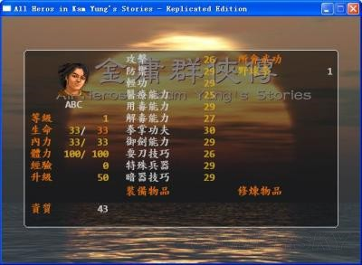
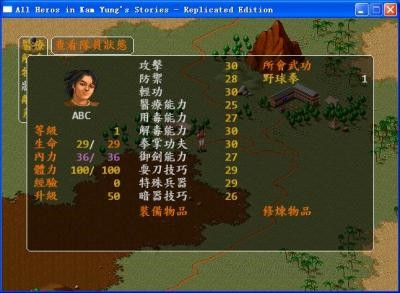

# 金庸群侠传 游侠攻略

　　《金庸群侠传》这个名字相信很多玩家都不陌生吗？这个名字是不是勾起了很多玩家的回忆？想起了自己的青春？确实《金庸群侠传》这款游戏承载着很多人的童年，今天小编给大家带来的是《金庸群侠传》全剧情流程图文攻略，跟小编一起来回忆一下自己的青春吧！

　　新建人物：复刻版选人物是可以看资质数值，选个资质43或44的，其他数值无所谓，特殊兵器更是用不上也练不到
　　

## 第一部分

**主角家**

　　剧情对话后，把家里的东西都拿走。（由于按alt截图后会改变开始初始人物的随机属性，所以截完图又要重新随机等到有资质43或44的，所以数值两图不一样）
　　

　　先上个大地图，然后出发开始游戏

**南贤居**

　　对话后拿罗盘

**唐诗山洞**

　　复刻版的山洞视野和平时一样，不用手动开灯，很方便。

　　拿唐诗选辑，地上有硝石（可拿可不拿）

　　复刻版不需要另外找船，直接可以过海过河，原版的船是在胡斐家附近，罗盘有坐标显示

**先去霹雳堂（台湾岛）**

　　对话孔八拉拿到黄钥匙，暂时只开下面上锁的宝箱拿皮衣并装上，复刻版的物品菜单有分类，物品说明和作用都有显示，很方便

　　上面的宝箱是槟榔，建议暂时不拿，原因后面再说，拿了也无所谓，影响不大

**高升客栈**

　　收段誉，得六脉神剑谱，可惜主角不能练……给不给段誉练无所谓，反正很快就不需要他了

绝情谷

　　搜刮所有箱子，君子剑，淑女剑，大燕国玉玺，断肠草一定要拿
　　
## 第二部分

**右上角的冰火岛**

　　床上有谢逊的金毛
　　
**左上角的冰蚕山洞**

　　天山雪莲和冰蚕可以拿，天山雪莲可以加最大生命和内力各60，越低级吃越好，这样主角升级加的生命和内力相对多一些

**昆仑仙境**

　　给金毛收张无忌，拿到九阳真经，树上两个大蟠桃给主角加内力最大值，张无忌练不练九阳真经随便，理由同段誉

**武当山**

　　对话张三丰，过招必败，第一次可以拿到梯云纵心法，任何人都能练的轻功秘笈，给主角装上练一下，张无忌给主角医疗补满生命

　　搜刮武当山，得到真武剑等，攻击+20的好武器之一
　　
**铁掌山**

　　门口的战斗：张无忌的九阳神功和主角的暗器玉峰针轻松搞定，段誉六脉神剑走过场，多一个人上场分摊一下经验，暂时

　　不需要让主角升级升太快，复刻版主角也可以不出战

　　战后主角2级，把铁掌山的宝箱都拿了，后山的宝箱有3000两和大燕皇帝世系图表
　　
## 第三部分

**河洛客栈**

　　找韦小宝买霹雳狂刀，霹雳刀法，软猬甲，天山雪莲，茯苓首乌丸，通犀地龙丸，后四种都给主角，复刻版买东西很方便，不用到各个客栈找韦小宝就能买到全部物品

**阎基居**

　　战斗开始我方内力全无，主角直接用暗器，张无忌和段誉先用人参等补一下内力再去攻击。战后主角升到3级

　　拿两页刀法，天王保命丹位置比较隐蔽

**胡斐居**

　　给两页刀法收胡斐，胡斐装备皮衣，修炼胡家刀法

**云鹤崖**

　　就是搜刮道具，其实这个地方也可以不来，兔肉只关系到以后拿降龙十八掌，后期练不练都一样

**无量山洞**

　　段誉磕头后得凌波微步和北冥神功，出门时和莽牯朱蛤战斗，胡斐用暗器霹雳弹，3下结束。莽牯朱蛤给胡斐吃

　　出去后可以让张无忌离队

**燕子坞**

　　把大燕玉玺和世系图表给慕容复后，可以收到慕容复和王语嫣，紫钥匙开宝箱拿棋谱，书架里的玄冥神掌没用……

　　出去让段誉和慕容复离队

　　前期准备工作完毕，有主角、胡斐、王语嫣就足够应付今后所有战斗了，给王语嫣练北冥神功，复刻版她还能练九阳神功……

**神龙教**

　　门口守卫战随便打，让胡斐自动打即可，对话洪教主

　　胡斐的耍刀技巧超过50可以练霹雳刀法，装备霹雳狂刀。我怎么记得DOS原版的北冥神功不能调和内力呢？

**灵蛇岛**

　　打赢金花婆婆救王难姑，金花婆婆可以练级，其实也没必要在这里浪费时间

**蝴蝶谷**

　　收胡青牛和王难姑后让他们离队，收他们只为了胡青牛医书，铁铲一定要拿

**苗人凤居**

　　打杂兵，和苗人凤对话，现在主要就是等胡斐的霹雳刀法练上来

**五毒教**

　　两场战斗自动即可，收蓝凤凰，主要为了拿含沙射影，因为每练一次武功带毒+2，50次就可以练满，当然如果觉得太慢日后可以把道德降到40以下收阿紫练化功大法（带毒+5）

　　主角轻功超过50可以装备君子剑或者淑女剑，复刻版的各项属性增加得很快……

## 第四部分

**大轮寺**

　　两场战斗后，收狄云得到乌蚕衣，也是一件不错的防具

**蜘蛛山洞**

　　千年灵芝可以加生命最大值，肯定给主角。玄冰碧火酒肯定要拿的

**杨过的山洞**

　　打蛇的话胡斐7级的霹雳刀法2下就解决，蛇胆加内力最大值。用断肠草收杨过

**百花谷**

　　给玉蜂浆周伯通，出去大地图再进来，对蜂巢得知绝情谷底的位置

　　复刻版周伯通练功时的攻击很弱，现在已经随便打，不过暂时可以先不练

**绝情谷底**

　　对话小龙女发生剧情

**古墓**

　　收杨过和小龙女，天山雪莲，九阴真经，神雕侠侣这些肯定要拿的

　　出大地图踢走杨过和小龙女

**程英居**

　　收程英

**黑龙潭**

　　有程英在很轻松进去找瑛姑，拿手帕

　　复刻版在图中这个位置可以进去了，比DOS原版近了一些

**一灯居**

　　给手帕一灯大师，不要战斗。

　　再回黑龙潭对话，去百花谷找周伯通对话，再去黑龙潭对话……最后去百花谷周伯通送左右互博，给主角练

**武当山**

　　路过武当山时再输一次给张三丰，可以拿太极拳经。太极剑就没必要拿了，用处不大，还不如打赢张三丰拿经验

**海边小屋**

　　主角练好左右互博之后来这里加3点资质，超过45资质练功速度又加快一些。

　　此时开始锻炼主角的武功了，看个人喜欢吧，一般来说野球拳+九阳神功+含沙射影已经很bt，如果觉得野球拳太强可以练太极拳。这次打算走邪道打正派十大高手，所以还是练野球拳轻松一些。

**摩天崖**

　　用玄冰碧火酒救石破天，收他得到十八泥偶
　　
## 第五部分

**龙门客栈**

　　收虚竹，其实以下这三步属支线剧情，不做对最后影响不大，也没什么有用的东西拿

**擂鼓山**

　　虚竹破珍珑棋局，最有用的大概就是小无相功，DOS原版某人说过内力调和只能练这个或十八泥偶，明显练十八泥偶更简单……回大地图可以踢走虚竹了

**薛慕华居**

　　用七宝指环使薛慕华加入，出大地图就踢走薛慕华吧，以上剧情就是可以去挑战丁春秋赚点经验而已……

　　虚竹都收过道德已经没什么用了，最后走邪道还要把道德降到50以下，所以后面多做坏事和进各个偷道具

**洪七公居**

　　对话后知道要做菜收集5种材料，为了剧情完整还是做一下吧，虽然降龙十八掌不想练

**悦来客栈**

　　偷钱，对话令狐冲-对话店小二-买烧刀子-给令狐冲喝-对话店小二

**白驼山**

　　单挑欧阳克练野球拳，此时应该能到2级了

　　收欧阳克，通犀地龙丸给王语嫣吃，记得拿翡翠杯，出大地图后踢走欧阳克

**凌霄城**

　　继续单挑锻炼野球拳，白万剑这种药多攻击弱的NPC很适合练野球拳，自动战斗即可，虽然这个复刻版补血会优先用生生造化丹和天王保命丹等……野球拳到3级，剧情拿赏善罚恶令

**阎基居**

　　单挑阎基拿七心海棠，阎基的药也不少，打完后野球拳5级

**侠客岛**

　　使用赏善罚恶令通过，对话岛主得到腊八粥，再对话门卫又拿一碗，可以加内力最大值，和众人对话触发剧情拿到侠客行

　　可惜太玄经只有石破天能练……石破天可以离队了

**万鳄岛**

　　单挑鳄鱼，皮厚同样可以单挑练野球拳，开始不拿槟榔就是让自动战斗不要用来加体力，精气丸等万一自动用完就原地休息，如果鳄鱼也休息正好能多打几下，呵呵

　　这个复刻版在万鳄岛的战场里可以随意走动……鳄鱼的经验也不算少，可以顺便练一次十八泥偶和2次九阴真经

**收岳老三后踢走**

　　万鳄岛后主角武功大进，野球拳10级加上左右互搏已经单挑天下无敌，可以开始练九阳神功

**福威镖局**

　　对话林平之，战斗肯定没有难度

**田伯光居**

　　收田伯光，拼命降道德啊……

**药王庄**

　　拿蓝花进去，给七心海棠得到苗人凤的眼药，收程灵素后踢走

**梅庄**

　　给丹青生谿山行旅图，单挑后拿梨花酒

　　衡山派，恒山派，泰山派，铁掌帮，昆仑派，崆峒派，全真教，星宿海，武当派

　　这些地方都去战斗练级踢馆

　　胡斐练好霹雳刀法可以去练十八泥偶，九阴真经，霹雳秘笈等

　　王语嫣的攻击如果超过50也能练九阳神功

**青城派**

　　打完余沧海后和青城四秀之一对话，得知辟邪剑谱的秘密

## 第六部分

**悦来客栈**

　　使用梨花酒和翡翠杯收令狐冲

**思过崖**

　　对话风清扬，资质加5，主角资质超过50，可以练霹雳刀法，吸星大法，化功大法之类的武功，不过用处也不大……

　　此时可以踢走令狐冲了

**金蛇山洞**

　　攻击高过75可以拔出金蛇剑

**华山派**

　　对话岳不群

**平一指居**

　　有田伯光在会发生战斗，杀了平一指后踢走田伯光

**苗人凤居**

　　给眼药后胡斐和苗人凤单挑，霹雳刀法10级很轻松就搞定，得到飞狐外传和闯王藏宝图等

**嵩山派**

　　单挑除华山派外的五岳剑派掌门，练九阳神功的好机会。记得拿张旭率意帖

**沙漠废墟**

　　攻击超过90，有玄铁剑，倚天剑，屠龙刀之一即可打破石壁，宝箱有天山雪莲和白马啸西风

**破庙**

　　给千年冰蚕阿紫，不过此时道德不低于40不能收他们，先去后面用铁铲拿广陵散琴曲

**北丑居**

　　对话北丑，金银钥匙可以打开两个宝箱，唐诗选辑用冰水浸泡得到情报

**闯王藏宝洞**

　　用闯王军刀打开机关，得到鸯刀，雪山飞狐等

　　王语嫣如果无聊也可以练一下满天花雨

## 第七部分

**神龙教**

　　打败洪教主后得到鹿鼎记

**浡泥岛**

　　打败袁承志得到碧血剑

**桃花岛**

　　打败郭靖夫妇得到射雕英雄传

**鸳鸯岛**

　　用鸳刀鸯刀打开机关，得到鸳鸯刀

**天宁寺**

　　打败一堆杂兵，在佛像后面得到连城诀

**梅庄**

　　使用张旭率意帖，棋谱，广陵散，依次分别打败梅庄四友

　　出去后再进来对话二黑白子，拿钥匙进地牢，剧情后调查地牢的箱子得吸星大法和黑木令

**燕子坞**

　　收慕容复

**福威镖局**

　　对话林平之，出去再进来可以收他，得到辟邪剑谱，有野球拳可以不练这个，还要自宫……

**明教分舵**

　　战斗没太多难度，如果九阳神功还没练完最好抓紧练。地道里乾坤大挪移要求资质75，是所有武功对资质要求最高的

**光明顶**

　　金庸群侠传里的经典战斗之一，有九阳神功和霹雳刀法毫无难度

## 第八部分

**回族部落**

　　对话

**金轮寺**

　　打败金轮法王得到可兰经

**回族部落**

　　交换可兰经拿书剑恩仇录

**黑木崖**

　　使用黑木令牌进去，打败东方不败，任我行送笑傲江湖，打败任我行得到葵花宝典，出去前再打五岳剑派，三场战斗只有东方不败有点难打

　　葵花宝典可以给王语嫣练

**冰火岛**

　　对谢逊使用明教铁焰令

**成昆居**

　　杀了成昆

**冰火岛**

　　再把头颅给谢逊，得到屠龙刀

**少林寺**

　　带慕容复上去可以威胁方丈拿带头大哥的信

**丐帮**

　　用带头大哥的信逼萧峰交出天龙八部，可以踢走慕容复了

**光明顶**

　　对话谢逊，要找紫衫龙王

**灵蛇岛**

　　对话金花婆婆，拿獐腿肉

**海边小屋**

　　五种食材凑齐给林厨子做玉笛谁家听落梅

**洪七公居**

　　用玉笛谁家听落梅换降龙十八掌

## 第九部分

**光明顶**

　　破明教的光明圣火阵，得倚天屠龙记（最麻烦的一本书）

**峨嵋派**

　　杀了灭绝师太，拿倚天剑

**主角家**

　　睡觉后发现桌上有武林帖，复刻版不睡觉也有，曾经有一次连倚天屠龙记都没拿也能拿……

**河洛客栈**

　　找韦小宝买生生造化丹和天王保命丹，还有剩钱买精气丸

**武林大会**

　　单挑15个人拿到神杖

　　复刻版此时还能收伙伴，想收阿紫和游坦之可以先去崆峒派练功，每打一场降一点道德，低于40就能收他们

## 第十部分

**霹雳堂**

　　把神杖给孔八拉得到绿钥匙，开门后到地道把十四本小说放在架上，这个复刻版只需要放一本就启动机关，很方便

　　正派十大高手，装备屠龙刀+软猬甲，开始向右下走，用九阳神功，生命低就用黑玉断续膏，打败郭靖后基本没什么难度

　　胜利后游戏终于通关！

## 后记

原文出处：[https://www.gamersky.com/handbook/201507/620110.shtml](https://www.gamersky.com/handbook/201507/620110.shtml)

高晶攻略：[http://bd.emu618.net/](http://bd.emu618.net/)

